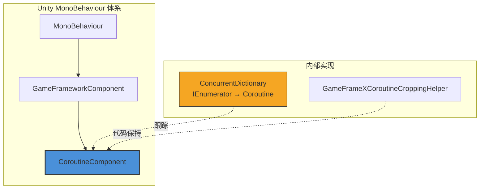

# CoroutineComponent

协程组件（CoroutineComponent）是 GameFrameX 框架的核心组件之一，提供扩展了 Unity 内建协程管理功能的接口。通过使用并发字典来跟踪执行的协程，它为停止和清理协程提供了更好的控制。

## 概述

`CoroutineComponent` 是一个 Unity `MonoBehaviour` 组件，继承自 `GameFrameworkComponent`。它封装了 Unity 原生协程功能，添加了协程追踪和管理能力，帮助开发者更方便地控制协程的生命周期，防止因未正确停止协程导致的内存泄漏问题。

### 核心特性

- **协程追踪**：使用 `ConcurrentDictionary` 线程安全地追踪所有已启动的协程
- **灵活停止**：支持通过迭代器或协程对象停止单个协程
- **批量管理**：提供一键停止所有协程的功能
- **帧结束回调**：提供在当前帧渲染结束后执行回调的便捷方法

## 架构



### 组件层级

- **MonoBehaviour**：Unity 组件基类
- **GameFrameworkComponent**：GameFrameX 框架组件基类
- **CoroutineComponent**：协程管理组件（当前文档主题）

### 核心数据结构

`CoroutineComponent` 使用 `ConcurrentDictionary<IEnumerator, UnityEngine.Coroutine>` 维护协程映射表：

```csharp
private readonly ConcurrentDictionary<IEnumerator, UnityEngine.Coroutine> m_CoroutineMap = new ConcurrentDictionary<IEnumerator, UnityEngine.Coroutine>();
```

> Source: [CoroutineComponent.cs](https://github.com/GameFrameX/com.gameframex.unity.coroutine/blob/main/Runtime/Coroutine/CoroutineComponent.cs#L18)

## 核心功能

### 启动协程

`StartCoroutine` 方法重写了 Unity 基类实现，不仅启动协程，还会将其添加到内部追踪字典中：

```csharp
public new UnityEngine.Coroutine StartCoroutine(IEnumerator enumerator)
{
    var ret = base.StartCoroutine(enumerator);
    m_CoroutineMap[enumerator] = ret;
    return ret;
}
```

> Source: [CoroutineComponent.cs](https://github.com/GameFrameX/com.gameframex.unity.coroutine/blob/main/Runtime/Coroutine/CoroutineComponent.cs#L25-L30)

**设计意图**：通过追踪每个迭代器与其对应协程的映射关系，实现精确的协程停止控制。

### 停止协程

组件提供了两种停止协程的方式：

**方式一：通过迭代器停止**

```csharp
public new void StopCoroutine(IEnumerator enumerator)
{
    if (m_CoroutineMap.TryGetValue(enumerator, out var coroutine))
    {
        base.StopCoroutine(coroutine);
        m_CoroutineMap.TryRemove(enumerator, out _);
    }
    base.StopCoroutine(enumerator);
}
```

> Source: [CoroutineComponent.cs](https://github.com/GameFrameX/com.gameframex.unity.coroutine/blob/main/Runtime/Coroutine/CoroutineComponent.cs#L36-L45)

**方式二：通过协程对象停止**

```csharp
public new void StopCoroutine(UnityEngine.Coroutine coroutine)
{
    base.StopCoroutine(coroutine);
    foreach (var item in m_CoroutineMap)
    {
        if (item.Value == coroutine)
        {
            m_CoroutineMap.TryRemove(item.Key, out _);
            break;
        }
    }
}
```

> Source: [CoroutineComponent.cs](https://github.com/GameFrameX/com.gameframex.unity.coroutine/blob/main/Runtime/Coroutine/CoroutineComponent.cs#L51-L62)

### 停止所有协程

```csharp
public new void StopAllCoroutines()
{
    foreach (var coroutine in m_CoroutineMap.Values)
    {
        base.StopCoroutine(coroutine);
    }
    m_CoroutineMap.Clear();
    base.StopAllCoroutines();
}
```

> Source: [CoroutineComponent.cs](https://github.com/GameFrameX/com.gameframex.unity.coroutine/blob/main/Runtime/Coroutine/CoroutineComponent.cs#L67-L76)

**设计意图**：确保所有协程被正确停止并清理内部追踪数据，防止内存泄漏。

### 帧结束回调

`WaitForEndOfFrameFinish` 方法允许在当前帧渲染结束后执行回调：

```csharp
private readonly WaitForEndOfFrame _waitForEndOfFrame = new WaitForEndOfFrame();

public void WaitForEndOfFrameFinish(System.Action callback)
{
    StartCoroutine(_WaitForEndOfFrameFinish(callback));
}
```

> Source: [CoroutineComponent.cs](https://github.com/GameFrameX/com.gameframex.unity.coroutine/blob/main/Runtime/Coroutine/CoroutineComponent.cs#L78-L97)

**设计意图**：提供便捷的帧结束回调功能，常用于需要在整个帧渲染完成后执行的操作，如 UI 更新后的数据同步。

## 使用示例

### 基本用法

```csharp
using GameFrameX.Coroutine.Runtime;
using UnityEngine;
using System.Collections;

public class CoroutineExample : MonoBehaviour
{
    private CoroutineComponent _coroutineComponent;

    private void Start()
    {
        // 获取或添加 CoroutineComponent
        _coroutineComponent = gameObject.GetComponent<CoroutineComponent>();
        if (_coroutineComponent == null)
        {
            _coroutineComponent = gameObject.AddComponent<CoroutineComponent>();
        }

        // 启动协程
        IEnumerator myCoroutine = MyCoroutine();
        _coroutineComponent.StartCoroutine(myCoroutine);
    }

    private IEnumerator MyCoroutine()
    {
        Debug.Log("协程开始");
        yield return new WaitForSeconds(1f);
        Debug.Log("1秒后继续执行");
        yield return null;
        Debug.Log("下一帧继续执行");
    }
}
```

### 停止协程示例

```csharp
using GameFrameX.Coroutine.Runtime;
using UnityEngine;
using System.Collections;

public class StopCoroutineExample : MonoBehaviour
{
    private CoroutineComponent _coroutineComponent;
    private IEnumerator _runningCoroutine;

    private void Start()
    {
        _coroutineComponent = gameObject.AddComponent<CoroutineComponent>();
        
        // 启动协程并保存引用
        _runningCoroutine = LongRunningCoroutine();
        _coroutineComponent.StartCoroutine(_runningCoroutine);
        
        // 5秒后自动停止
        Invoke("StopMyCoroutine", 5f);
    }

    private IEnumerator LongRunningCoroutine()
    {
        int count = 0;
        while (true)
        {
            Debug.Log($"运行中: {count++}");
            yield return new WaitForSeconds(1f);
        }
    }

    private void StopMyCoroutine()
    {
        // 通过迭代器停止协程
        if (_runningCoroutine != null)
        {
            _coroutineComponent.StopCoroutine(_runningCoroutine);
        }
    }
}
```

### 帧结束回调示例

```csharp
using GameFrameX.Coroutine.Runtime;
using UnityEngine;
using UnityEngine.UI;

public class FrameEndCallbackExample : MonoBehaviour
{
    public Text statusText;
    private CoroutineComponent _coroutineComponent;

    private void Start()
    {
        _coroutineComponent = gameObject.AddComponent<CoroutineComponent>();
        
        // 在帧结束后更新 UI
        _coroutineComponent.WaitForEndOfFrameFinish(() =>
        {
            statusText.text = "UI 已更新";
        });
    }
}
```

## API 参考

### 属性

| 属性 | 类型 | 说明 |
|------|------|------|
| m_CoroutineMap | `ConcurrentDictionary<IEnumerator, UnityEngine.Coroutine>` | 存储所有活跃协程的映射表 |

### 方法

### `StartCoroutine(IEnumerator enumerator): UnityEngine.Coroutine`

启动一个协程并将其添加到追踪表中。

**参数：**
- `enumerator` (IEnumerator): 协程迭代器

**返回：** UnityEngine.Coroutine - 启动的协程对象

**示例：**
```csharp
IEnumerator coroutine = MyRoutine();
UnityEngine.Coroutine running = coroutineComponent.StartCoroutine(coroutine);
```

---

### `StopCoroutine(IEnumerator enumerator): void`

通过迭代器引用停止协程。

**参数：**
- `enumerator` (IEnumerator): 要停止的协程迭代器

**说明：** 此方法会同时从追踪表中移除协程引用，确保完全清理。

**示例：**
```csharp
IEnumerator myCoroutine = MyRoutine();
coroutineComponent.StartCoroutine(myCoroutine);
// ... 一些逻辑后
coroutineComponent.StopCoroutine(myCoroutine);
```

---

### `StopCoroutine(UnityEngine.Coroutine coroutine): void`

通过协程对象停止协程。

**参数：**
- `coroutine` (UnityEngine.Coroutine): 要停止的协程对象

**说明：** 如果协程在追踪表中存在，也会同步清理映射关系。

**示例：**
```csharp
var running = coroutineComponent.StartCoroutine(MyRoutine());
coroutineComponent.StopCoroutine(running);
```

---

### `StopAllCoroutines(): void`

停止该组件启动的所有协程。

**说明：** 此方法会遍历并停止所有追踪中的协程，同时清空内部追踪表。

**示例：**
```csharp
// 场景切换时清理所有协程
coroutineComponent.StopAllCoroutines();
```

---

### `WaitForEndOfFrameFinish(System.Action callback): void`

在当前帧渲染结束后执行回调。

**参数：**
- `callback` (System.Action): 要执行的回调方法

**说明：** 内部使用 `WaitForEndOfFrame` 实现，常用于需要在整个渲染流程完成后执行的操作。

**示例：**
```csharp
coroutineComponent.WaitForEndOfFrameFinish(() =>
{
    Debug.Log("当前帧已渲染完成");
});
```

---

## 组件配置

### Unity 编辑器配置

`CoroutineComponent` 在 Unity 编辑器中有以下特性：

| 特性 | 值 | 说明 |
|------|------|------|
| 菜单路径 | Game Framework/Coroutine | 添加组件时的菜单位置 |
| 允许重复 | 否 | 使用 `[DisallowMultipleComponent]` 限制 |
| 自动注册 | 否 | `IsAutoRegister = false`，需手动添加 |

### 代码保持 (IL2CPP)

为防止 IL2CPP 代码裁剪导致组件被移除，框架提供了 `GameFrameXCoroutineCroppingHelper` 辅助类：

```csharp
[Preserve]
public class GameFrameXCoroutineCroppingHelper : MonoBehaviour
{
    [Preserve]
    private void Start()
    {
        _ = typeof(CoroutineComponent);
    }
}
```

> Source: [GameFrameXCoroutineCroppingHelper.cs](https://github.com/GameFrameX/com.gameframex.unity.coroutine/blob/main/Runtime/GameFrameXCoroutineCroppingHelper.cs#L7-L14)

**设计意图**：通过引用 `CoroutineComponent` 类型，确保该类型在 IL2CPP 构建时不会被代码裁剪移除。

## 相关链接

- [插件介绍](../1-overview.index)
- [安装方式](../2-installation.index)
- [使用指南](../3-getting-started.index)
- [常见问题](../5-troubleshooting.index)
- [GitHub 仓库](https://github.com/GameFrameX/com.gameframex.unity.coroutine.git)
