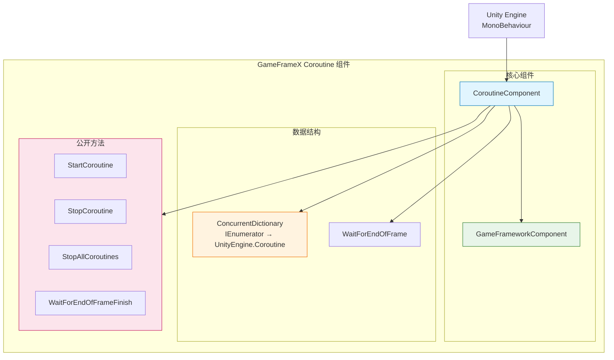
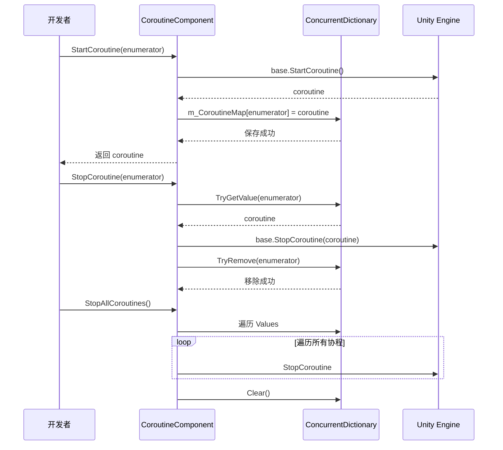

# 插件介绍

GameFrameX Coroutine 协程组件是一个 Unity 扩展组件，提供增强的协程管理功能。通过使用并发字典来跟踪执行的协程，它为协程的启动、停止和清理提供了更好的控制和访问。

## 概述

**CoroutineComponent** 是 GameFrameX 游戏开发框架的核心组件之一，专门用于管理和执行 Unity 协程。该组件扩展了 Unity 的内建协程管理功能，解决了原生协程管理中的一些痛点问题。

### 解决的问题

在 Unity 开发中，原生协程管理存在以下问题：

1. **追踪困难**: 难以获取已启动协程的状态
2. **停止复杂**: 使用 `IEnumerator` 停止协程不够直观
3. **内存泄漏风险**: 协程未正确停止可能导致内存泄漏
4. **无法批量管理**: 无法方便地停止所有协程

### 核心特性

| 特性 | 描述 |
|------|------|
| 协程追踪 | 使用 `ConcurrentDictionary` 记录所有启动的协程 |
| 安全停止 | 支持通过迭代器和协程对象两种方式停止协程 |
| 批量管理 | 提供停止所有协程的功能 |
| 帧结束回调 | 提供在当前帧渲染结束后执行回调的便捷方法 |
| 单例限制 | 使用 `[DisallowMultipleComponent]` 防止重复添加 |

## 架构



### 组件结构说明

**CoroutineComponent** 继承自 `GameFrameworkComponent`，集成了 GameFrameX 框架的核心功能。组件内部维护一个 `ConcurrentDictionary`，用于将用户传入的 `IEnumerator` 与 Unity 内部的 `Coroutine` 对象进行映射，从而实现更便捷的协程管理。

### 核心文件

| 文件 | 路径 | 描述 |
|------|------|------|
| CoroutineComponent.cs | Runtime/Coroutine/ | 主组件实现 |
| CoroutineComponentInspector.cs | Editor/Inspector/ | Unity 编辑器检查器 |
| GameFrameXCoroutineCroppingHelper.cs | Runtime/ | IL2CPP 代码保留辅助类 |

## 核心功能

### 1. 协程启动

`StartCoroutine` 方法重写了 Unity MonoBehaviour 的同名方法，在启动协程的同时将其记录到内部字典中：

```csharp
public new UnityEngine.Coroutine StartCoroutine(IEnumerator enumerator)
{
    var ret = base.StartCoroutine(enumerator);
    m_CoroutineMap[enumerator] = ret;
    return ret;
}
```

> Source: [CoroutineComponent.cs](https://github.com/GameFrameX/com.gameframex.unity.coroutine/blob/main/Runtime/Coroutine/CoroutineComponent.cs#L25-L30)

**设计意图**: 通过在启动时保存映射关系，后续可以通过 `IEnumerator` 精确地停止特定的协程，解决了原生 Unity 协程 API 无法通过 IEnumerator 停止的问题。

### 2. 协程停止

组件提供了两种停止协程的方法：

**通过 IEnumerator 停止**:
```csharp
public new void StopCoroutine(IEnumerator enumerator)
{
    if (m_CoroutineMap.TryGetValue(enumerator, out var coroutine))
    {
        base.StopCoroutine(coroutine);
        m_CoroutineMap.TryRemove(enumerator, out _);
    }
    base.StopCoroutine(enumerator);
}
```

> Source: [CoroutineComponent.cs](https://github.com/GameFrameX/com.gameframex.unity.coroutine/blob/main/Runtime/Coroutine/CoroutineComponent.cs#L36-L45)

**通过 UnityEngine.Coroutine 停止**:
```csharp
public new void StopCoroutine(UnityEngine.Coroutine coroutine)
{
    base.StopCoroutine(coroutine);
    foreach (var item in m_CoroutineMap)
    {
        if (item.Value == coroutine)
        {
            m_CoroutineMap.TryRemove(item.Key, out _);
            break;
        }
    }
}
```

> Source: [CoroutineComponent.cs](https://github.com/GameFrameX/com.gameframex.unity.coroutine/blob/main/Runtime/Coroutine/CoroutineComponent.cs#L51-L62)

**设计意图**: 提供灵活的停止方式，开发者可以根据手中持有的引用类型（IEnumerator 或 Coroutine）选择合适的停止方法。

### 3. 停止所有协程

```csharp
public new void StopAllCoroutines()
{
    foreach (var coroutine in m_CoroutineMap.Values)
    {
        base.StopCoroutine(coroutine);
    }
    m_CoroutineMap.Clear();
    base.StopAllCoroutines();
}
```

> Source: [CoroutineComponent.cs](https://github.com/GameFrameX/com.gameframex.unity.coroutine/blob/main/Runtime/Coroutine/CoroutineComponent.cs#L67-L76)

**设计意图**: 在场景切换或对象销毁时，确保所有协程被干净地停止，防止内存泄漏和野指针问题。

### 4. 帧结束回调

```csharp
public void WaitForEndOfFrameFinish(System.Action callback)
{
    StartCoroutine(_WaitForEndOfFrameFinish(callback));
}
```

> Source: [CoroutineComponent.cs](https://github.com/GameFrameX/com.gameframex.unity.coroutine/blob/main/Runtime/Coroutine/CoroutineComponent.cs#L94-L97)

**设计意图**: 提供一种便捷的方式，在当前帧的渲染完成后执行回调。这对于需要等待 UI 更新完成后再进行计算的场景特别有用。

## 协程管理流程



## 使用示例

### 基本使用

```csharp
IEnumerator YourCoroutine()
{
    // 协程执行的内容
    yield return null;
}

// 添加组件到游戏对象
CoroutineComponent coroutineComponent = gameObject.AddComponent<CoroutineComponent>();

// 启动协程
coroutineComponent.StartCoroutine(YourCoroutine());

// 停止协程
coroutineComponent.StopCoroutine(YourCoroutine());
```

> Source: [README.md](https://github.com/GameFrameX/com.gameframex.unity.coroutine/blob/main/README.md#L29-L42)

### 帧结束回调

```csharp
void YourCallback()
{
    // 回调执行的内容
}

coroutineComponent.WaitForEndOfFrameFinish(YourCallback);
```

> Source: [README.md](https://github.com/GameFrameX/com.gameframex.unity.coroutine/blob/main/README.md#L59-L70)

## 注意事项

1. **单例限制**: 组件使用 `[DisallowMultipleComponent]` 属性，确保每个 GameObject 只能添加一个 CoroutineComponent 实例。

2. **自动注册**: 在 `Awake` 方法中设置 `IsAutoRegister = false`，表示该组件不会自动注册到框架的核心系统。

3. **代码保留**: `GameFrameXCoroutineCroppingHelper` 类用于确保在使用 IL2CPP 构建时，CoroutineComponent 不会被代码裁剪掉。

## 相关链接

- [安装方式](../2-installation.index)
- [使用指南](../3-getting-started.index)
- [API 参考](./4-api-reference.coroutine-component)
- [FAQ](../5-troubleshooting.index)
- [GitHub 仓库](https://github.com/GameFrameX/com.gameframex.unity.coroutine.git)
- [GameFrameX 官网](https://gameframex.doc.alianblank.com)
