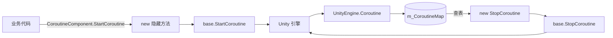

# 工作原理：协程追踪与组件生命周期

`CoroutineComponent` 通过在原生 Unity API 上叠加一层引用追踪,把"开启的协程"和"IEnumerator 实例"一一对应起来,从而保证后续能按同样的 `IEnumerator` 引用精确停止。组件自身作为 `GameFrameworkComponent` 参与 GameFrameX 框架的生命周期调度。

## 核心机制

### 1. 用 ConcurrentDictionary 做引用追踪

组件内部维护一个线程安全的字典,key 是 `IEnumerator`,value 是 `UnityEngine.Coroutine`。

```csharp
private readonly ConcurrentDictionary<IEnumerator, UnityEngine.Coroutine> m_CoroutineMap
    = new ConcurrentDictionary<IEnumerator, UnityEngine.Coroutine>();
```

Source: [CoroutineComponent.cs](https://github.com/GameFrameX/com.gameframex.unity.coroutine/blob/main/Runtime/Coroutine/CoroutineComponent.cs#L21)

`StartCoroutine` 用 `new` 关键字隐藏基类方法,先调用 `base.StartCoroutine`,再把返回的 `UnityEngine.Coroutine` 写进字典:

```csharp
public new UnityEngine.Coroutine StartCoroutine(IEnumerator enumerator)
{
    var ret = base.StartCoroutine(enumerator);
    m_CoroutineMap[enumerator] = ret;
    return ret;
}
```

Source: [CoroutineComponent.cs](https://github.com/GameFrameX/com.gameframex.unity.coroutine/blob/main/Runtime/Coroutine/CoroutineComponent.cs#L28-L33)

### 2. 用 `new` 隐藏基类方法保证追踪入口唯一

四个 Start/Stop 方法全部用 `new` 关键字覆盖 `MonoBehaviour` 基类成员。如果不通过 `CoroutineComponent` 引用调用(例如直接 `gameObject.GetComponent<MonoBehaviour>().StartCoroutine(...)`),追踪字典不会被写入,后续 `StopCoroutine` 将无法命中。

| 方法 | 行为 |
|------|------|
| `StartCoroutine(IEnumerator)` | 启动并存入 `m_CoroutineMap` |
| `StopCoroutine(IEnumerator)` | 查字典找到 `UnityEngine.Coroutine` 再 `base.StopCoroutine`;查不到则回退到 `base.StopCoroutine(enumerator)` |
| `StopCoroutine(UnityEngine.Coroutine)` | 直接 `base.StopCoroutine`,然后线性扫描字典删除对应条目 |
| `StopAllCoroutines()` | 先逐个停止字典里的协程,清空字典,再调用 `base.StopAllCoroutines()` 兜底清理未跟踪的协程 |

Source: [CoroutineComponent.cs](https://github.com/GameFrameX/com.gameframex.unity.coroutine/blob/main/Runtime/Coroutine/CoroutineComponent.cs#L39-L82)

### 3. 组件生命周期接入

`CoroutineComponent` 继承自 `GameFrameworkComponent`,并带有 `[GameFrameXAutoComponent(-6500)]` 特性,表示由框架按优先级自动注册到全局组件系统。

```csharp
[DisallowMultipleComponent]
[AddComponentMenu("GameFrameX/Coroutine")]
[GameFrameXAutoComponent(-6500)]
public class CoroutineComponent : GameFrameworkComponent
```

Source: [CoroutineComponent.cs](https://github.com/GameFrameX/com.gameframex.unity.coroutine/blob/main/Runtime/Coroutine/CoroutineComponent.cs#L12-L15)

`Awake` 中显式关闭自动注册,避免与框架注册逻辑冲突:

```csharp
protected override void Awake()
{
    IsAutoRegister = false;
    base.Awake();
}
```

Source: [CoroutineComponent.cs](https://github.com/GameFrameX/com.gameframex.unity.coroutine/blob/main/Runtime/Coroutine/CoroutineComponent.cs#L106-L110)

### 4. 帧尾回调封装

组件额外提供了 `WaitForEndOfFrameFinish`,内部 yield 一个复用的 `WaitForEndOfFrame` 实例,再触发回调:

```csharp
private readonly WaitForEndOfFrame _waitForEndOfFrame = new WaitForEndOfFrame();

private IEnumerator WaitForEndOfFrameFinishInternal(System.Action callback)
{
    yield return _waitForEndOfFrame;
    callback?.Invoke();
}

public void WaitForEndOfFrameFinish(System.Action callback)
{
    StartCoroutine(WaitForEndOfFrameFinishInternal(callback));
}
```

Source: [CoroutineComponent.cs](https://github.com/GameFrameX/com.gameframex.unity.coroutine/blob/main/Runtime/Coroutine/CoroutineComponent.cs#L84-L104)

如果协程在帧结束前被 `StopCoroutine` 或 `StopAllCoroutines` 终止,`callback` 不会执行。

### 5. IL2CPP 链接保护

`GameFrameXCoroutineCroppingHelper` 是一个空 `MonoBehaviour`,仅在 `Start` 中引用 `CoroutineComponent` 类型,目的是在 IL2CPP / 裁剪场景下把 `CoroutineComponent` 标记为保留,避免被静态分析误删:

```csharp
[Preserve]
public class GameFrameXCoroutineCroppingHelper : MonoBehaviour
{
    [Preserve]
    private void Start()
    {
        _ = typeof(CoroutineComponent);
    }
}
```

Source: [GameFrameXCoroutineCroppingHelper.cs](https://github.com/GameFrameX/com.gameframex.unity.coroutine/blob/main/Runtime/GameFrameXCoroutineCroppingHelper.cs#L1-L14)

## 数据流



## 调用约束

- `IEnumerator` 作为字典 key 使用引用相等性,`StopCoroutine` 必须传入与 `StartCoroutine` 完全相同的 `IEnumerator` 实例,否则会走"查不到"的回退分支。
- 必须通过 `CoroutineComponent` 类型的引用调用 `StartCoroutine`/`StopCoroutine`,直接调用基类 `MonoBehaviour` 方法不会被追踪。
- 字典使用 `ConcurrentDictionary`,因此即便在非主线程上构造 `IEnumerator`(如任务系统生成的迭代器),写入与查询也是线程安全的;但 `UnityEngine.Coroutine` 的实际启动/停止仍受 Unity 主线程约束。

## 相关链接

- 关于组件如何接入 GameFrameX 框架,见 `GameFrameworkComponent` 与 `[GameFrameXAutoComponent]` 的源码。
- 关于 Unity 原生协程语义,参考 Unity 官方 `MonoBehaviour.StartCoroutine` 文档。