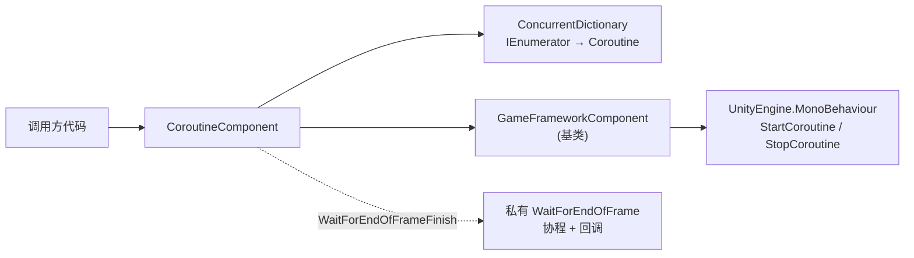

# 认识 Coroutine 协程组件

`CoroutineComponent` 是 GameFrameX 框架对 Unity 原生协程 API 的封装组件,核心价值在于**追踪与管理**所有通过它启动的协程——既能按迭代器或 `UnityEngine.Coroutine` 句柄精确停止单个协程,也能一键清理全部,同时还提供「帧结束回调」的便捷接口。

## 快速开始

### 1. 安装包

在 Unity 项目的 `Packages/manifest.json` 的 `scopedRegistries` 中加入 GameFrameX 注册表,然后在 `dependencies` 中声明:

```json
{
  "scopedRegistries": [
    {
      "name": "GameFrameX",
      "url": "https://gameframex.upm.alianblank.uk",
      "scopes": ["com.gameframex"]
    }
  ],
  "dependencies": {
    "com.gameframex.unity.coroutine": "1.0.3"
  }
}
```

Source: [README.zh-CN.md](https://github.com/GameFrameX/com.gameframex.unity.coroutine/blob/main/README.zh-CN.md#L50-L65)

### 2. 添加组件到场景对象

由于类上标注了 `[DisallowMultipleComponent]` 与 `[AddComponentMenu("GameFrameX/Coroutine")]`,同一个游戏对象只能挂一个;框架也会通过 `[GameFrameXAutoComponent(-6500)]` 自动注册。

```csharp
CoroutineComponent coroutineComponent = gameObject.AddComponent<CoroutineComponent>();
```

Source: [CoroutineComponent.cs](https://github.com/GameFrameX/com.gameframex.unity.coroutine/blob/main/Runtime/Coroutine/CoroutineComponent.cs#L12-L15)

### 3. 启动并管理协程

```csharp
IEnumerator YourCoroutine()
{
    // 协程执行的内容
    yield return null;
}

coroutineComponent.StartCoroutine(YourCoroutine());
```

Source: [README.zh-CN.md](https://github.com/GameFrameX/com.gameframex.unity.coroutine/blob/main/README.zh-CN.md#L82-L91)

## 工作原理速览

组件内部使用 `ConcurrentDictionary<IEnumerator, UnityEngine.Coroutine>` 维护一张「迭代器 → Unity 协程句柄」的映射表。所有 `StartCoroutine`/`StopCoroutine`/`StopAllCoroutines` 都通过 `new` 关键字隐藏基类方法,先操作这张映射表,再委托给 `GameFrameworkComponent` 基类执行真正的 Unity 调用。



## 核心 API 一览

| 方法 | 作用 | 关键点 |
|------|------|--------|
| `StartCoroutine(IEnumerator)` | 启动协程并加入跟踪表 | 返回 `UnityEngine.Coroutine` |
| `StopCoroutine(IEnumerator)` | 按迭代器停止 | 必须传入与 `StartCoroutine` 相同的 `IEnumerator` 实例 |
| `StopCoroutine(UnityEngine.Coroutine)` | 按句柄停止 | 内部遍历字典找到对应 key 并移除 |
| `StopAllCoroutines()` | 停止全部已跟踪与未跟踪协程 | 先停跟踪项、清字典,再调用基类 |
| `WaitForEndOfFrameFinish(Action)` | 当前帧渲染结束后执行回调 | 若在帧结束前被 `StopCoroutine` 停止,回调不会触发 |

## 接下来

- 想按步骤跑通第一个协程:见《如何启动与停止协程》
- 遇到 `StopCoroutine` 无效、回调没触发等问题:见《协程相关问题怎么办》
- 需要完整 API 签名与默认值:见《CoroutineComponent API 参考》
