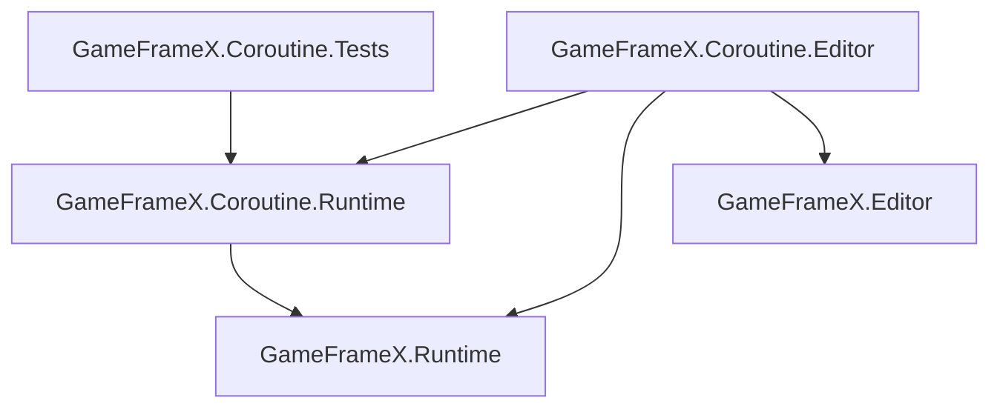

# 包配置与程序集参考

本页收录 `com.gameframex.unity.coroutine` 包的全部元数据与程序集定义,用于排查依赖、版本兼容和程序集引用问题。

## 包元数据(package.json)

| 字段 | 值 |
|------|-----|
| `name` | `com.gameframex.unity.coroutine` |
| `displayName` | `Game Frame X Coroutine` |
| `category` | `GameFrameX` |
| `version` | `1.2.0` |
| `unity` | `2019.4`(最低支持版本) |
| `keywords` | `GameFrameX`, `Coroutine` |
| `dependencies` | `com.gameframex.unity: 2.5.1` |
| `publishConfig.access` | `public` |
| `publishConfig.registry` | `https://npm.cnb.cool/GameFrameX/npm/-/packages/` |
| `documentationUrl` | `https://gameframex.doc.alianblank.com` |
| `changelogUrl` | `https://github.com/gameframex/com.gameframex.unity.coroutine/blob/main/CHANGELOG.md` |
| `licensesUrl` | `https://github.com/gameframex/com.gameframex.unity.coroutine/blob/main/LICENSE.md` |

## 程序集清单

包内共三个程序集(`.asmdef`)。所有程序集 `autoReferenced` 均为 `true`,意味着同一工程中其他脚本可直接使用其中类型而无需手动添加引用。

| 程序集名 | 文件 | 作用平台 | 引用 |
|---------|------|---------|------|
| `GameFrameX.Coroutine.Runtime` | [Runtime/GameFrameX.Coroutine.Runtime.asmdef](https://github.com/GameFrameX/com.gameframex.unity.coroutine/blob/main/Runtime/GameFrameX.Coroutine.Runtime.asmdef) | 全平台 | `GameFrameX.Runtime` |
| `GameFrameX.Coroutine.Editor` | [Editor/GameFrameX.Coroutine.Editor.asmdef](https://github.com/GameFrameX/com.gameframex.unity.coroutine/blob/main/Editor/GameFrameX.Coroutine.Editor.asmdef) | `Editor` | `GameFrameX.Coroutine.Runtime`, `GameFrameX.Editor`, `GameFrameX.Runtime` |
| `GameFrameX.Coroutine.Tests` | [Tests/GameFrameX.Coroutine.Tests.asmdef](https://github.com/GameFrameX/com.gameframex.unity.coroutine/blob/main/Tests/GameFrameX.Coroutine.Tests.asmdef) | `Editor` | `GameFrameX.Coroutine.Runtime` |

## 各程序集关键字段

| 字段 | Runtime | Editor | Tests |
|------|---------|--------|-------|
| `rootNamespace` | `GameFrameX.Coroutine.Runtime` | (未设置) | `GameFrameX.Coroutine.Tests` |
| `includePlatforms` | (空,全部平台) | `Editor` | `Editor` |
| `allowUnsafeCode` | `true` | `false` | `false` |
| `overrideReferences` | `false` | `false` | `false` |
| `autoReferenced` | `true` | `true` | `true` |
| `precompiledReferences` | (空) | (空) | (空) |
| `defineConstraints` | (空) | (空) | (空) |

## 依赖关系图

## 常见问题速查

| 症状 | 原因 | 修复 |
|------|------|------|
| 找不到 `GameFrameX.Coroutine` 命名空间 | 未导入本包或未启用 `com.gameframex.unity` 上游包 | 在 `manifest.json` 中确认 `com.gameframex.unity.coroutine` 与 `com.gameframex.unity@2.5.1` 同时存在 |
| Editor 平台编译报错 `GameFrameX.Editor` 找不到 | 上游 Editor 程序集未导入 | 确认 `com.gameframex.unity@2.5.1` 已安装并提供 `GameFrameX.Editor` |
| 在非 Editor 平台引用 Editor 程序集 | Editor 程序集限制了 `includePlatforms: ["Editor"]` | 把对应代码移至 Runtime 程序集或使用 `#if UNITY_EDITOR` 包裹 |
| 想关闭自动引用 | `autoReferenced: true` | 在自家 `.asmdef` 的 `references` 中显式添加 `GameFrameX.Coroutine.Runtime` |

## 包源码引用

- [package.json](https://github.com/GameFrameX/com.gameframex.unity.coroutine/blob/main/package.json)
- [Runtime/GameFrameX.Coroutine.Runtime.asmdef](https://github.com/GameFrameX/com.gameframex.unity.coroutine/blob/main/Runtime/GameFrameX.Coroutine.Runtime.asmdef)
- [Editor/GameFrameX.Coroutine.Editor.asmdef](https://github.com/GameFrameX/com.gameframex.unity.coroutine/blob/main/Editor/GameFrameX.Coroutine.Editor.asmdef)
- [Tests/GameFrameX.Coroutine.Tests.asmdef](https://github.com/GameFrameX/com.gameframex.unity.coroutine/blob/main/Tests/GameFrameX.Coroutine.Tests.asmdef)
