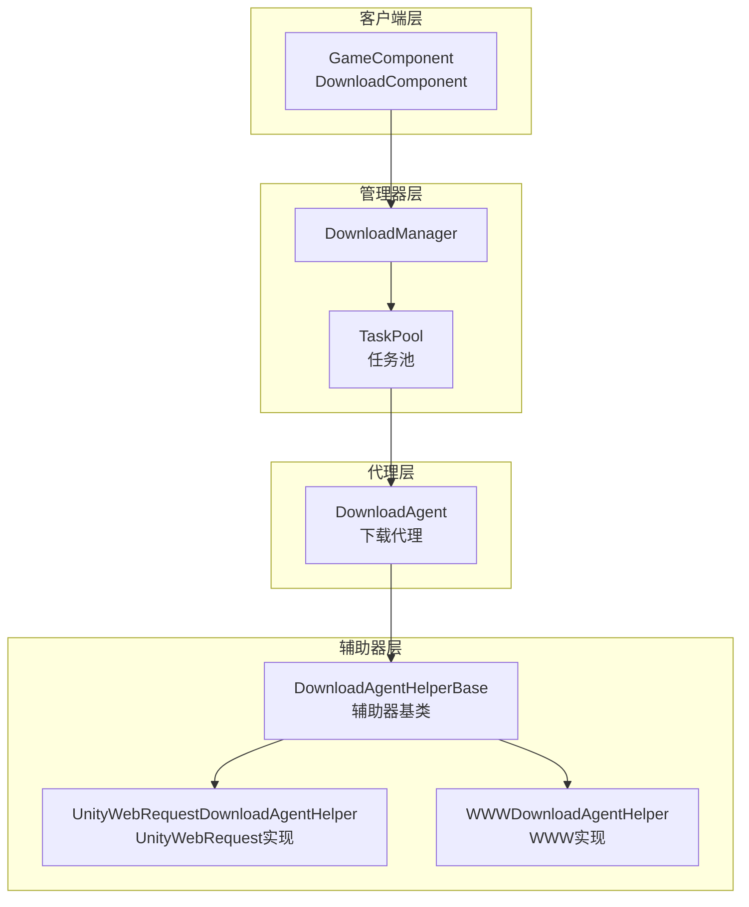
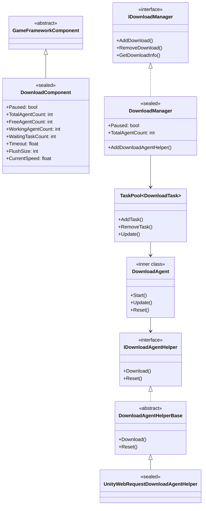
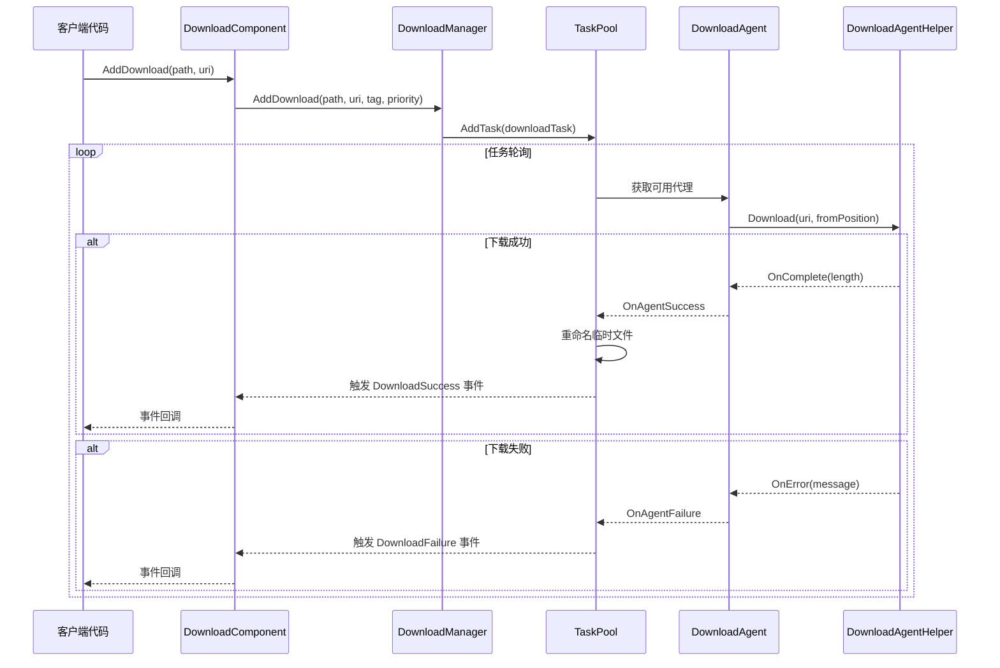
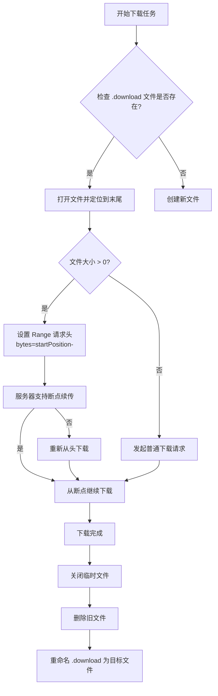
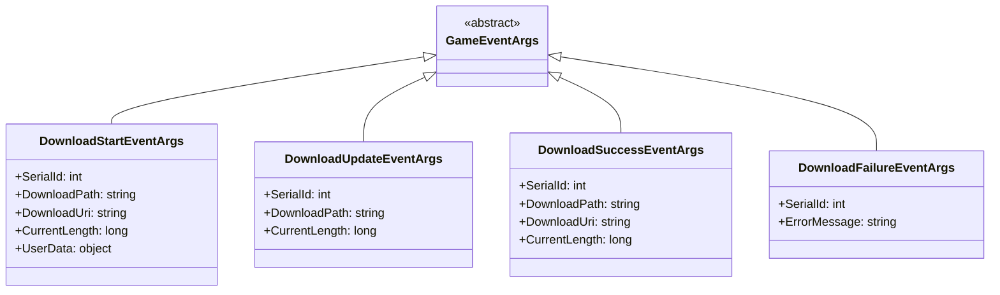

# 架构概述

GameFrameX Download 插件是一个功能完善的 Unity 下载管理框架，提供了统一的任务调度、下载代理管理、断点续传和多线程下载能力。

## 概述

GameFrameX Download 插件是 GameFrameX 框架的核心组件之一，专门为 Unity 游戏提供高效、可靠的资源下载解决方案。该插件采用模块化设计，将下载任务管理、代理调度和底层网络通信分离，便于扩展和维护。

**设计目标：**
- 提供统一的下载任务管理接口
- 支持多线程并发下载
- 实现断点续传功能
- 支持可插拔的下载代理实现
- 提供完整的事件系统用于进度监控

## 架构设计

该插件采用分层架构设计，从上到下分为四个主要层次：



### 架构层次说明

| 层次 | 组件 | 职责 |
|------|------|------|
| 客户端层 | DownloadComponent | 对外暴露下载功能，集成到 Unity 组件系统 |
| 管理器层 | DownloadManager | 统一管理下载任务、事件、代理池 |
| 代理层 | DownloadAgent | 处理单个下载任务的生命周期 |
| 辅助器层 | DownloadAgentHelper | 底层网络通信实现 |

## 核心组件

### 组件关系图



### 核心组件职责

#### 1. DownloadComponent（下载组件）

`DownloadComponent` 是插件的入口点，继承自 `GameFrameworkComponent`，直接挂载在 Unity 场景中使用。它负责：

- 初始化 `DownloadManager` 模块
- 创建和管理 `DownloadAgentHelper` 实例
- 对外暴露下载 API
- 订阅并转发下载事件

> Source: [DownloadComponent.cs](https://github.com/GameFrameX/com.gameframex.unity.download/blob/main/Runtime/Download/DownloadComponent.cs#L1-L443)

关键属性：

```csharp
// 获取可用下载代理数量
public int FreeAgentCount { get; }

// 获取工作中下载代理数量
public int WorkingAgentCount { get; }

// 获取等待下载任务数量
public int WaitingTaskCount { get; }

// 获取当前下载速度（字节/秒）
public float CurrentSpeed { get; }
```

#### 2. DownloadManager（下载管理器）

`DownloadManager` 是核心模块，继承自 `GameFrameworkModule`，实现 `IDownloadManager` 接口。主要功能：

- 管理任务池（TaskPool）
- 注册和调度下载代理
- 维护下载计数器（DownloadCounter）
- 触发下载事件

> Source: [DownloadManager.cs](https://github.com/GameFrameX/com.gameframex.unity.download/blob/main/Runtime/Download/Download/DownloadManager.cs#L1-L430)

```csharp
public sealed partial class DownloadManager : GameFrameworkModule, IDownloadManager
{
    private readonly TaskPool<DownloadTask> m_TaskPool;
    private readonly DownloadCounter m_DownloadCounter;
}
```

#### 3. DownloadAgent（下载代理）

`DownloadAgent` 是内部类，实现了 `ITaskAgent<DownloadTask>` 接口，负责单个下载任务的完整生命周期：

- 创建下载临时文件（.download 后缀）
- 处理断点续传逻辑
- 将下载数据写入磁盘
- 处理超时检测

> Source: [DownloadManager.DownloadAgent.cs](https://github.com/GameFrameX/com.gameframex.unity.download/blob/main/Runtime/Download/Download/DownloadManager.DownloadAgent.cs#L1-L358)

#### 4. DownloadAgentHelper（下载代理辅助器）

辅助器采用策略模式设计，支持多种底层实现：

- `IDownloadAgentHelper`：辅助器接口
- `DownloadAgentHelperBase`：抽象基类
- `UnityWebRequestDownloadAgentHelper`：基于 UnityWebRequest 的实现（推荐）
- `WWWDownloadAgentHelper`：基于 WWW 的实现（已废弃）

> Source: [IDownloadAgentHelper.cs](https://github.com/GameFrameX/com.gameframex.unity.download/blob/main/Runtime/Download/Download/IDownloadAgentHelper.cs#L1-L66)
> Source: [UnityWebRequestDownloadAgentHelper.cs](https://github.com/GameFrameX/com.gameframex.unity.download/blob/main/Runtime/Download/UnityWebRequestDownloadAgentHelper.cs#L1-L230)

## 核心流程

### 下载任务流程



### 断点续传流程

当已有下载文件时，下载代理会自动检测并恢复下载：



## 事件系统

插件提供了完整的事件系统，用于监控下载进度和状态：



### 事件触发时机

| 事件 | 触发时机 |
|------|----------|
| DownloadStart | 下载代理开始处理任务 |
| DownloadUpdate | 下载数据更新（每帧多次） |
| DownloadSuccess | 下载完成并写入磁盘 |
| DownloadFailure | 下载失败或出错 |

> 详细事件参数说明请参见 [下载事件](./6-events.download-events) 文档。

## 配置选项

DownloadComponent 提供以下可配置项：

| 属性 | 类型 | 默认值 | 说明 |
|------|------|--------|------|
| DownloadAgentHelperTypeName | string | UnityWebRequestDownloadAgentHelper | 下载代理辅助器类型 |
| DownloadAgentHelperCount | int | 3 | 下载代理实例数量 |
| Timeout | float | 30f | 下载超时时间（秒） |
| FlushSize | int | 1MB | 缓冲区刷新大小 |

> 详细配置说明请参见 [编辑器配置](./7-configuration.editor-configuration) 和 [下载代理配置](./7-configuration.agent-configuration) 文档。

## 扩展机制

### 自定义下载代理

可以通过继承 `DownloadAgentHelperBase` 创建自定义下载实现：

```csharp
public class CustomDownloadAgentHelper : DownloadAgentHelperBase
{
    public override void Download(string downloadUri, object userData)
    {
        // 实现自定义下载逻辑
    }
    
    public override void Download(string downloadUri, long fromPosition, object userData)
    {
        // 实现断点续传
    }
    
    public override void Download(string downloadUri, long fromPosition, long toPosition, object userData)
    {
        // 实现范围下载
    }
    
    public override void Reset()
    {
        // 清理资源
    }
}
```

> 详细扩展说明请参见 [下载代理](./4-core-concepts.download-agent) 文档。

## 性能特性

### 并发下载

插件支持多代理并发下载，通过 `DownloadAgentHelperCount` 配置代理数量。任务池会自动将任务分配给空闲的代理。

### 速度计算

使用移动平均算法计算下载速度：

```csharp
m_DownloadCounter = new DownloadCounter(1f, 10f);  // 1秒更新间隔，10秒平均
```

> 详细实现请参见 [DownloadCounter](./4-core-concepts.download-component) 文档。

### 断点续传

- 下载过程中使用 `.download` 临时文件
- 支持检测已有临时文件并恢复下载
- 下载完成后自动重命名为目标文件

## 相关链接

- [DownloadComponent](./4-core-concepts.download-component) - 下载组件详解
- [下载代理](./4-core-concepts.download-agent) - 代理实现详解
- [下载事件](./6-events.download-events) - 事件系统详解
- [编辑器配置](./7-configuration.editor-configuration) - 编辑器配置
- [下载代理配置](./7-configuration.agent-configuration) - 代理配置
- [API 参考](./5-api-reference.properties) - 属性 API
- [API 参考](./5-api-reference.methods) - 方法 API
