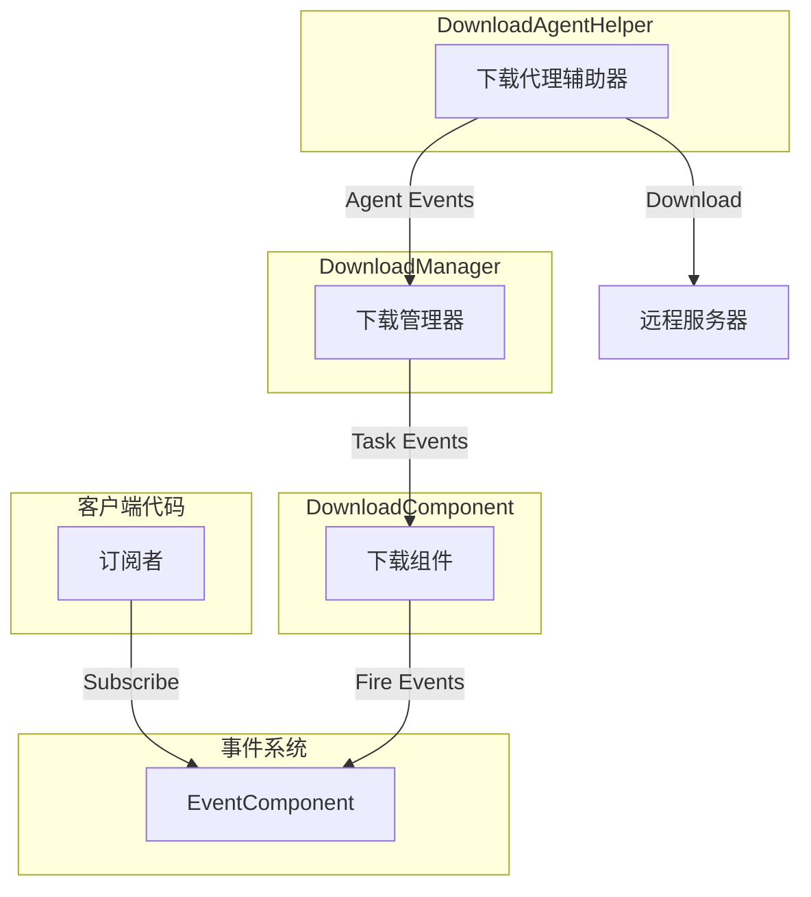
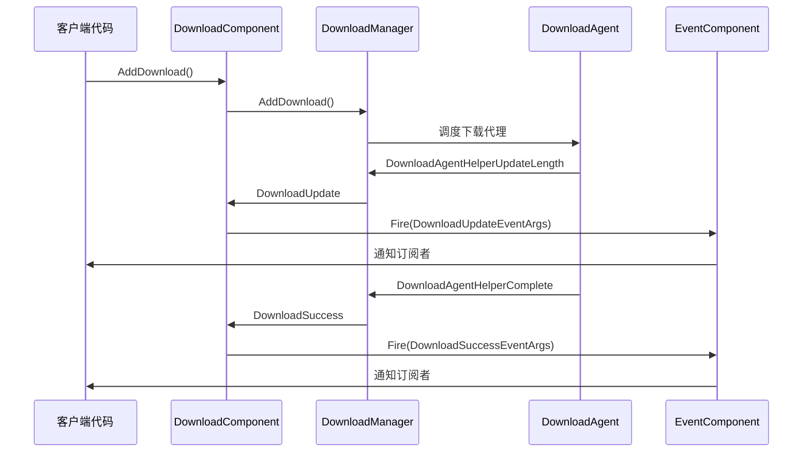

# 下载事件

本文档详细介绍 GameFrameX 下载模块中的事件系统，包括下载任务事件和下载代理事件两大类。

## 概述

GameFrameX 下载模块采用事件驱动架构，通过统一的事件系统实现下载状态的实时通知。事件系统分为两个层次：

1. **下载任务事件** - 针对整个下载任务的状态变更通知
2. **下载代理事件** - 针对下载代理辅助器的底层状态通知

这种分层设计使得开发者可以根据需求选择不同粒度的事件监听，既可以监听高层下载任务状态，也可以监听底层代理数据传输状态。

## 事件架构

下载事件系统采用发布-订阅模式，通过 `EventComponent` 统一管理和分发事件。



### 事件流程说明

1. 客户端通过 `EventComponent` 订阅感兴趣的下载事件
2. 当调用 `DownloadComponent.AddDownload()` 添加下载任务时，任务进入下载队列
3. `DownloadManager` 调度下载代理执行实际下载操作
4. 下载过程中产生的各类事件通过 `DownloadComponent` 转发到 `EventComponent`
5. 订阅者收到事件通知并执行相应逻辑

## 下载任务事件

下载任务事件在 `IDownloadManager` 接口中定义，由 `DownloadComponent` 统一暴露给外部使用。这些事件提供了下载任务完整生命周期中的关键状态变更通知。

> Source: [IDownloadManager.cs](https://github.com/GameFrameX/com.gameframex.unity.download/blob/main/Runtime/Download/Download/IDownloadManager.cs#L86-L104)

### 事件列表

| 事件名称 | 事件参数类 | 触发时机 |
|---------|-----------|---------|
| 下载开始 | `DownloadStartEventArgs` | 下载任务开始执行时 |
| 下载更新 | `DownloadUpdateEventArgs` | 下载进度更新时 |
| 下载成功 | `DownloadSuccessEventArgs` | 下载成功完成时 |
| 下载失败 | `DownloadFailureEventArgs` | 下载失败时 |

### DownloadStartEventArgs

下载开始事件，在下载任务被下载代理接收并开始处理时触发。

```csharp
//------------------------------------------------------------
// Game Framework
// Copyright © 2013-2021 Jiang Yin. All rights reserved.
//------------------------------------------------------------

using GameFrameX.Event.Runtime;
using GameFrameX.Runtime;

namespace GameFrameX.Download.Runtime
{
    /// <summary>
    /// 下载开始事件。
    /// </summary>
    public sealed class DownloadStartEventArgs : GameEventArgs
    {
        public static readonly string EventId = typeof(DownloadStartEventArgs).FullName;

        /// <summary>
        /// 初始化下载开始事件的新实例。
        /// </summary>
        public DownloadStartEventArgs()
        {
            SerialId = 0;
            DownloadPath = null;
            DownloadUri = null;
            CurrentLength = 0L;
            UserData = null;
        }

        /// <summary>
        /// 获取下载任务的序列编号。
        /// </summary>
        public int SerialId { get; private set; }

        /// <summary>
        /// 获取下载后存放路径。
        /// </summary>
        public string DownloadPath { get; private set; }

        /// <summary>
        /// 获取下载地址。
        /// </summary>
        public string DownloadUri { get; private set; }

        /// <summary>
        /// 获取当前大小。
        /// </summary>
        public long CurrentLength { get; private set; }

        /// <summary>
        /// 获取用户自定义数据。
        /// </summary>
        public object UserData { get; private set; }

        /// <summary>
        /// 创建下载开始事件。
        /// </summary>
        public static DownloadStartEventArgs Create(int serialId, string downloadPath, string downloadUri, long currentLength, object userData)
        {
            DownloadStartEventArgs downloadStartEventArgs = ReferencePool.Acquire<DownloadStartEventArgs>();
            downloadStartEventArgs.SerialId = serialId;
            downloadStartEventArgs.DownloadPath = downloadPath;
            downloadStartEventArgs.DownloadUri = downloadUri;
            downloadStartEventArgs.CurrentLength = currentLength;
            downloadStartEventArgs.UserData = userData;
            return downloadStartEventArgs;
        }

        /// <summary>
        /// 清理下载开始事件。
        /// </summary>
        public override void Clear()
        {
            SerialId = 0;
            DownloadPath = null;
            DownloadUri = null;
            CurrentLength = 0L;
            UserData = null;
        }

        public override string Id
        {
            get { return EventId; }
        }
    }
}
```
> Source: [DownloadStartEventArgs.cs](https://github.com/GameFrameX/com.gameframex.unity.download/blob/main/Runtime/EventArgs/DownloadStartEventArgs.cs#L1-L94)

### DownloadUpdateEventArgs

下载更新事件，在下载过程中持续触发，用于报告当前下载进度。

```csharp
/// <summary>
/// 下载更新事件。
/// </summary>
public sealed class DownloadUpdateEventArgs : GameEventArgs
{
    public static readonly string EventId = typeof(DownloadUpdateEventArgs).FullName;

    /// <summary>
    /// 初始化下载更新事件的新实例。
    /// </summary>
    public DownloadUpdateEventArgs()
    {
        SerialId = 0;
        DownloadPath = null;
        DownloadUri = null;
        CurrentLength = 0L;
        UserData = null;
    }

    /// <summary>
    /// 获取下载任务的序列编号。
    /// </summary>
    public int SerialId { get; private set; }

    /// <summary>
    /// 获取下载后存放路径。
    /// </summary>
    public string DownloadPath { get; private set; }

    /// <summary>
    /// 获取下载地址。
    /// </summary>
    public string DownloadUri { get; private set; }

    /// <summary>
    /// 获取当前大小。
    /// </summary>
    public long CurrentLength { get; private set; }

    /// <summary>
    /// 获取用户自定义数据。
    /// </summary>
    public object UserData { get; private set; }

    /// <summary>
    /// 创建下载更新事件。
    /// </summary>
    public static DownloadUpdateEventArgs Create(int serialId, string downloadPath, string downloadUri, long currentLength, object userData)
    {
        DownloadUpdateEventArgs downloadUpdateEventArgs = ReferencePool.Acquire<DownloadUpdateEventArgs>();
        downloadUpdateEventArgs.SerialId = serialId;
        downloadUpdateEventArgs.DownloadPath = downloadPath;
        downloadUpdateEventArgs.DownloadUri = downloadUri;
        downloadUpdateEventArgs.CurrentLength = currentLength;
        downloadUpdateEventArgs.UserData = userData;
        return downloadUpdateEventArgs;
    }

    /// <summary>
    /// 清理下载更新事件。
    /// </summary>
    public override void Clear()
    {
        SerialId = 0;
        DownloadPath = null;
        DownloadUri = null;
        CurrentLength = 0L;
        UserData = null;
    }

    public override string Id
    {
        get { return EventId; }
    }
}
```
> Source: [DownloadUpdateEventArgs.cs](https://github.com/GameFrameX/com.gameframex.unity.download/blob/main/Runtime/EventArgs/DownloadUpdateEventArgs.cs#L1-L94)

### DownloadSuccessEventArgs

下载成功事件，在下载任务成功完成时触发。

```csharp
/// <summary>
/// 下载成功事件。
/// </summary>
public sealed class DownloadSuccessEventArgs : GameEventArgs
{
    public static readonly string EventId = typeof(DownloadSuccessEventArgs).FullName;

    /// <summary>
    /// 初始化下载成功事件的新实例。
    /// </summary>
    public DownloadSuccessEventArgs()
    {
        SerialId = 0;
        DownloadPath = null;
        DownloadUri = null;
        CurrentLength = 0L;
        UserData = null;
    }

    /// <summary>
    /// 获取下载任务的序列编号。
    /// </summary>
    public int SerialId { get; private set; }

    /// <summary>
    /// 获取下载后存放路径。
    /// </summary>
    public string DownloadPath { get; private set; }

    /// <summary>
    /// 获取下载地址。
    /// </summary>
    public string DownloadUri { get; private set; }

    /// <summary>
    /// 获取当前大小。
    /// </summary>
    public long CurrentLength { get; private set; }

    /// <summary>
    /// 获取用户自定义数据。
    /// </summary>
    public object UserData { get; private set; }

    /// <summary>
    /// 创建下载成功事件。
    /// </summary>
    public static DownloadSuccessEventArgs Create(int serialId, string downloadPath, string downloadUri, long currentLength, object userData)
    {
        DownloadSuccessEventArgs downloadSuccessEventArgs = ReferencePool.Acquire<DownloadSuccessEventArgs>();
        downloadSuccessEventArgs.SerialId = serialId;
        downloadSuccessEventArgs.DownloadPath = downloadPath;
        downloadSuccessEventArgs.DownloadUri = downloadUri;
        downloadSuccessEventArgs.CurrentLength = currentLength;
        downloadSuccessEventArgs.UserData = userData;
        return downloadSuccessEventArgs;
    }

    /// <summary>
    /// 清理下载成功事件。
    /// </summary>
    public override void Clear()
    {
        SerialId = 0;
        DownloadPath = null;
        DownloadUri = null;
        CurrentLength = 0L;
        UserData = null;
    }

    public override string Id
    {
        get { return EventId; }
    }
}
```
> Source: [DownloadSuccessEventArgs.cs](https://github.com/GameFrameX/com.gameframex.unity.download/blob/main/Runtime/EventArgs/DownloadSuccessEventArgs.cs#L1-L95)

### DownloadFailureEventArgs

下载失败事件，在下载过程中发生错误时触发。

```csharp
/// <summary>
/// 下载失败事件。
/// </summary>
public sealed class DownloadFailureEventArgs : GameEventArgs
{
    public static readonly string EventId = typeof(DownloadFailureEventArgs).FullName;

    /// <summary>
    /// 初始化下载失败事件的新实例。
    /// </summary>
    public DownloadFailureEventArgs()
    {
        SerialId = 0;
        DownloadPath = null;
        DownloadUri = null;
        ErrorMessage = null;
        UserData = null;
    }

    /// <summary>
    /// 获取下载任务的序列编号。
    /// </summary>
    public int SerialId { get; private set; }

    /// <summary>
    /// 获取下载后存放路径。
    /// </summary>
    public string DownloadPath { get; private set; }

    /// <summary>
    /// 获取下载地址。
    /// </summary>
    public string DownloadUri { get; private set; }

    /// <summary>
    /// 获取错误信息。
    /// </summary>
    public string ErrorMessage { get; private set; }

    /// <summary>
    /// 获取用户自定义数据。
    /// </summary>
    public object UserData { get; private set; }

    /// <summary>
    /// 创建下载失败事件。
    /// </summary>
    public static DownloadFailureEventArgs Create(int serialId, string downloadPath, string downloadUri, string errorMessage, object userData)
    {
        DownloadFailureEventArgs downloadFailureEventArgs = ReferencePool.Acquire<DownloadFailureEventArgs>();
        downloadFailureEventArgs.SerialId = serialId;
        downloadFailureEventArgs.DownloadPath = downloadPath;
        downloadFailureEventArgs.DownloadUri = downloadUri;
        downloadFailureEventArgs.ErrorMessage = errorMessage;
        downloadFailureEventArgs.UserData = userData;
        return downloadFailureEventArgs;
    }

    /// <summary>
    /// 清理下载失败事件。
    /// </summary>
    public override void Clear()
    {
        SerialId = 0;
        DownloadPath = null;
        DownloadUri = null;
        ErrorMessage = null;
        UserData = null;
    }

    public override string Id
    {
        get { return EventId; }
    }
}
```
> Source: [DownloadFailureEventArgs.cs](https://github.com/GameFrameX/com.gameframex.unity.download/blob/main/Runtime/EventArgs/DownloadFailureEventArgs.cs#L1-L94)

## 下载代理事件

下载代理事件定义在 `DownloadAgentHelperBase` 抽象类中，提供更底层的下载状态通知。这些事件主要被 `DownloadManager` 内部使用，用于追踪下载代理的工作状态。

> Source: [DownloadAgentHelperBase.cs](https://github.com/GameFrameX/com.gameframex.unity.download/blob/main/Runtime/Download/DownloadAgentHelperBase.cs#L19-L42)

### 事件列表

| 事件名称 | 事件参数类 | 触发时机 |
|---------|-----------|---------|
| 代理更新数据流 | `DownloadAgentHelperUpdateBytesEventArgs` | 下载代理接收到新的数据块时 |
| 代理更新数据大小 | `DownloadAgentHelperUpdateLengthEventArgs` | 下载代理下载数据大小变化时 |
| 代理完成 | `DownloadAgentHelperCompleteEventArgs` | 下载代理完成下载时 |
| 代理错误 | `DownloadAgentHelperErrorEventArgs` | 下载代理发生错误时 |

### DownloadAgentHelperUpdateBytesEventArgs

代理更新数据流事件，提供下载数据的原始字节内容。

```csharp
/// <summary>
/// 下载代理辅助器更新数据流事件。
/// </summary>
public sealed class DownloadAgentHelperUpdateBytesEventArgs : GameEventArgs
{
    public static readonly string EventId = typeof(DownloadAgentHelperUpdateBytesEventArgs).FullName;
    
    private byte[] m_Bytes;

    /// <summary>
    /// 初始化下载代理辅助器更新数据流事件的新实例。
    /// </summary>
    public DownloadAgentHelperUpdateBytesEventArgs()
    {
        m_Bytes = null;
        Offset = 0;
        Length = 0;
    }

    /// <summary>
    /// 获取数据流的偏移。
    /// </summary>
    public int Offset { get; private set; }

    /// <summary>
    /// 获取数据流的长度。
    /// </summary>
    public int Length { get; private set; }

    /// <summary>
    /// 创建下载代理辅助器更新数据流事件。
    /// </summary>
    public static DownloadAgentHelperUpdateBytesEventArgs Create(byte[] bytes, int offset, int length)
    {
        if (bytes == null)
        {
            throw new GameFrameworkException("Bytes is invalid.");
        }

        if (offset < 0 || offset >= bytes.Length)
        {
            throw new GameFrameworkException("Offset is invalid.");
        }

        if (length <= 0 || offset + length > bytes.Length)
        {
            throw new GameFrameworkException("Length is invalid.");
        }

        DownloadAgentHelperUpdateBytesEventArgs downloadAgentHelperUpdateBytesEventArgs = ReferencePool.Acquire<DownloadAgentHelperUpdateBytesEventArgs>();
        downloadAgentHelperUpdateBytesEventArgs.m_Bytes = bytes;
        downloadAgentHelperUpdateBytesEventArgs.Offset = offset;
        downloadAgentHelperUpdateBytesEventArgs.Length = length;
        return downloadAgentHelperUpdateBytesEventArgs;
    }

    /// <summary>
    /// 获取下载的数据流。
    /// </summary>
    public byte[] GetBytes()
    {
        return m_Bytes;
    }
    
    public override string Id
    {
        get { return EventId; }
    }
}
```
> Source: [DownloadAgentHelperUpdateBytesEventArgs.cs](https://github.com/GameFrameX/com.gameframex.unity.download/blob/main/Runtime/EventArgs/DownloadAgentHelperUpdateBytesEventArgs.cs#L1-L104)

### DownloadAgentHelperUpdateLengthEventArgs

代理更新数据大小事件，提供下载数据的增量大小。

```csharp
/// <summary>
/// 下载代理辅助器更新数据大小事件。
/// </summary>
public sealed class DownloadAgentHelperUpdateLengthEventArgs : GameEventArgs
{
    public static readonly string EventId = typeof(DownloadAgentHelperUpdateLengthEventArgs).FullName;

    /// <summary>
    /// 初始化下载代理辅助器更新数据大小事件的新实例。
    /// </summary>
    public DownloadAgentHelperUpdateLengthEventArgs()
    {
        DeltaLength = 0;
    }

    /// <summary>
    /// 获取下载的增量数据大小。
    /// </summary>
    public int DeltaLength { get; private set; }

    /// <summary>
    /// 创建下载代理辅助器更新数据大小事件。
    /// </summary>
    public static DownloadAgentHelperUpdateLengthEventArgs Create(int deltaLength)
    {
        if (deltaLength <= 0)
        {
            throw new GameFrameworkException("Delta length is invalid.");
        }

        DownloadAgentHelperUpdateLengthEventArgs downloadAgentHelperUpdateLengthEventArgs = ReferencePool.Acquire<DownloadAgentHelperUpdateLengthEventArgs>();
        downloadAgentHelperUpdateLengthEventArgs.DeltaLength = deltaLength;
        return downloadAgentHelperUpdateLengthEventArgs;
    }

    /// <summary>
    /// 清理下载代理辅助器更新数据大小事件。
    /// </summary>
    public override void Clear()
    {
        DeltaLength = 0;
    }

    public override string Id
    {
        get { return EventId; }
    }
}
```
> Source: [DownloadAgentHelperUpdateLengthEventArgs.cs](https://github.com/GameFrameX/com.gameframex.unity.download/blob/main/Runtime/EventArgs/DownloadAgentHelperUpdateLengthEventArgs.cs#L1-L63)

### DownloadAgentHelperCompleteEventArgs

代理完成事件，在下载代理完成下载时触发。

```csharp
/// <summary>
/// 下载代理辅助器完成事件。
/// </summary>
public sealed class DownloadAgentHelperCompleteEventArgs : GameEventArgs
{
    public static readonly string EventId = typeof(DownloadAgentHelperCompleteEventArgs).FullName;

    /// <summary>
    /// 初始化下载代理辅助器完成事件的新实例。
    /// </summary>
    public DownloadAgentHelperCompleteEventArgs()
    {
        Length = 0L;
    }

    /// <summary>
    /// 获取下载的数据大小。
    /// </summary>
    public long Length { get; private set; }

    /// <summary>
    /// 创建下载代理辅助器完成事件。
    /// </summary>
    public static DownloadAgentHelperCompleteEventArgs Create(long length)
    {
        if (length < 0L)
        {
            throw new GameFrameworkException("Length is invalid.");
        }

        DownloadAgentHelperCompleteEventArgs downloadAgentHelperCompleteEventArgs = ReferencePool.Acquire<DownloadAgentHelperCompleteEventArgs>();
        downloadAgentHelperCompleteEventArgs.Length = length;
        return downloadAgentHelperCompleteEventArgs;
    }

    /// <summary>
    /// 清理下载代理辅助器完成事件。
    /// </summary>
    public override void Clear()
    {
        Length = 0L;
    }

    public override string Id
    {
        get { return EventId; }
    }
}
```
> Source: [DownloadAgentHelperCompleteEventArgs.cs](https://github.com/GameFrameX/com.gameframex.unity.download/blob/main/Runtime/EventArgs/DownloadAgentHelperCompleteEventArgs.cs#L1-L63)

### DownloadAgentHelperErrorEventArgs

代理错误事件，在下载代理发生错误时触发。

```csharp
/// <summary>
/// 下载代理辅助器错误事件。
/// </summary>
public sealed class DownloadAgentHelperErrorEventArgs : GameEventArgs
{
    public static readonly string EventId = typeof(DownloadAgentHelperErrorEventArgs).FullName;

    /// <summary>
    /// 初始化下载代理辅助器错误事件的新实例。
    /// </summary>
    public DownloadAgentHelperErrorEventArgs()
    {
        DeleteDownloading = false;
        ErrorMessage = null;
    }

    /// <summary>
    /// 获取是否需要删除正在下载的文件。
    /// </summary>
    public bool DeleteDownloading { get; private set; }

    /// <summary>
    /// 获取错误信息。
    /// </summary>
    public string ErrorMessage { get; private set; }

    /// <summary>
    /// 创建下载代理辅助器错误事件。
    /// </summary>
    public static DownloadAgentHelperErrorEventArgs Create(bool deleteDownloading, string errorMessage)
    {
        DownloadAgentHelperErrorEventArgs downloadAgentHelperErrorEventArgs = ReferencePool.Acquire<DownloadAgentHelperErrorEventArgs>();
        downloadAgentHelperErrorEventArgs.DeleteDownloading = deleteDownloading;
        downloadAgentHelperErrorEventArgs.ErrorMessage = errorMessage;
        return downloadAgentHelperErrorEventArgs;
    }

    /// <summary>
    /// 清理下载代理辅助器错误事件。
    /// </summary>
    public override void Clear()
    {
        DeleteDownloading = false;
        ErrorMessage = null;
    }

    public override string Id
    {
        get { return EventId; }
    }
}
```
> Source: [DownloadAgentHelperErrorEventArgs.cs](https://github.com/GameFrameX/com.gameframex.unity.download/blob/main/Runtime/EventArgs/DownloadAgentHelperErrorEventArgs.cs#L1-L67)

## 事件订阅与使用

开发者可以通过 `EventComponent` 订阅下载事件，监听下载状态的变化。

### 事件订阅示例

```csharp
using GameFrameX.Download.Runtime;
using GameFrameX.Event.Runtime;
using UnityEngine;

public class DownloadExample : MonoBehaviour
{
    private EventComponent m_EventComponent;
    
    private void Start()
    {
        m_EventComponent = GameEntry.GetComponent<EventComponent>();
        
        // 订阅下载开始事件
        m_EventComponent.Subscribe(DownloadStartEventArgs.EventId, OnDownloadStart);
        
        // 订阅下载更新事件
        m_EventComponent.Subscribe(DownloadUpdateEventArgs.EventId, OnDownloadUpdate);
        
        // 订阅下载成功事件
        m_EventComponent.Subscribe(DownloadSuccessEventArgs.EventId, OnDownloadSuccess);
        
        // 订阅下载失败事件
        m_EventComponent.Subscribe(DownloadFailureEventArgs.EventId, OnDownloadFailure);
    }
    
    private void OnDownloadStart(object sender, GameEventArgs e)
    {
        var args = (DownloadStartEventArgs)e;
        Debug.Log($"下载开始: SerialId={args.SerialId}, Path={args.DownloadPath}");
    }
    
    private void OnDownloadUpdate(object sender, GameEventArgs e)
    {
        var args = (DownloadUpdateEventArgs)e;
        Debug.Log($"下载进度: SerialId={args.SerialId}, CurrentLength={args.CurrentLength}");
    }
    
    private void OnDownloadSuccess(object sender, GameEventArgs e)
    {
        var args = (DownloadSuccessEventArgs)e;
        Debug.Log($"下载成功: SerialId={args.SerialId}, Path={args.DownloadPath}");
    }
    
    private void OnDownloadFailure(object sender, GameEventArgs e)
    {
        var args = (DownloadFailureEventArgs)e;
        Debug.LogError($"下载失败: SerialId={args.SerialId}, Error={args.ErrorMessage}");
    }
}
```

> Source: [DownloadComponent.cs](https://github.com/GameFrameX/com.gameframex.unity.download/blob/main/Runtime/Download/DownloadComponent.cs#L415-L442)

### 事件触发流程



## 事件参数属性参考

### 下载任务事件属性

| 属性 | 类型 | 说明 | 所属事件 |
|-----|------|------|---------|
| `SerialId` | `int` | 下载任务的唯一序列编号 | 全部 |
| `DownloadPath` | `string` | 下载后存放的本地路径 | 全部 |
| `DownloadUri` | `string` | 远程下载地址 | 全部 |
| `CurrentLength` | `long` | 当前已下载的数据大小（字节） | Start/Update/Success |
| `ErrorMessage` | `string` | 错误描述信息 | Failure |
| `UserData` | `object` | 用户自定义数据 | 全部 |

### 代理事件属性

| 属性 | 类型 | 说明 | 所属事件 |
|-----|------|------|---------|
| `Bytes[]` | `byte[]` | 下载的原始数据字节 | UpdateBytes |
| `Offset` | `int` | 数据流的偏移量 | UpdateBytes |
| `Length` | `int` | 数据流的长度 | UpdateBytes/Complete |
| `DeltaLength` | `int` | 本次下载的增量大小 | UpdateLength |
| `DeleteDownloading` | `bool` | 是否需要删除正在下载的文件 | Error |
| `ErrorMessage` | `string` | 错误描述信息 | Error |

## 事件使用建议

1. **选择适当的事件粒度**
   - 监听下载任务事件（`DownloadStart`/`DownloadUpdate`/`DownloadSuccess`/`DownloadFailure`）用于业务逻辑处理
   - 监听代理事件用于实现下载进度条或调试

2. **事件参数池化**
   - 所有事件参数通过 `ReferencePool` 进行池化管理
   - 使用 `Create()` 方法创建事件，通过 `Clear()` 方法回收

3. **错误处理**
   - 始终订阅 `DownloadFailure` 事件以捕获下载失败情况
   - 失败事件中的 `ErrorMessage` 包含详细的错误信息

## 相关链接

- [代理事件](./6-events.agent-events) - 下载代理底层事件详解
- [DownloadComponent](./4-core-concepts.download-component) - 下载组件详解
- [下载代理](./4-core-concepts.download-agent) - 下载代理概念说明
- [API 参考](./5-api-reference) - 完整的 API 参考文档
