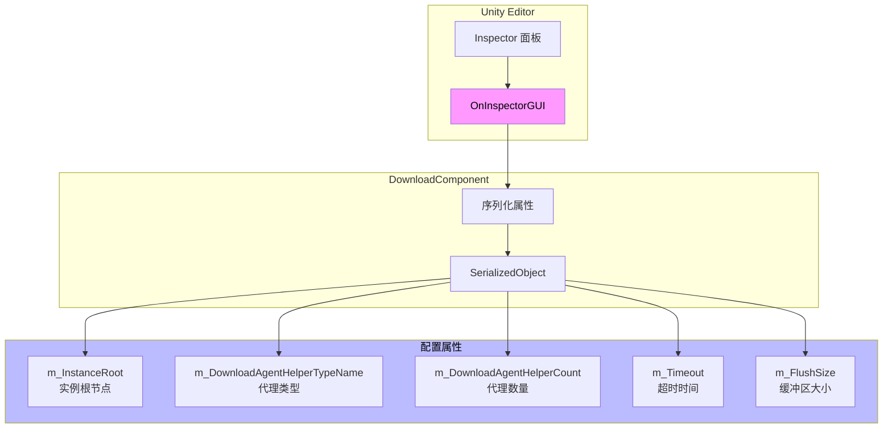
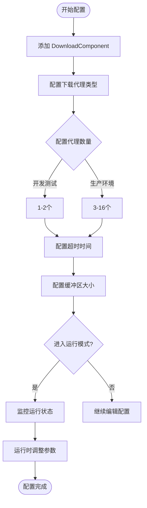

# 编辑器配置

本文档详细介绍 GameFrameX Download 组件在 Unity 编辑器中的配置选项，包括组件的 Inspector 面板配置和设计意图。

## 概述

GameFrameX Download 组件通过 Unity 的自定义 Inspector 界面提供直观的编辑器配置功能。开发者可以在编辑器中配置下载代理数量、超时时长、缓冲区大小等关键参数，无需编写代码即可完成基础配置。

> Source: [DownloadComponentInspector.cs](https://github.com/GameFrameX/com.gameframex.unity.download/blob/main/Editor/Inspector/DownloadComponentInspector.cs#L19-L156)

## 配置界面详解

### 添加 DownloadComponent

在 Unity 场景中，通过以下方式添加 Download 组件：

1. 在 Hierarchy 面板中右键选择 **GameObject** → **Create Empty**
2. 在 Inspector 面板中点击 **Add Component**
3. 搜索并选择 **Download**（或 `Game Framework/Download`）
4. 组件将自动添加到游戏对象上

```csharp
// 组件通过 AddComponentMenu 特性注册到 Unity 菜单
[AddComponentMenu("Game Framework/Download")]
public sealed class DownloadComponent : GameFrameworkComponent
```

> Source: [DownloadComponent.cs](https://github.com/GameFrameX/com.gameframex.unity.download/blob/main/Runtime/Download/DownloadComponent.cs#L22-L23)

### Inspector 配置面板

当在场景中选择带有 DownloadComponent 的游戏对象时，Inspector 面板会显示以下配置选项：

```csharp
private SerializedProperty m_InstanceRoot = null;
private SerializedProperty m_DownloadAgentHelperCount = null;
private SerializedProperty m_Timeout = null;
private SerializedProperty m_FlushSize = null;

private HelperInfo<DownloadAgentHelperBase> m_DownloadAgentHelperInfo = new HelperInfo<DownloadAgentHelperBase>("DownloadAgent");
```

> Source: [DownloadComponentInspector.cs](https://github.com/GameFrameX/com.gameframex.unity.download/blob/main/Editor/Inspector/DownloadComponentInspector.cs#L22-L27)

## 配置选项详解

### 1. Instance Root（实例根节点）

| 属性 | 说明 |
|------|------|
| **类型** | Transform |
| **默认值** | null（自动创建） |
| **运行时** | 可读取 |

**功能说明**：指定下载代理实例的父级 Transform。如果为空，组件会自动创建一个名为 "Download Agent Instances" 的游戏对象作为父节点。

```csharp
if (m_InstanceRoot == null)
{
    m_InstanceRoot = new GameObject("Download Agent Instances").transform;
    m_InstanceRoot.SetParent(gameObject.transform);
    m_InstanceRoot.localScale = Vector3.one;
}
```

> Source: [DownloadComponent.cs](https://github.com/GameFrameX/com.gameframex.unity.download/blob/main/Runtime/Download/DownloadComponent.cs#L171-L176)

---

### 2. Download Agent Helper Type（下载代理类型）

| 属性 | 说明 |
|------|------|
| **类型** | string（类型名称） |
| **默认值** | UnityGameFramework.Runtime.UnityWebRequestDownloadAgentHelper |
| **运行时** | 仅读取 |

**功能说明**：指定用于执行实际下载工作的代理辅助器类型。插件提供了两种内置实现：

- **UnityWebRequestDownloadAgentHelper**：基于 Unity 的 `UnityWebRequest` API，支持断点续传
- **WWWDownloadAgentHelper**：基于传统的 `WWW` 类（已废弃）

```csharp
[SerializeField] private string m_DownloadAgentHelperTypeName = "UnityGameFramework.Runtime.UnityWebRequestDownloadAgentHelper";
```

> Source: [DownloadComponent.cs](https://github.com/GameFrameX/com.gameframex.unity.download/blob/main/Runtime/Download/DownloadComponent.cs#L33)

**自定义代理**：开发者也可以实现自己的下载代理辅助器，只需继承 `DownloadAgentHelperBase` 类并实现相应接口。

---

### 3. Download Agent Helper Count（下载代理数量）

| 属性 | 说明 |
|------|------|
| **类型** | int |
| **范围** | 1 - 16 |
| **默认值** | 3 |
| **运行时** | 不可修改 |

**功能说明**：配置并发下载代理的数量。增加代理数量可以提高并行下载能力，但也会占用更多系统资源。

```csharp
m_DownloadAgentHelperCount.intValue = EditorGUILayout.IntSlider("Download Agent Helper Count", m_DownloadAgentHelperCount.intValue, 1, 16);
```

> Source: [DownloadComponentInspector.cs](https://github.com/GameFrameX/com.gameframex.unity.download/blob/main/Editor/Inspector/DownloadComponentInspector.cs#L41)

**配置建议**：
| 场景 | 推荐值 |
|------|--------|
| 开发测试 | 1-2 |
| 移动端游戏 | 3-5 |
| PC/主机游戏 | 5-10 |
| 大文件多线程下载 | 10-16 |

---

### 4. Timeout（超时时间）

| 属性 | 说明 |
|------|------|
| **类型** | float |
| **范围** | 0 - 120 秒 |
| **默认值** | 30 秒 |
| **运行时** | 可修改 |

**功能说明**：设置下载请求的超时时间。当下载时间超过此值时，下载任务将失败并触发错误事件。

```csharp
float timeout = EditorGUILayout.Slider("Timeout", m_Timeout.floatValue, 0f, 120f);
if (timeout != m_Timeout.floatValue)
{
    if (EditorApplication.isPlaying)
    {
        t.Timeout = timeout;  // 运行时修改
    }
    else
    {
        m_Timeout.floatValue = timeout;  // 编辑器修改
    }
}
```

> Source: [DownloadComponentInspector.cs](https://github.com/GameFrameX/com.gameframex.unity.download/blob/main/Editor/Inspector/DownloadComponentInspector.cs#L45-L56)

**设计意图**：超时设置可以防止因网络问题导致的无限等待。在编辑器模式下修改会保存到组件配置，在运行时修改则直接生效。

---

### 5. Flush Size（缓冲区刷新大小）

| 属性 | 说明 |
|------|------|
| **类型** | int |
| **默认值** | 1048576（1 MB） |
| **运行时** | 可修改 |

**功能说明**：设置将内存缓冲区数据写入磁盘的临界大小。仅当开启断点续传功能时有效。该值决定了多久将数据写入磁盘一次，较大的值可以提高性能但会降低断点续传的精度。

```csharp
private const int OneMegaBytes = 1024 * 1024;

[SerializeField] private int m_FlushSize = OneMegaBytes;
```

> Source: [DownloadComponent.cs](https://github.com/GameFrameX/com.gameframex.unity.download/blob/main/Runtime/Download/DownloadComponent.cs#L26#L41)

```csharp
int flushSize = EditorGUILayout.DelayedIntField("Flush Size", m_FlushSize.intValue);
```

> Source: [DownloadComponentInspector.cs](https://github.com/GameFrameX/com.gameframex.unity.download/blob/main/Editor/Inspector/DownloadComponentInspector.cs#L58)

**配置建议**：
| 场景 | 推荐值 | 说明 |
|------|--------|------|
| 小文件下载 | 64KB - 256KB | 更频繁写入，数据更安全 |
| 大文件下载 | 512KB - 2MB | 提高性能，减少磁盘IO |
| 网络不稳定 | 较小值 | 减少断点续传失败概率 |

---

## 运行时状态监控

在运行模式下，Inspector 面板会显示当前下载组件的实时状态信息：

```csharp
if (EditorApplication.isPlaying && IsPrefabInHierarchy(t.gameObject))
{
    EditorGUILayout.LabelField("Paused", t.Paused.ToString());
    EditorGUILayout.LabelField("Total Agent Count", t.TotalAgentCount.ToString());
    EditorGUILayout.LabelField("Free Agent Count", t.FreeAgentCount.ToString());
    EditorGUILayout.LabelField("Working Agent Count", t.WorkingAgentCount.ToString());
    EditorGUILayout.LabelField("Waiting Agent Count", t.WaitingTaskCount.ToString());
    EditorGUILayout.LabelField("Current Speed", t.CurrentSpeed.ToString());
}
```

> Source: [DownloadComponentInspector.cs](https://github.com/GameFrameX/com.gameframex.unity.download/blob/main/Editor/Inspector/DownloadComponentInspector.cs#L71-L78)

### 运行时属性说明

| 属性 | 类型 | 说明 |
|------|------|------|
| Paused | bool | 下载是否被暂停 |
| TotalAgentCount | int | 下载代理总数量 |
| FreeAgentCount | int | 可用下载代理数量 |
| WorkingAgentCount | int | 工作中下载代理数量 |
| WaitingTaskCount | int | 等待中的任务数量 |
| CurrentSpeed | float | 当前下载速度（字节/秒） |

---

## CSV 导出功能

运行时状态下，Inspector 面板提供下载任务信息导出功能：

```csharp
if (GUILayout.Button("Export CSV Data"))
{
    string exportFileName = EditorUtility.SaveFilePanel("Export CSV Data", string.Empty, "Download Task Data.csv", string.Empty);
    if (!string.IsNullOrEmpty(exportFileName))
    {
        // 导出逻辑...
    }
}
```

> Source: [DownloadComponentInspector.cs](https://github.com/GameFrameX/com.gameframex.unity.download/blob/main/Editor/Inspector/DownloadComponentInspector.cs#L89-L112)

点击按钮后，可以将当前所有下载任务的信息导出为 CSV 文件，包含以下字段：
- Download Path（下载路径）
- Serial Id（序列编号）
- Tag（标签）
- Priority（优先级）
- Status（状态）

---

## 编辑器配置架构



---

## 配置流程图



---

## 相关链接

- [下载代理配置](./7-configuration.agent-configuration) - 了解下载代理的详细配置
- [DownloadComponent](./4-core-concepts.download-component) - 核心组件详解
- [下载代理](./4-core-concepts.download-agent) - 下载代理工作原理
- [API 参考](./5-api-reference.properties) - 属性详细说明
- [API 参考](./5-api-reference.methods) - 方法详细说明
