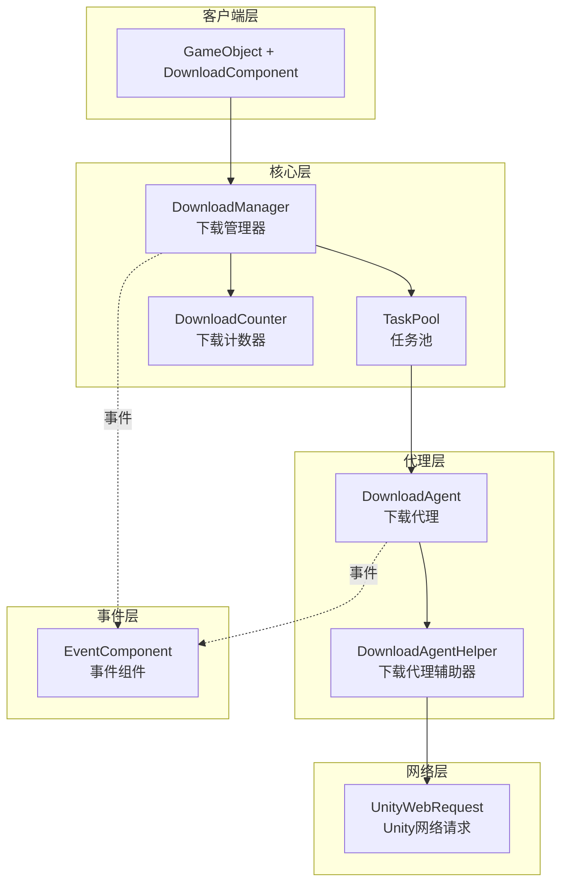
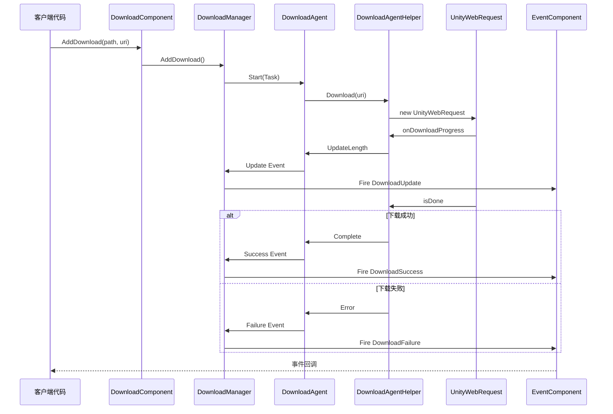

# 插件介绍

GameFrameX Download 下载任务组件是 GameFrameX 游戏框架的核心模块之一，专门为 Unity 游戏项目提供高效、可靠的资源下载解决方案。该组件采用模块化设计，支持多线程并发下载、断点续传、任务优先级管理等企业级功能。

## 概述

GameFrameX Download 组件是一个功能完善的下载管理系统，旨在帮助 Unity 开发者轻松实现游戏资源的远程下载和更新功能。该组件设计遵循高内聚、低耦合的原则，通过事件驱动机制提供下载全流程的状态追踪，让开发者能够灵活控制下载任务的创建、管理和监控。

该组件的核心价值在于提供了开箱即用的下载功能，开发者无需关心底层网络实现的复杂性，只需调用简单的 API 即可完成复杂的下载任务。同时，组件支持自定义下载代理辅助器，允许开发者根据项目需求替换或扩展下载实现方式。

从架构角度来看，Download 组件构建在 GameFrameX 框架的模块系统之上，与 Event 组件紧密集成，通过统一的事件机制向外部传递下载状态变化。这种设计使得下载逻辑与业务逻辑完全分离，代码更加清晰易于维护。

## 核心功能

该下载组件提供了完整的企业级下载管理能力，能够满足各种复杂的游戏资源下载场景。以下是组件的主要功能特性：

### 多任务并发下载

组件内部采用任务池（TaskPool）机制管理下载任务，支持配置多个下载代理同时工作。开发者可以根据实际需求调整并发数量，在下载速度和系统资源消耗之间取得平衡。任务池会自动调度任务的执行顺序，确保高优先级任务优先处理，同时合理分配系统带宽资源。

```csharp
// 配置下载代理数量，默认值为3
[SerializeField] private int m_DownloadAgentHelperCount = 3;
```
> Source: [DownloadComponent.cs](https://github.com/GameFrameX/com.gameframex.unity.download/blob/main/Runtime/Download/DownloadComponent.cs#L37)

### 断点续传支持

组件内置断点续传功能，在下载过程中会将数据先写入 `.download` 临时文件。当下载中断（无论是网络问题还是应用退出）后重新启动时，系统会自动检测已下载的部分，并从中断处继续下载，避免重复下载造成的流量浪费和时间损失。

```csharp
// 检测并继续未完成的下载
if (File.Exists(downloadFile))
{
    m_FileStream = File.OpenWrite(downloadFile);
    m_FileStream.Seek(0L, SeekOrigin.End);
    m_StartLength = m_SavedLength = m_FileStream.Length;
}
```
> Source: [DownloadManager.DownloadAgent.cs](https://github.com/GameFrameX/com.gameframex.unity.download/blob/main/Runtime/Download/Download/DownloadManager.DownloadAgent.cs#L173-L178)

### 任务优先级管理

每个下载任务都可以设置优先级（整数数值，数值越高优先级越大），任务池会根据优先级调度下载顺序。在游戏更新场景中，可以将关键资源（如初始场景、核心配置）设置为高优先级，确保重要内容优先下载完成。

### 实时进度追踪

组件提供完整的下载事件系统，包括下载开始、进度更新、下载成功和下载失败四种状态。开发者可以通过订阅这些事件实时获取下载进度、速度统计等信息，并据此更新用户界面或执行相应的业务逻辑。

### 下载速度统计

内置下载计数器模块，能够实时计算当前下载速度（字节/秒）。这一功能对于向用户展示下载进度、优化下载体验非常有帮助。开发者可以通过 `CurrentSpeed` 属性获取当前下载速度值。

```csharp
/// <summary>
/// 获取当前下载速度。
/// </summary>
public float CurrentSpeed
{
    get { return m_DownloadManager.CurrentSpeed; }
}
```
> Source: [DownloadComponent.cs](https://github.com/GameFrameX/com.gameframex.unity.download/blob/main/Runtime/Download/DownloadComponent.cs#L105-L108)

### 任务标签管理

支持为下载任务设置标签（Tag），可以通过标签批量查询或移除相关任务。这一功能在管理同类型资源（如语言包、地图数据）时特别有用，可以一次性对某一类资源进行统一操作。

## 架构设计

GameFrameX Download 组件采用分层架构设计，各层职责明确，层与层之间通过接口进行通信，实现了良好的解耦效果。



### 各层职责说明

**客户端层（DownloadComponent）**

客户端层是开发者直接交互的入口点，表现为 Unity 游戏对象上的组件。DownloadComponent 继承自 GameFrameworkComponent，负责初始化下载管理器、注册事件回调、处理任务添加和移除等前端工作。它将复杂的内部实现封装为简洁的 API，供业务代码调用。

作为 Unity 组件，DownloadComponent 提供了丰富的序列化字段，用于在编辑器中配置下载参数，如下载代理类型、代理数量、超时时间等。这种设计使得开发者无需编写代码即可完成组件的基础配置。

**核心层（DownloadManager + TaskPool + DownloadCounter）**

核心层是下载功能的大脑，由下载管理器（DownloadManager）、任务池（TaskPool）和下载计数器（DownloadCounter）三个核心组件构成。

DownloadManager 继承自 GameFrameworkModule，是框架的模块化组成部分。它实现了 IDownloadManager 接口，提供下载任务的增删改查、暂停恢复、参数配置等管理功能。DownloadManager 内部维护一个任务池实例，将具体的下载执行委托给任务池处理。

TaskPool 是一个通用的任务池实现，专门用于管理 DownloadTask。它负责维护待处理任务队列、分配任务给空闲的下载代理、处理任务优先级排序等逻辑。TaskPool 支持动态添加和移除代理，能够根据可用代理数量和任务队列状态自动调度任务。

DownloadCounter 用于统计下载速度。它维护一个时间窗口，记录最近一段时间内下载的数据量，从而计算出实时的下载速度。这种滑动窗口算法能够快速反映网络状况的变化。

**代理层（DownloadAgent + DownloadAgentHelper）**

代理层负责实际的网络下载操作，是真正与外部服务器通信的层级。

DownloadAgent 是下载代理的内部实现类，实现了 ITaskAgent 接口。每个下载代理绑定一个下载代理辅助器，负责处理一个具体的下载任务。DownloadAgent 管理下载的整个生命周期，包括创建临时文件、处理断点续传、写入下载数据、检测超时等。

DownloadAgentHelper 是下载操作的抽象接口，定义了下载辅助器需要实现的方法。DownloadAgentHelperBase 是该接口的 Unity 基类实现，提供了 MonoBehaviour 的生命周期管理和基础的事件定义。

**网络层（UnityWebRequest）**

网络层是架构的最底层，负责与远程服务器建立连接并传输数据。默认实现使用 Unity 的 UnityWebRequest 类，这是一个跨平台的 HTTP 客户端，能够在所有 Unity 支持的平台上有良好的表现。

开发者可以通过继承 DownloadAgentHelperBase 或实现 IDownloadAgentHelper 接口来创建自定义的网络实现，以满足特殊需求。

**事件层（EventComponent）**

事件层不是下载组件的一部分，而是依赖 GameFrameX 框架的 Event 组件。下载过程中产生的各种状态变化会通过事件系统向外传播，DownloadComponent 负责将内部事件转换为框架事件并触发。这种设计使得下载状态能够被任意业务模块订阅和响应。

### 事件流转机制



## 核心概念

### 下载任务（DownloadTask）

下载任务是一个数据结构，封装了单个下载请求的所有信息。每个任务包含：下载路径（本地存储位置）、下载地址（远程 URL）、标签、优先级、用户自定义数据等属性。任务在下载过程中会维护其状态（待处理、执行中、完成、错误等）。

任务使用序列号（SerialId）作为唯一标识符，开发者通过序列号可以查询特定任务的状态或在运行时移除任务。

### 下载代理（DownloadAgent）

下载代理是执行下载的实体，每个代理一次只能处理一个下载任务。代理负责管理下载的完整生命周期：创建本地临时文件、发起网络请求、处理下载进度、维护断点续传状态、检测超时、处理完成或错误等。

系统中可以存在多个代理同时工作，实现并发下载。代理数量的配置需要权衡下载速度和系统资源占用。

### 下载代理辅助器（DownloadAgentHelper）

下载代理辅助器是网络下载能力的抽象，它定义了与特定网络实现交互的接口。框架提供了基于 UnityWebRequest 的默认实现，开发者也可以通过实现接口来使用其他网络库（如 HttpClient、curl 等）。

辅助器设计为可替换组件，这种策略模式允许在不同的运行环境和需求下切换网络实现，而不需要修改上层代码。

### 任务池（TaskPool）

任务池是下载管理的核心调度器，负责维护所有下载任务的状态和队列。任务池管理待处理任务的优先级排序，将任务分配给可用的下载代理，处理任务完成后的清理工作，并提供任务状态的查询接口。

任务池的设计参考了对象池模式，通过复用代理资源来减少频繁创建和销毁对象的开销，提升系统性能。

## 使用流程

### 组件初始化

在 Unity 场景中创建一个空游戏对象，然后添加 DownloadComponent 组件。组件会在 Awake 阶段获取下载管理器模块，并在 Start 阶段初始化指定数量的下载代理辅助器。

```csharp
protected override void Awake()
{
    ImplementationComponentType = Utility.Assembly.GetType(componentType);
    InterfaceComponentType = typeof(IDownloadManager);
    base.Awake();
    m_DownloadManager = GameFrameworkEntry.GetModule<IDownloadManager>();
    // ...
}
```
> Source: [DownloadComponent.cs](https://github.com/GameFrameX/com.gameframex.unity.download/blob/main/Runtime/Download/DownloadComponent.cs#L142-L152)

### 添加下载任务

通过调用 DownloadComponent 的 AddDownload 方法添加下载任务。该方法有多种重载形式，支持只指定路径和地址，也可以额外指定标签、优先级和自定义数据。

```csharp
// 基础用法：添加下载任务
int serialId = downloadComponent.AddDownload("本地存储路径", "下载链接");

// 带优先级的用法
int serialId = downloadComponent.AddDownload("本地存储路径", "下载链接", 10);

// 带标签的用法
int serialId = downloadComponent.AddDownload("本地存储路径", "下载链接", "resource");

// 完整参数用法
int serialId = downloadComponent.AddDownload("本地存储路径", "下载链接", "resource", 10, customData);
```
> Source: [DownloadComponent.cs](https://github.com/GameFrameX/com.gameframex.unity.download/blob/main/Runtime/Download/DownloadComponent.cs#L238-L350)

AddDownload 方法返回任务的序列号（SerialId），这是一个递增的唯一标识符，可用于后续查询任务状态或移除任务。

### 异步等待下载完成

组件提供了基于 Task 的异步等待机制，适合在 async/await 模式下使用：

```csharp
// 异步等待下载完成
public async Task<bool> DownloadAsync(string downloadPath, string downloadUri)
{
    var serialId = AddDownload(downloadPath, downloadUri);
    if (m_Downloads.TryGetValue(serialId, out var value))
    {
        return await value.TCS.Task;
    }
    return false;
}
```
> Source: [DownloadComponent.cs](https://github.com/GameFrameX/com.gameframex.unity.download/blob/main/Runtime/Download/DownloadComponent.cs#L273-L282)

### 订阅下载事件

通过 GameFrameX 的事件系统订阅下载进度和结果：

```csharp
// 订阅下载成功事件
eventComponent.Subscribe(DownloadSuccessEventArgs.EventId, OnDownloadSuccess);

// 订阅下载失败事件
eventComponent.Subscribe(DownloadFailureEventArgs.EventId, OnDownloadFailure);

// 下载成功回调
private void OnDownloadSuccess(object sender, GameEventArgs e)
{
    DownloadSuccessEventArgs ne = (DownloadSuccessEventArgs)e;
    Debug.Log($"下载完成：{ne.DownloadPath}，大小：{ne.CurrentLength}");
}
```
> Source: [README.md](https://github.com/GameFrameX/com.gameframex.unity.download/blob/main/README.md#L88-L106)

### 移除下载任务

可以通过序列号、标签或全部移除来管理下载任务：

```csharp
// 根据序列号移除单个任务
bool result = downloadComponent.RemoveDownload(serialId);

// 根据标签移除多个任务
int count = downloadComponent.RemoveDownloads("resource");

// 移除所有任务
int count = downloadComponent.RemoveAllDownloads();
```
> Source: [DownloadComponent.cs](https://github.com/GameFrameX/com.gameframex.unity.download/blob/main/Runtime/Download/DownloadComponent.cs#L357-L392)

## 配置说明

### DownloadComponent 配置项

| 配置项 | 类型 | 默认值 | 说明 |
|--------|------|--------|------|
| DownloadAgentHelperTypeName | string | UnityWebRequestDownloadAgentHelper | 下载代理辅助器类型名称 |
| CustomDownloadAgentHelper | DownloadAgentHelperBase | null | 自定义下载代理辅助器实例 |
| DownloadAgentHelperCount | int | 3 | 下载代理数量，并发下载数 |
| Timeout | float | 30f | 单个任务超时时间（秒） |
| FlushSize | int | 1048576 (1MB) | 缓冲区写入磁盘的临界大小 |

### FlushSize 的作用

FlushSize 控制数据从内存缓冲区写入磁盘的频率。设置较小的值可以更频繁地保存下载数据，减少因异常中断导致的数据丢失，但会增加磁盘 I/O 操作。较大的值则相反。建议根据实际场景和网络环境调整此参数。

### Timeout 的作用

Timeout 设置单个下载任务的无响应超时时间。当网络连接建立后，如果在指定时间内没有收到任何数据，任务会被判定为超时并触发失败回调。合理的超时设置可以避免下载在网络不稳定时无限等待。

## 依赖关系

GameFrameX Download 组件依赖于以下模块：

- **GameFrameX.Runtime** - 核心运行时库，提供框架基础功能
- **GameFrameX.Event** - 事件系统，用于下载状态的事件通知

```json
{
   "com.gameframex.unity.event": "https://github.com/GameFrameX/com.gameframex.unity.event.git",
   "com.gameframex.unity.download": "https://github.com/GameFrameX/com.gameframex.unity.download.git"
}
```
> Source: [README.md](https://github.com/GameFrameX/com.gameframex.unity.download/blob/main/README.md#L112-L118)

## 平台支持

该组件使用 UnityWebRequest 作为默认网络实现，天然支持 Unity 支持的所有平台：

- Windows / macOS / Linux
- Android
- iOS
- WebGL
- PS4 / PS5
- Xbox One / Xbox Series X|S
- Nintendo Switch

## 相关链接

- [功能特性](./1-overview.features) - 了解更多功能详情
- [安装指南](./2-installation) - 插件安装说明
- [基础配置](./3-getting-started.basic-setup) - 快速配置
- [首个示例](./3-getting-started.first-example) - 完整代码示例
- [架构概述](./4-core-concepts.architecture) - 深入架构解析
- [DownloadComponent 详解](./4-core-concepts.download-component) - 组件 API 详解
- [下载代理详解](./4-core-concepts.download-agent) - 代理实现机制
- [属性参考](./5-api-reference.properties) - 属性列表
- [方法参考](./5-api-reference.methods) - 方法签名
- [下载事件](./6-events.download-events) - 事件详情
- [代理事件](./6-events.agent-events) - 代理层事件
- [编辑器配置](./7-configuration.editor-configuration) - 编辑器设置
- [代理配置](./7-configuration.agent-configuration) - 代理配置详解
- [常见问题](./8-troubleshooting) - 问题排查指南
