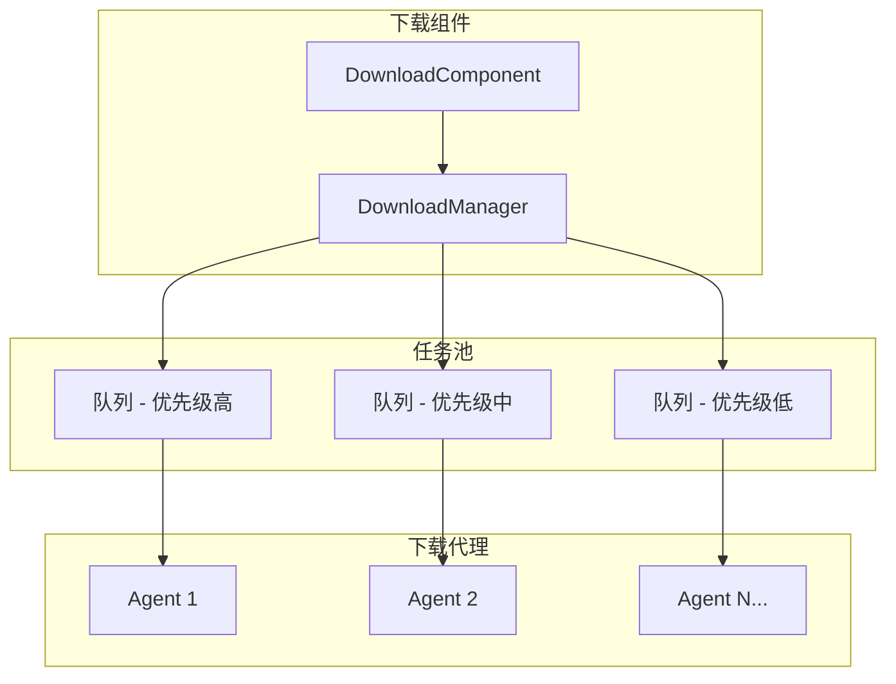
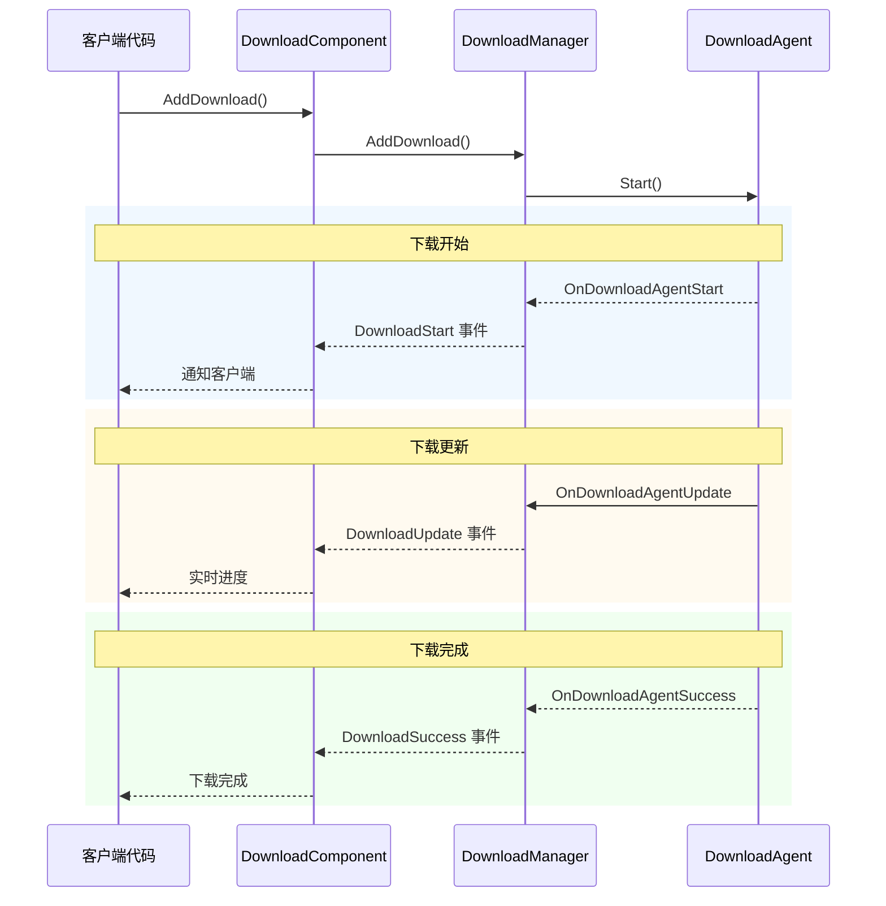
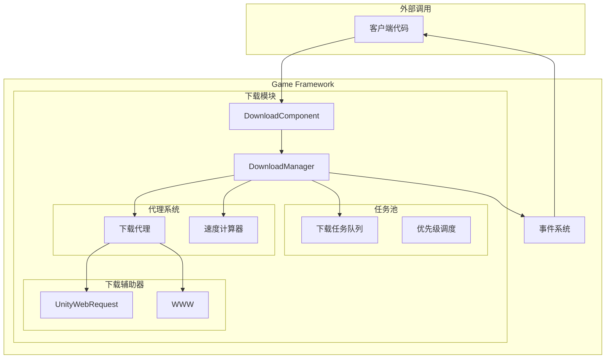

# 功能特性

GameFrameX Download 下载组件是一个功能强大的 Unity 资源下载管理模块，提供完整的下载任务队列管理、断点续传、优先级调度、实时进度监控等功能。

## 概述

下载组件是 GameFrameX 框架的核心模块之一，专门用于处理游戏资源的下载需求。该组件基于任务池架构设计，支持多线程并发下载，可同时管理多个下载任务，并通过事件机制实时推送下载状态更新。

> 更多关于组件的介绍和架构设计，请参阅 [插件介绍](./1-overview.introduction) 和 [架构概述](./4-core-concepts.architecture)。

## 核心功能

### 1. 多任务队列管理

下载组件采用任务池（TaskPool）架构，支持同时管理多个下载任务。任务队列具有以下特性：

- **FIFO 队列**：按先进先出顺序处理任务
- **优先级调度**：高优先级任务优先执行
- **任务状态追踪**：实时记录每个任务的状态（待处理、执行中、已完成、错误）
- **序列 ID 标识**：每个任务拥有唯一的序列 ID，便于追踪和管理



> 来源: [DownloadManager.cs](https://github.com/GameFrameX/com.gameframex.unity.download/blob/main/Runtime/Download/Download/DownloadManager.cs#L22-L44)

### 2. 断点续传支持

断点续传是下载组件的核心功能之一，显著提升大文件下载的可靠性：

- **自动检测**：系统自动检测本地是否存在未完成的下载文件（`.download` 后缀）
- **Range 请求**：使用 HTTP Range 头部从上次停止的位置继续下载
- **增量下载**：仅下载文件的新增部分，节省带宽和时间
- **状态验证**：下载完成后自动验证文件完整性

```csharp
// DownloadAgent.cs 中断点续传核心逻辑
if (File.Exists(downloadFile))
{
    m_FileStream = File.OpenWrite(downloadFile);
    m_FileStream.Seek(0L, SeekOrigin.End);
    m_StartLength = m_SavedLength = m_FileStream.Length;
    m_DownloadedLength = 0L;
}
// 从断点位置继续下载
if (m_StartLength > 0L)
{
    m_Helper.Download(m_Task.DownloadUri, m_StartLength, m_Task.UserData);
}
```

> 来源: [DownloadManager.DownloadAgent.cs#L168-L204](https://github.com/GameFrameX/com.gameframex.unity.download/blob/main/Runtime/Download/Download/DownloadManager.DownloadAgent.cs#L168-L204)

### 3. 多下载代理并行

下载组件支持配置多个下载代理（Download Agent），实现并行下载：

- **可配置数量**：1-16 个代理可通过编辑器配置
- **工作状态监控**：实时获取代理工作状态
- **负载均衡**：任务自动分配给空闲代理
- **独立运行**：每个代理相互独立，互不干扰

| 属性 | 说明 |
|------|------|
| TotalAgentCount | 下载代理总数量 |
| FreeAgentCount | 可用（空闲）代理数量 |
| WorkingAgentCount | 工作中代理数量 |
| WaitingTaskCount | 等待执行的任务数量 |

```csharp
// 在 Start 方法中初始化多个下载代理
for (int i = 0; i < m_DownloadAgentHelperCount; i++)
{
    AddDownloadAgentHelper(i);
}
```

> 来源: [DownloadComponent.cs#L178-L181](https://github.com/GameFrameX/com.gameframex.unity.download/blob/main/Runtime/Download/DownloadComponent.cs#L178-L181)

### 4. 实时下载速度监控

组件内置下载速度计算器，提供准确的实时下载速率：

- **滑动窗口算法**：使用时间窗口计算瞬时速度
- **按需更新**：速度值根据实际下载数据动态更新
- **多代理汇总**：多个代理的速度自动累加

```csharp
public float CurrentSpeed
{
    get { return m_DownloadCounter.CurrentSpeed; }
}
```

> 来源: [DownloadManager.cs#L117-L120](https://github.com/GameFrameX/com.gameframex.unity.download/blob/main/Runtime/Download/Download/DownloadManager.cs#L117-L120)

### 5. 事件驱动通知

完整的生命周期事件体系，涵盖下载全流程：



| 事件 | 说明 | 触发时机 |
|------|------|----------|
| DownloadStart | 下载开始 | 代理开始处理任务时 |
| DownloadUpdate | 下载更新 | 收到数据块时 |
| DownloadSuccess | 下载成功 | 文件完整下载完成时 |
| DownloadFailure | 下载失败 | 发生错误或超时时 |

> 详细事件参数请参阅 [下载事件](./6-events.download-events)。

### 6. 暂停与恢复

全局暂停功能，可随时暂停/恢复所有下载任务：

```csharp
// 暂停所有下载
downloadComponent.Paused = true;

// 恢复下载
downloadComponent.Paused = false;
```

> 来源: [DownloadComponent.cs#L46-L50](https://github.com/GameFrameX/com.gameframex.unity.download/blob/main/Runtime/Download/DownloadComponent.cs#L46-L50)

### 7. 标签化管理

支持使用标签（Tag）对下载任务进行分组管理：

- **按标签查询**：获取指定标签的所有下载任务
- **按标签移除**：一次性移除指定标签的所有任务
- **灵活组织**：可按资源类型、更新批次等方式组织任务

```csharp
// 添加带标签的下载任务
int serialId = downloadComponent.AddDownload(downloadPath, downloadUri, "resources");

// 获取指定标签的任务信息
TaskInfo[] tasks = downloadComponent.GetDownloadInfos("resources");

// 移除指定标签的所有任务
downloadComponent.RemoveDownloads("resources");
```

> 来源: [DownloadComponent.cs#L250-L253](https://github.com/GameFrameX/com.gameframex.unity.download/blob/main/Runtime/Download/DownloadComponent.cs#L250-L253)

### 8. 超时与缓冲区配置

灵活的下载参数配置：

| 配置项 | 说明 | 默认值 |
|--------|------|--------|
| Timeout | 下载超时时间（秒） | 30 |
| FlushSize | 缓冲区写入磁盘临界值（字节） | 1 MB |

- **Timeout**：单次请求无响应时的超时时间
- **FlushSize**：内存缓冲区达到此大小时强制写入磁盘，防止数据丢失

```csharp
// 配置超时时间（运行时）
downloadComponent.Timeout = 60f;

// 配置FlushSize（运行时）
downloadComponent.FlushSize = 2 * 1024 * 1024; // 2MB
```

> 来源: [DownloadComponent.cs#L87-L100](https://github.com/GameFrameX/com.gameframex.unity.download/blob/main/Runtime/Download/DownloadComponent.cs#L87-L100)

### 9. 多下载代理辅助器

组件提供两种下载实现方式：

1. **UnityWebRequestDownloadAgentHelper**（推荐）
   - 现代 Unity 网络请求 API
   - 支持 Unity 2017.2+
   - 完整的断点续传支持

2. **WWWDownloadAgentHelper**（兼容性）
   - 传统 WWW 类
   - 支持 Unity 2018.3 之前的版本
   - 断点续传依赖服务器支持

```csharp
// 使用 UnityWebRequest 从断点继续下载
m_UnityWebRequest.SetRequestHeader("Range", 
    GameFrameX.Runtime.Utility.Text.Format("bytes={0}-", fromPosition));
m_UnityWebRequest.downloadHandler = new DownloadHandler(this);
```

> 来源: [UnityWebRequestDownloadAgentHelper.cs#L104-L121](https://github.com/GameFrameX/com.gameframex.unity.download/blob/main/Runtime/Download/UnityWebRequestDownloadAgentHelper.cs#L104-L121)

## 系统架构



## 功能对比

| 功能 | 说明 | 状态 |
|------|------|------|
| 多任务队列 | 同时管理多个下载任务 | ✅ 支持 |
| 断点续传 | 从上次位置继续下载 | ✅ 支持 |
| 优先级调度 | 高优先级任务优先处理 | ✅ 支持 |
| 实时速度 | 显示当前下载速度 | ✅ 支持 |
| 事件通知 | 下载状态实时推送 | ✅ 支持 |
| 多代理并行 | 1-16个代理并发下载 | ✅ 支持 |
| 暂停/恢复 | 暂停和恢复所有任务 | ✅ 支持 |
| 标签管理 | 按标签组织下载任务 | ✅ 支持 |
| 超时控制 | 配置网络超时时间 | ✅ 支持 |
| 缓冲区管理 | 控制磁盘写入频率 | ✅ 支持 |

## 相关链接

- [插件介绍](./1-overview.introduction) - 了解插件背景和设计理念
- [架构概述](./4-core-concepts.architecture) - 深入了解系统架构
- [DownloadComponent](./4-core-concepts.download-component) - 核心组件详解
- [下载代理](./4-core-concepts.download-agent) - 下载代理机制
- [API 参考](./5-api-reference.properties) - 完整 API 文档
- [安装指南](./2-installation) - 快速安装配置
