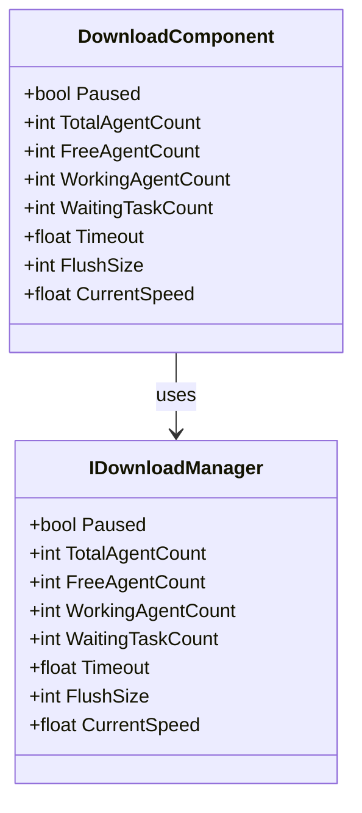
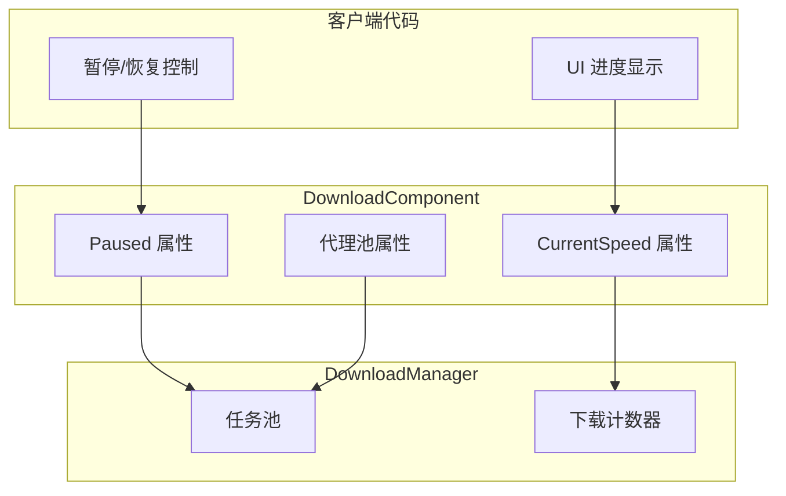

# 属性

本文档详细介绍 DownloadComponent 组件及其关联接口、事件参数中暴露的所有公共属性。

## 概述

下载模块提供了丰富的属性用于监控和控制下载任务的状态。主要属性分为以下几类：

1. **状态控制属性** - 用于控制下载暂停/恢复
2. **代理池属性** - 用于监控下载代理的使用情况
3. **性能配置属性** - 用于配置超时和缓冲区大小
4. **监控属性** - 用于获取实时下载状态



## DownloadComponent 属性

DownloadComponent 是下载系统的核心组件，继承自 GameFrameworkComponent。以下是所有公共属性的详细说明：

> Source: [DownloadComponent.cs](https://github.com/GameFrameX/com.gameframex.unity.download/blob/main/Runtime/Download/DownloadComponent.cs#L46-L108)

### `Paused`

```csharp
public bool Paused
{
    get { return m_DownloadManager.Paused; }
    set { m_DownloadManager.Paused = value; }
}
```

**类型：** `bool`  
**读写：** 可读可写  
**描述：** 获取或设置下载是否被暂停。当设置为 `true` 时，所有正在进行的下载任务和等待中的任务都将暂停；当设置为 `false` 时，暂停的任务将恢复执行。

**使用示例：**

```csharp
// 暂停所有下载
var downloadComponent = GameEntry.GetComponent<DownloadComponent>();
downloadComponent.Paused = true;

// 恢复下载
downloadComponent.Paused = false;
```

### `TotalAgentCount`

```csharp
public int TotalAgentCount
{
    get { return m_DownloadManager.TotalAgentCount; }
}
```

**类型：** `int`  
**读写：** 只读  
**描述：** 获取下载代理总数量。这是系统在启动时创建的下载代理实例总数，反映了系统能够并行处理的最大下载任务数。

### `FreeAgentCount`

```csharp
public int FreeAgentCount
{
    get { return m_DownloadManager.FreeAgentCount; }
}
```

**类型：** `int`  
**读写：** 只读  
**描述：** 获取可用（空闲）下载代理数量。当此值大于 0 时，可以立即添加新的下载任务而无需等待。

### `WorkingAgentCount`

```csharp
public int WorkingAgentCount
{
    get { return m_DownloadManager.WorkingAgentCount; }
}
```

**类型：** `int`  
**读写：** 只读  
**描述：** 获取工作中（忙碌）下载代理数量。表示当前正在执行下载任务的代理数量。

### `WaitingTaskCount`

```csharp
public int WaitingTaskCount
{
    get { return m_DownloadManager.WaitingTaskCount; }
}
```

**类型：** `int`  
**读写：** 只读  
**描述：** 获取等待下载任务数量。由于系统只有有限的下载代理，当所有代理都在忙碌时，新添加的任务会进入等待队列。

### `Timeout`

```csharp
public float Timeout
{
    get { return m_DownloadManager.Timeout; }
    set { m_DownloadManager.Timeout = m_Timeout = value; }
}
```

**类型：** `float`  
**读写：** 可读可写  
**默认值：** `30.0f`（30秒）  
**描述：** 获取或设置下载超时时长，以秒为单位。当单个下载任务超过此时间未完成时，将触发下载失败事件。

### `FlushSize`

```csharp
public int FlushSize
{
    get { return m_DownloadManager.FlushSize; }
    set { m_DownloadManager.FlushSize = m_FlushSize = value; }
}
```

**类型：** `int`  
**读写：** 可读可写  
**默认值：** `1048576`（1MB，即 1024 * 1024）  
**描述：** 获取或设置将缓冲区写入磁盘的临界大小，仅当开启断点续传时有效。该值决定了数据在写入最终文件前需要在内存缓冲区中积累的大小，较大的值可以提高写入性能但会增加内存占用。

### `CurrentSpeed`

```csharp
public float CurrentSpeed
{
    get { return m_DownloadManager.CurrentSpeed; }
}
```

**类型：** `float`  
**读写：** 只读  
**单位：** 字节/秒（B/s）  
**描述：** 获取当前下载速度。这是系统实时计算的下行速率，可用于显示下载进度 UI。

## 事件参数属性

下载模块通过事件系统通知外部下载状态变化。以下是各事件参数类中暴露的属性：

### DownloadStartEventArgs

下载开始时触发的事件参数。

> Source: [DownloadStartEventArgs.cs](https://github.com/GameFrameX/com.gameframex.unity.download/blob/main/Runtime/EventArgs/DownloadStartEventArgs.cs#L35-L55)

| 属性 | 类型 | 描述 |
|------|------|------|
| `SerialId` | `int` | 下载任务的序列编号，用于唯一标识下载任务 |
| `DownloadPath` | `string` | 下载后存放的本地路径 |
| `DownloadUri` | `string` | 原始下载地址（URL） |
| `CurrentLength` | `long` | 当前已下载的大小（字节） |
| `UserData` | `object` | 用户自定义数据 |

### DownloadUpdateEventArgs

下载进度更新时触发的事件参数。

> Source: [DownloadUpdateEventArgs.cs](https://github.com/GameFrameX/com.gameframex.unity.download/blob/main/Runtime/EventArgs/DownloadUpdateEventArgs.cs#L35-L55)

| 属性 | 类型 | 描述 |
|------|------|------|
| `SerialId` | `int` | 下载任务的序列编号 |
| `DownloadPath` | `string` | 下载后存放的本地路径 |
| `DownloadUri` | `string` | 原始下载地址 |
| `CurrentLength` | `long` | 当前已下载的大小 |
| `UserData` | `object` | 用户自定义数据 |

### DownloadSuccessEventArgs

下载成功完成时触发的事件参数。

> Source: [DownloadSuccessEventArgs.cs](https://github.com/GameFrameX/com.gameframex.unity.download/blob/main/Runtime/EventArgs/DownloadSuccessEventArgs.cs#L35-L56)

| 属性 | 类型 | 描述 |
|------|------|------|
| `SerialId` | `int` | 下载任务的序列编号 |
| `DownloadPath` | `string` | 下载后存放的本地路径 |
| `DownloadUri` | `string` | 原始下载地址 |
| `CurrentLength` | `long` | 最终下载文件的大小 |
| `UserData` | `object` | 用户自定义数据 |

### DownloadFailureEventArgs

下载失败时触发的事件参数。

> Source: [DownloadFailureEventArgs.cs](https://github.com/GameFrameX/com.gameframex.unity.download/blob/main/Runtime/EventArgs/DownloadFailureEventArgs.cs#L35-L55)

| 属性 | 类型 | 描述 |
|------|------|------|
| `SerialId` | `int` | 下载任务的序列编号 |
| `DownloadPath` | `string` | 下载后存放的本地路径 |
| `DownloadUri` | `string` | 原始下载地址 |
| `ErrorMessage` | `string` | 错误信息描述 |
| `UserData` | `object` | 用户自定义数据 |

## 属性关系与数据流

以下图表展示了各属性之间的关系以及数据流向：



## 使用示例

### 监控下载状态

以下示例展示如何利用属性监控下载系统状态：

```csharp
public class DownloadStatusMonitor : MonoBehaviour
{
    private DownloadComponent _downloadComponent;

    private void Start()
    {
        _downloadComponent = GameEntry.GetComponent<DownloadComponent>();
    }

    private void Update()
    {
        // 获取实时下载速度
        float speed = _downloadComponent.CurrentSpeed;
        
        // 获取代理池状态
        int total = _downloadComponent.TotalAgentCount;
        int free = _downloadComponent.FreeAgentCount;
        int working = _downloadComponent.WorkingAgentCount;
        int waiting = _downloadComponent.WaitingTaskCount;
        
        // 更新 UI 显示
        UpdateDownloadUI(speed, total, free, working, waiting);
    }
    
    private void UpdateDownloadUI(float speed, int total, int free, int working, int waiting)
    {
        // 将字节转换为 MB/s
        float speedMB = speed / (1024 * 1024);
        Debug.Log($"下载速度: {speedMB:F2} MB/s | 代理状态: {free}/{total} 空闲 | 工作中: {working} | 等待: {waiting}");
    }
}
```
> Source: [DownloadComponent.cs](https://github.com/GameFrameX/com.gameframex.unity.download/blob/main/Runtime/Download/DownloadComponent.cs#L100-L108)

### 暂停与恢复下载

```csharp
public class DownloadController
{
    private DownloadComponent _downloadComponent;

    public void PauseAllDownloads()
    {
        _downloadComponent = GameEntry.GetComponent<DownloadComponent>();
        _downloadComponent.Paused = true;
        Debug.Log("所有下载已暂停");
    }

    public void ResumeAllDownloads()
    {
        if (_downloadComponent == null)
        {
            _downloadComponent = GameEntry.GetComponent<DownloadComponent>();
        }
        _downloadComponent.Paused = false;
        Debug.Log("下载已恢复");
    }
}
```
> Source: [DownloadComponent.cs](https://github.com/GameFrameX/com.gameframex.unity.download/blob/main/Runtime/Download/DownloadComponent.cs#L46-L50)

### 配置下载参数

```csharp
public void ConfigureDownload()
{
    var downloadComponent = GameEntry.GetComponent<DownloadComponent>();
    
    // 设置超时时间为 60 秒
    downloadComponent.Timeout = 60f;
    
    // 设置缓冲区刷新大小为 2MB
    downloadComponent.FlushSize = 2 * 1024 * 1024;
    
    Debug.Log($"超时: {downloadComponent.Timeout}s, 缓冲区: {downloadComponent.FlushSize} bytes");
}
```
> Source: [DownloadComponent.cs](https://github.com/GameFrameX/com.gameframex.unity.download/blob/main/Runtime/Download/DownloadComponent.cs#L87-L100)

## 配置选项汇总表

| 属性 | 类型 | 默认值 | 描述 |
|------|------|--------|------|
| `Paused` | `bool` | `false` | 下载是否被暂停 |
| `TotalAgentCount` | `int` | 由配置决定 | 下载代理总数量 |
| `FreeAgentCount` | `int` | - | 可用下载代理数量 |
| `WorkingAgentCount` | `int` | - | 工作中下载代理数量 |
| `WaitingTaskCount` | `int` | - | 等待下载任务数量 |
| `Timeout` | `float` | `30.0f` | 下载超时时长（秒） |
| `FlushSize` | `int` | `1048576` | 缓冲区写入磁盘临界大小（字节） |
| `CurrentSpeed` | `float` | - | 当前下载速度（字节/秒） |

## 相关链接

- [方法](./5-api-reference.methods) - 了解 DownloadComponent 的所有方法
- [下载事件](./6-events.download-events) - 详细了解下载事件系统
- [架构概述](./4-core-concepts.architecture) - 查看下载模块的整体架构
- [DownloadComponent](./4-core-concepts.download-component) - 了解 DownloadComponent 核心概念
