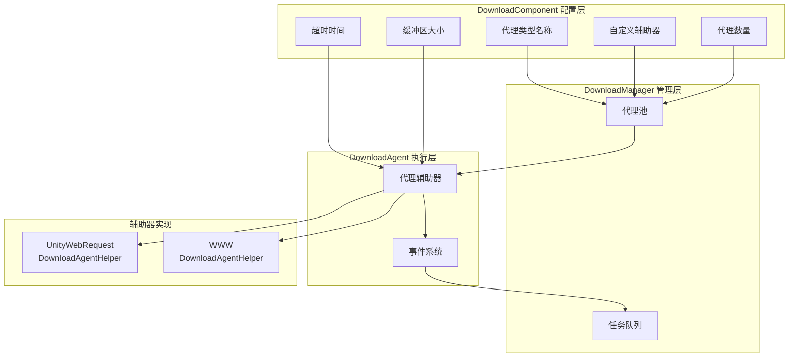

# 下载代理配置

下载代理配置用于设置下载系统的核心行为，包括代理类型选择、并发数量、超时设置等关键参数。

## 概述

下载代理（Download Agent）是下载系统的核心执行单元，负责实际的网络请求和数据写入操作。每个下载代理通过一个下载代理辅助器（DownloadAgentHelper）来实现具体的下载功能。系统支持配置多个并行工作的下载代理，以提升多文件下载的效率。

下载代理配置主要通过 `DownloadComponent` 组件在 Unity 编辑器中进行设置，也可以通过代码动态调整。

## 配置项详解

### 代理辅助器类型配置

代理辅助器类型决定了实际执行下载操作的具体实现类。

| 配置项 | 类型 | 默认值 | 说明 |
|--------|------|--------|------|
| 辅助器类型名称 | string | "GameFrameX.Download.Runtime.UnityWebRequestDownloadAgentHelper" | 辅助器类的完整类型名 |
| 自定义辅助器实例 | DownloadAgentHelperBase | null | 直接引用的自定义辅助器对象 |

```csharp
// DownloadComponent.cs 中的配置定义
[SerializeField] private string m_DownloadAgentHelperTypeName = "GameFrameX.Download.Runtime.UnityWebRequestDownloadAgentHelper";

[SerializeField] private DownloadAgentHelperBase m_CustomDownloadAgentHelper = null;
```
> Source: [DownloadComponent.cs](https://github.com/GameFrameX/com.gameframex.unity.download/blob/main/Runtime/Download/DownloadComponent.cs#L33-L35)

**使用说明：**
- 通过类型名称创建：系统会根据字符串类型名反射创建辅助器实例
- 直接引用自定义实例：可以预先创建自定义辅助器并赋值给 `m_CustomDownloadAgentHelper`

### 代理数量配置

```csharp
// 默认创建3个并行下载代理
[SerializeField] private int m_DownloadAgentHelperCount = 3;
```
> Source: [DownloadComponent.cs](https://github.com/GameFrameX/com.gameframex.unity.download/blob/main/Runtime/Download/DownloadComponent.cs#L37)

```csharp
// 启动时创建所有下载代理
for (int i = 0; i < m_DownloadAgentHelperCount; i++)
{
    AddDownloadAgentHelper(i);
}
```
> Source: [DownloadComponent.cs](https://github.com/GameFrameX/com.gameframex.unity.download/blob/main/Runtime/Download/DownloadComponent.cs#L178-L181)

| 配置项 | 类型 | 默认值 | 取值范围 | 说明 |
|--------|------|--------|----------|------|
| 代理数量 | int | 3 | 1-16 | 同时工作的下载代理数量 |

**性能建议：**
- 数量越多，并行下载能力越强，但网络带宽消耗越大
- 建议根据实际网络条件和服务器限制设置
- 移动端建议 2-4 个，PC端可设置 4-8 个

### 超时配置

```csharp
// 下载超时时间（秒）
[SerializeField] private float m_Timeout = 30f;
```
> Source: [DownloadComponent.cs](https://github.com/GameFrameX/com.gameframex.unity.download/blob/main/Runtime/Download/DownloadComponent.cs#L39)

| 配置项 | 类型 | 默认值 | 取值范围 | 说明 |
|--------|------|--------|----------|------|
| 超时时间 | float | 30秒 | 0-120秒 | 单次下载请求的最大等待时间 |

**超时判断逻辑：**
```csharp
// DownloadAgent.cs 中，超时判断
m_WaitTime += realElapseSeconds;
if (m_WaitTime >= m_Task.Timeout)
{
    // 触发超时错误
    DownloadAgentHelperErrorEventArgs.Create(false, "Timeout");
}
```
> Source: [DownloadManager.DownloadAgent.cs](https://github.com/GameFrameX/com.gameframex.unity.download/blob/main/Runtime/Download/Download/DownloadManager.DownloadAgent.cs#L127-L138)

### 缓冲区配置

```csharp
// 缓冲区大小（字节），默认 1MB
private const int OneMegaBytes = 1024 * 1024;
[SerializeField] private int m_FlushSize = OneMegaBytes;
```
> Source: [DownloadComponent.cs](https://github.com/GameFrameX/com.gameframex.unity.download/blob/main/Runtime/Download/DownloadComponent.cs#L25-L41)

| 配置项 | 类型 | 默认值 | 说明 |
|--------|------|--------|------|
| 缓冲区大小 | int | 1048576 (1MB) | 触发磁盘写入的缓冲区临界值 |

**断点续传原理：**
```csharp
// 数据写入时累积缓冲区，达到阈值后刷新到磁盘
m_FileStream.Write(e.GetBytes(), e.Offset, e.Length);
m_WaitFlushSize += e.Length;
if (m_WaitFlushSize >= m_Task.FlushSize)
{
    m_FileStream.Flush();  // 刷新到磁盘
    m_WaitFlushSize = 0;
}
```
> Source: [DownloadManager.DownloadAgent.cs](https://github.com/GameFrameX/com.gameframex.unity.download/blob/main/Runtime/Download/Download/DownloadManager.DownloadAgent.cs#L270-L291)

## 内置代理辅助器

### UnityWebRequestDownloadAgentHelper

这是系统默认的下载代理辅助器，基于 Unity 的 `UnityWebRequest` 实现。

**特性：**
- 支持断点续传（Range 请求）
- 支持 HTTPS/SSL
- 自动处理证书（默认接受所有证书）
- 兼容 Unity 2017.2+

**关键实现：**
```csharp
public partial class UnityWebRequestDownloadAgentHelper : DownloadAgentHelperBase, IDisposable
{
    // 支持三种下载模式：
    // 1. 完整下载
    public override void Download(string downloadUri, object userData);
    
    // 2. 从指定位置开始断点续传
    public override void Download(string downloadUri, long fromPosition, object userData);
    
    // 3. 指定范围下载
    public override void Download(string downloadUri, long fromPosition, long toPosition, object userData);
}
```
> Source: [UnityWebRequestDownloadAgentHelper.cs](https://github.com/GameFrameX/com.gameframex.unity.download/blob/main/Runtime/Download/UnityWebRequestDownloadAgentHelper.cs#L26-L147)

**证书处理：**
```csharp
// 默认接受所有 SSL 证书（开发环境使用）
public sealed class DownloadCertificateHandler : CertificateHandler
{
    protected override bool ValidateCertificate(byte[] certificateData)
    {
        return true; // 接受所有证书
    }
}
```
> Source: [UnityWebRequestDownloadAgentHelper.cs](https://github.com/GameFrameX/com.gameframex.unity.download/blob/main/Runtime/Download/UnityWebRequestDownloadAgentHelper.cs#L14-L21)

### WWWDownloadAgentHelper

传统下载辅助器，基于 `WWW` 类实现，仅在 Unity 2018.3 之前的版本可用。

```csharp
#if !UNITY_2018_3_OR_NEWER
public class WWWDownloadAgentHelper : DownloadAgentHelperBase, IDisposable
{
    // 与 UnityWebRequestDownloadAgentHelper 相同的接口
}
#endif
```
> Source: [WWWDownloadAgentHelper.cs](https://github.com/GameFrameX/com.gameframex.unity.download/blob/main/Runtime/Download/WWWDownloadAgentHelper.cs#L8-L22)

**注意：** 建议使用 `UnityWebRequestDownloadAgentHelper`，`WWW` 类已在 Unity 2018.3 中废弃。

## 架构图



## 代理辅助器接口

所有下载代理辅助器必须实现 `IDownloadAgentHelper` 接口：

```csharp
public interface IDownloadAgentHelper
{
    /// 下载代理辅助器更新数据流事件
    event EventHandler<DownloadAgentHelperUpdateBytesEventArgs> DownloadAgentHelperUpdateBytes;

    /// 下载代理辅助器更新数据大小事件
    event EventHandler<DownloadAgentHelperUpdateLengthEventArgs> DownloadAgentHelperUpdateLength;

    /// 下载代理辅助器完成事件
    event EventHandler<DownloadAgentHelperCompleteEventArgs> DownloadAgentHelperComplete;

    /// 下载代理辅助器错误事件
    event EventHandler<DownloadAgentHelperErrorEventArgs> DownloadAgentHelperError;

    /// 通过下载代理辅助器下载指定地址的数据
    void Download(string downloadUri, object userData);
    void Download(string downloadUri, long fromPosition, object userData);
    void Download(string downloadUri, long fromPosition, long toPosition, object userData);

    /// 重置下载代理辅助器
    void Reset();
}
```
> Source: [IDownloadAgentHelper.cs](https://github.com/GameFrameX/com.gameframex.unity.download/blob/main/Runtime/Download/Download/IDownloadAgentHelper.cs#L15-L65)

## 自定义代理辅助器

可以通过继承 `DownloadAgentHelperBase` 创建自定义下载代理辅助器：

```csharp
public abstract class DownloadAgentHelperBase : MonoBehaviour, IDownloadAgentHelper
{
    /// 范围不适用错误码
    protected const int RangeNotSatisfiableErrorCode = 416;

    /// 必须实现的四个事件
    public abstract event EventHandler<DownloadAgentHelperUpdateBytesEventArgs> DownloadAgentHelperUpdateBytes;
    public abstract event EventHandler<DownloadAgentHelperUpdateLengthEventArgs> DownloadAgentHelperUpdateLength;
    public abstract event EventHandler<DownloadAgentHelperCompleteEventArgs> DownloadAgentHelperComplete;
    public abstract event EventHandler<DownloadAgentHelperErrorEventArgs> DownloadAgentHelperError;

    /// 必须实现的三个下载方法（支持断点续传）
    public abstract void Download(string downloadUri, object userData);
    public abstract void Download(string downloadUri, long fromPosition, object userData);
    public abstract void Download(string downloadUri, long fromPosition, long toPosition, object userData);

    /// 重置辅助器状态
    public abstract void Reset();
}
```
> Source: [DownloadAgentHelperBase.cs](https://github.com/GameFrameX/com.gameframex.unity.download/blob/main/Runtime/Download/DownloadAgentHelperBase.cs#L17-L72)

## 编辑器配置

在 Unity 编辑器中，可以通过 `DownloadComponent` 组件的面板进行可视化配置：

```csharp
// Inspector 中的配置项
EditorGUILayout.PropertyField(m_InstanceRoot);  // 实例根节点
m_DownloadAgentHelperInfo.Draw();               // 代理辅助器类型选择
m_DownloadAgentHelperCount.intValue = EditorGUILayout.IntSlider("Download Agent Helper Count", ...); // 代理数量
EditorGUILayout.Slider("Timeout", ...);        // 超时时间
EditorGUILayout.DelayedIntField("Flush Size", ...); // 缓冲区大小
```
> Source: [DownloadComponentInspector.cs](https://github.com/GameFrameX/com.gameframex.unity.download/blob/main/Editor/Inspector/DownloadComponentInspector.cs#L38-L69)

## 事件系统

下载代理辅助器通过事件向上层报告下载状态：

| 事件 | 参数类型 | 触发时机 |
|------|----------|----------|
| DownloadAgentHelperUpdateBytes | DownloadAgentHelperUpdateBytesEventArgs | 收到下载数据时 |
| DownloadAgentHelperUpdateLength | DownloadAgentHelperUpdateLengthEventArgs | 数据大小更新时 |
| DownloadAgentHelperComplete | DownloadAgentHelperCompleteEventArgs | 下载完成时 |
| DownloadAgentHelperError | DownloadAgentHelperErrorEventArgs | 下载出错时 |

这些事件被 `DownloadAgent` 接收并处理，最终触发更上层的下载事件。

## 相关链接

- [编辑器配置](./7-configuration.editor-configuration) - 编辑器相关配置说明
- [核心概念 - 下载代理](./4-core-concepts.download-agent) - 下载代理核心概念详解
- [API 参考 - 属性](./5-api-reference.properties) - DownloadComponent 属性API
- [API 参考 - 方法](./5-api-reference.methods) - DownloadComponent 方法API
- [下载事件](./6-events.download-events) - 下载相关事件说明
- [代理事件](./6-events.agent-events) - 代理相关事件说明
