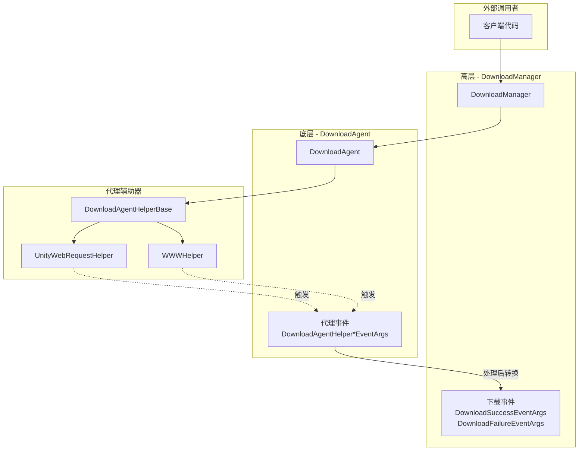
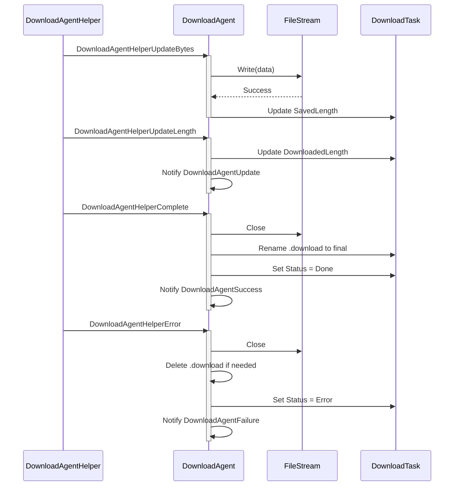
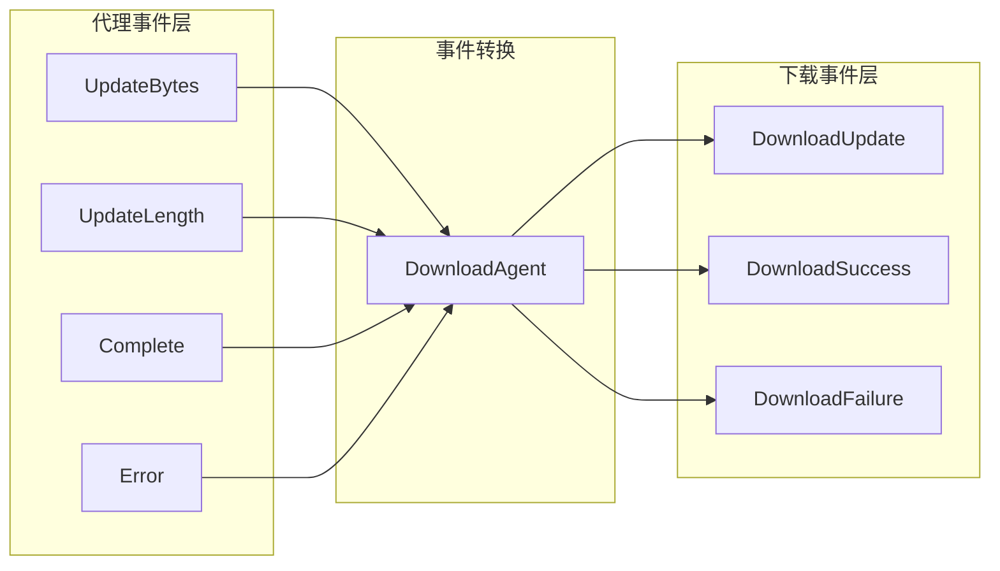

# 代理事件

代理事件是下载代理辅助器（Download Agent Helper）在执行下载操作时触发的底层事件。这些事件提供了对下载过程中各个阶段的细粒度控制，使开发者能够监控和处理下载数据的流动状态。

## 概述

代理事件是下载系统中的**底层事件**，与 DownloadManager 发出的高层下载事件（下载成功、下载失败等）不同。代理事件直接在下载代理辅助器层面工作，提供了对下载数据流的精细控制能力。

**代理事件与下载事件的区别：**

| 特性 | 代理事件 | 下载事件 |
|------|----------|----------|
| 触发层级 | 下载代理辅助器层（底层） | DownloadManager 层（高层） |
| 事件粒度 | 细粒度（字节流、更新进度） | 粗粒度（任务完成/失败） |
| 使用场景 | 需要处理下载数据的场景 | 需要感知任务整体状态的场景 |

**四种代理事件：**
1. `DownloadAgentHelperUpdateBytesEventArgs` - 下载数据流更新事件
2. `DownloadAgentHelperUpdateLengthEventArgs` - 下载数据大小更新事件
3. `DownloadAgentHelperCompleteEventArgs` - 下载完成事件
4. `DownloadAgentHelperErrorEventArgs` - 下载错误事件

## 事件体系架构



### 事件流说明

1. **客户端**通过 `DownloadManager` 添加下载任务
2. **DownloadManager** 将任务分配给 **DownloadAgent** 处理
3. **DownloadAgent** 调用 **DownloadAgentHelper** 执行实际下载
4. **DownloadAgentHelper**（如 UnityWebRequestHelper）在下载过程中触发 **代理事件**
5. **DownloadAgent** 接收并处理这些事件，更新任务状态
6. 任务完成后，**DownloadManager** 发出高层 **下载事件**

## 核心事件详解

### DownloadAgentHelperUpdateBytesEventArgs

下载数据流更新事件，在下载过程中当有新的数据块到达时触发。

```csharp
// Source: Runtime/EventArgs/DownloadAgentHelperUpdateBytesEventArgs.cs#L16-L103
public sealed class DownloadAgentHelperUpdateBytesEventArgs : GameEventArgs
{
    public static readonly string EventId = typeof(DownloadAgentHelperUpdateBytesEventArgs).FullName;

    private byte[] m_Bytes;

    /// <summary>
    /// 获取数据流的偏移。
    /// </summary>
    public int Offset { get; private set; }

    /// <summary>
    /// 获取数据流的长度。
    /// </summary>
    public int Length { get; private set; }

    /// <summary>
    /// 获取下载的数据流。
    /// </summary>
    public byte[] GetBytes()
    {
        return m_Bytes;
    }
}
```

**使用场景：**
- 实时处理下载的数据流
- 对下载数据进行加密/解密处理
- 边下载边写入存储

### DownloadAgentHelperUpdateLengthEventArgs

下载数据大小更新事件，报告下载数据的增量变化。

```csharp
// Source: Runtime/EventArgs/DownloadAgentHelperUpdateLengthEventArgs.cs#L16-L63
public sealed class DownloadAgentHelperUpdateLengthEventArgs : GameEventArgs
{
    public static readonly string EventId = typeof(DownloadAgentHelperUpdateLengthEventArgs).FullName;

    /// <summary>
    /// 获取下载的增量数据大小。
    /// </summary>
    public int DeltaLength { get; private set; }
}
```

**使用场景：**
- 实时更新下载进度
- 计算下载速度
- 显示下载百分比

### DownloadAgentHelperCompleteEventArgs

下载完成事件，当下载代理辅助器完成下载时触发。

```csharp
// Source: Runtime/EventArgs/DownloadAgentHelperCompleteEventArgs.cs#L16-L63
public sealed class DownloadAgentHelperCompleteEventArgs : GameEventArgs
{
    public static readonly string EventId = typeof(DownloadAgentHelperCompleteEventArgs).FullName;

    /// <summary>
    /// 获取下载的数据大小。
    /// </summary>
    public long Length { get; private set; }
}
```

**使用场景：**
- 下载完成后的数据验证
- 触发后续处理流程

### DownloadAgentHelperErrorEventArgs

下载错误事件，当下载过程中发生错误时触发。

```csharp
// Source: Runtime/EventArgs/DownloadAgentHelperErrorEventArgs.cs#L16-L67
public sealed class DownloadAgentHelperErrorEventArgs : GameEventArgs
{
    public static readonly string EventId = typeof(DownloadAgentHelperErrorEventArgs).FullName;

    /// <summary>
    /// 获取是否需要删除正在下载的文件。
    /// </summary>
    public bool DeleteDownloading { get; private set; }

    /// <summary>
    /// 获取错误信息。
    /// </summary>
    public string ErrorMessage { get; private set; }
}
```

**使用场景：**
- 错误日志记录
- 重试机制触发
- 清理不完整的下载文件

## 事件订阅与处理

### 在 DownloadAgent 中处理代理事件

```csharp
// Source: Runtime/Download/Download/DownloadManager.DownloadAgent.cs#L114-L120
/// <summary>
/// 初始化下载代理。
/// </summary>
public void Initialize()
{
    m_Helper.DownloadAgentHelperUpdateBytes += OnDownloadAgentHelperUpdateBytes;
    m_Helper.DownloadAgentHelperUpdateLength += OnDownloadAgentHelperUpdateLength;
    m_Helper.DownloadAgentHelperComplete += OnDownloadAgentHelperComplete;
    m_Helper.DownloadAgentHelperError += OnDownloadAgentHelperError;
}
```

### 事件处理流程



## 代理事件与下载事件的关系



代理事件经过 DownloadAgent 处理后会转换为高层下载事件：

| 代理事件 | 转换结果 |
|----------|----------|
| UpdateBytes | 写入文件，更新 SavedLength |
| UpdateLength | 触发 DownloadAgentUpdate 回调 |
| Complete | 触发 DownloadAgentSuccess → DownloadSuccessEventArgs |
| Error | 触发 DownloadAgentFailure → DownloadFailureEventArgs |

## 事件参数参考

### DownloadAgentHelperUpdateBytesEventArgs

| 属性 | 类型 | 描述 |
|------|------|------|
| Offset | int | 数据流的偏移量 |
| Length | int | 数据流的长度 |
| GetBytes() | byte[] | 获取完整的字节数组 |

### DownloadAgentHelperUpdateLengthEventArgs

| 属性 | 类型 | 描述 |
|------|------|------|
| DeltaLength | int | 本次下载的增量数据大小 |

### DownloadAgentHelperCompleteEventArgs

| 属性 | 类型 | 描述 |
|------|------|------|
| Length | long | 下载的总数据大小 |

### DownloadAgentHelperErrorEventArgs

| 属性 | 类型 | 描述 |
|------|------|------|
| DeleteDownloading | bool | 是否需要删除正在下载的文件 |
| ErrorMessage | string | 错误信息 |

## 何时使用代理事件

代理事件适用于以下场景：

1. **需要处理下载数据流**：如实时解密、边下载边处理
2. **需要精细进度控制**：获取每个数据块的更新
3. **自定义存储策略**：完全控制文件的写入方式
4. **实现断点续传**：监听数据大小变化

对于大多数场景，建议使用高层**下载事件**，因为它们提供了更简洁的 API 和完整的任务信息。只有在需要上述特殊功能时才需要使用代理事件。

## 相关链接

- [下载事件](./6-events.download-events) - 高层下载事件
- [下载代理](./4-core-concepts.download-agent) - 下载代理概念
- [DownloadAgentHelper](./4-core-concepts.download-agent) - 代理辅助器
- [IDownloadAgentHelper](./5-api-reference.methods) - 代理辅助器接口
- [DownloadComponent](./7-configuration.download-component) - 下载组件配置
