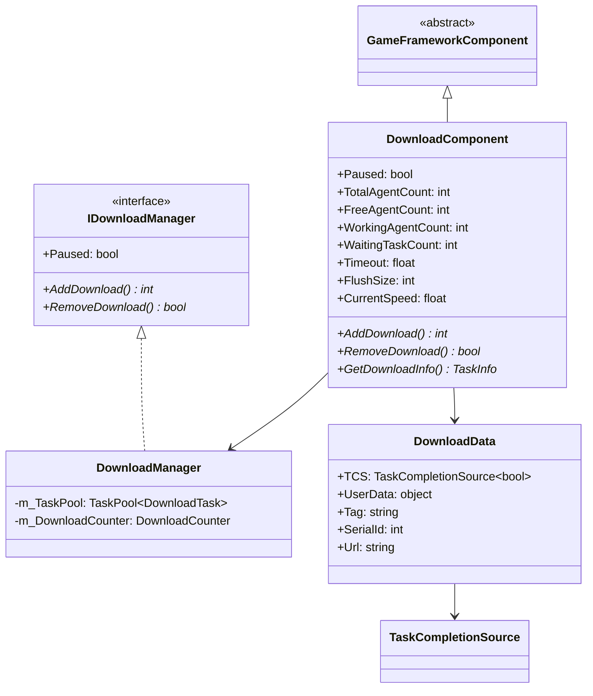
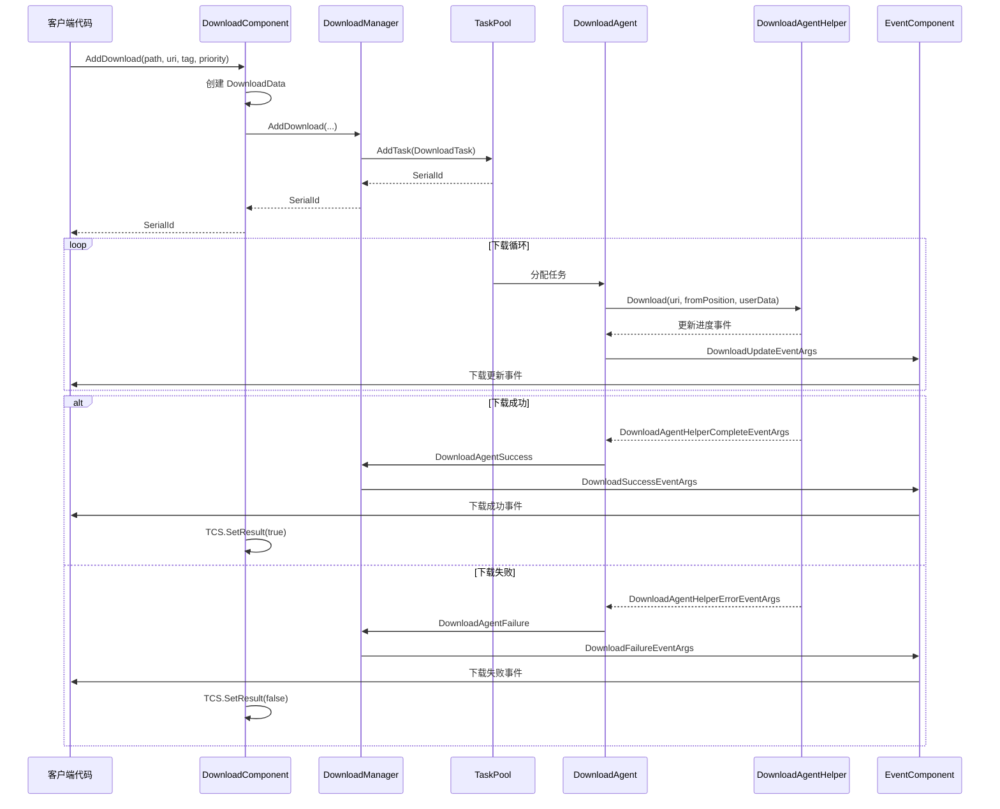
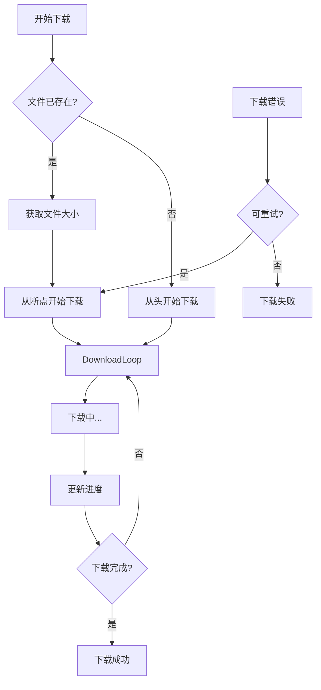

# DownloadComponent

DownloadComponent 是 Game Framework 下载系统的 Unity 组件层，作为 IDownloadManager 接口的外观（Facade），为 Unity 项目提供便捷的下载功能集成。

## 概述

DownloadComponent 是游戏框架下载模块的核心 Unity 组件，继承自 GameFrameworkComponent。它封装了 DownloadManager 的功能，并将其与 Unity 生命周期集成。作为一个 MonoBehaviour，开发者可以直接将其添加到游戏场景中，通过 Inspector 面板或代码进行配置和使用。

该组件的核心设计目标是：
- 提供简洁的 Unity API 接口
- 管理多个下载代理（Download Agent）实例
- 通过事件系统通知下载进度和状态变化
- 支持任务优先级、标签分类、断点续传等高级功能

## 架构

DownloadComponent 在整个下载系统中扮演着入口层的角色，下图展示了其与各组件的关系：

```mermaid
flowchart TD
    subgraph UnityLayer["Unity 层"]
        DC[DownloadComponent]
        Inspector[DownloadComponentInspector]
    end

    subgraph Core["核心模块"]
        DM[DownloadManager]
        IDM[IDownloadManager 接口]
    end

    subgraph TaskPool["任务池"]
        TP[TaskPool&lt;DownloadTask&gt;]
        DA[DownloadAgent x N]
    end

    subgraph AgentHelper["下载代理辅助器"]
        DAHB[DownloadAgentHelperBase]
        UWR[UnityWebRequestDownloadAgentHelper]
        WWW[WWWDownloadAgentHelper]
    end

    subgraph Events["事件系统"]
        EC[EventComponent]
        DE[DownloadEventArgs]
    end

    DC --> DM
    DC --> Inspector
    DM --> IDM
    IDM <|.. DM
    DM --> TP
    TP --> DA
    DA --> DAHB
    DAHB --> UWR
    DAHB --> WWW
    DM --> EC
    EC --> DE
```

### 组件层次说明

**Unity 层**
- DownloadComponent：主组件，提供 Unity 友好的 API
- DownloadComponentInspector：Editor  Inspector，用于可视化配置

**核心模块**
- DownloadManager：下载管理器实现，处理核心逻辑
- IDownloadManager：下载管理器接口，定义规范

**任务池层**
- TaskPool：通用任务池，管理下载任务和代理
- DownloadAgent：下载代理，执行具体下载任务

**代理辅助器层**
- DownloadAgentHelperBase：下载代理辅助器基类
- UnityWebRequestDownloadAgentHelper：基于 UnityWebRequest 的实现
- WWWDownloadAgentHelper：基于 WWW 的实现（兼容旧版）

### 核心类图



## 核心功能

### 1. 下载任务管理

DownloadComponent 提供了丰富的下载任务管理功能：

```csharp
// 添加基础下载任务
int serialId = downloadComponent.AddDownload(downloadPath, downloadUri);

// 添加带标签的下载任务
int serialId = downloadComponent.AddDownload(downloadPath, downloadUri, "resources");

// 添加带优先级的下载任务
int serialId = downloadComponent.AddDownload(downloadPath, downloadUri, 100);

// 添加带用户数据的下载任务
int serialId = downloadComponent.AddDownload(downloadPath, downloadUri, userData);

// 完整参数：路径、URI、标签、优先级、用户数据
int serialId = downloadComponent.AddDownload(downloadPath, downloadUri, "update", 100, userData);
```
> Source: [DownloadComponent.cs](https://github.com/GameFrameX/com.gameframex.unity.download/blob/main/Runtime/Download/DownloadComponent.cs#L238-L350)

### 2. 异步下载支持

DownloadComponent 支持异步下载模式，通过 Task 返回下载结果：

```csharp
// 异步下载并等待结果
public async void StartDownload()
{
    var downloadComponent = GameEntry.GetComponent<DownloadComponent>();
    Task<bool> task = downloadComponent.Download(downloadPath, downloadUri);
    bool success = await task;
    Debug.Log($"Download {(success ? "succeeded" : "failed")}");
}
```
> Source: [DownloadComponent.cs](https://github.com/GameFrameX/com.gameframex.unity.download/blob/main/Runtime/Download/DownloadComponent.cs#L273-L282)

### 3. 任务查询与移除

```csharp
// 根据序列编号获取下载任务信息
TaskInfo info = downloadComponent.GetDownloadInfo(serialId);

// 根据标签获取所有匹配的下载任务
TaskInfo[] infos = downloadComponent.GetDownloadInfos("resources");

// 获取所有下载任务
TaskInfo[] allInfos = downloadComponent.GetAllDownloadInfos();

// 移除指定任务
bool removed = downloadComponent.RemoveDownload(serialId);

// 移除指定标签的所有任务
int count = downloadComponent.RemoveDownloads("resources");

// 移除所有任务
downloadComponent.RemoveAllDownloads();
```
> Source: [DownloadComponent.cs](https://github.com/GameFrameX/com.gameframex.unity.download/blob/main/Runtime/Download/DownloadComponent.cs#L189-L392)

### 4. 下载状态监控

组件提供了多个只读属性用于监控下载状态：

```csharp
// 获取下载代理状态
int totalCount = downloadComponent.TotalAgentCount;    // 总代理数
int freeCount = downloadComponent.FreeAgentCount;       // 空闲代理数
int workingCount = downloadComponent.WorkingAgentCount; // 工作代理数
int waitingCount = downloadComponent.WaitaitingTaskCount; // 等待任务数

// 获取当前下载速度（字节/秒）
float speed = downloadComponent.CurrentSpeed;

// 获取/设置暂停状态
downloadComponent.Paused = true;
```

### 5. 配置属性

| 属性 | 类型 | 默认值 | 说明 |
|------|------|--------|------|
| InstanceRoot | Transform | null | 下载代理实例的根节点 |
| DownloadAgentHelperTypeName | string | UnityWebRequestDownloadAgentHelper | 下载代理辅助器类型 |
| DownloadAgentHelperCount | int | 3 | 下载代理实例数量（1-16） |
| Timeout | float | 30f | 下载超时时间（秒，0-120） |
| FlushSize | int | 1MB | 缓冲区写入磁盘的临界大小 |

> Source: [DownloadComponentInspector.cs](https://github.com/GameFrameX/com.gameframex.unity.download/blob/main/Editor/Inspector/DownloadComponentInspector.cs#L39-L69)

## 下载流程

### 时序图



### 断点续传流程

DownloadComponent 支持断点续传功能，当下载中断后可以继续从上次位置下载：



断点续传通过在 DownloadAgentHelper 中设置 HTTP Range 头实现：

```csharp
// UnityWebRequestDownloadAgentHelper.cs 中的断点续传实现
m_UnityWebRequest.SetRequestHeader("Range", GameFrameX.Runtime.Utility.Text.Format("bytes={0}-", fromPosition));
```
> Source: [UnityWebRequestDownloadAgentHelper.cs](https://github.com/GameFrameX/com.gameframex.unity.download/blob/main/Runtime/Download/UnityWebRequestDownloadAgentHelper.cs#L114)

## 使用示例

### 基本用法

```csharp
using GameFrameX.Runtime;
using GameFrameX.Download.Runtime;

// 获取组件
var downloadComponent = GameEntry.GetComponent<DownloadComponent>();

// 添加下载任务
string localPath = Application.persistentDataPath + "/Resources/texture.png";
string remoteUrl = "https://example.com/texture.png";

int serialId = downloadComponent.AddDownload(localPath, remoteUrl);
```
> Source: [DownloadComponent.cs](https://github.com/GameFrameX/com.gameframex.unity.download/blob/main/Runtime/Download/DownloadComponent.cs#L238-L241)

### 监听下载事件

```csharp
using GameFrameX.Runtime;
using GameFrameX.Download.Runtime;

// 订阅下载事件
var downloadComponent = GameEntry.GetComponent<DownloadComponent>();
downloadComponent.DownloadStart += OnDownloadStart;
downloadComponent.DownloadUpdate += OnDownloadUpdate;
downloadComponent.DownloadSuccess += OnDownloadSuccess;
downloadComponent.DownloadFailure += OnDownloadFailure;

private void OnDownloadStart(object sender, DownloadStartEventArgs e)
{
    Debug.Log($"下载开始: {e.DownloadUri}");
}

private void OnDownloadUpdate(object sender, DownloadUpdateEventArgs e)
{
    Debug.Log($"下载进度: {e.CurrentLength} bytes");
}

private void OnDownloadSuccess(object sender, DownloadSuccessEventArgs e)
{
    Debug.Log($"下载成功: {e.DownloadPath}");
}

private void OnDownloadFailure(object sender, DownloadFailureEventArgs e)
{
    Debug.Log($"下载失败: {e.ErrorMessage}");
}
```
> Source: [DownloadComponent.cs](https://github.com/GameFrameX/com.gameframex.unity.download/blob/main/Runtime/Download/DownloadComponent.cs#L415-L442)

### 批量下载资源包

```csharp
public class ResourceUpdater
{
    private DownloadComponent _downloadComponent;
    private List<string> _pendingDownloads = new List<string>();
    
    public void StartUpdate(List<ResourceInfo> resources)
    {
        _downloadComponent = GameEntry.GetComponent<DownloadComponent>();
        
        foreach (var resource in resources)
        {
            // 为每个资源添加下载任务，设置标签便于管理
            _downloadComponent.AddDownload(
                resource.LocalPath, 
                resource.RemoteUrl, 
                "resources",  // 标签
                resource.Priority  // 优先级
            );
        }
    }
    
    // 监听特定标签的下载完成
    private void OnDownloadSuccess(object sender, DownloadSuccessEventArgs e)
    {
        if (e.UserData is ResourceInfo info)
        {
            Debug.Log($"资源下载完成: {info.Name}");
            CheckAllComplete();
        }
    }
}
```

### 使用异步/await

```csharp
public async Task<bool> DownloadFileAsync(string url, string path)
{
    var downloadComponent = GameEntry.GetComponent<DownloadComponent>();
    
    // 使用 Task-based API
    Task<bool> downloadTask = downloadComponent.Download(path, url);
    
    // 等待下载完成
    bool success = await downloadTask;
    
    return success;
}

// 调用示例
bool result = await DownloadFileAsync(
    "https://example.com/bundle.zip",
    Application.persistentDataPath + "/bundle.zip"
);
```
> Source: [DownloadComponent.cs](https://github.com/GameFrameX/com.gameframex.unity.download/blob/main/Runtime/Download/DownloadComponent.cs#L273-L282)

## 事件系统

DownloadComponent 通过 EventComponent 转发下载事件，主要事件包括：

| 事件 | 说明 | EventArgs |
|------|------|-----------|
| DownloadStart | 下载开始时触发 | DownloadStartEventArgs |
| DownloadUpdate | 下载进度更新时触发 | DownloadUpdateEventArgs |
| DownloadSuccess | 下载成功时触发 | DownloadSuccessEventArgs |
| DownloadFailure | 下载失败时触发 | DownloadFailureEventArgs |

### DownloadSuccessEventArgs 属性

```csharp
public sealed class DownloadSuccessEventArgs : GameEventArgs
{
    public int SerialId { get; }           // 任务序列编号
    public string DownloadPath { get; }    // 本地存储路径
    public string DownloadUri { get; }    // 原始下载地址
    public long CurrentLength { get; }     // 已下载大小
    public object UserData { get; }         // 用户自定义数据
}
```
> Source: [DownloadSuccessEventArgs.cs](https://github.com/GameFrameX/com.gameframex.unity.download/blob/main/Runtime/EventArgs/DownloadSuccessEventArgs.cs#L36-L56)

## 配置说明

### Inspector 配置

在 Unity 编辑器中，选中带有 DownloadComponent 的 GameObject，可以在 Inspector 面板中配置以下属性：

```csharp
// DownloadComponentInspector.cs 中的配置界面
EditorGUILayout.PropertyField(m_InstanceRoot);
m_DownloadAgentHelperInfo.Draw();
m_DownloadAgentHelperCount.intValue = EditorGUILayout.IntSlider("Download Agent Helper Count", ...);
float timeout = EditorGUILayout.Slider("Timeout", ...);
int flushSize = EditorGUILayout.DelayedIntField("Flush Size", ...);
```
> Source: [DownloadComponentInspector.cs](https://github.com/GameFrameX/com.gameframex.unity.download/blob/main/Editor/Inspector/DownloadComponentInspector.cs#L39-L69)

### 下载代理辅助器

DownloadComponent 支持自定义下载代理辅助器，默认使用 UnityWebRequestDownloadAgentHelper。开发者可以通过继承 DownloadAgentHelperBase 创建自定义实现：

```csharp
public abstract class DownloadAgentHelperBase : MonoBehaviour, IDownloadAgentHelper
{
    public abstract event EventHandler<DownloadAgentHelperUpdateBytesEventArgs> DownloadAgentHelperUpdateBytes;
    public abstract event EventHandler<DownloadAgentHelperUpdateLengthEventArgs> DownloadAgentHelperUpdateLength;
    public abstract event EventHandler<DownloadAgentHelperCompleteEventArgs> DownloadAgentHelperComplete;
    public abstract event EventHandler<DownloadAgentHelperErrorEventArgs> DownloadAgentHelperError;
    
    public abstract void Download(string downloadUri, object userData);
    public abstract void Download(string downloadUri, long fromPosition, object userData);
    public abstract void Download(string downloadUri, long fromPosition, long toPosition, object userData);
    public abstract void Reset();
}
```
> Source: [DownloadAgentHelperBase.cs](https://github.com/GameFrameX/com.gameframex.unity.download/blob/main/Runtime/Download/DownloadAgentHelperBase.cs#L17-L72)

## 内部实现细节

### DownloadData 内部类

DownloadComponent 使用内部类 DownloadData 存储每个下载任务的元数据：

```csharp
sealed class DownloadData
{
    public TaskCompletionSource<bool> TCS { get; }  // 用于异步等待
    public object UserData { get; }                  // 用户数据
    public string Tag { get; }                        // 标签
    public int SerialId { get; }                      // 序列编号
    public string Url { get; }                        // 下载地址
    
    public DownloadData(string url, string tag, int serialId, object userData)
    {
        Url = url;
        Tag = tag;
        SerialId = serialId;
        UserData = userData;
        TCS = new TaskCompletionSource<bool>();
    }
}
```
> Source: [DownloadComponent.cs](https://github.com/GameFrameX/com.gameframex.unity.download/blob/main/Runtime/Download/DownloadComponent.cs#L118-L137)

### 生命周期

1. **Awake()**: 初始化 DownloadManager 模块，注册下载事件
2. **Start()**: 获取 EventComponent，创建下载代理辅助器实例
3. **Update()**: 由 GameFramework 自动调用，处理任务池更新
4. **OnDestroy()**: 清理资源（通过基类实现）

```csharp
protected override void Awake()
{
    ImplementationComponentType = Utility.Assembly.GetType(componentType);
    InterfaceComponentType = typeof(IDownloadManager);
    base.Awake();
    m_DownloadManager = GameFrameworkEntry.GetModule<IDownloadManager>();
    // 注册事件...
}

private void Start()
{
    m_EventComponent = GameEntry.GetComponent<EventComponent>();
    // 创建下载代理辅助器...
}
```
> Source: [DownloadComponent.cs](https://github.com/GameFrameX/com.gameframex.unity.download/blob/main/Runtime/Download/DownloadComponent.cs#L142-L182)

## 相关链接

- [架构概述](./4-core-concepts.architecture) - 下载系统整体架构
- [下载代理](./4-core-concepts.download-agent) - DownloadAgent 详解
- [API 参考 - 属性](./5-api-reference.properties) - 完整属性列表
- [API 参考 - 方法](./5-api-reference.methods) - 完整方法列表
- [下载事件](./6-events.download-events) - 下载事件详解
- [编辑器配置](./7-configuration.editor-configuration) - Editor Inspector 配置
- [下载代理配置](./7-configuration.agent-configuration) - 代理辅助器配置
