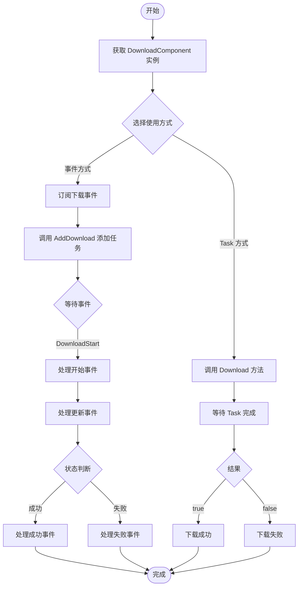

# 首个示例

本节将通过一个完整的示例，帮助您快速上手 GameFrameX 下载组件。我们将展示如何添加下载组件、创建下载任务以及处理下载事件。

## 概述

GameFrameX 下载组件（DownloadComponent）提供了简洁的 API 来管理下载任务。通过本示例，您将学习：

- 如何在场景中添加下载组件
- 如何创建基本的下载任务
- 如何订阅下载事件获取进度和结果
- 如何处理下载成功和失败的情况

> 注意：在开始本示例之前，请确保您已经完成了基础配置。详细配置说明请参考 [基础配置](./3-getting-started.basic-setup)。

## 核心流程

下面的流程图展示了使用下载组件的完整流程：



## 使用示例

### 1. 获取下载组件

在 GameFrameX 框架中，您可以通过 GameEntry 获取下载组件：

```csharp
using GameFrameX.Download.Runtime;
using GameFrameX.Runtime;

// 获取下载组件实例
var downloadComponent = GameEntry.GetComponent<DownloadComponent>();
```

> Source: [DownloadComponent.cs](https://github.com/GameFrameX/com.gameframex.unity.download/blob/main/Runtime/Download/DownloadComponent.cs#L23-L24)

下载组件继承自 `GameFrameworkComponent`，是 Unity 游戏的组件之一。

### 2. 添加下载任务

下载组件提供了多种添加任务的方法。以下是常用的几种方式：

#### 最简单的下载

```csharp
// 参数说明：
// downloadPath: 下载后文件存放在本地的路径
// downloadUri: 文件的网络下载地址
int serialId = downloadComponent.AddDownload(downloadPath, downloadUri);
```

> Source: [DownloadComponent.cs](https://github.com/GameFrameX/com.gameframex.unity.download/blob/main/Runtime/Download/DownloadComponent.cs#L238-L241)

#### 带标签的下载

```csharp
// 添加任务标签，便于后续管理和查询
int serialId = downloadComponent.AddDownload(downloadPath, downloadUri, "资源包");
```

> Source: [DownloadComponent.cs](https://github.com/GameFrameX/com.gameframex.unity.download/blob/main/Runtime/Download/DownloadComponent.cs#L250-L253)

#### 带优先级的下载

```csharp
// 优先级数值越大，优先级越高
int serialId = downloadComponent.AddDownload(downloadPath, downloadUri, 100);
```

> Source: [DownloadComponent.cs](https://github.com/GameFrameX/com.gameframex.unity.download/blob/main/Runtime/Download/DownloadComponent.cs#L262-L265)

#### 带用户数据的下载

```csharp
// 通过 userData 传递自定义数据，下载完成时可获取
var userData = new { FileName = "config.json", Version = "1.0.0" };
int serialId = downloadComponent.AddDownload(downloadPath, downloadUri, userData);
```

> Source: [DownloadComponent.cs](https://github.com/GameFrameX/com.gameframex.unity.download/blob/main/Runtime/Download/DownloadComponent.cs#L291-L294)

#### 完整参数下载

```csharp
// 使用所有参数的完整版本
int serialId = downloadComponent.AddDownload(
    downloadPath,    // 本地存储路径
    downloadUri,     // 下载地址
    "资源包",        // 标签
    100,            // 优先级
    userData        // 用户数据
);
```

> Source: [DownloadComponent.cs](https://github.com/GameFrameX/com.gameframex.unity.download/blob/main/Runtime/Download/DownloadComponent.cs#L344-L350)

### 3. 使用 Task 异步方式

如果您更喜欢异步编程模式，可以使用 `Download` 方法直接获取 Task：

```csharp
using System.Threading.Tasks;

// 异步下载并等待结果
bool success = await downloadComponent.Download(downloadPath, downloadUri);

if (success)
{
    UnityEngine.Debug.Log("下载成功！");
}
else
{
    UnityEngine.Debug.Log("下载失败！");
}
```

> Source: [DownloadComponent.cs](https://github.com/GameFrameX/com.gameframex.unity.download/blob/main/Runtime/Download/DownloadComponent.cs#L273-L282)

### 4. 使用事件监听下载状态

GameFrameX 使用事件系统来通知下载状态的变化。首先需要获取 EventComponent：

```csharp
using GameFrameX.Event.Runtime;

// 获取事件组件
var eventComponent = GameEntry.GetComponent<EventComponent>();
```

#### 订阅下载开始事件

```csharp
// 订阅下载开始事件
eventComponent.Subscribe(DownloadStartEventArgs.EventId, OnDownloadStart);

private void OnDownloadStart(object sender, GameEventArgs e)
{
    DownloadStartEventArgs ne = (DownloadStartEventArgs)e;
    UnityEngine.Debug.Log($"下载开始：{ne.DownloadUri}");
    UnityEngine.Debug.Log($"已下载大小：{ne.CurrentLength} 字节");
}
```

> Source: [DownloadStartEventArgs.cs](https://github.com/GameFrameX/com.gameframex.unity.download/blob/main/Runtime/EventArgs/DownloadStartEventArgs.cs#L17-L67)

#### 订阅下载进度更新事件

```csharp
// 订阅下载进度更新事件
eventComponent.Subscribe(DownloadUpdateEventArgs.EventId, OnDownloadUpdate);

private void OnDownloadUpdate(object sender, GameEventArgs e)
{
    DownloadUpdateEventArgs ne = (DownloadUpdateEventArgs)e;
    // 计算进度百分比（需要先获取文件总大小）
    UnityEngine.Debug.Log($"当前进度：{ne.CurrentLength} 字节");
}
```

> Source: [DownloadUpdateEventArgs.cs](https://github.com/GameFrameX/com.gameframex.unity.download/blob/main/Runtime/EventArgs/DownloadUpdateEventArgs.cs#L17-L93)

#### 订阅下载成功事件

```csharp
// 订阅下载成功事件
eventComponent.Subscribe(DownloadSuccessEventArgs.EventId, OnDownloadSuccess);

private void OnDownloadSuccess(object sender, GameEventArgs e)
{
    DownloadSuccessEventArgs ne = (DownloadSuccessEventArgs)e;
    UnityEngine.Debug.Log($"下载成功！");
    UnityEngine.Debug.Log($"文件路径：{ne.DownloadPath}");
    UnityEngine.Debug.Log($"文件大小：{ne.CurrentLength} 字节");
    
    // 获取传递的用户数据
    if (ne.UserData != null)
    {
        UnityEngine.Debug.Log($"用户数据：{ne.UserData}");
    }
}
```

> Source: [DownloadSuccessEventArgs.cs](https://github.com/GameFrameX/com.gameframex.unity.download/blob/main/Runtime/EventArgs/DownloadSuccessEventArgs.cs#L17-L94)

#### 订阅下载失败事件

```csharp
// 订阅下载失败事件
eventComponent.Subscribe(DownloadFailureEventArgs.EventId, OnDownloadFailure);

private void OnDownloadFailure(object sender, GameEventArgs e)
{
    DownloadFailureEventArgs ne = (DownloadFailureEventArgs)e;
    UnityEngine.Debug.LogWarning($"下载失败！");
    UnityEngine.Debug.LogWarning($"下载地址：{ne.DownloadUri}");
    UnityEngine.Debug.LogWarning($"错误信息：{ne.ErrorMessage}");
}
```

> Source: [DownloadFailureEventArgs.cs](https://github.com/GameFrameX/com.gameframex.unity.download/blob/main/Runtime/EventArgs/DownloadFailureEventArgs.cs#L17-L93)

### 5. 完整的下载示例脚本

以下是一个完整的下载管理器脚本示例，展示了如何综合使用上述功能：

```csharp
using UnityEngine;
using GameFrameX.Download.Runtime;
using GameFrameX.Runtime;
using GameFrameX.Event.Runtime;

public class DownloadExample : MonoBehaviour
{
    private DownloadComponent _downloadComponent;
    private EventComponent _eventComponent;
    
    private void Start()
    {
        // 获取所需组件
        _downloadComponent = GameEntry.GetComponent<DownloadComponent>();
        _eventComponent = GameEntry.GetComponent<EventComponent>();
        
        // 订阅所有下载事件
        _eventComponent.Subscribe(DownloadStartEventArgs.EventId, OnDownloadStart);
        _eventComponent.Subscribe(DownloadUpdateEventArgs.EventId, OnDownloadUpdate);
        _eventComponent.Subscribe(DownloadSuccessEventArgs.EventId, OnDownloadSuccess);
        _eventComponent.Subscribe(DownloadFailureEventArgs.EventId, OnDownloadFailure);
        
        // 开始下载示例
        StartDownload();
    }
    
    private void StartDownload()
    {
        string downloadUri = "https://example.com/file.zip";
        string localPath = Application.persistentDataPath + "/file.zip";
        
        // 添加下载任务，使用标签和用户数据
        var userData = new { FileName = "file.zip", Type = "资源包" };
        int serialId = _downloadComponent.AddDownload(localPath, downloadUri, "资源包", 100, userData);
        
        Debug.Log($"添加下载任务，序列ID：{serialId}");
    }
    
    private void OnDownloadStart(object sender, GameEventArgs e)
    {
        var args = (DownloadStartEventArgs)e;
        Debug.Log($"下载开始：{args.DownloadUri}");
    }
    
    private void OnDownloadUpdate(object sender, GameEventArgs e)
    {
        var args = (DownloadUpdateEventArgs)e;
        // 可以在这里更新UI进度
        Debug.Log($"下载中：{args.CurrentLength} 字节");
    }
    
    private void OnDownloadSuccess(object sender, GameEventArgs e)
    {
        var args = (DownloadSuccessEventArgs)e;
        Debug.Log($"下载完成：{args.DownloadPath}，大小：{args.CurrentLength} 字节");
    }
    
    private void OnDownloadFailure(object sender, GameEventArgs e)
    {
        var args = (DownloadFailureEventArgs)e;
        Debug.LogError($"下载失败：{args.ErrorMessage}");
    }
    
    private void OnDestroy()
    {
        // 取消订阅事件，避免内存泄漏
        if (_eventComponent != null)
        {
            _eventComponent.Unsubscribe(DownloadStartEventArgs.EventId, OnDownloadStart);
            _eventComponent.Unsubscribe(DownloadUpdateEventArgs.EventId, OnDownloadUpdate);
            _eventComponent.Unsubscribe(DownloadSuccessEventArgs.EventId, OnDownloadSuccess);
            _eventComponent.Unsubscribe(DownloadFailureEventArgs.EventId, OnDownloadFailure);
        }
    }
}
```

## 下载组件属性

以下是 DownloadComponent 的主要属性说明：

| 属性 | 类型 | 说明 |
|------|------|------|
| `Paused` | bool | 获取或设置下载是否被暂停 |
| `TotalAgentCount` | int | 获取下载代理总数量 |
| `FreeAgentCount` | int | 获取可用下载代理数量 |
| `WorkingAgentCount` | int | 获取工作中下载代理数量 |
| `WaitingTaskCount` | int | 获取等待下载任务数量 |
| `Timeout` | float | 获取或设置下载超时时长（秒） |
| `FlushSize` | int | 获取或设置写入磁盘的临界大小 |
| `CurrentSpeed` | float | 获取当前下载速度（字节/秒） |

> Source: [DownloadComponent.cs](https://github.com/GameFrameX/com.gameframex.unity.download/blob/main/Runtime/Download/DownloadComponent.cs#L46-L108)

## 常见下载任务操作

### 移除单个下载任务

```csharp
// 根据序列编号移除下载任务
bool success = downloadComponent.RemoveDownload(serialId);
```

> Source: [DownloadComponent.cs](https://github.com/GameFrameX/com.gameframex.unity.download/blob/main/Runtime/Download/DownloadComponent.cs#L357-L361)

### 移除指定标签的下载任务

```csharp
// 根据标签移除下载任务
int removedCount = downloadComponent.RemoveDownloads("资源包");
```

> Source: [DownloadComponent.cs](https://github.com/GameFrameX/com.gameframex.unity.download/blob/main/Runtime/Download/DownloadComponent.cs#L368-L382)

### 移除所有下载任务

```csharp
// 移除所有下载任务
int removedCount = downloadComponent.RemoveAllDownloads();
```

> Source: [DownloadComponent.cs](https://github.com/GameFrameX/com.gameframex.unity.download/blob/main/Runtime/Download/DownloadComponent.cs#L388-L392)

### 获取下载任务信息

```csharp
// 根据序列编号获取下载任务信息
TaskInfo taskInfo = downloadComponent.GetDownloadInfo(serialId);

// 根据标签获取所有相关下载任务信息
TaskInfo[] taskInfos = downloadComponent.GetDownloadInfos("资源包");

// 获取所有下载任务信息
TaskInfo[] allTaskInfos = downloadComponent.GetAllDownloadInfos();
```

> Source: [DownloadComponent.cs](https://github.com/GameFrameX/com.gameframex.unity.download/blob/main/Runtime/Download/DownloadComponent.cs#L189-L230)

## 下一步

现在您已经了解了下载组件的基本用法。接下来可以学习：

- [核心概念 - DownloadComponent](./4-core-concepts.download-component) - 深入了解 DownloadComponent 的内部实现
- [核心概念 - 下载代理](./4-core-concepts.download-agent) - 了解下载代理的工作原理
- [事件系统 - 下载事件](./6-events.download-events) - 详细了解所有下载事件
- [配置 - 编辑器配置](./7-configuration.editor-configuration) - 了解如何配置下载组件

## 相关链接

- [基础配置](./3-getting-started.basic-setup) - 在开始下载前完成基础配置
- [架构概述](./4-core-concepts.architecture) - 了解整体架构
- [API 参考 - 方法](./5-api-reference.methods) - 完整的 API 方法参考
