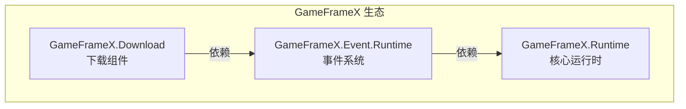

# 安装

本文档介绍如何在 Unity 项目中安装 Game Frame X Download 下载组件。

## 概述

Game Frame X Download 是 GameFrameX 框架的下载管理组件，提供完整的多任务下载解决方案。该组件支持断点续传、下载优先级、进度实时更新等功能，并通过事件系统提供下载状态的完整通知。

> **注意**：此组件依赖于 **Event 组件** (`com.gameframex.unity.event`)，在安装时需要同时安装依赖项。

### 系统要求

| 要求 | 最低版本 |
|------|----------|
| Unity | 2017.1+ |
| GameFrameX.Runtime | 最新稳定版 |
| GameFrameX.Event | 最新稳定版 |

## 安装前准备

在开始安装之前，请确保：

1. ✅ 已安装 Unity 2017.1 或更高版本
2. ✅ 了解 Unity Package Manager 的基本使用方法
3. ✅ 具备对项目 `Packages/manifest.json` 文件的编辑权限

## 安装方式

### 方式一：通过 manifest.json 安装（推荐）

这是最推荐的安装方式，便于版本管理和团队协作。

1. 打开项目的 `Packages/manifest.json` 文件
2. 在 `dependencies` 节点下添加以下内容：

```json
{
  "dependencies": {
    "com.gameframex.unity.event": "https://github.com/AlianBlank/com.gameframex.unity.event.git",
    "com.gameframex.unity.download": "https://github.com/AlianBlank/com.gameframex.unity.download.git"
  }
}
```

3. 保存文件后，Unity 会自动下载并安装依赖包
4. 等待 Unity 编译完成

> Source: [README.md](https://github.com/GameFrameX/com.gameframex.unity.download/blob/main/README.md#L112-L118)

### 方式二：通过 Unity Package Manager 安装

如果您偏好使用 Unity 编辑器的图形界面：

1. 打开 Unity 编辑器
2. 进入 **Window → Package Manager** 菜单
3. 点击左上角的 **+** 按钮
4. 选择 **Add package from git URL...**
5. 在输入框中填入以下 URL：

```
https://github.com/AlianBlank/com.gameframex.unity.download.git
```

6. 点击 **Add** 按钮开始安装
7. 同样需要先安装事件组件，重复步骤 3-6，添加以下 URL：

```
https://github.com/AlianBlank/com.gameframex.unity.event.git
```

8. 等待下载和安装完成

### 方式三：直接放置源码

适用于需要修改源码或离线使用的情况：

1. 从 GitHub 仓库下载或克隆源码：

```bash
git clone https://github.com/AlianBlank/com.gameframex.unity.download.git
```

2. 将下载的文件夹复制到 Unity 项目的 `Packages` 目录下
3. Unity 会自动识别并加载包
4. 确保同时安装 Event 组件的源码或预编译包

## 依赖项说明

安装 Download 组件时，系统会自动解析以下依赖：



| 依赖包 | 说明 | 必需 |
|--------|------|------|
| `GameFrameX.Runtime` | 核心运行时，提供基础框架功能 | ✅ 必需 |
| `GameFrameX.Event.Runtime` | 事件系统，处理下载状态通知 | ✅ 必需 |
| `GameFrameX.Editor` | 编辑器工具（仅开发时需要） | ❌ 可选 |

## 安装验证

安装完成后，可以通过以下方式验证是否安装成功：

### 方法一：检查 Package Manager

打开 **Window → Package Manager**，确认以下包已正确安装：

- `Game Frame X Download` - 版本号应为 1.1.0
- `Game Frame X Event` - 事件组件

### 方法二：检查脚本编译

在项目中创建一个简单的测试脚本，确认以下命名空间可以正常引用：

```csharp
using GameFrameX.Download.Runtime;
// 如果编译通过，说明安装成功
```

### 方法三：检查组件菜单

在 Unity 编辑器中：

1. 创建一个新的 GameObject
2. 右键点击 Inspector 面板
3. 检查菜单中是否出现 **Game Framework → Download** 选项

## 项目配置

### Assembly Definition

安装后，系统会自动配置以下程序集定义文件：

| 程序集 | 路径 | 用途 |
|--------|------|------|
| `GameFrameX.Download.Runtime` | `Runtime/GameFrameX.Download.Runtime.asmdef` | 运行时程序集 |
| `GameFrameX.Download.Editor` | `Editor/GameFrameX.Download.Editor.asmdef` | 编辑器程序集 |

运行时程序集的依赖配置如下：

```json
{
  "name": "GameFrameX.Download.Runtime",
  "references": [
    "GameFrameX.Runtime",
    "GameFrameX.Event.Runtime"
  ]
}
```

> Source: [Runtime/GameFrameX.Download.Runtime.asmdef](https://github.com/GameFrameX/com.gameframex.unity.download/blob/main/Runtime/GameFrameX.Download.Runtime.asmdef#L1-L17)

## 常见问题

### Q1: 安装后编译报错怎么办？

请确保：
1. 已正确安装 Event 组件依赖
2. Unity 版本符合要求（2017.1+）
3. 尝试执行 **File → Build Settings → Switch Platform** 重新编译

### Q2: 下载功能无法使用？

检查是否满足以下条件：
1. `DownloadComponent` 组件已添加到场景中
2. `EventComponent` 组件也已添加
3. 网络权限已配置（见下文）

### Q3: 如何配置网络权限？

对于需要访问互联网的下载功能，需要在 `Assets/Plugins/Android` 目录下创建或修改 `AndroidManifest.xml`，添加网络权限：

```xml
<uses-permission android:name="android.permission.INTERNET" />
```

## 后续步骤

安装完成后，建议继续阅读以下文档：

- [基础配置](./3-getting-started.basic-setup) - 了解组件的基本配置
- [首个示例](./3-getting-started.first-example) - 创建您的第一个下载任务
- [核心概念](./4-core-concepts.architecture) - 深入了解框架架构

## 相关链接

- [GitHub 仓库](https://github.com/GameFrameX/com.gameframex.unity.download.git)
- [官方文档](https://gameframex.doc.alianblank.com)
- [Event 组件](https://github.com/AlianBlank/com.gameframex.unity.event)
- [问题反馈](mailto:alianblank@outlook.com)
