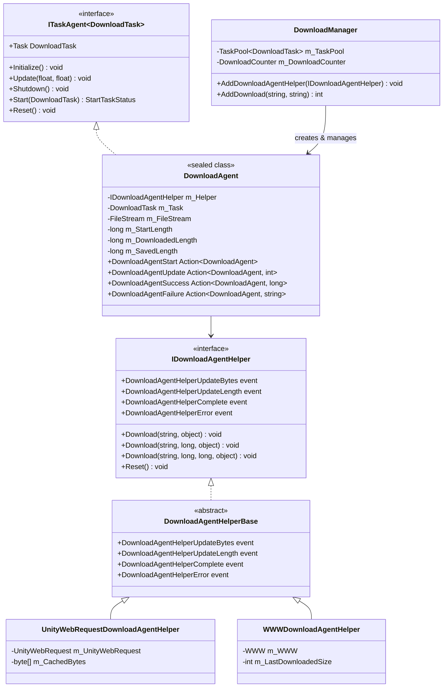
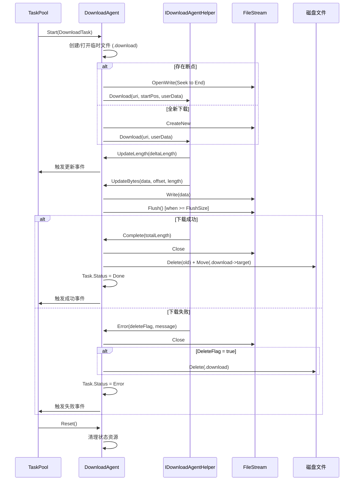

# 下载代理

下载代理（Download Agent）是 GameFrameX 下载系统的核心执行单元，负责实际执行下载任务。每个下载代理实例对应一个具体的下载操作，通过与下载代理辅助器（Download Agent Helper）交互完成网络请求和数据存储。

## 概述

下载代理是 `DownloadManager` 内部的任务执行器，实现了 `ITaskAgent<DownloadTask>` 接口。它管理单个下载任务的完整生命周期，包括：

- **任务启动**：初始化文件流、检查断点续传、启动下载
- **进度监控**：实时追踪下载进度、处理超时、计算下载速度
- **数据写入**：将下载的数据块写入临时文件（.download 后缀）
- **任务完成**：将临时文件重命名为目标文件
- **错误处理**：处理网络错误、超时错误、IO 错误

下载代理采用策略模式设计，通过依赖注入不同的下载代理辅助器（`IDownloadAgentHelper`）来支持不同的下载实现。框架提供了两个内置实现：
- `UnityWebRequestDownloadAgentHelper`：基于 Unity 的 `UnityWebRequest` API（推荐，兼容 Unity 2017.2+）
- `WWWDownloadAgentHelper`：基于传统的 `WWW` 类（仅支持 Unity 2018.3 以下版本）

## 架构

下载代理系统采用分层架构设计，核心组件包括：



**架构设计要点：**

1. **任务代理模式**：`DownloadAgent` 实现 `ITaskAgent<DownloadTask>` 接口，融入 `TaskPool` 任务池系统，实现任务的统一调度和管理。

2. **依赖注入**：`DownloadAgent` 通过构造函数接收 `IDownloadAgentHelper` 实例，将底层下载实现抽象化，便于扩展和测试。

3. **事件驱动**：`DownloadAgent` 通过订阅 `IDownloadAgentHelper` 的事件来感知下载进度和状态变化，保持与具体下载实现解耦。

4. **生命周期管理**：`DownloadAgent` 实现 `IDisposable` 接口，确保资源（特别是文件流和网络请求）正确释放。

## 核心流程

下载代理处理单个下载任务的完整流程如下：



**关键设计决策：**

1. **临时文件机制**：下载数据先写入 `.download` 后缀的临时文件，完成后才重命名为目标文件。这确保了：
   - 下载中断时不会损坏原有的目标文件
   - 支持断点续传（通过检查临时文件大小）

2. **缓冲区写入**：`DownloadAgent` 维护一个内部缓冲区，达到 `FlushSize`（默认 1MB）时才执行物理写入，减少 IO 操作次数。

3. **超时检测**：每次收到数据或进度更新时重置等待计时器，如果超过 `Timeout`（默认 30 秒）未收到任何数据，判定为超时错误。

## 核心属性

`DownloadAgent` 提供了以下公开属性供外部查询：

| 属性 | 类型 | 描述 |
|------|------|------|
| `Task` | `DownloadTask` | 当前正在处理的下载任务 |
| `WaitTime` | `float` | 距离上次收到数据的时间（秒） |
| `StartLength` | `long` | 开始下载时文件已存在的大小（断点续传用） |
| `DownloadedLength` | `long` | 本次下载已获取的数据大小 |
| `CurrentLength` | `long` | 当前总大小（StartLength + DownloadedLength） |
| `SavedLength` | `long` | 已持久化到磁盘的数据大小 |

```csharp
// 使用示例：查询下载进度
DownloadAgent agent = /* 从事件或池中获取 */;
long totalSize = agent.CurrentLength;
long downloaded = agent.DownloadedLength;
float progress = (float)downloaded / totalSize * 100f;
Debug.Log($"下载进度: {progress:F1}% ({downloaded}/{totalSize} bytes)");
```

## 事件系统

下载代理通过以下回调事件与外部通信：

```csharp
// 下载开始事件
public Action<DownloadAgent> DownloadAgentStart;

// 下载进度更新事件（每次收到新数据块）
public Action<DownloadAgent, int> DownloadAgentUpdate;

// 下载成功完成事件
public Action<DownloadAgent, long> DownloadAgentSuccess;

// 下载失败事件
public Action<DownloadAgent, string> DownloadAgentFailure;
```

这些事件在 `DownloadManager.AddDownloadAgentHelper()` 时被绑定到管理器的事件系统，形成统一的事件流。

## 下载代理辅助器

### IDownloadAgentHelper 接口

`IDownloadAgentHelper` 定义了下载代理辅助器的核心契约：

> Source: [IDownloadAgentHelper.cs](https://github.com/GameFrameX/com.gameframex.unity.download/blob/main/Runtime/Download/Download/IDownloadAgentHelper.cs#L15-L65)

```csharp
public interface IDownloadAgentHelper
{
    // 事件：下载数据流更新
    event EventHandler<DownloadAgentHelperUpdateBytesEventArgs> DownloadAgentHelperUpdateBytes;
    
    // 事件：下载长度更新（增量）
    event EventHandler<DownloadAgentHelperUpdateLengthEventArgs> DownloadAgentHelperUpdateLength;
    
    // 事件：下载完成
    event EventHandler<DownloadAgentHelperCompleteEventArgs> DownloadAgentHelperComplete;
    
    // 事件：下载错误
    event EventHandler<DownloadAgentHelperErrorEventArgs> DownloadAgentHelperError;

    // 方法：从头开始下载
    void Download(string downloadUri, object userData);
    
    // 方法：从指定位置继续下载（断点续传）
    void Download(string downloadUri, long fromPosition, object userData);
    
    // 方法：下载指定范围的数据
    void Download(string downloadUri, long fromPosition, long toPosition, object userData);
    
    // 方法：重置辅助器状态
    void Reset();
}
```

### UnityWebRequestDownloadAgentHelper

基于 UnityWebRequest 的实现，支持现代 Unity 版本（2017.2+）：

> Source: [UnityWebRequestDownloadAgentHelper.cs](https://github.com/GameFrameX/com.gameframex.unity.download/blob/main/Runtime/Download/UnityWebRequestDownloadAgentHelper.cs#L26-L229)

**特性：**
- 使用 `DownloadHandlerScript` 子类实现增量数据回调
- 内置 SSL 证书验证处理器（默认接受所有证书）
- 支持 HTTP Range 头部实现断点续传
- 兼容 Unity 2017.2 至最新版本

**使用方式：**

```csharp
// 创建 UnityWebRequest 辅助器实例
var helper = gameObject.AddComponent<UnityWebRequestDownloadAgentHelper>();

// 添加到下载管理器
var downloadManager = GameEntry.GetComponent<DownloadManager>();
downloadManager.AddDownloadAgentHelper(helper);
```

### WWWDownloadAgentHelper

基于传统 WWW 的实现，仅适用于 Unity 2018.3 以下版本（已标记为过时）：

> Source: [WWWDownloadAgentHelper.cs](https://github.com/GameFrameX/com.gameframex.unity.download/blob/main/Runtime/Download/WWWDownloadAgentHelper.cs#L21-L244)

**注意：** 此实现被 `#if !UNITY_2018_3_OR_NEWER` 条件编译保护，在 Unity 2018.3 及以上版本中不可用。

## 自定义下载代理辅助器

开发者可以通过继承 `DownloadAgentHelperBase` 来实现自定义下载逻辑：

```csharp
using UnityEngine;
using GameFrameX.Download.Runtime;

public class CustomDownloadAgentHelper : DownloadAgentHelperBase
{
    // 实现继承的事件和抽象方法...
    
    public override void Download(string downloadUri, object userData)
    {
        // 实现自定义下载逻辑
        // 重要：在适当的时候触发事件
    }
    
    public override void Reset()
    {
        // 清理资源
    }
}
```

## 事件参数

### DownloadAgentHelperUpdateBytesEventArgs

下载数据流更新事件参数：

> Source: [DownloadAgentHelperUpdateBytesEventArgs.cs](https://github.com/GameFrameX/com.gameframex.unity.download/blob/main/Runtime/EventArgs/DownloadAgentHelperUpdateBytesEventArgs.cs#L16-L62)

| 属性 | 类型 | 描述 |
|------|------|------|
| `Bytes` | `byte[]` | 下载的数据块 |
| `Offset` | `int` | 数据起始偏移 |
| `Length` | `int` | 数据长度 |

### DownloadAgentHelperUpdateLengthEventArgs

下载增量大小事件参数：

> Source: [DownloadAgentHelperUpdateLengthEventArgs.cs](https://github.com/GameFrameX/com.gameframex.unity.download/blob/main/Runtime/EventArgs/DownloadAgentHelperUpdateLengthEventArgs.cs#L16-L47)

| 属性 | 类型 | 描述 |
|------|------|------|
| `DeltaLength` | `int` | 本次新增的下载数据大小 |

### DownloadAgentHelperCompleteEventArgs

下载完成事件参数：

> Source: [DownloadAgentHelperCompleteEventArgs.cs](https://github.com/GameFrameX/com.gameframex.unity.download/blob/main/Runtime/EventArgs/DownloadAgentHelperCompleteEventArgs.cs#L16-L62)

| 属性 | 类型 | 描述 |
|------|------|------|
| `Length` | `long` | 下载的总数据大小 |

### DownloadAgentHelperErrorEventArgs

下载错误事件参数：

> Source: [DownloadAgentHelperErrorEventArgs.cs](https://github.com/GameFrameX/com.gameframex.unity.download/blob/main/Runtime/EventArgs/DownloadAgentHelperErrorEventArgs.cs#L16-L66)

| 属性 | 类型 | 描述 |
|------|------|------|
| `DeleteDownloading` | `bool` | 是否需要删除正在下载的临时文件 |
| `ErrorMessage` | `string` | 错误描述信息 |

## 常见问题

### 断点续传不工作

**症状**：重新启动游戏后，下载任务从头开始而非从上次中断处继续。

**可能原因**：
1. 服务器不支持 HTTP Range 头部
2. 临时文件（.download）被意外删除
3. 下载路径不一致

**排查方法**：
```csharp
// 检查下载代理的 StartLength 属性
DownloadAgent agent = /* 获取代理 */;
Debug.Log($"StartLength: {agent.StartLength}");
// 如果为 0，说明未检测到断点
```

### 下载超时

**症状**：下载长时间无响应，最终报错 "Timeout"。

**解决方案**：
```csharp
// 调整下载超时设置
var downloadManager = GameEntry.GetComponent<DownloadManager>();
downloadManager.Timeout = 120f; // 调整为 120 秒
```

### 内存占用过高

**症状**：大文件下载时内存使用量激增。

**原因分析**：
`UnityWebRequestDownloadAgentHelper` 使用 4KB 的固定缓冲区，如果下载速度极快且未及时处理，可能导致数据积压。

**优化建议**：
- 降低 `FlushSize` 以增加磁盘写入频率
- 监控 `WorkingAgentCount`，限制并发下载数量

## 相关链接

- [下载组件](./4-core-concepts.download-component) - 下载组件的使用
- [架构概述](./4-core-concepts.architecture) - 整体系统架构
- [下载事件](./6-events.download-events) - 下载相关事件详解
- [代理事件](./6-events.agent-events) - 代理相关事件详解
- [API 参考](./5-api-reference.properties) - 属性和方法的完整定义
