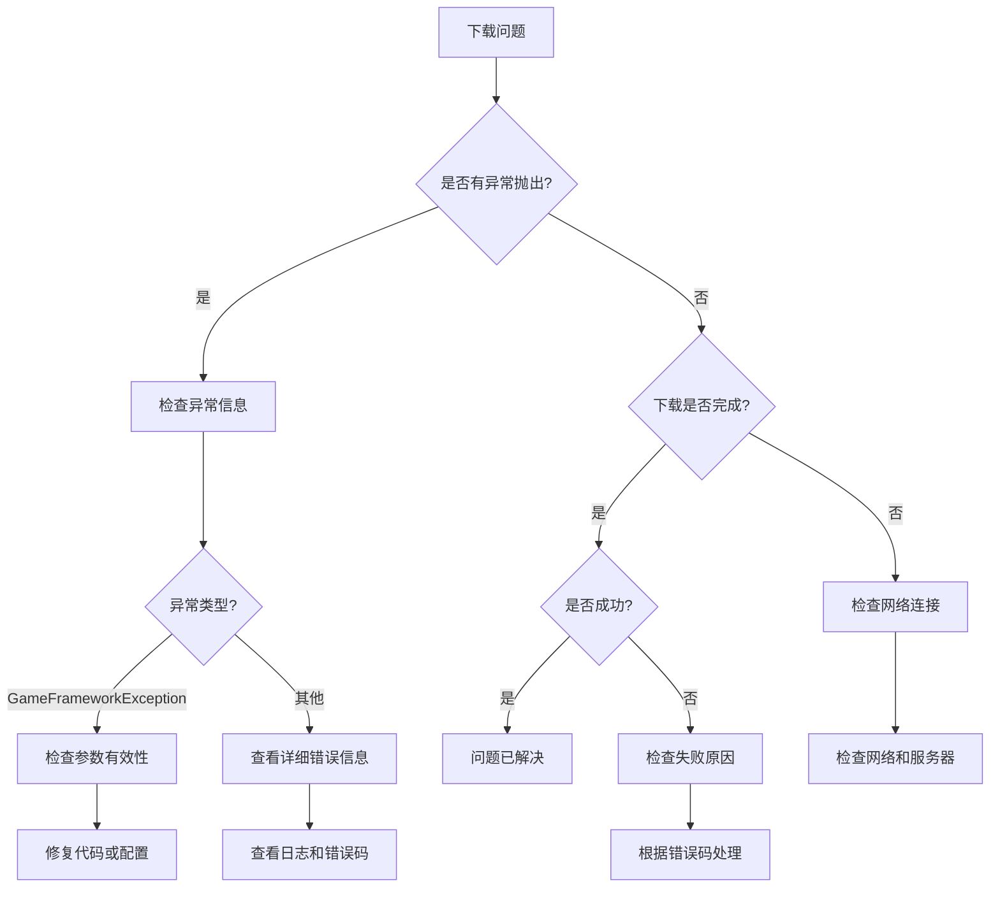

# 常见问题

本文档收集了使用 GameFrameX Download 下载组件过程中可能遇到的常见问题及其解决方案。

## 概述

Download 组件是 GameFrameX 框架中负责处理下载任务的核心组件。在实际使用过程中，可能因为配置不当、依赖缺失或网络环境等因素遇到各种问题。本文档旨在帮助开发者快速定位和解决这些问题。

## 初始化问题

### 问题：游戏启动时提示 "Download manager is invalid"

**错误信息：**
```
Log.Fatal("Download manager is invalid.");
```

**原因分析：**
DownloadComponent 依赖 IDownloadManager 模块，但该模块未能正确注册到 GameFramework 系统中。

**解决方案：**
1. 确保 DownloadManager 模块已正确注册。检查是否在启动时调用了相关的模块注册代码。
2. 确认 GameFrameworkEntry 能够正确解析 IDownloadManager 接口。

---

### 问题：游戏启动时提示 "Event component is invalid"

**错误信息：**
```
Log.Fatal("Event component is invalid.");
```

**原因分析：**
DownloadComponent 依赖 EventComponent 进行事件分发，但 EventComponent 未正确初始化。

**解决方案：**
1. 确保场景中存在 EventComponent。
2. EventComponent 必须在 DownloadComponent 之前初始化。
3. 有关 EventComponent 的详细信息，请参阅 [Event 组件文档](https://github.com/GameFrameX/com.gameframex.unity.event)。

---

### 问题：提示 "Can not create download agent helper"

**错误信息：**
```
Log.Error("Can not create download agent helper.");
```

**原因分析：**
无法根据配置的类型名称创建下载代理辅助器实例。

**解决方案：**
1. 检查 DownloadComponent 的 `DownloadAgentHelperTypeName` 字段配置是否正确。
2. 默认值应为 `UnityGameFramework.Runtime.UnityWebRequestDownloadAgentHelper`。
3. 如果使用自定义下载代理辅助器，确保类型名称与程序集中的完全限定名一致。

---

## API 使用问题

### 问题：调用 AddDownload 时抛出异常 "Download path is invalid"

**错误信息：**
```
GameFrameworkException: Download path is invalid.
```

**原因分析：**
传递给 AddDownload 方法的 downloadPath 参数为空或 null。

**解决方案：**
确保 downloadPath 参数有效：
```csharp
// 错误示例
int id = downloadComponent.AddDownload("", "http://example.com/file.zip");

// 正确示例
int id = downloadComponent.AddDownload(Application.persistentDataPath + "/file.zip", "http://example.com/file.zip");
```

> Source: [DownloadManager.cs](https://github.com/GameFrameX/com.gameframex.unity.download/blob/main/Runtime/Download/Download/DownloadManager.cs#L338-L341)

---

### 问题：调用 AddDownload 时抛出异常 "Download uri is invalid"

**错误信息：**
```
GameFrameworkException: Download uri is invalid.
```

**原因分析：**
传递给 AddDownload 方法的 downloadUri 参数为空或 null。

**解决方案：**
确保 downloadUri 参数有效：
```csharp
// 错误示例
int id = downloadComponent.AddDownload(Application.persistentDataPath + "/file.zip", "");

// 正确示例
int id = downloadComponent.AddDownload(Application.persistentDataPath + "/file.zip", "http://example.com/file.zip");
```

> Source: [DownloadManager.cs](https://github.com/GameFrameX/com.gameframex.unity.download/blob/main/Runtime/Download/Download/DownloadManager.cs#L343-L346)

---

### 问题：调用 AddDownload 时抛出异常 "You must add download agent first"

**错误信息：**
```
GameFrameworkException: You must add download agent first.
```

**原因分析：**
在添加任何下载任务之前，必须先添加至少一个下载代理辅助器。

**解决方案：**
1. DownloadComponent 会在 Start 方法中自动创建指定数量的代理辅助器。
2. 确保 DownloadComponent 已正确添加到场景中。
3. 检查 `DownloadAgentHelperCount` 属性是否大于 0（默认为 3）。

```csharp
// 在 DownloadComponent Inspector 中设置
[SerializeField] private int m_DownloadAgentHelperCount = 3;
```

> Source: [DownloadManager.cs](https://github.com/GameFrameX/com.gameframex.unity.download/blob/main/Runtime/Download/Download/DownloadManager.cs#L348-L351)

---

## 网络与下载问题

### 问题：下载失败，提示 "Timeout"

**错误信息：**
```
Download failure, download serial id '0', download path '...', download uri '...', error message 'Timeout'.
```

**原因分析：**
下载请求在指定超时时间内未完成。默认超时时间为 30 秒。

**解决方案：**
1. 增加超时时间设置：
```csharp
// 设置超时时间为 120 秒
downloadComponent.Timeout = 120f;
```

2. 检查网络连接是否稳定。

3. 确认服务器响应时间是否正常，可以尝试使用浏览器或其他工具访问下载链接。

4. 如果是大型文件下载，考虑调整超时时间或实现断点续传。

---

### 问题：下载时出现网络错误

**错误信息：**
```
error: "Network error"
```

**原因分析：**
UnityWebRequest 检测到网络层面的错误，可能是以下原因：
- 网络连接中断
- DNS 解析失败
- 无法建立连接

**解决方案：**
1. 检查设备网络连接状态。
2. 确认下载 URL 是否可访问。
3. 如果在移动设备上测试，确保已添加网络权限（Android: INTERNET, ACCESS_NETWORK_STATE; iOS: NSAppTransportSecurity）。
4. 查看设备日志获取更详细的错误信息。

---

### 问题：下载时出现 HTTP 错误

**错误信息：**
```
error: "HTTP Error 404"
error: "HTTP Error 500"
```

**原因分析：**
服务器返回了错误状态码，常见状态码包括：
- 404: 文件不存在
- 500: 服务器内部错误
- 502: 网关错误
- 503: 服务不可用

**解决方案：**
1. 确认下载链接是否正确。
2. 检查服务器端的文件是否存在。
3. 如果是 API 请求，检查 API 接口是否正确。
4. 查看服务器日志以获取更多错误详情。

---

### 问题：断点续传不生效

**原因分析：**
断点续传功能依赖于服务器支持 HTTP Range 头。

**解决方案：**
1. 确认服务器是否支持断点续传（HTTP 206 状态码）。
2. 检查 FlushSize 配置，确保文件写入逻辑正常：
```csharp
// 设置写入磁盘的临界大小（默认为 1MB）
downloadComponent.FlushSize = 1024 * 1024;
```

3. 确保下载目录有足够的磁盘空间。

---

## 文件系统问题

### 问题：下载文件写入失败

**原因分析：**
- 磁盘空间不足
- 写入路径无权限
- 目录不存在

**解决方案：**
1. 确保目标目录存在：
```csharp
string directory = Path.GetDirectoryName(downloadPath);
if (!Directory.Exists(directory))
{
    Directory.CreateDirectory(directory);
}
```

2. 检查磁盘剩余空间。

3. 检查应用程序的写入权限。

4. 在 Android 上，注意使用 Application.persistentDataPath 而非 Application.dataPath。

---

## 事件订阅问题

### 问题：无法接收下载事件

**原因分析：**
未正确订阅 DownloadComponent 或 DownloadManager 的事件。

**解决方案：**
正确订阅事件的方式：
```csharp
// 通过 EventComponent 订阅
var eventComponent = GameEntry.GetComponent<EventComponent>();
eventComponent.Subscribe(DownloadSuccessEventArgs.EventId, OnDownloadSuccess);
eventComponent.Subscribe(DownloadFailureEventArgs.EventId, OnDownloadFailure);

// 回调处理
private void OnDownloadSuccess(object sender, GameEventArgs e)
{
    var ne = (DownloadSuccessEventArgs)e;
    Debug.Log($"Download success: {ne.DownloadPath}");
}

private void OnDownloadFailure(object sender, GameEventArgs e)
{
    var ne = (DownloadFailureEventArgs)e;
    Debug.Log($"Download failed: {ne.ErrorMessage}");
}
```

> Source: [README.md](https://github.com/GameFrameX/com.gameframex.unity.download/blob/main/README.md#L94-L106)

---

### 问题：Task 返回 null

**原因信息：**
Download 方法返回 null 而不是 Task 对象。

**原因分析：**
在 Download 方法中，如果 serialId 不在 m_Downloads 字典中，会返回 null。

**解决方案：**
确保使用正确的序列 ID：
```csharp
// 使用 AddDownload 返回的 serialId
int serialId = downloadComponent.AddDownload(downloadPath, downloadUri);

// 等待下载完成
var task = downloadComponent.Download(downloadPath, downloadUri);
if (task != null)
{
    bool success = await task;
}
```

> Source: [DownloadComponent.cs](https://github.com/GameFrameX/com.gameframex.unity.download/blob/main/Runtime/Download/DownloadComponent.cs#L273-L282)

---

## 配置问题

### 问题：下载速度过慢

**可能原因：**
- 代理数量不足
- 超时时间设置过短
- 网络带宽限制

**解决方案：**
1. 增加下载代理数量：
```csharp
// 在 Inspector 中设置更高的 DownloadAgentHelperCount
// 建议值：3-5 个代理
```

2. 调整超时时间：
```csharp
downloadComponent.Timeout = 60f; // 增加到 60 秒
```

3. 调整 FlushSize：
```csharp
// 增加写入缓冲区大小可以提升大文件下载性能
downloadComponent.FlushSize = 2 * 1024 * 1024; // 2MB
```

---

### 问题：无法创建自定义下载代理辅助器

**原因分析：**
自定义下载代理辅助器类型未正确注册或程序集未包含。

**解决方案：**
1. 确保自定义辅助器继承自 DownloadAgentHelperBase：
```csharp
public class CustomDownloadAgentHelper : DownloadAgentHelperBase
{
    // 实现必要的方法
}
```

2. 在 DownloadComponent Inspector 中设置正确的类型名称：
```
DownloadAgentHelperTypeName: "YourNamespace.CustomDownloadAgentHelper"
```

3. 确保程序集已正确添加到 Unity 项目的 Assembly Definition 中。

---

## 调试技巧

### 启用详细日志

在开发阶段，可以启用详细的调试日志来帮助定位问题：

```csharp
// 订阅所有下载事件以监控状态
downloadComponent.DownloadStart += (s, e) => Debug.Log($"Start: {e.DownloadUri}");
downloadComponent.DownloadUpdate += (s, e) => Debug.Log($"Progress: {e.CurrentLength}");
downloadComponent.DownloadSuccess += (s, e) => Debug.Log($"Success: {e.DownloadPath}");
downloadComponent.DownloadFailure += (s, e) => Debug.Log($"Failure: {e.ErrorMessage}");
```

### 检查下载状态

使用 DownloadComponent 提供的方法检查当前下载状态：

```csharp
// 获取等待下载任务数量
int waitingCount = downloadComponent.WaitingTaskCount;

// 获取工作中代理数量
int workingCount = downloadComponent.WorkingAgentCount;

// 获取可用代理数量
int freeCount = downloadComponent.FreeAgentCount;

// 获取当前下载速度
float speed = downloadComponent.CurrentSpeed;
```

### 获取任务信息

```csharp
// 根据序列编号获取下载任务信息
var info = downloadComponent.GetDownloadInfo(serialId);

// 根据标签获取下载任务信息
var infos = downloadComponent.GetDownloadInfos("myTag");

// 获取所有下载任务信息
var allInfos = downloadComponent.GetAllDownloadInfos();
```

---

## 诊断流程图



---

## 相关链接

- [插件介绍](./1-overview.introduction)
- [功能特性](./1-overview.features)
- [安装](./2-installation)
- [基础配置](./3-getting-started.basic-setup)
- [首个示例](./3-getting-started.first-example)
- [架构概述](./4-core-concepts.architecture)
- [DownloadComponent](./4-core-concepts.download-component)
- [下载代理](./4-core-concepts.download-agent)
- [API 参考 - 属性](./5-api-reference.properties)
- [API 参考 - 方法](./5-api-reference.methods)
- [下载事件](./6-events.download-events)
- [代理事件](./6-events.agent-events)
- [编辑器配置](./7-configuration.editor-configuration)
- [下载代理配置](./7-configuration.agent-configuration)
