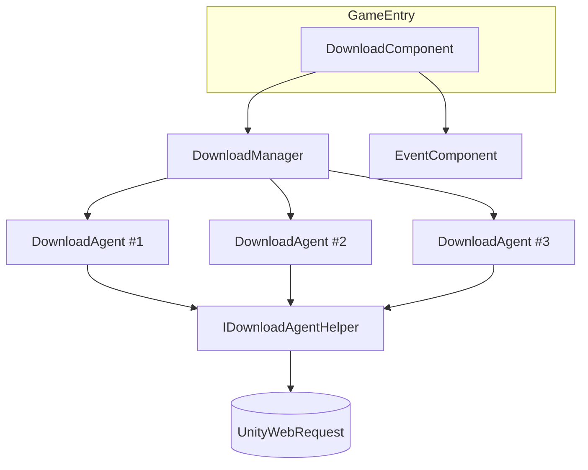

# 下载组件简介

GameFrameX 下载组件是 Unity 下的多代理下载管理器，负责并发文件下载、优先级队列调度、暂停/恢复、实时速度上报与事件回调。它以 `DownloadComponent`（挂载在 `GameEntry` 上）作为对外入口，内部封装 `DownloadManager` 与可插拔的下载代理助手（`IDownloadAgentHelper`），适合用于资源包、热更新文件、补丁等本地落盘下载场景。

## 快速开始

1. **安装组件**：在 `Packages/manifest.json` 中添加 Scoped Registry 与依赖：

   ```json
   {
     "scopedRegistries": [
       {
         "name": "GameFrameX",
         "url": "https://gameframex.upm.alianblank.uk",
         "scopes": ["com.gameframex"]
       }
     ],
     "dependencies": {
       "com.gameframex.unity.download": "1.1.2"
     }
   }
   ```

   Source: [README.zh-CN.md](https://github.com/GameFrameX/com.gameframex.unity.download/blob/main/README.zh-CN.md#L68-L84)

2. **获取组件实例**：通过框架入口拿到 `DownloadComponent`：

   ```csharp
   var downloadComponent = GameEntry.GetComponent<DownloadComponent>();
   ```

   Source: [DownloadComponent.cs](https://github.com/GameFrameX/com.gameframex.unity.download/blob/main/Runtime/Download/DownloadComponent.cs#L46-L60)

3. **添加一个下载任务**（异步方式）：

   ```csharp
   bool success = await downloadComponent.Download(
       "/本地保存路径/file.zip",
       "https://example.com/file.zip"
   );
   ```

   Source: [README.zh-CN.md](https://github.com/GameFrameX/com.gameframex.unity.download/blob/main/README.zh-CN.md#L131-L143)

4. **或使用事件驱动方式**：

   ```csharp
   var eventComponent = GameEntry.GetComponent<EventComponent>();
   eventComponent.Subscribe(DownloadSuccessEventArgs.EventId, OnDownloadSuccess);
   eventComponent.Subscribe(DownloadFailureEventArgs.EventId, OnDownloadFailure);

   int serialId = downloadComponent.AddDownload(
       "/本地保存路径/file.zip",
       "https://example.com/file.zip"
   );
   ```

   Source: [README.zh-CN.md](https://github.com/GameFrameX/com.gameframex.unity.download/blob/main/README.zh-CN.md#L96-L127)

5. **按标签分组与暂停/恢复**：

   ```csharp
   int id = downloadComponent.AddDownload(path, uri, tag: "assets", priority: 10);
   downloadComponent.GetDownloadInfos("assets");
   downloadComponent.RemoveDownloads("assets");

   downloadComponent.Paused = true;   // 暂停全部
   downloadComponent.Paused = false;  // 恢复
   ```

   Source: [README.zh-CN.md](https://github.com/GameFrameX/com.gameframex.unity.download/blob/main/README.zh-CN.md#L145-L167)

## 工作原理速览

组件对外只暴露 `DownloadComponent`，内部由三类对象协作：



- `DownloadComponent` 负责参数（代理数、超时、`FlushSize`、助手类型）并转发调用。
- `DownloadManager` 维护任务队列与代理池，按优先级派发任务。
- `IDownloadAgentHelper` 是真正发网络请求的抽象，默认实现为 `UnityWebRequestDownloadAgentHelper`，可在 Inspector 中替换或自定义。
- 完成/失败通过事件总线广播给订阅者。

Source: [DownloadComponent.cs](https://github.com/GameFrameX/com.gameframex.unity.download/blob/main/Runtime/Download/DownloadComponent.cs#L46-L80)

## 核心特性速览

| 特性 | 说明 |
|------|------|
| 多代理并发 | 默认 3 个下载代理并行，可通过 Inspector 修改 |
| 优先级调度 | 数值越大越优先派发 |
| 标签分组 | 支持按 tag 添加、查询、移除任务 |
| 暂停与恢复 | `Paused = true/false` 全局生效 |
| 超时与刷盘 | `Timeout`（默认 30 秒）与 `FlushSize`（默认 1 MB）支持断点续传 |
| 实时指标 | `CurrentSpeed`、`TotalAgentCount`、`WaitingTaskCount` |
| 事件驱动 | 通过 `EventComponent` 派发 `DownloadStart` / `DownloadUpdate` / `DownloadSuccess` / `DownloadFailure` |
| 异步支持 | `Download()` 返回 `Task<bool>`，可直接 await |
| 可插拔后端 | 内置 `UnityWebRequestDownloadAgentHelper`，也可实现 `IDownloadAgentHelper` |

Source: [README.zh-CN.md](https://github.com/GameFrameX/com.gameframex.unity.download/blob/main/README.zh-CN.md#L28-L38)

## 接下来

- 关于如何添加下载任务并处理结果，见《如何发起一次下载》。
- 关于按标签管理任务，见《如何使用标签分组管理下载》。
- 关于暂停/恢复、修改超时与刷盘阈值，见《如何配置下载组件》。
- 关于事件订阅与异步接口选择，见《如何订阅下载事件》。
- 关于更换或自定义下载后端，见《如何替换下载代理助手》。
- 关于下载失败的排查，见《下载失败怎么办》。