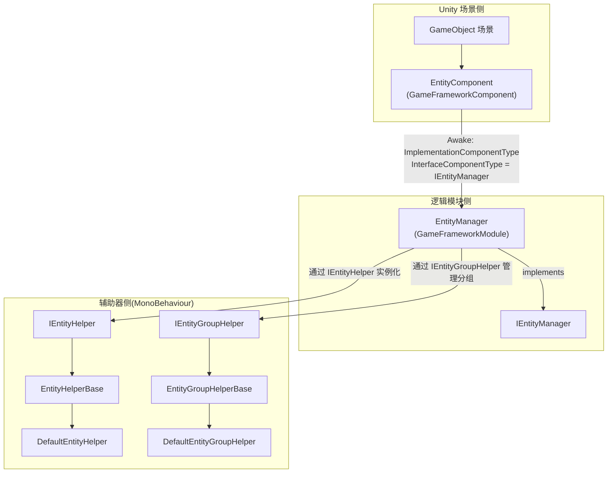

# 工作原理:Manager-Component-Helper 架构与实体生命周期

实体(Entity)模块采用 GameFrameX 框架通用的 **Manager + Component + Helper** 三层架构:Unity 侧的 `EntityComponent` 是面向场景的入口,持有逻辑侧的 `EntityManager` 来统一调度所有实体的生命周期(`Init → Show → Hide → Recycle`),并通过 `IEntityHelper` / `IEntityGroupHelper` 这两个 Helper 接口把"如何创建 / 如何分组"的具体行为下放到用户可替换的实现上。

## 三层角色一览

| 层 | 类型 | 所在命名空间 | 职责 |
|----|------|--------------|------|
| Component(组件) | `EntityComponent : GameFrameworkComponent` | `GameFrameX.Entity.Runtime` | 挂场景 GameObject,作为框架模块入口,在 `Awake` 时把 `IEntityManager` 的实现类绑定到框架;提供实体组的注册与获取 |
| Manager(管理器) | `EntityManager : GameFrameworkModule, IEntityManager` | `GameFrameX.Entity.Runtime` | partial class,纯逻辑模块。负责实体 / 实体组字典、状态机推进、`ShowEntity` / `HideEntity` / `RecycleEntity` 主流程 |
| Helper(辅助器) | `IEntityHelper` / `IEntityGroupHelper` 及对应 `*Base`、`Default*` 实现 | `GameFrameX.Entity.Runtime` | 由用户或框架默认提供的 `MonoBehaviour`:Helper 决定"怎么实例化实体 / 怎么把实体挂到哪一组" |

## 快速开始(把模块跑起来)

1. 在场景挂一个空 GameObject,添加 `EntityComponent`(在 Inspector 中通过 Add Component → GameFrameX/Entity 可找到)。
2. 让一个 `MonoBehaviour` 继承 `EntityHelperBase` 作为实体辅助器,或直接使用内置 `DefaultEntityHelper`。
3. 让一个 `MonoBehaviour` 继承 `EntityGroupHelperBase` 作为实体组辅助器,或直接使用内置 `DefaultEntityGroupHelper`。
4. 在游戏启动时通过 `GameEntry.GetComponent<EntityComponent>()` 拿到组件,调用 `AddEntityGroup(...)` 注册若干个分组,之后即可调用 `ShowEntity` 创建实例。

源码入口:[EntityComponent.cs](https://github.com/GameFrameX/com.gameframex.unity.entity/blob/main/Runtime/Entity/EntityComponent.cs#L100-L120)

## Manager-Component-Helper 关系



- 启动:`EntityComponent.Awake()` 在源文件中做 `InterfaceComponentType = typeof(IEntityManager)` 与 `ImplementationComponentType = Utility.Assembly.GetType(componentType)`,由框架把它装配成 `IEntityManager` 供全局访问。

源码:[EntityComponent.cs](https://github.com/GameFrameX/com.gameframex.unity.entity/blob/main/Runtime/Entity/EntityComponent.cs)

## 实体生命周期

实体从无到销毁的全过程由 `EntityStatus` 状态机推进,枚举定义在 `Entity/EntityManager.EntityStatus.cs`:

| 状态 | 含义 | 触发动作 |
|------|------|----------|
| `Unknown` | 默认占位 | — |
| `WillInit` | 即将初始化 | 由 Manager 准备资源并调用 Helper |
| `Inited` | 已初始化 | 资源就绪、回调 `OnInit` |
| `WillShow` | 即将显示 | 调用 Helper 的 `CreateEntity` |
| `Showed` | 已显示,场景中活跃 | 回调 `OnShow` |
| `WillHide` | 即将隐藏 | 准备回收显示 |
| `Hidden` | 已隐藏,实例保留 | 回调 `OnHide` |
| `WillRecycle` | 即将回收 | 引用计数归零 |
| `Recycled` | 已回收,可复用或销毁 | 回调 `OnRecycle` |

源码:[EntityManager.EntityStatus.cs](https://github.com/GameFrameX/com.gameframex.unity.entity/blob/main/Runtime/Entity/Entity/EntityManager.EntityStatus.cs#L38-L52)

### 状态推进四步

Manager 通过 `ShowEntity` / `HideEntity` 主入口按顺序推进以上状态,每一步都委托给 Helper:

1. **Init**:`InstantiateEntity(entityAsset)` 由 `IEntityHelper` 在对应组容器中实例化实体。
2. **Show**:`CreateEntity(entityInstance, entityGroup, userData)` 由 Helper 构造 `IEntity`、设置 Transform 与父节点。
3. **Hide**:`EntityManager.Hide*` 流程把 `Showed → WillHide → Hidden`,实例保留在组中等待复用。
4. **Recycle**:`ReleaseEntity(entityAsset, entityInstance)` 由 Helper 销毁或归还对象池。

`IEntityHelper` 的接口定义:

```csharp
public interface IEntityHelper
{
    object InstantiateEntity(object entityAsset);
    IEntity CreateEntity(object entityInstance, IEntityGroup entityGroup, object userData);
    void ReleaseEntity(object entityAsset, object entityInstance);
}
```

源码:[IEntityHelper.cs](https://github.com/GameFrameX/com.gameframex.unity.entity/blob/main/Runtime/Entity/Entity/IEntityHelper.cs#L37-L61)

## Helper 的可替换点

| 接口 | 默认实现 | 替换为自定义 Helper 的场景 |
|------|----------|--------------------------|
| `IEntityHelper` | `DefaultEntityHelper : EntityHelperBase` | 想用 Addressables、对象池或自定义预加载策略时,继承 `EntityHelperBase` |
| `IEntityGroupHelper` | `DefaultEntityGroupHelper : EntityGroupHelperBase` | 想把实体挂到不同父节点、按层级 LOD/分屏展示时,继承 `EntityGroupHelperBase` |

两个 Helper 抽象类都继承自 `MonoBehaviour`,因此可以在 Inspector 里把它们绑到任意 GameObject 上,Manager 调用时通过接口拿到实例即可。

源码:[EntityHelperBase.cs](https://github.com/GameFrameX/com.gameframex.unity.entity/blob/main/Runtime/Entity/EntityHelperBase.cs#L38-L40)、[EntityGroupHelperBase.cs](https://github.com/GameFrameX/com.gameframex.unity.entity/blob/main/Runtime/Entity/EntityGroupHelperBase.cs#L38-L40)

## 接下来

- 想添加实体组并展示一个实体,见《如何:注册实体组并 ShowEntity》。
- `ShowEntity` 报 `Entity ... is not inited` 或类似错误,见《实体生命周期异常怎么办》。
- 公共 API 的方法签名与默认值,见《实体模块 API 速查》。
