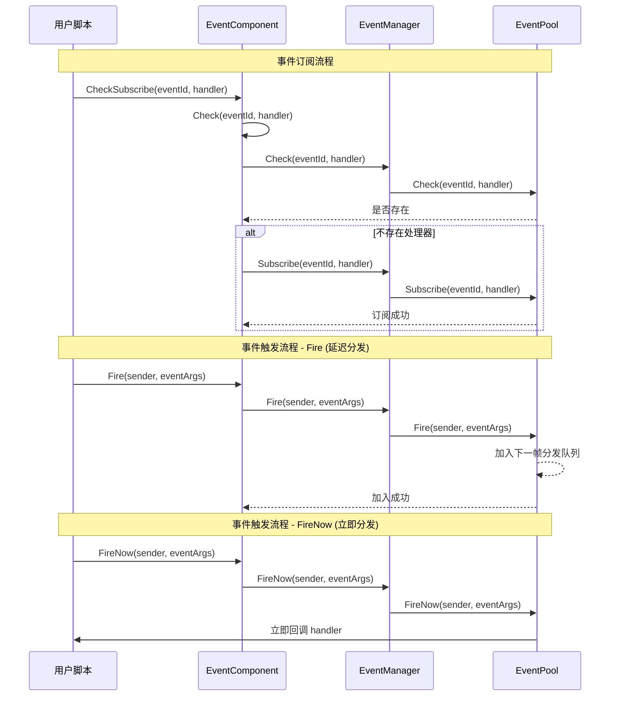

# EventComponent

EventComponent 是 Game Frame X 事件系统的 Unity 组件层，提供基于观察者模式的事件订阅与发布功能。

## Overview

EventComponent 是游戏框架中的核心事件组件，继承自 `GameFrameworkComponent`。它作为 Unity 游戏对象组件，提供了一个可配置的、易于使用的事件系统接口。

### 核心职责

- **事件订阅**：允许脚本订阅特定事件 ID 的处理函数
- **事件取消订阅**：允许脚本取消对特定事件的订阅
- **事件触发**：支持两种模式触发事件（延迟分发和立即分发）
- **线程安全**：跨线程触发事件时可保证在主线程回调

### 组件特性

- 继承自 `GameFrameworkComponent`，遵循框架组件规范
- 使用 `[DisallowMultipleComponent]` 特性防止重复添加
- 使用 `[AddComponentMenu]` 在 Unity 编辑器中添加菜单项
- 支持多处理器（MultiHandler）和无处理器（NoHandler）模式

## Architecture

EventComponent 在事件系统中的位置和交互关系：

```mermaid
flowchart TD
    subgraph UnityLayer["Unity 游戏层"]
        EventComp[EventComponent]
    end

    subgraph FrameworkLayer["Game Framework 核心层"]
        GFComponent[GameFrameworkComponent]
        GFEntry[GameFrameworkEntry]
    end

    subgraph EventLayer["事件系统层"]
        IEventMgr[IEventManager]
        EventMgr[EventManager]
        EventPool[EventPool<GameEventArgs>]
    end

    subgraph UserLayer["用户脚本层"]
        ScriptA[用户脚本 A]
        ScriptB[用户脚本 B]
    end

    EventComp -->|继承| GFComponent
    EventComp -->|获取模块| GFEntry
    GFEntry -->|返回| IEventMgr
    IEventMgr <|.实现.| EventMgr
    EventMgr -->|使用| EventPool
    
    ScriptA -->|订阅事件| EventComp
    ScriptB -->|订阅事件| EventComp
    EventComp -->|触发事件| EventPool
    EventPool -.->|回调| ScriptA
    EventPool -.->|回调| ScriptB
```

### 事件系统架构说明

| 层级 | 组件 | 职责 |
|------|------|------|
| Unity层 | EventComponent | 提供 Unity 组件接口，封装底层模块 |
| 框架核心层 | GameFrameworkEntry | 模块初始化和依赖注入 |
| 事件系统层 | IEventManager | 事件管理器接口定义 |
| 事件系统层 | EventManager | 事件管理器实现 |
| 事件系统层 | EventPool | 事件池，负责事件存储和分发 |

## Core Flow

事件订阅与触发的完整流程：



### 事件分发模式对比

| 模式 | 方法 | 线程安全 | 分发时机 | 适用场景 |
|------|------|----------|----------|----------|
| 延迟分发 | `Fire()` | ✅ 是 | 下一帧 | 大多数情况，特别是跨线程触发 |
| 立即分发 | `FireNow()` | ❌ 否 | 立即 | 确定性要求高的同步场景 |

## Usage Examples

### 基本用法 - 订阅和触发事件

```csharp
using GameFrameX.Event.Runtime;

// 定义事件参数类
public class PlayerDeadEventArgs : GameEventArgs
{
    public int PlayerId { get; set; }
    public string Reason { get; set; }
    
    public override void Clear()
    {
        PlayerId = 0;
        Reason = string.Empty;
    }

    public override string Id => "player.dead";
}

// 在需要监听事件的脚本中
public class PlayerController : MonoBehaviour
{
    private EventComponent _eventComponent;

    private void Start()
    {
        // 获取 EventComponent 组件
        _eventComponent = UnityEngine.GameObject.FindObjectOfType<EventComponent>();
        
        // 订阅事件 - 使用 CheckSubscribe 自动检查是否已订阅
        _eventComponent.CheckSubscribe(PlayerDeadEventArgs args => OnPlayerDead(args));
    }

    private void OnPlayerDead(PlayerDeadEventArgs args)
    {
        UnityEngine.Debug.Log($"玩家 {args.PlayerId} 死亡: {args.Reason}");
    }

    private void OnDestroy()
    {
        // 取消订阅事件
        if (_eventComponent != null)
        {
            _eventComponent.Unsubscribe("player.dead", OnPlayerDead);
        }
    }
}

// 在触发事件的脚本中
public class GameManager : MonoBehaviour
{
    private EventComponent _eventComponent;

    private void Start()
    {
        _eventComponent = UnityEngine.GameObject.FindObjectOfType<EventComponent>();
    }

    public void KillPlayer(int playerId)
    {
        // 创建事件参数
        var eventArgs = ReferencePool.Acquire<PlayerDeadEventArgs>();
        eventArgs.PlayerId = playerId;
        eventArgs.Reason = "被怪物击杀";

        // 触发事件
        _eventComponent.Fire(this, eventArgs);
        
        // 事件参数会被自动回收
    }
}
```
> Source: [EventComponent.cs](https://github.com/GameFrameX/com.gameframex.unity.event/blob/main/Runtime/EventComponent.cs#L1-L155)
> Source: [GameEventArgs.cs](https://github.com/GameFrameX/com.gameframex.unity.event/blob/main/Runtime/EventArgs/GameEventArgs.cs#L1-L19)

### 简化事件 - 使用空事件参数

如果只需要传递事件 ID，不需要额外数据：

```csharp
// 触发一个简单事件
_eventComponent.Fire(this, "player.respawn");

// 订阅简单事件
_eventComponent.CheckSubscribe("player.respawn", args => 
{
    UnityEngine.Debug.Log("玩家重生");
});
```
> Source: [EventComponent.cs](https://github.com/GameFrameX/com.gameframex.unity.event/blob/main/Runtime/EventComponent.cs#L140-L144)

### 使用默认事件处理器

可以为所有未处理的事件设置默认处理器：

```csharp
// 设置默认处理器
_eventComponent.SetDefaultHandler((sender, args) =>
{
    UnityEngine.Debug.Log($"未处理的事件: {args.Id}");
});
```
> Source: [EventComponent.cs](https://github.com/GameFrameX/com.gameframex.unity.event/blob/main/Runtime/EventComponent.cs#L120-L123)

## API Reference

### 属性

#### `EventHandlerCount`

```csharp
public int EventHandlerCount { get; }
```

获取已订阅的事件处理函数总数。

**返回：** 事件处理函数的总数

---

#### `EventCount`

```csharp
public int EventCount { get; }
```

获取已订阅的事件类型总数。

**返回：** 事件类型的总数

---

### 方法

#### `Count(id: string): int`

```csharp
public int Count(string id)
```

获取指定事件 ID 的事件处理函数数量。

**参数：**
- `id` (string): 事件类型编号

**返回：** 该事件 ID 关联的事件处理函数数量

---

#### `Check(id: string, handler: EventHandler<GameEventArgs>): bool`

```csharp
public bool Check(string id, EventHandler<GameEventArgs> handler)
```

检查指定事件 ID 是否已存在特定的事件处理函数。

**参数：**
- `id` (string): 事件类型编号
- `handler` (EventHandler<GameEventArgs>): 要检查的事件处理函数

**返回：** 是否存在该事件处理函数

---

#### `CheckSubscribe(id: string, handler: EventHandler<GameEventArgs>): void`

```csharp
public void CheckSubscribe(string id, EventHandler<GameEventArgs> handler)
```

检查并订阅事件处理函数。如果处理函数不存在，则自动订阅。

**设计意图：** 此方法解决了重复订阅的问题。在 Unity 开发中，经常会在 `Start()` 或 `OnEnable()` 中订阅事件，但如果这些方法被多次调用，会导致同一处理函数被重复订阅。此方法会在订阅前检查，避免重复订阅。

**参数：**
- `id` (string): 事件类型编号
- `handler` (EventHandler<GameEventArgs>): 要订阅的事件处理回调函数

---

#### `Subscribe(id: string, handler: EventHandler<GameEventArgs>): void`

```csharp
[Obsolete("Use CheckSubscribe instead.")]
public void Subscribe(string id, EventHandler<GameEventArgs> handler)
```

> ⚠️ 已废弃，请使用 `CheckSubscribe` 代替。

订阅事件处理回调函数。

**参数：**
- `id` (string): 事件类型编号
- `handler` (EventHandler<GameEventArgs>): 要订阅的事件处理回调函数

---

#### `Unsubscribe(id: string, handler: EventHandler<GameEventArgs>): void`

```csharp
public void Unsubscribe(string id, EventHandler<GameEventArgs> handler)
```

取消订阅事件处理回调函数。

**设计意图：** 在 Unity 中，当脚本被销毁时（如切换场景、对象销毁），必须取消事件订阅以避免空引用异常。通常在 `OnDestroy()` 或 `OnDisable()` 中调用。

**参数：**
- `id` (string): 事件类型编号
- `handler` (EventHandler<GameEventArgs>): 要取消订阅的事件处理回调函数

---

#### `SetDefaultHandler(handler: EventHandler<GameEventArgs>): void`

```csharp
public void SetDefaultHandler(EventHandler<GameEventArgs> handler)
```

设置默认事件处理函数。当触发一个没有订阅者的事件时，会调用默认处理器。

**参数：**
- `handler` (EventHandler<GameEventArgs>): 要设置的默认事件处理函数

---

#### `Fire(sender: object, e: GameEventArgs): void`

```csharp
public void Fire(object sender, GameEventArgs e)
```

抛出事件（延迟分发模式）。

**设计意图：** 此方法是线程安全的。即使在后台线程中调用 `Fire()`，事件回调也只会在主线程的下一帧执行。这是推荐使用的事件触发方式，特别适用于网络消息回调、异步操作完成通知等场景。

**参数：**
- `sender` (object): 事件发送者，通常传递 `this`
- `e` (GameEventArgs): 事件参数对象

---

#### `Fire(sender: object, eventId: string): void`

```csharp
public void Fire(object sender, string eventId)
```

抛出事件（使用空事件参数）。

**设计意图：** 提供一种简化的无数据事件触发方式。当只需要传递事件 ID 而不需要携带额外数据时使用。

**参数：**
- `sender` (object): 事件发送者
- `eventId` (string): 事件编号

---

#### `FireNow(sender: object, e: GameEventArgs): void`

```csharp
public void FireNow(object sender, GameEventArgs e)
```

抛出事件（立即分发模式）。

**设计意图：** 此方法不是线程安全的，事件会立刻同步分发。适用于需要确定性执行顺序的场景，例如某些帧同步逻辑或调试时需要立即看到效果的情况。**注意：** 不要在后台线程中调用此方法。

**参数：**
- `sender` (object): 事件发送者
- `e` (GameEventArgs): 事件参数对象

---

## Configuration Options

EventComponent 作为 Unity 组件，无需额外配置。它通过框架的 `GameFrameworkEntry` 自动获取 `IEventManager` 模块。

| 配置项 | 类型 | 默认值 | 说明 |
|--------|------|--------|------|
| Component Menu | string | "Game Framework/Event" | Unity 编辑器中的组件菜单位置 |

---

## Related Links

- [EventManager](./5-api-reference.event-manager) - 事件管理器底层实现
- [GameEventArgs](./5-api-reference.game-event-args) - 事件参数基类
- [核心概念：事件系统架构](../4-core-concepts.index) - 了解事件系统设计原理
- [快速入门](../3-getting-started.index) - 开始使用事件系统
