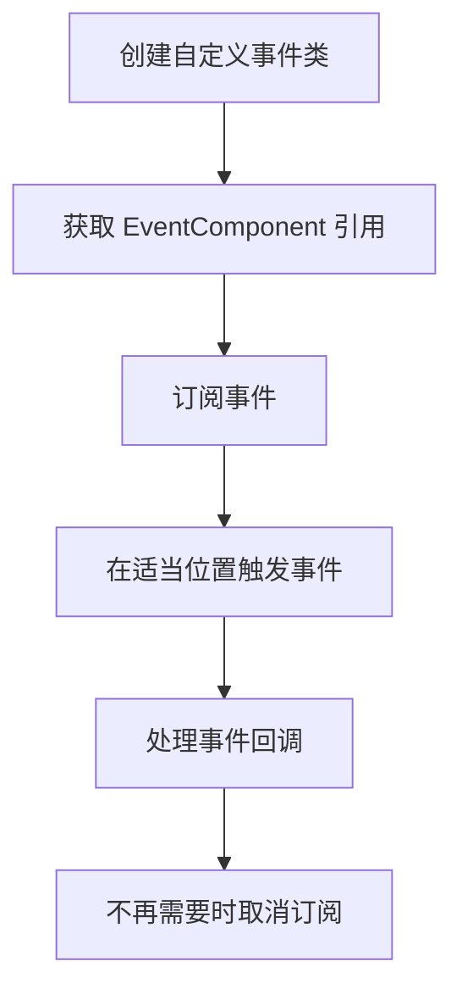

# 快速入门

本文档将帮助你快速上手 GameFrameX 事件系统。通过阅读本指南，你将了解如何在 Unity 项目中配置和使用事件组件来实现游戏中的事件驱动编程。

## 概述

GameFrameX 事件系统是一个轻量级的事件管理框架，采用观察者模式实现，允许游戏中的不同模块通过事件进行松耦合通信。你可以使用字符串作为事件标识符来订阅和处理事件。

## 前置条件

在使用事件系统之前，请确保：

1. Unity 2017.1 或更高版本
2. 已正确安装 GameFrameX 核心框架
3. 已在项目中添加 Event 组件包

> **提示:** 有关安装说明，请参阅 [安装方式](./2-installation.index)。

## 基本使用流程

事件系统的典型使用流程如下：



## 第一步：创建自定义事件类

首先，需要定义一个继承自 `GameEventArgs` 的事件参数类：

```csharp
using GameFrameX.Event.Runtime;

/// <summary>
/// 游戏开始事件参数
/// </summary>
public class GameStartEventArgs : GameEventArgs
{
    /// <summary>
    /// 事件 ID 标识
    /// </summary>
    public override string Id => "game_start";

    /// <summary>
    /// 当前游戏关卡
    /// </summary>
    public int CurrentLevel { get; set; }

    /// <summary>
    /// 玩家名称
    /// </summary>
    public string PlayerName { get; set; }

    /// <summary>
    /// 清理事件数据
    /// </summary>
    public override void Clear()
    {
        CurrentLevel = 0;
        PlayerName = null;
    }
}
```

> Source: [GameEventArgs.cs](https://github.com/GameFrameX/com.gameframex.unity.event/blob/main/Runtime/EventArgs/GameEventArgs.cs#L12-L18)

## 第二步：在场景中添加 EventComponent

在 Unity 编辑器中，按照以下步骤添加事件组件：

1. 在场景中创建一个空游戏对象（或选择已有游戏对象）
2. 点击 **Add Component** 按钮
3. 搜索 **Event** 组件
4. 选择 **Game Framework → Event**

组件添加后，EventComponent 会自动初始化事件管理器。

## 第三步：订阅事件

在需要监听事件的脚本中，订阅相应的事件：

```csharp
using UnityEngine;
using GameFrameX.Event.Runtime;

/// <summary>
/// 游戏管理器 - 负责游戏生命周期管理
/// </summary>
public class GameManager : MonoBehaviour
{
    private EventComponent _eventComponent;

    private void Awake()
    {
        // 获取事件组件引用
        _eventComponent = UnityEngine.GameObject.FindObjectOfType<EventComponent>();
    }

    private void OnEnable()
    {
        // 订阅游戏开始事件
        // CheckSubscribe 会在不存在时自动订阅，避免重复订阅
        _eventComponent.CheckSubscribe("game_start", OnGameStart);
    }

    private void OnDisable()
    {
        // 取消订阅游戏开始事件
        _eventComponent.Unsubscribe("game_start", OnGameStart);
    }

    /// <summary>
    /// 游戏开始事件处理函数
    /// </summary>
    private void OnGameStart(object sender, GameEventArgs e)
    {
        if (e is GameStartEventArgs args)
        {
            Debug.Log($"游戏开始！关卡：{args.CurrentLevel}, 玩家：{args.PlayerName}");
        }
    }
}
```

> Source: [EventComponent.cs](https://github.com/GameFrameX/com.gameframex.unity.event/blob/main/Runtime/EventComponent.cs#L82-L88)

## 第四步：触发事件

当游戏状态发生变化时，触发相应的事件：

```csharp
// 在游戏的启动流程中触发事件
public class GameStarter : MonoBehaviour
{
    public EventComponent eventComponent;

    private void Start()
    {
        // 创建事件参数
        var eventArgs = new GameStartEventArgs
        {
            CurrentLevel = 1,
            PlayerName = "Player1"
        };

        // 触发事件 - Fire 是线程安全的，会在下一帧分发
        eventComponent.Fire(this, eventArgs);

        // 或者使用 FireNow 立即分发（非线程安全）
        // eventComponent.FireNow(this, eventArgs);
    }
}
```

> Source: [EventComponent.cs](https://github.com/GameFrameX/com.gameframex.unity.event/blob/main/Runtime/EventComponent.cs#L130-L144)

## 事件分发模式

事件组件提供两种事件分发方式：

| 模式 | 方法 | 线程安全 | 适用场景 |
|------|------|----------|----------|
| 延迟分发 | `Fire()` | ✅ 安全 | 大多数情况，推荐使用 |
| 立即分发 | `FireNow()` | ❌ 不安全 | 紧急事件或确定性要求高的情况 |

```csharp
// 延迟分发 - 事件会在下一帧处理
eventComponent.Fire(sender, new GameEventArgs());

// 立即分发 - 事件会立即处理
eventComponent.FireNow(sender, new GameEventArgs());
```

## 简化事件用法

如果不需要传递复杂的事件数据，可以使用简化的字符串事件：

```csharp
// 触发简单事件
eventComponent.Fire(this, "player_dead");

// 在事件处理函数中接收
private void OnPlayerDead(object sender, GameEventArgs e)
{
    // e.Id 将包含 "player_dead"
    Debug.Log("玩家死亡！");
}
```

> Source: [EmptyEventArgs.cs](https://github.com/GameFrameX/com.gameframex.unity.event/blob/main/Runtime/EventArgs/EmptyEventArgs.cs#L32-L37)

## 完整示例：玩家死亡事件

以下是一个完整的示例，展示如何实现玩家死亡事件系统：

```csharp
using UnityEngine;
using GameFrameX.Event.Runtime;

/// <summary>
/// 玩家死亡事件参数
/// </summary>
public class PlayerDeadEventArgs : GameEventArgs
{
    public override string Id => "player_dead";
    public int PlayerId { get; set; }
    public string Reason { get; set; }
    public override void Clear()
    {
        PlayerId = 0;
        Reason = null;
    }
}

/// <summary>
/// 玩家控制器
/// </summary>
public class PlayerController : MonoBehaviour
{
    private EventComponent _eventComponent;
    private int _health = 100;

    private void Awake()
    {
        _eventComponent = FindObjectOfType<EventComponent>();
    }

    private void OnEnable()
    {
        _eventComponent.CheckSubscribe("player_dead", OnPlayerDead);
    }

    private void OnDisable()
    {
        _eventComponent.Unsubscribe("player_dead", OnPlayerDead);
    }

    /// <summary>
    /// 玩家受到伤害
    /// </summary>
    public void TakeDamage(int damage)
    {
        _health -= damage;
        
        if (_health <= 0)
        {
            // 触发玩家死亡事件
            var args = new PlayerDeadEventArgs
            {
                PlayerId = GetInstanceID(),
                Reason = "生命值耗尽"
            };
            _eventComponent.Fire(this, args);
        }
    }

    private void OnPlayerDead(object sender, GameEventArgs e)
    {
        if (e is PlayerDeadEventArgs args)
        {
            Debug.Log($"玩家 {args.PlayerId} 已死亡，原因：{args.Reason}");
            // 这里可以添加游戏结束逻辑
        }
    }
}
```

## 默认事件处理函数

可以为事件组件设置默认处理器，用于捕获未明确订阅的事件：

```csharp
private void Start()
{
    var eventComponent = GetComponent<EventComponent>();
    eventComponent.SetDefaultHandler(OnUnhandledEvent);
}

private void OnUnhandledEvent(object sender, GameEventArgs e)
{
    Debug.Log($"未处理的事件：{e.Id}");
}
```

> Source: [EventComponent.cs](https://github.com/GameFrameX/com.gameframex.unity.event/blob/main/Runtime/EventComponent.cs#L120-L123)

## 事件统计

可以随时获取当前事件系统的状态：

```csharp
// 获取事件处理函数总数
int handlerCount = eventComponent.EventHandlerCount;

// 获取事件类型总数
int eventCount = eventComponent.EventCount;

// 获取特定事件的处理函数数量
int specificCount = eventComponent.Count("game_start");
```

> Source: [EventComponent.cs](https://github.com/GameFrameX/com.gameframex.unity.event/blob/main/Runtime/EventComponent.cs#L27-L38)

## 最佳实践

1. **及时取消订阅**: 在 `OnDisable` 或 `OnDestroy` 中取消订阅事件，避免内存泄漏
2. **使用 CheckSubscribe**: 使用 `CheckSubscribe` 方法避免重复订阅
3. **使用 Fire 而非 FireNow**: 除非有特殊需求，否则使用 `Fire` 方法确保线程安全
4. **清理事件数据**: 在自定义事件类中正确实现 `Clear()` 方法，便于对象池复用

## 相关链接

- [插件介绍](./1-overview.index) - 了解更多关于事件系统的概述
- [安装方式](./2-installation.index) - 查看详细的安装说明
- [事件系统架构](./4-core-concepts.index) - 深入了解内部架构
- [EventComponent API 参考](./5-api-reference.event-component) - 完整的 API 文档
- [EventManager API 参考](./5-api-reference.event-manager) - 事件管理器 API
- [GameEventArgs API 参考](./5-api-reference.game-event-args) - 事件参数基类
- [常见问题解答](./6-troubleshooting.index) - 常见问题与解决方案
