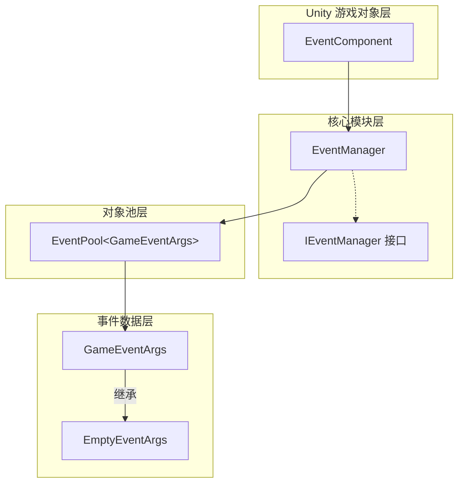
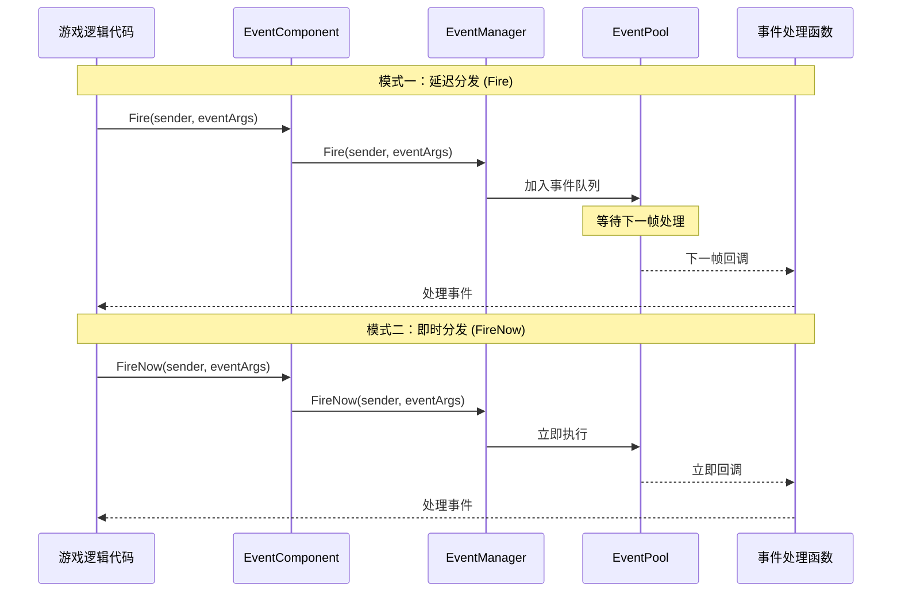
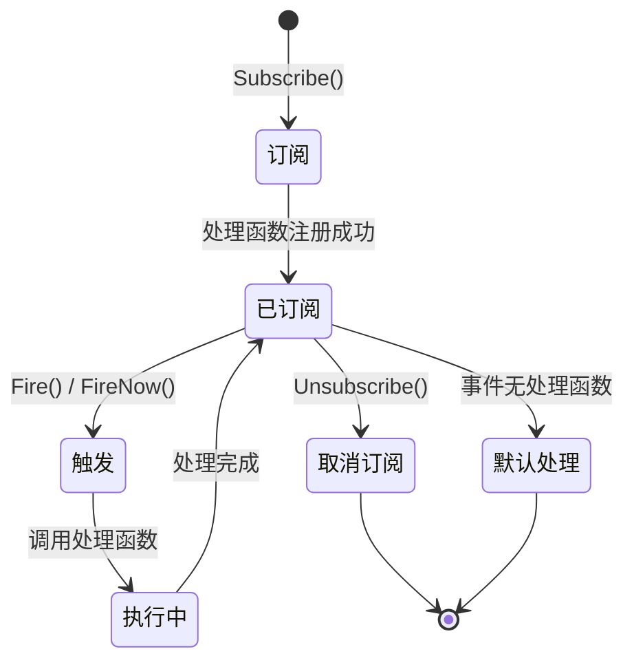

# 插件介绍

GameFrameX Event 插件是 GameFrameX 游戏框架的核心组件之一，提供了一套完整的游戏事件系统解决方案。该插件实现了观察者模式（Observer Pattern），允许游戏对象之间进行松耦合的通信，是构建事件驱动型游戏架构的理想选择。

## 概述

GameFrameX Event 事件系统组件是一个轻量级、高性能的 Unity 事件管理框架，专为游戏开发设计。它解决了传统 Unity 事件系统（如 UnityEvent、SendMessage）的诸多局限性，提供了更加强大和灵活的事件处理能力。

该事件系统的核心设计理念是将事件的**发送者**与**接收者**解耦，使得游戏各个模块之间不需要直接引用彼此，通过事件进行通信。这种设计模式极大地提高了代码的可维护性和可扩展性，特别适合大型游戏项目的开发。

### 核心特性

| 特性 | 说明 |
|------|------|
| **线程安全** | 支持在后台线程触发事件，自动在主线程回调处理函数 |
| **延迟分发** | Fire() 方法将事件分发延迟到下一帧，避免性能抖动 |
| **即时分发** | FireNow() 方法支持立即事件分发，适用于实时响应场景 |
| **对象池** | 内部使用对象池技术，减少内存分配和 GC 压力 |
| **默认处理器** | 支持设置默认事件处理函数，捕获未明确订阅的事件 |
| **多重订阅** | 允许同一事件 ID 绑定多个处理函数 |

### 事件系统架构

GameFrameX Event 事件系统由多个核心组件构成，每个组件都有明确的职责分工：



**架构说明：**

- **EventComponent**：作为 Unity 组件存在，提供给游戏脚本直接调用的公共 API，是事件系统与游戏代码的桥梁。它继承自 `GameFrameworkComponent`，遵循 GameFrameX 框架的组件规范。

- **EventManager**：事件系统的核心模块，继承自 `GameFrameworkModule`，实现了 `IEventManager` 接口。负责管理所有事件的订阅、取消订阅和分发逻辑。

- **EventPool**：内部使用的事件池实现，负责事件对象的获取和回收，有效减少游戏运行时的内存分配。

- **GameEventArgs**：所有游戏事件的基类，开发者需要继承此类来创建自定义事件类型。

- **EmptyEventArgs**：预置的简单事件类，仅包含事件 ID，适用于不需要携带额外数据的场景。

## 事件流转机制

### 事件分发模式

GameFrameX Event 提供了两种事件分发模式，以满足不同场景的需求：



**延迟分发（Fire）特点：**
- 事件被加入队列，在下一帧统一处理
- 完全线程安全，可在任意线程调用
- 适用于大多数游戏逻辑事件
- 可避免在某一帧产生性能高峰

**即时分发（FireNow）特点：**
- 事件立即分发，同步执行所有处理函数
- 非线程安全，必须在主线程调用
- 适用于需要立即响应的事件
- 适合处理游戏中的即时反馈

### 事件生命周期



## 快速使用示例

### 基本订阅与触发

```csharp
// 1. 定义自定义事件类
public class PlayerDeadEventArgs : GameEventArgs
{
    public int PlayerId { get; set; }
    public string Reason { get; set; }
}

// 2. 获取 EventComponent 组件引用
var eventComponent = UnityEngine.GameObject.Find("GameRoot").GetComponent<EventComponent>();

// 3. 订阅事件
eventComponent.CheckSubscribe("player_dead", OnPlayerDead);

// 4. 定义事件处理函数
private void OnPlayerDead(object sender, GameEventArgs e)
{
    var args = (PlayerDeadEventArgs)e;
    UnityEngine.Debug.Log($"玩家 {args.PlayerId} 死亡，原因：{args.Reason}");
}

// 5. 触发事件
eventComponent.Fire(this, new PlayerDeadEventArgs 
{ 
    PlayerId = 1001, 
    Reason = "被怪物击杀" 
});
```

> Source: [Runtime/EventComponent.cs](https://github.com/GameFrameX/com.gameframex.unity.event/blob/main/Runtime/EventComponent.cs#L90-L99)

### 使用空事件

```csharp
// 触发一个不带数据的简单事件
eventComponent.Fire(this, "game_start");
```

> Source: [Runtime/EventComponent.cs](https://github.com/GameFrameX/com.gameframex.unity.event/blob/main/Runtime/EventComponent.cs#L140-L144)

### 检查与取消订阅

```csharp
// 检查事件处理函数是否存在
bool exists = eventComponent.Check("player_dead", OnPlayerDead);

// 取消订阅
eventComponent.Unsubscribe("player_dead", OnPlayerDead);
```

> Source: [Runtime/EventComponent.cs](https://github.com/GameFrameX/com.gameframex.unity.event/blob/main/Runtime/EventComponent.cs#L72-L75)

## 事件系统设计优势

### 相比 Unity 原生事件系统的优势

| 特性 | UnityEvent / SendMessage | GameFrameX Event |
|------|-------------------------|------------------|
| 性能 | 较差，有反射开销 | 高性能，无反射 |
| 类型安全 | 弱类型 | 强类型 |
| 线程安全 | 不支持 | 支持 |
| 对象池 | 不支持 | 支持 |
| 泛型支持 | 不支持 | 支持 |

### 典型应用场景

1. **UI 与游戏逻辑解耦**：游戏数据变化时，通过事件通知 UI 层更新，无需 UI 直接引用游戏逻辑代码

2. **模块间通信**：不同游戏模块（如背包系统、任务系统、成就系统）之间通过事件进行通信，降低模块间耦合度

3. **插件系统**：游戏插件或扩展模块可以通过订阅事件来响应游戏事件，无需修改核心代码

4. **调试与日志**：通过订阅全局事件，可以实现游戏行为的监控和日志记录

## 技术实现细节

### 核心类说明

**EventComponent 类**

EventComponent 是事件系统在 Unity 中的入口点，它继承自 `GameFrameworkComponent`，在 `Awake()` 方法中初始化 EventManager 模块：

```csharp
protected override void Awake()
{
    ImplementationComponentType = Utility.Assembly.GetType(componentType);
    InterfaceComponentType = typeof(IEventManager);
    base.Awake();
    m_EventManager = GameFrameworkEntry.GetModule<IEventManager>();
}
```

> Source: [Runtime/EventComponent.cs](https://github.com/GameFrameX/com.gameframex.unity.event/blob/main/Runtime/EventComponent.cs#L43-L54)

**EventManager 类**

EventManager 实现了 `IEventManager` 接口，内部使用 `EventPool<GameEventArgs>` 进行事件管理：

```csharp
public EventManager()
{
    m_EventPool = new EventPool<GameEventArgs>(EventPoolMode.AllowNoHandler | EventPoolMode.AllowMultiHandler);
}
```

> Source: [Runtime/Event/EventManager.cs](https://github.com/GameFrameX/com.gameframex.unity.event/blob/main/Runtime/Event/EventManager.cs#L24-L27)

**CheckSubscribe 方法**

该方法实现了「检查订阅」模式，如果事件处理函数不存在则自动订阅：

```csharp
public void CheckSubscribe(string id, EventHandler<GameEventArgs> handler)
{
    if (!Check(id, handler))
    {
        m_EventManager.Subscribe(id, handler);
    }
}
```

> Source: [Runtime/EventComponent.cs](https://github.com/GameFrameX/com.gameframex.unity.event/blob/main/Runtime/EventComponent.cs#L82-L88)

这种设计避免了重复订阅导致的重复调用问题，简化了开发者的使用逻辑。

## 相关链接

- [安装方式](./2-installation.index) - 了解如何安装和配置插件
- [快速入门](./3-getting-started.index) - 快速开始使用事件系统
- [事件系统架构](./4-core-concepts.index) - 深入了解事件系统架构设计
- [EventComponent API 参考](./5-api-reference.event-component) - 完整的 API 文档
- [EventManager API 参考](./5-api-reference.event-manager) - 事件管理器 API 文档
- [GameEventArgs API 参考](./5-api-reference.game-event-args) - 事件参数类 API 文档
