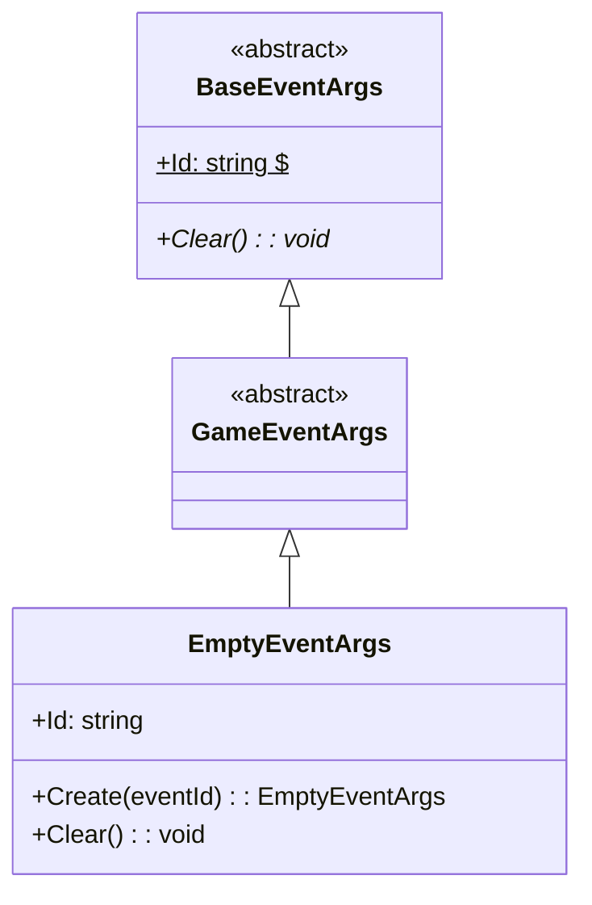
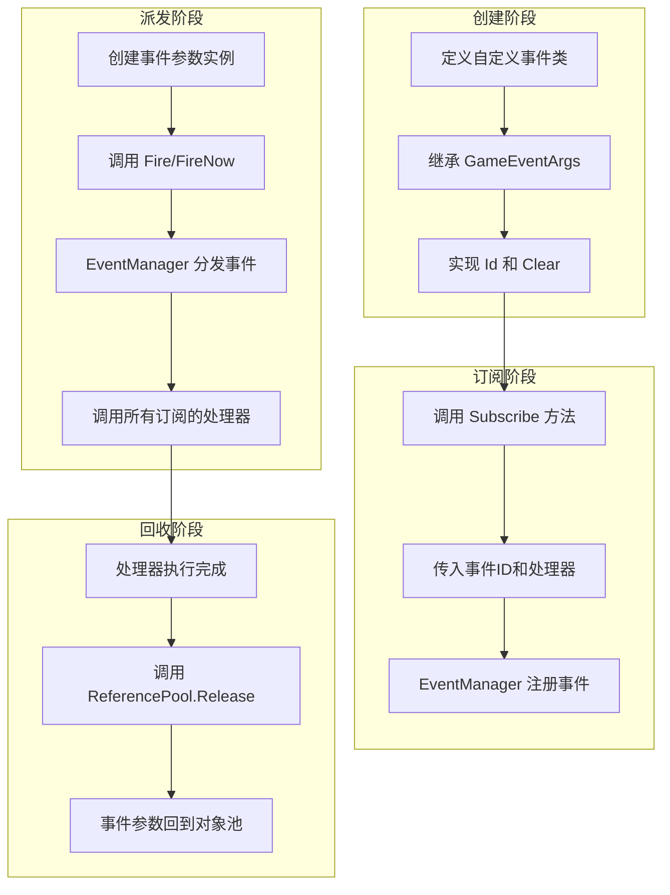

# GameEventArgs

游戏事件参数基类，用于定义游戏框架中所有事件的基类。

## 概述

GameEventArgs 是 GameFrameX 事件系统的核心基类，所有自定义游戏事件都应继承此类。它继承自 BaseEventArgs，提供了事件系统的基本结构和接口规范。

**设计意图**：通过建立统一的事件参数基类，事件系统能够以类型安全的方式处理各种游戏事件，同时保持事件订阅和派发的灵活性。

## 类层次结构



## 核心概念

### 事件 ID

每个事件参数都应该具有唯一的事件标识符（Event ID），用于事件的订阅和识别。事件 ID 通常使用字符串类型，可以是：

- 预定义的常量字符串
- 类型的完整名称（`typeof(T).FullName`）
- 自定义的业务逻辑标识

### 对象池

GameEventArgs 设计上支持对象池模式以优化性能。实际使用中，事件参数通常通过 `ReferencePool` 进行获取和回收：

```csharp
var eventArgs = ReferencePool.Acquire<EmptyEventArgs>();
// ... 使用事件参数
ReferencePool.Release(eventArgs);
```

> Source: [EmptyEventArgs.cs](https://github.com/GameFrameX/com.gameframex.unity.event/blob/main/Runtime/EventArgs/EmptyEventArgs.cs#L32-L37)

## 创建自定义事件参数

要创建自定义事件参数类，需要继承 GameEventArgs 并实现必要成员。以下是 EmptyEventArgs 的完整实现示例：

```csharp
using GameFrameX.Runtime;

namespace GameFrameX.Event.Runtime
{
    /// <summary>
    /// 空事件
    /// </summary>
    public sealed class EmptyEventArgs : GameEventArgs
    {
        private string _eventId = typeof(EmptyEventArgs).FullName;

        public override void Clear()
        {
        }

        public override string Id
        {
            get { return _eventId; }
        }

        /// <summary>
        /// 创建空事件
        /// </summary>
        /// <param name="eventId">事件编号</param>
        /// <returns>空事件对象</returns>
        public static EmptyEventArgs Create(string eventId)
        {
            var eventArgs = ReferencePool.Acquire<EmptyEventArgs>();
            eventArgs.SetEventId(eventId);
            return eventArgs;
        }

        /// <summary>
        /// 设置事件编号
        /// </summary>
        /// <param name="eventId"></param>
        private void SetEventId(string eventId)
        {
            _eventId = eventId;
        }
    }
}
```

> Source: [EmptyEventArgs.cs](https://github.com/GameFrameX/com.gameframex.unity.event/blob/main/Runtime/EventArgs/EmptyEventArgs.cs#L1-L48)

### 实现要点

1. **Id 属性**（必须）：返回事件的唯一标识符
2. **Clear 方法**（必须）：重置事件参数状态，用于对象回收时清理数据
3. **Create 静态方法**（推荐）：提供工厂方法创建事件实例，支持对象池

## 事件参数与事件系统

GameEventArgs 在事件系统中的使用流程如下：



## 完整事件示例

以下是一个带有数据载荷的自定义事件参数示例：

```csharp
// 假设的自定义事件参数示例（展示模式）
public class PlayerDieEventArgs : GameEventArgs
{
    private int _playerId;
    private string _deathReason;
    private Vector3 _deathPosition;

    public override void Clear()
    {
        _playerId = 0;
        _deathReason = string.Empty;
        _deathPosition = Vector3.zero;
    }

    public override string Id => "PlayerDie";

    public int PlayerId => _playerId;
    public string DeathReason => _deathReason;
    public Vector3 DeathPosition => _deathPosition;

    public static PlayerDieEventArgs Create(int playerId, string reason, Vector3 position)
    {
        var args = ReferencePool.Acquire<PlayerDieEventArgs>();
        args._playerId = playerId;
        args._deathReason = reason;
        args._deathPosition = position;
        return args;
    }
}
```

> 注：以上示例展示创建自定义事件参数的模式，实际代码需根据具体需求实现

## 事件派发方式

事件系统提供两种派发方式：

| 方式 | 方法 | 线程安全 | 特点 |
|------|------|----------|------|
| 延迟派发 | `Fire(sender, args)` | ✅ 安全 | 在下一帧分发，适合跨线程调用 |
| 立即派发 | `FireNow(sender, args)` | ❌ 不安全 | 立即分发，性能更高但非线程安全 |

```csharp
// 延迟派发（线程安全）
eventComponent.Fire(this, EmptyEventArgs.Create("game_start"));

// 立即派发
eventComponent.FireNow(this, EmptyEventArgs.Create("game_start"));
```

> Source: [EventComponent.cs](https://github.com/GameFrameX/com.gameframex.unity.event/blob/main/Runtime/EventComponent.cs#L130-L154)

## API 参考

### `GameEventArgs`

游戏逻辑事件基类。

**命名空间**: `GameFrameX.Event.Runtime`

**继承**: `BaseEventArgs`

**子类**:

- `EmptyEventArgs`：空事件实现

#### 成员

| 成员 | 类型 | 说明 |
|------|------|------|
| `Id` | `string` | 获取事件唯一标识符（抽象属性） |
| `Clear()` | `void` | 重置事件状态（抽象方法） |

### `EmptyEventArgs`

空事件实现，用于不需要携带数据的事件。

**命名空间**: `GameFrameX.Event.Runtime`

**继承**: `GameEventArgs`

#### 方法

| 方法 | 返回类型 | 说明 |
|------|----------|------|
| `Create(eventId)` | `EmptyEventArgs` | 创建空事件实例 |

## 相关链接

- [EventComponent](./5-api-reference.event-component)
- [EventManager](./5-api-reference.event-manager)
- [事件系统架构](./4-core-concepts.index)
- [快速入门](./3-getting-started.index)
