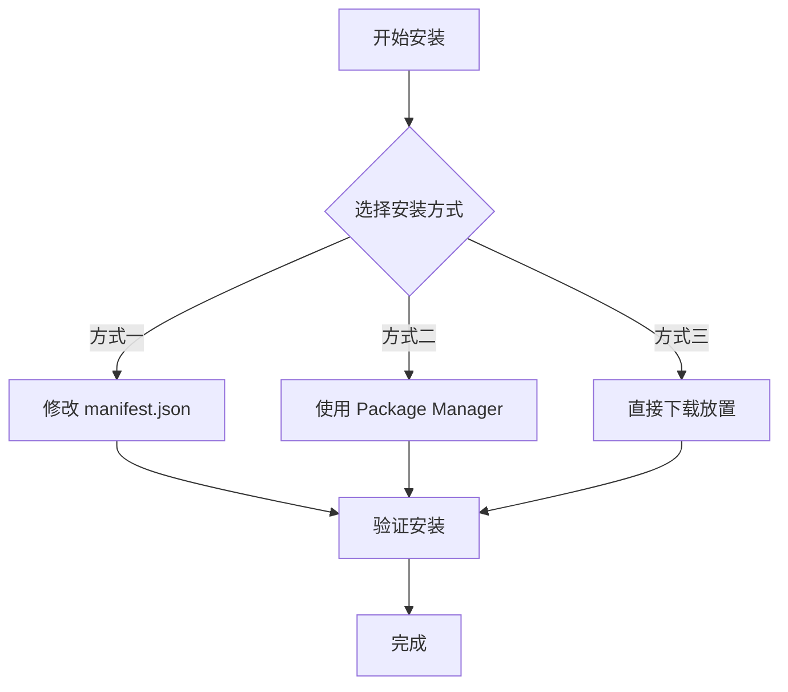
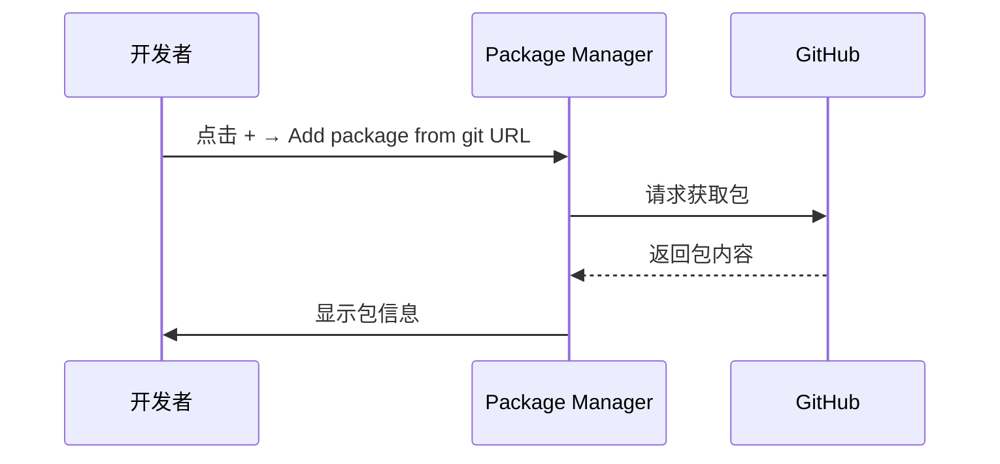

# 安装方式

本文档介绍如何将 Game Frame X Event 事件系统组件安装到您的 Unity 项目中。

## 概述

Game Frame X Event 是 Game Frame X 游戏框架的事件系统组件，提供游戏内事件的订阅、派发和管理功能。该组件支持线程安全的异步事件派发，适用于各种游戏开发场景。

**包信息：**
| 属性 | 值 |
|------|-----|
| 包名 | com.gameframex.unity.event |
| 版本 | 1.1.0 |
| Unity 版本 | 2017.1+ |

## 安装前准备

在开始安装之前，请确保您的开发环境满足以下要求：

- Unity 2017.1 或更高版本
- 已安装 Git 工具（用于通过 Git URL 安装）

## 安装方式

Game Frame X Event 提供三种安装方式，您可以根据项目需求选择其中一种。



### 方式一：通过 manifest.json 安装

这种方式适合需要将包作为项目依赖进行版本管理的场景。

1. 打开 Unity 项目中的 `Packages` 文件夹
2. 找到并编辑 `manifest.json` 文件
3. 在 `dependencies` 节点下添加以下内容：

```json
{
  "dependencies": {
    "com.gameframex.unity.event": "https://github.com/GameFrameX/com.gameframex.unity.event.git"
  }
}
```

4. 保存文件并等待 Unity 自动下载和导入包

> **注意：** 这种方式会自动从 Git 仓库获取最新版本。如果需要指定版本，可以使用 Git 的版本标签。

### 方式二：通过 Unity Package Manager 安装

这是最常用的安装方式，适合大多数项目。

1. 打开 Unity 编辑器
2. 选择菜单 **Window → Package Manager**
3. 在 Package Manager 窗口中，点击左上角的 **+** 按钮
4. 选择 **Add package from git URL...**
5. 在输入框中粘贴以下地址：

```
https://github.com/GameFrameX/com.gameframex.unity.event.git
```

6. 点击 **Add** 按钮开始安装
7. 等待下载和导入完成



### 方式三：直接下载放置

这种方式适合离线环境或需要自定义修改的场景。

1. 访问 GitHub 仓库：
   > https://github.com/GameFrameX/com.gameframex.unity.event.git

2. 点击 **Code** 按钮，选择 **Download ZIP** 下载源码
3. 解压下载的 ZIP 文件
4. 将解压后的文件夹重命名为 `com.gameframex.unity.event`
5. 将文件夹复制到 Unity 项目的 `Packages` 目录中
6. Unity 会自动识别并加载该包

> **提示：** 放置后包文件夹中需要包含 `package.json` 文件，Unity 才能正确识别。

## 安装验证

安装完成后，可以通过以下方式验证是否安装成功：

### 方法一：检查 Package Manager

打开 **Window → Package Manager**，在列表中查找 **Game Frame X Event**，确认其状态为已安装。

### 方法二：检查脚本引用

在项目中创建一个测试脚本，尝试引用 EventComponent：

```csharp
using GameFrameX.Event.Runtime;

// 确保 EventComponent 可以正常使用
public class TestScript : MonoBehaviour
{
    private EventComponent _eventComponent;
    
    void Start()
    {
        _eventComponent = GetComponent<EventComponent>();
        Debug.Log("Event 组件已成功安装！");
    }
}
```

### 方法三：检查程序集

确认项目中已加载以下程序集：
- `GameFrameX.Event.Runtime`
- `GameFrameX.Event.Editor`（如果在编辑器中使用）

## 依赖项说明

Game Frame X Event 组件依赖以下核心模块：

| 依赖模块 | 说明 |
|---------|------|
| GameFrameX.Runtime | 游戏框架运行时核心 |

> **注意：** 如果您的项目中没有安装 GameFrameX.Runtime，需要先安装该依赖项。EventComponent 继承自 `GameFrameworkComponent`，需要框架核心支持。

## 常见问题

### Q1: 安装后出现找不到 GameFrameworkComponent 的错误

这是因为缺少 GameFrameX.Runtime 核心模块。请先安装游戏框架的核心运行时组件，然后再安装 Event 模块。

### Q2: 如何更新到最新版本

- **方式一/二**：删除 manifest.json 中的对应条目后重新添加，或在 Package Manager 中点击更新按钮
- **方式三**：重新下载最新版本并替换

### Q3: 支持哪些 Unity 版本

该组件支持 Unity 2017.1 及以上版本。建议使用较新的 LTS 版本以获得最佳兼容性。

## 相关链接

- [插件介绍](./01.overview.md)
- [快速入门](./03.getting-started.md)
- [核心概念](./04.features.md)
- [GitHub 仓库](https://github.com/GameFrameX/com.gameframex.unity.event.git)
- [官方网站](https://gameframex.doc.alianblank.com)
