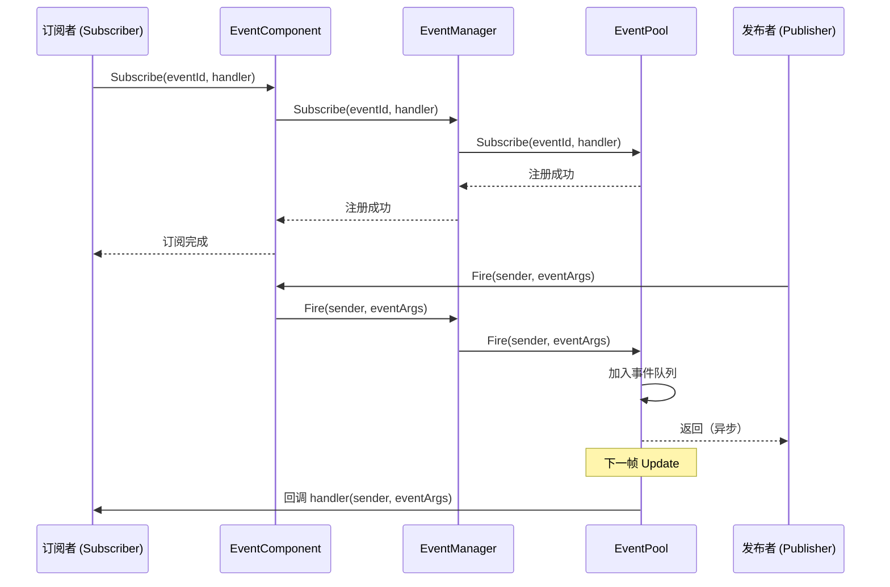
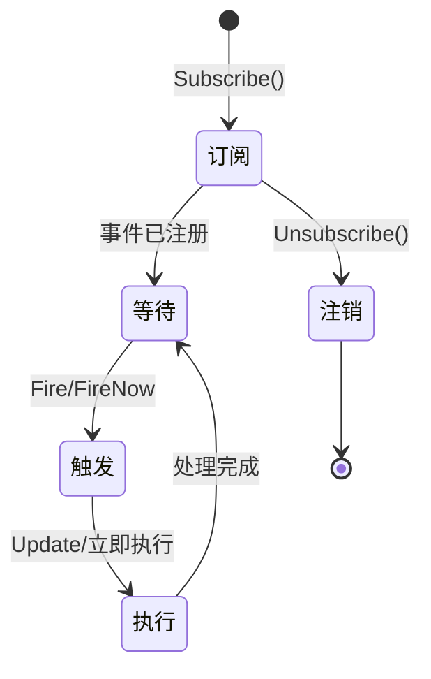
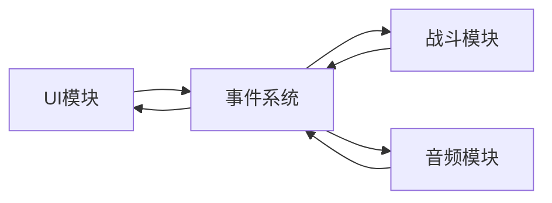
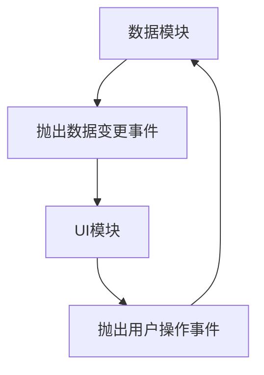

# 事件系统架构

GameFrameX 事件系统是一个基于发布-订阅（Pub-Sub）模式的事件驱动框架，提供线程安全的异步事件派发机制。该系统是 GameFrameX 架构的核心组件之一，支持游戏开发中的解耦和事件通信。

## 概述

事件系统旨在解决游戏开发中的组件通信问题。在游戏开发中，不同模块（如 UI、战斗、系统）之间需要相互通信，但直接调用会造成紧耦合。事件系统通过引入事件通道，使模块之间可以松耦合通信：

- **发布者（Publisher）**：负责抛出事件，不关心谁接收
- **订阅者（Subscriber）**：负责监听事件并处理，不关心谁发出
- **事件通道**：负责将事件从发布者传递给订阅者

### 核心特性

| 特性 | 说明 |
|------|------|
| 线程安全 | `Fire` 方法支持跨线程调用，自动在主线程回调 |
| 延迟派发 | 异步事件在下一帧分发，避免逻辑同步问题 |
| 立即派发 | `FireNow` 方法立即执行回调（需注意线程安全） |
| 多播支持 | 同一事件可绑定多个处理函数 |
| 默认处理 | 支持设置默认处理器捕获未订阅事件 |
| 对象池 | 使用 EventPool 减少内存分配 |

## 架构设计

### 组件层次结构

```mermaid
flowchart TB
    subgraph Unity["Unity 引擎层"]
        Mono[MonoBehaviour 脚本]
    end

    subgraph Component["Component 封装层"]
        EC[EventComponent]
    end

    subgraph Interface["接口抽象层"]
        IEM[IEventManager]
    end

    subgraph Implementation["实现层"]
        EM[EventManager]
        EP[EventPool]
    end

    subgraph Runtime["运行时依赖"]
        Pool[EventPool 核心]
    end

    Mono --> EC
    EC --> IEM
    IEM <|.. EM
    EM --> EP
    EP --> Pool
```

### 核心组件说明

#### 1. EventComponent

Unity 组件，继承自 `GameFrameworkComponent`，提供面向 Unity 的事件接口。

```csharp
public sealed class EventComponent : GameFrameworkComponent
{
    private IEventManager m_EventManager = null;

    protected override void Awake()
    {
        ImplementationComponentType = Utility.Assembly.GetType(componentType);
        InterfaceComponentType = typeof(IEventManager);
        base.Awake();
        m_EventManager = GameFrameworkEntry.GetModule<IEventManager>();
    }

    public void Fire(object sender, GameEventArgs e);
    public void FireNow(object sender, GameEventArgs e);
    public void Subscribe(string id, EventHandler<GameEventArgs> handler);
    public void Unsubscribe(string id, EventHandler<GameEventArgs> handler);
}
```
> Source: [EventComponent.cs](https://github.com/GameFrameX/com.gameframex.unity.event/blob/main/Runtime/EventComponent.cs#L1-L155)

#### 2. IEventManager

事件管理器接口，定义了事件系统的核心操作契约：

```csharp
public interface IEventManager
{
    int EventHandlerCount { get; }
    int EventCount { get; }

    void Subscribe(string id, EventHandler<GameEventArgs> handler);
    void Unsubscribe(string id, EventHandler<GameEventArgs> handler);
    void Fire(object sender, GameEventArgs e);
    void FireNow(object sender, GameEventArgs e);
    void SetDefaultHandler(EventHandler<GameEventArgs> handler);
}
```
> Source: [IEventManager.cs](https://github.com/GameFrameX/com.gameframex.unity.event/blob/main/Runtime/Event/IEventManager.cs#L1-L77)

#### 3. EventManager

`IEventManager` 的实现类，内部使用 `EventPool` 管理事件：

```csharp
public sealed class EventManager : GameFrameworkModule, IEventManager
{
    private readonly EventPool<GameEventArgs> m_EventPool;

    public EventManager()
    {
        m_EventPool = new EventPool<GameEventArgs>(
            EventPoolMode.AllowNoHandler | EventPoolMode.AllowMultiHandler);
    }

    public void Fire(object sender, GameEventArgs e)
    {
        m_EventPool.Fire(sender, e);
    }

    public void FireNow(object sender, GameEventArgs e)
    {
        m_EventPool.FireNow(sender, e);
    }
}
```
> Source: [EventManager.cs](https://github.com/GameFrameX/com.gameframex.unity.event/blob/main/Runtime/Event/EventManager.cs#L1-L142)

#### 4. EventPool（依赖 GameFrameX.Runtime）

事件池是底层实现，负责：
- 存储事件订阅关系
- 管理事件对象（使用对象池减少 GC）
- 分发事件到处理函数

### 类继承关系

```mermaid
classDiagram
    class BaseEventArgs {
        <<abstract>>
        +Id: string { get; }
        +Clear() void
    }

    class GameEventArgs {
        <<abstract>>
    }

    class EmptyEventArgs {
        -_eventId: string
        +Create(eventId): EmptyEventArgs
    }

    BaseEventArgs <|-- GameEventArgs
    GameEventArgs <|-- EmptyEventArgs
```

### 事件参数体系

**GameEventArgs** 是所有游戏事件的基类：

```csharp
public abstract class GameEventArgs : BaseEventArgs
{
}
```
> Source: [GameEventArgs.cs](https://github.com/GameFrameX/com.gameframex.unity.event/blob/main/Runtime/EventArgs/GameEventArgs.cs#L1-L19)

**EmptyEventArgs** 用于不需要携带数据的简单事件：

```csharp
public sealed class EmptyEventArgs : GameEventArgs
{
    public static EmptyEventArgs Create(string eventId)
    {
        var eventArgs = ReferencePool.Acquire<EmptyEventArgs>();
        eventArgs.SetEventId(eventId);
        return eventArgs;
    }
}
```
> Source: [EmptyEventArgs.cs](https://github.com/GameFrameX/com.gameframex.unity.event/blob/main/Runtime/EventArgs/EmptyEventArgs.cs#L1-L47)

## 事件流程

### 订阅与派发流程



### 两种派发模式对比

| 模式 | 方法 | 线程安全 | 执行时机 | 适用场景 |
|------|------|----------|----------|----------|
| 延迟派发 | `Fire()` | ✅ 安全 | 下一帧 | 异步逻辑、跨线程调用 |
| 立即派发 | `FireNow()` | ⚠️ 注意 | 立即 | 同步逻辑、主线程确定 |

**设计意图：**

- **Fire 方法**：采用延迟派发，确保即使在后台线程抛出事件，回调也在主线程执行。这对于 Unity 开发非常重要，因为 Unity 的 API 只能在主线程调用。同时，延迟到下一帧可以避免在当前帧触发意外的计算。

- **FireNow 方法**：立即执行回调，性能更高，但调用者需确保在主线程执行，且回调执行不会导致问题。

### 事件生命周期



## 使用示例

### 基本订阅与派发

```csharp
public class Player : MonoBehaviour
{
    private EventComponent _eventComponent;

    private void Start()
    {
        // 获取事件组件
        _eventComponent = UnityEngine.Component.FindObjectOfType<EventComponent>();

        // 订阅事件
        _eventComponent.CheckSubscribe("OnPlayerDead", OnPlayerDead);
    }

    private void OnPlayerDead(object sender, GameEventArgs e)
    {
        UnityEngine.Debug.Log("玩家死亡！");
    }

    private void OnCollisionEnter(UnityEngine.Collision collision)
    {
        // 抛出事件
        _eventComponent.Fire(this, EmptyEventArgs.Create("OnPlayerDead"));
    }
}
```
> Source: [EventComponent.cs](https://github.com/GameFrameX/com.gameframex.unity.event/blob/main/Runtime/EventComponent.cs#L80-L114)

### 自定义事件参数

```csharp
// 定义自定义事件参数
public class DamageEventArgs : GameEventArgs
{
    public int Damage { get; set; }
    public UnityEngine.Vector3 Position { get; set; }
}

// 抛出带数据的事件
var args = ReferencePool.Acquire<DamageEventArgs>();
args.Damage = 100;
args.Position = transform.position;
eventComponent.Fire(this, args);
```

### 默认处理器

```csharp
// 设置默认处理器捕获未订阅的事件
eventComponent.SetDefaultHandler((sender, e) =>
{
    UnityEngine.Debug.Log($"未处理的事件: {e.Id}");
});
```
> Source: [EventManager.cs](https://github.com/GameFrameX/com.gameframex.unity.event/blob/main/Runtime/Event/EventManager.cs#L113-L120)

## 配置与检查

### 事件统计

```csharp
// 获取事件处理函数数量
int handlerCount = eventComponent.EventHandlerCount;

// 获取事件类型数量
int eventCount = eventComponent.EventCount;
```
> Source: [EventComponentInspector.cs](https://github.com/GameFrameX/com.gameframex.unity.event/blob/main/Editor/Inspector/EventComponentInspector.cs#L27-L33)

### 检查订阅状态

```csharp
// 检查特定事件处理函数是否存在
bool exists = eventComponent.Check("OnPlayerDead", OnPlayerDeadHandler);
```
> Source: [EventComponent.cs](https://github.com/GameFrameX/com.gameframex.unity.event/blob/main/Runtime/EventComponent.cs#L72-L75)

## 常见使用模式

### 模式一：模块间解耦



UI 模块不知道战斗模块的存在，只订阅 "战斗开始" 事件；战斗模块只负责抛出事件，不关心谁接收。

### 模式二：数据驱动 UI



数据变化时抛出事件，UI 自动响应更新；用户操作通过事件通知数据模块处理。

### 模式三：系统间通信

游戏中的各个系统（成就系统、任务系统、日志系统）可以订阅同一个事件，实现不同的响应：

```csharp
// 成就系统
achievementComponent.Subscribe("LevelComplete", OnLevelComplete);

// 任务系统
questComponent.Subscribe("LevelComplete", OnLevelComplete);

// 日志系统
logComponent.Subscribe("LevelComplete", OnLevelComplete);

// 等级完成时，所有系统都会收到通知
levelComponent.Fire(this, new LevelCompleteEventArgs { Level = 5 });
```

## 设计优势

1. **松耦合**：发布者和订阅者不直接依赖
2. **可扩展**：新增订阅者无需修改发布者代码
3. **线程安全**：支持跨线程事件派发
4. **性能优化**：使用对象池减少 GC
5. **灵活控制**：支持延迟派发和立即派发两种模式

## 注意事项

1. **避免内存泄漏**：组件销毁时务必取消订阅
2. **Fire vs FireNow**：除非明确在主线程，否则使用 `Fire`
3. **事件ID管理**：建议使用常量或枚举管理事件ID，避免字符串硬编码
4. **回调性能**：避免在回调中执行耗时操作

## 相关链接

- [EventComponent API 参考](./5-api-reference.event-component)
- [EventManager API 参考](./5-api-reference.event-manager)
- [GameEventArgs API 参考](./5-api-reference.game-event-args)
- [快速入门](./3-getting-started.index)
- [常见问题解答](./6-troubleshooting.index)
