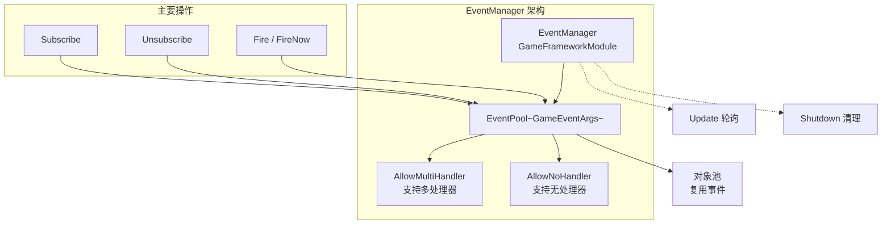
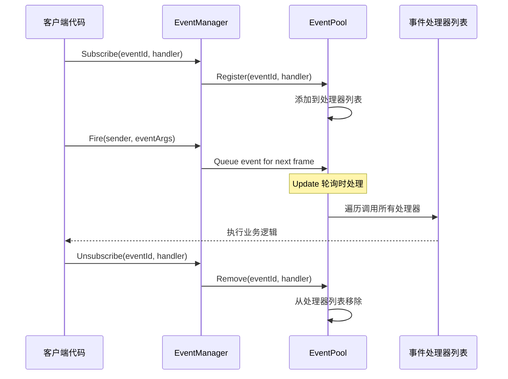
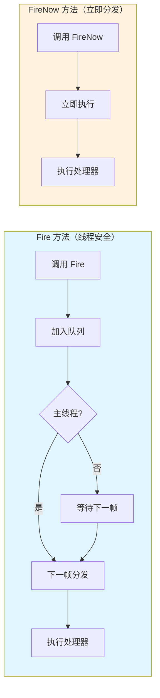

# EventManager

EventManager 是 GameFrameX 事件系统的核心管理器，负责游戏事件的订阅、取消订阅和派发管理。它基于 EventPool 实现，支持线程安全的事件分发和多处理器模式。

## 概述

EventManager 是 GameFrameX 事件系统的核心组件，继承自 `GameFrameworkModule` 并实现了 `IEventManager` 接口。它提供了一个强大的事件系统，允许游戏中的不同模块通过事件进行松耦合的通信。

EventManager 的核心功能包括：
- **事件订阅与取消订阅**：通过事件 ID 注册或移除事件处理函数
- **事件派发**：支持线程安全的延迟分发（`Fire`）和立即分发（`FireNow`）两种模式
- **事件统计**：提供当前已订阅的事件处理函数数量和事件数量查询
- **默认处理器**：支持设置默认事件处理函数来捕获未明确订阅的事件

> **注意**：EventManager 通常通过 EventComponent 在 Unity 场景中使用。EventComponent 是 EventManager 的 Unity 组件封装，提供了更友好的 Unity 集成接口。
> 
> 有关 EventComponent 的详细信息，请参阅 [EventComponent](./05.event-component.md) 文档。
> 
> 有关 GameEventArgs 的详细信息，请参阅 [GameEventArgs](./07.game-event-args.md) 文档。

## 架构

EventManager 基于事件池（EventPool）实现，这是一种高效的事件管理模式。EventPool 支持以下特性：



### 设计模式

EventManager 采用以下设计模式：

| 模式 | 应用 | 优势 |
|------|------|------|
| **对象池模式** | EventPool 复用 GameEventArgs | 减少 GC，优化性能 |
| **观察者模式** | Subscribe/Publish 机制 | 解耦事件发布者和订阅者 |
| **延迟执行模式** | Fire 延迟到下一帧分发 | 保证线程安全 |

## 核心流程

### 事件订阅与派发流程



### 事件分发模式对比



## 使用示例

### 基本使用

```csharp
// 定义自定义事件参数
public class PlayerDeathEventArgs : GameEventArgs
{
    public int PlayerId { get; set; }
    public string Reason { get; set; }
    public override void Clear()
    {
        PlayerId = 0;
        Reason = string.Empty;
    }
}

// 订阅事件
EventComponent eventComponent = UnityEngine.Object.FindObjectOfType<EventComponent>();
eventComponent.CheckSubscribe("player_death", OnPlayerDeath);

// 事件处理函数
private void OnPlayerDeath(object sender, GameEventArgs e)
{
    var args = (PlayerDeathEventArgs)e;
    UnityEngine.Debug.Log($"玩家 {args.PlayerId} 死亡: {args.Reason}");
}

// 抛出事件
eventComponent.Fire(this, new PlayerDeathEventArgs 
{ 
    PlayerId = 1001, 
    Reason = "被怪物击杀" 
});

// 取消订阅
eventComponent.Unsubscribe("player_death", OnPlayerDeath);
```
> Source: [EventManager.cs](https://github.com/GameFrameX/com.gameframex.unity.event/blob/main/Runtime/Event/EventManager.cs#L98-L101)

### 使用空事件（无需数据）

```csharp
// 订阅简单事件（无需携带数据）
eventComponent.CheckSubscribe("game_start", OnGameStart);

// 抛出简单事件
eventComponent.Fire(this, "game_start");

// 事件处理函数
private void OnGameStart(object sender, GameEventArgs e)
{
    UnityEngine.Debug.Log("游戏开始！");
}
```
> Source: [EventComponent.cs](https://github.com/GameFrameX/com.gameframex.unity.event/blob/main/Runtime/EventComponent.cs#L140-L144)

### 设置默认处理器

```csharp
// 设置默认处理器捕获所有未明确订阅的事件
eventComponent.SetDefaultHandler(OnDefaultEvent);

// 默认事件处理函数
private void OnDefaultEvent(object sender, GameEventArgs e)
{
    UnityEngine.Debug.Log($"收到未处理事件: {e.Id}");
}
```
> Source: [EventManager.cs](https://github.com/GameFrameX/com.gameframex.unity.event/blob/main/Runtime/Event/EventManager.cs#L117-L120)

## API 参考

### 属性

#### `EventHandlerCount`

```csharp
public int EventHandlerCount { get; }
```

获取已订阅的事件处理函数的总数量。

**返回值：** 事件处理函数的数量。

---

#### `EventCount`

```csharp
public int EventCount { get; }
```

获取已订阅的事件类型数量（不同事件 ID 的数量）。

**返回值：** 事件类型的数量。

---

### 方法

#### `Count`

```csharp
public int Count(string id)
```

获取指定事件 ID 的事件处理函数数量。

**参数：**
- `id` (string): 事件类型编号

**返回值：** 指定事件 ID 的事件处理函数数量。

> Source: [EventManager.cs#L77-L80](https://github.com/GameFrameX/com.gameframex.unity.event/blob/main/Runtime/Event/EventManager.cs#L77-L80)

---

#### `Check`

```csharp
public bool Check(string id, EventHandler<GameEventArgs> handler)
```

检查是否存在指定的事件处理函数。

**参数：**
- `id` (string): 事件类型编号
- `handler` (EventHandler<GameEventArgs>): 要检查的事件处理函数

**返回值：** 是否存在指定的事件处理函数。

> Source: [EventManager.cs#L88-L91](https://github.com/GameFrameX/com.gameframex.unity.event/blob/main/Runtime/Event/EventManager.cs#L88-L91)

---

#### `Subscribe`

```csharp
public void Subscribe(string id, EventHandler<GameEventArgs> handler)
```

订阅指定事件 ID 的事件处理函数。

**参数：**
- `id` (string): 事件类型编号
- `handler` (EventHandler<GameEventArgs>): 要订阅的事件处理函数

**说明：** 
- 同一个事件 ID 可以订阅多个处理函数
- 事件触发时，所有订阅的处理函数都会被调用

> Source: [EventManager.cs#L98-L101](https://github.com/GameFrameX/com.gameframex.unity.event/blob/main/Runtime/Event/EventManager.cs#L98-L101)

---

#### `Unsubscribe`

```csharp
public void Unsubscribe(string id, EventHandler<GameEventArgs> handler)
```

取消订阅指定事件 ID 的事件处理函数。

**参数：**
- `id` (string): 事件类型编号
- `handler` (EventHandler<GameEventArgs>): 要取消订阅的事件处理函数

**说明：** 如果事件处理函数不存在，则不会执行任何操作。

> Source: [EventManager.cs#L108-L111](https://github.com/GameFrameX/com.gameframex.unity.event/blob/main/Runtime/Event/EventManager.cs#L108-L111)

---

#### `SetDefaultHandler`

```csharp
public void SetDefaultHandler(EventHandler<GameEventArgs> handler)
```

设置默认事件处理函数。

**参数：**
- `handler` (EventHandler<GameEventArgs>): 要设置的默认事件处理函数

**说明：** 默认事件处理函数会在事件没有找到对应的订阅处理器时被调用。

> Source: [EventManager.cs#L117-L120](https://github.com/GameFrameX/com.gameframex.unity.event/blob/main/Runtime/Event/EventManager.cs#L117-L120)

---

#### `Fire`

```csharp
public void Fire(object sender, GameEventArgs e)
```

抛出事件（线程安全模式）。

**参数：**
- `sender` (object): 事件发送者
- `e` (GameEventArgs): 事件参数

**说明：** 
- 此方法是线程安全的
- 即使在非主线程中调用，也会保证在主线程中回调事件处理函数
- 事件会在抛出后的下一帧分发

> Source: [EventManager.cs#L127-L130](https://github.com/GameFrameX/com.gameframex.unity.event/blob/main/Runtime/Event/EventManager.cs#L127-L130)

---

#### `FireNow`

```csharp
public void FireNow(object sender, GameEventArgs e)
```

抛出事件（立即模式）。

**参数：**
- `sender` (object): 事件发送者
- `e` (GameEventArgs): 事件参数

**说明：** 
- 此方法不是线程安全的
- 事件会立刻分发，立即调用所有订阅的处理函数
- 仅在确定调用线程安全的情况下使用

> Source: [EventManager.cs#L137-L140](https://github.com/GameFrameX/com.gameframex.unity.event/blob/main/Runtime/Event/EventManager.cs#L137-L140)

---

## 线程安全性

EventManager 提供了两种事件分发模式以满足不同的需求：

| 方法 | 线程安全 | 分发时机 | 适用场景 |
|------|----------|----------|----------|
| `Fire` | ✅ 安全 | 下一帧 | 跨线程事件、后端通知前端 |
| `FireNow` | ❌ 不安全 | 立即 | 同一线程内同步逻辑 |

**最佳实践：**
- 在子线程中触发事件时使用 `Fire`，确保回调在主线程执行
- 在主线程中需要立即响应时使用 `FireNow`
- 避免在 `FireNow` 的事件处理函数中进行耗时操作

## 性能优化建议

1. **使用对象池**：自定义事件类应继承 `GameEventArgs` 并实现对象池接口，避免频繁创建对象
2. **及时取消订阅**：不再需要的事件应及时取消订阅，减少遍历开销
3. **使用 `CheckSubscribe`**：推荐使用 `CheckSubscribe` 方法自动处理重复订阅问题
4. **避免频繁派发**：对于高频事件（如每帧更新），考虑合并或节流

## 相关链接

- [EventComponent](./05.event-component.md) - Unity 组件封装
- [GameEventArgs](./07.game-event-args.md) - 事件参数基类
- [核心概念：事件系统架构](../04.features.md) - 了解更多设计原理
- [快速入门](../03.getting-started.md) - 开始使用事件系统
