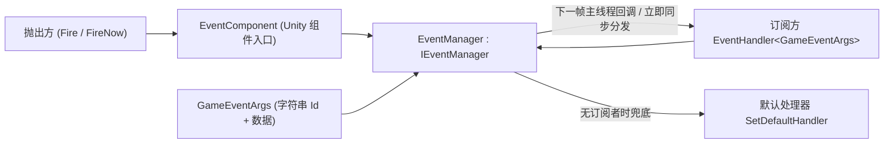

# 包概览:GameFrameX Event 是什么

GameFrameX Event(包名 `com.gameframex.unity.event`)是 GameFrameX 框架中的事件系统组件:一个基于**字符串 ID** 的事件总线,用于模块间解耦通信。它支持线程安全的延迟分发(`Fire`,下一帧在主线程回调)、立即分发(`FireNow`),并可用默认处理器兜底未订阅的事件;本包无任何依赖包。

它提供的能力:

- 基于字符串 ID 的事件订阅 / 取消订阅
- `Fire` — 线程安全的延迟分发(下一帧主线程回调)
- `FireNow` — 立即同步分发
- `Fire(sender, eventId)` — 无需自定义事件参数的快捷方式
- `Check` / `CheckSubscribe` / `CheckUnsubscribe` — 检查存在性、不存在时自动订阅、存在时安全取消订阅
- `Count` / `EventHandlerCount` / `EventCount` — 处理函数统计
- 默认处理器兜底未订阅事件

## 快速开始

1. 安装包(任选其一):编辑 Unity 项目的 `Packages/manifest.json`,添加 scoped registry 并声明依赖;或直接在 `dependencies` 节点下添加 Git URL;也可在 Unity `Package Manager` 中用 Git URL 添加,或把仓库下载后放进 `Packages` 目录。

   ```json
   {
     "scopedRegistries": [
       {
         "name": "GameFrameX",
         "url": "https://gameframex.upm.alianblank.uk",
         "scopes": [
           "com.gameframex"
         ]
       }
     ],
     "dependencies": {
       "com.gameframex.unity.event": "1.1.1"
     }
   }
   ```

   Source: [README.zh-CN.md](https://github.com/GameFrameX/com.gameframex.unity.event/blob/main/README.zh-CN.md#L42-L67)

2. 定义自定义事件参数类,继承 `GameEventArgs`,用 `Id` 返回字符串事件 ID,并配合引用池复用:

   ```csharp
   public class LevelUpEventArgs : GameEventArgs
   {
       public override string Id => "level_up";
       public int Level { get; private set; }

       public static LevelUpEventArgs Create(int level)
       {
           var args = ReferencePool.Acquire<LevelUpEventArgs>();
           args.Level = level;
           return args;
       }

       public override void Clear()
       {
           base.Clear();
           Level = 0;
       }
   }
   ```

   Source: [README.zh-CN.md](https://github.com/GameFrameX/com.gameframex.unity.event/blob/main/README.zh-CN.md#L75-L94)

3. 通过 `EventComponent`(以下示例中的 `eventComponent` 为该组件的引用)订阅和取消订阅:

   ```csharp
   eventComponent.Subscribe("level_up", OnLevelUp);
   eventComponent.Unsubscribe("level_up", OnLevelUp);

   void OnLevelUp(object sender, GameEventArgs e)
   {
       var args = (LevelUpEventArgs)e;
       Debug.Log($"升级到 {args.Level} 级");
   }
   ```

   Source: [README.zh-CN.md](https://github.com/GameFrameX/com.gameframex.unity.event/blob/main/README.zh-CN.md#L99-L107)

4. 抛出事件——延迟模式(线程安全,下一帧主线程回调)、立即模式(仅限主线程)、快捷方式(无需自定义参数)三种任选:

   ```csharp
   eventComponent.Fire(this, LevelUpEventArgs.Create(5));      // 延迟模式
   eventComponent.FireNow(this, LevelUpEventArgs.Create(5));   // 立即模式
   eventComponent.Fire(this, "level_up");                      // 快捷方式
   ```

   Source: [README.zh-CN.md](https://github.com/GameFrameX/com.gameframex.unity.event/blob/main/README.zh-CN.md#L122-L140)

5. (可选)设置默认处理器,兜底未被任何处理器订阅的事件:

   ```csharp
   eventComponent.SetDefaultHandler(OnDefaultEvent);

   void OnDefaultEvent(object sender, GameEventArgs e)
   {
       Debug.Log($"未处理的事件: {e.Id}");
   }
   ```

   Source: [README.zh-CN.md](https://github.com/GameFrameX/com.gameframex.unity.event/blob/main/README.zh-CN.md#L142-L151)

常用 API(定义在 `IEventManager` 接口上,`EventComponent` 对外暴露同名的调用入口):

| 成员 | 签名 | 说明 |
|------|------|------|
| `EventHandlerCount` | `int { get; }` | 获取事件处理函数的总数量 |
| `EventCount` | `int { get; }` | 获取事件数量 |
| `Count` | `int Count(string id)` | 获取指定事件的处理函数数量 |
| `Check` | `bool Check(string id, EventHandler<GameEventArgs> handler)` | 检查是否存在事件处理函数 |
| `Subscribe` | `void Subscribe(string id, EventHandler<GameEventArgs> handler)` | 订阅事件处理函数 |
| `Unsubscribe` | `void Unsubscribe(string id, EventHandler<GameEventArgs> handler)` | 取消订阅事件处理函数 |
| `CheckUnsubscribe` | `void CheckUnsubscribe(string id, EventHandler<GameEventArgs> handler)` | 检查并取消订阅;handler 不存在时不执行任何操作 |
| `SetDefaultHandler` | `void SetDefaultHandler(EventHandler<GameEventArgs> handler)` | 设置默认事件处理函数 |
| `Fire` | `void Fire(object sender, GameEventArgs e)` | 线程安全的延迟抛出;即使不在主线程抛出,也保证在主线程回调,事件在下一帧分发 |
| `FireNow` | `void FireNow(object sender, GameEventArgs e)` | 立即抛出并同步分发;非线程安全 |

Source: [IEventManager.cs](https://github.com/GameFrameX/com.gameframex.unity.event/blob/main/Runtime/Event/IEventManager.cs#L38-L105)

## 工作原理速览

事件由 `EventComponent`(Unity 组件入口)转交给事件管理器 `EventManager`(`IEventManager` 的实现)统一处理:订阅方按字符串 ID 注册 `EventHandler<GameEventArgs>`,抛出方把携带数据的 `GameEventArgs` 交给事件总线;`Fire` 走线程安全的延迟队列在下一帧主线程分发,`FireNow` 立即同步分发,没有订阅者的事件交给默认处理器兜底。



仓库源码结构一览:

| 路径 | 作用 |
|------|------|
| `Runtime/EventComponent.cs` | Unity 组件入口,对外暴露订阅 / 抛出等调用 |
| `Runtime/Event/EventManager.cs` | 事件管理器实现 |
| `Runtime/Event/IEventManager.cs` | 事件管理器接口(API 契约) |
| `Runtime/EventArgs/GameEventArgs.cs` | 事件参数基类(字符串 `Id`) |
| `Runtime/EventArgs/EmptyEventArgs.cs` | 空事件参数 |
| `Runtime/GameFrameXEventCroppingHelper.cs` | 裁剪(代码裁剪)辅助 |
| `Editor/Inspector/EventComponentInspector.cs` | 编辑器下 `EventComponent` 的 Inspector |

Source: [IEventManager.cs](https://github.com/GameFrameX/com.gameframex.unity.event/blob/main/Runtime/Event/IEventManager.cs#L38-L105)

## 常见错误

- **在非主线程调用 `FireNow`**:`FireNow` 非线程安全,会立即同步分发。跨线程抛事件请改用 `Fire`,它保证在主线程回调(下一帧分发)。
- **子线程抛出 `Fire` 后同帧读取副作用**:`Fire` 是延迟分发,事件在抛出后的**下一帧**才回调,不要在抛出后立刻假设处理器已执行。
- **重复订阅 / 取消订阅不存在的处理器**:用 `Check` 判断存在性,或直接用 `CheckSubscribe`(不存在时才订阅)、`CheckUnsubscribe`(存在时才取消,不存在则不操作)避免异常。
- **忘记让事件参数实现复用**:`GameEventArgs` 配合引用池使用,示例中 `Create` 里 `ReferencePool.Acquire`、`Clear` 里重置字段,抛出后由框架回收复用。

Source: [README.zh-CN.md](https://github.com/GameFrameX/com.gameframex.unity.event/blob/main/README.zh-CN.md#L109-L159)

## 接下来

- 各 API 的详细签名与说明,见 [IEventManager.cs](https://github.com/GameFrameX/com.gameframex.unity.event/blob/main/Runtime/Event/IEventManager.cs#L38-L105) 接口源码。
- 完整使用示例(检查 / 统计 / 默认处理器),见 [README.zh-CN.md](https://github.com/GameFrameX/com.gameframex.unity.event/blob/main/README.zh-CN.md#L71-L159)。
- 官方文档:<https://gameframex.doc.alianblank.com>;更新日志见 [Releases](https://github.com/gameframex/com.gameframex.unity.event/releases)。
