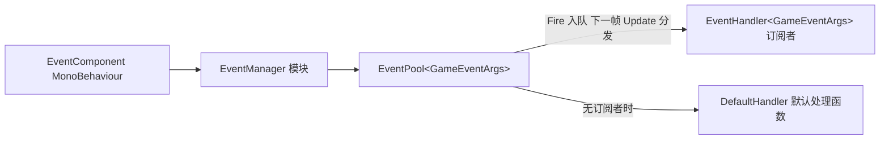

# 工作原理:事件分发与模块生命周期

本页说明 Event 模块内部如何完成一次事件分发，以及 `EventManager` 作为框架模块的初始化、轮询与关闭流程。核心结论：`Fire` 入队、下一帧在 `Update` 中分发（线程安全）；`FireNow` 立即同步分发（非线程安全）；所有转发都经 `EventComponent` → `EventManager` → `EventPool<GameEventArgs>` 三层完成。

## 事件分发流程

一次 `Fire` 的完整路径只有四步：

1. 业务代码调用 `EventComponent.Fire(sender, e)`，组件把请求原样转发给内部的 `IEventManager`（通过 `GameFrameworkEntry.GetModule<IEventManager>()` 获取，见 `EventComponent.Awake`）。
2. `EventManager.Fire` 把事件压入内部的 `EventPool<GameEventArgs>` 队列，**不立即回调任何处理函数**。
3. 框架每帧轮询模块时，`EventManager.Update` 调用 `m_EventPool.Update(elapseSeconds, realElapseSeconds)`，把队列中的事件按入队顺序在**主线程**分发给对应 `id` 的订阅者。
4. 分发完成后事件参数归还引用池（`GameEventArgs` 派生自 `BaseEventArgs`，空事件由 `ReferencePool.Acquire<EmptyEventArgs>()` 创建）。



两层转发的真实代码如下——组件层只做委托，管理器层持有真正的 `EventPool`：

```csharp
public void Fire(object sender, GameEventArgs e)
{
    m_EventManager.Fire(sender, e);
}
```

Source: [EventComponent.cs](https://github.com/GameFrameX/com.gameframex.unity.event/blob/main/Runtime/EventComponent.cs#L147-L150)

```csharp
public sealed class EventManager : GameFrameworkModule, IEventManager
{
    private readonly EventPool<GameEventArgs> m_EventPool;

    public EventManager()
    {
        m_EventPool = new EventPool<GameEventArgs>(EventPoolMode.AllowNoHandler | EventPoolMode.AllowMultiHandler);
    }
```

Source: [EventManager.cs](https://github.com/GameFrameX/com.gameframex.unity.event/blob/main/Runtime/Event/EventManager.cs#L39-L49)

构造时传入的 `EventPoolMode` 标志组合决定了本模块的分发行为：`AllowNoHandler` 允许事件没有任何订阅者时不报错，`AllowMultiHandler` 允许同一 `id` 挂多个处理函数。

## 两种抛出方式的区别

| 方法 | 分发时机 | 线程安全 | 适用场景 |
|------|----------|----------|----------|
| `Fire(sender, e)` | 抛出后的下一帧 | 是（子线程抛出也保证主线程回调） | 常规游戏逻辑事件 |
| `FireNow(sender, e)` | 立即同步分发 | 否（仅主线程调用） | 需要当场拿到回调结果的场景 |
| `Fire(sender, eventId)` | 同 `Fire` | 是 | 无参数事件，内部自动构造 `EmptyEventArgs` |

`Fire(object sender, string eventId)` 重载会校验事件编号非空，并从引用池取一个空事件对象：

```csharp
public void Fire(object sender, string eventId)
{
    GameFrameworkGuard.NotNullOrEmpty(eventId, nameof(eventId));
    m_EventManager.Fire(sender, EmptyEventArgs.Create(eventId));
}
```

Source: [EventComponent.cs](https://github.com/GameFrameX/com.gameframex.unity.event/blob/main/Runtime/EventComponent.cs#L157-L161)

`EmptyEventArgs.Create` 的实现证实了引用池路径：

```csharp
public static EmptyEventArgs Create(string eventId)
{
    var eventArgs = ReferencePool.Acquire<EmptyEventArgs>();
    eventArgs.SetEventId(eventId);
    return eventArgs;
}
```

Source: [EmptyEventArgs.cs](https://github.com/GameFrameX/com.gameframex.unity.event/blob/main/Runtime/EventArgs/EmptyEventArgs.cs#L33-L38)

## 模块生命周期

`EventManager` 继承自 `GameFrameworkModule`，由 `GameFrameworkEntry` 统一驱动。三个关键生命周期节点都只是对 `EventPool` 的透传：

| 生命周期阶段 | 触发方 | EventManager 中的实现 |
|--------------|--------|----------------------|
| 初始化 | 构造函数 | 创建 `EventPool<GameEventArgs>` 并设置 `EventPoolMode` |
| 每帧轮询 | 框架主循环 | `Update` 调用 `m_EventPool.Update(...)` 分发积压事件 |
| 关闭 | 框架关闭流程 | `Shutdown` 调用 `m_EventPool.Shutdown()` 清空订阅与队列 |

```csharp
/// <summary>获取游戏框架模块优先级。</summary>
/// <remarks>优先级较高的模块会优先轮询，并且关闭操作会后进行。</remarks>
protected override int Priority
{
    get { return 7; }
}

protected override void Update(float elapseSeconds, float realElapseSeconds)
{
    m_EventPool.Update(elapseSeconds, realElapseSeconds);
}

protected override void Shutdown()
{
    m_EventPool.Shutdown();
}
```

Source: [EventManager.cs](https://github.com/GameFrameX/com.gameframex.unity.event/blob/main/Runtime/Event/EventManager.cs#L67-L92)

优先级为 **7**：数值越大越早轮询、越晚关闭。同时场景中的 `EventComponent` 带有 `[GameFrameXAutoComponent(-7000)]` 标记，负责把 Unity 侧的 MonoBehaviour 与该模块桥接起来；它在 `Awake` 中通过 `GameFrameworkEntry.GetModule<IEventManager>()` 取得管理器实例，取不到时输出 `Log.Fatal("Event manager is invalid.")`。

```csharp
protected override void Awake()
{
    ImplementationComponentType = Utility.Assembly.GetType(componentType);
    InterfaceComponentType = typeof(IEventManager);
    base.Awake();
    m_EventManager = GameFrameworkEntry.GetModule<IEventManager>();
    if (m_EventManager == null)
    {
        Log.Fatal("Event manager is invalid.");
        return;
    }
}
```

Source: [EventComponent.cs](https://github.com/GameFrameX/com.gameframex.unity.event/blob/main/Runtime/EventComponent.cs#L66-L77)

因此对使用者而言的完整时序是：场景加载 → `EventComponent.Awake` 拿到模块 → 业务在任意时刻 `Subscribe` / `Fire` → 每帧 `Update` 分发 → 退出时 `Shutdown` 清理。

## 订阅与退订的内部行为

订阅、退订、检查均直接操作 `EventPool` 的处理函数表，`EventManager` 本身不保存任何业务状态：

```csharp
public void Subscribe(string id, EventHandler<GameEventArgs> handler)
{
    m_EventPool.Subscribe(id, handler);
}

public void CheckUnsubscribe(string id, EventHandler<GameEventArgs> handler)
{
    if (m_EventPool.Check(id, handler))
    {
        m_EventPool.Unsubscribe(id, handler);
    }
}
```

Source: [EventManager.cs](https://github.com/GameFrameX/com.gameframex.unity.event/blob/main/Runtime/Event/EventManager.cs#L120-L146)

组件层额外提供了防重复订阅的 `CheckSubscribe`——先 `Check` 再 `Subscribe`，避免同一委托被登记两次导致一次 `Fire` 触发多次回调：

```csharp
public void CheckSubscribe(string id, EventHandler<GameEventArgs> handler)
{
    if (!Check(id, handler))
    {
        m_EventManager.Subscribe(id, handler);
    }
}
```

Source: [EventComponent.cs](https://github.com/GameFrameX/com.gameframex.unity.event/blob/main/Runtime/EventComponent.cs#L105-L111)

另外可调用 `SetDefaultHandler(handler)` 设置默认处理函数：当某个事件 `id` 没有任何订阅者时，事件会被交给默认处理函数，常用于调试时追踪"发出去没人接"的事件。`EventManager` 暴露的 `EventHandlerCount` / `EventCount` / `Count(id)` 可在运行时观察队列与订阅规模。

## 事件参数的继承链

```csharp
public abstract class GameEventArgs : BaseEventArgs
{
}
```

Source: [GameEventArgs.cs](https://github.com/GameFrameX/com.gameframex.unity.event/blob/main/Runtime/EventArgs/GameEventArgs.cs#L38-L40)

所有可分发的事件参数都必须继承 `GameEventArgs`（其基类 `BaseEventArgs` 来自 GameFrameX 运行时库，不在本仓库内，`BaseEventArgs` 与 `EventPool` 的完整实现细节源码中未随本仓库提供）。仓库内自带的 `EmptyEventArgs` 用于无参数事件，业务自定义事件同理：继承 `GameEventArgs`、实现 `Id` 与 `Clear`，抛出后由引用池复用以避免 GC。

## 相关链接

- 关于如何在业务代码中订阅与抛出事件，见《如何订阅与抛出事件》任务页（同目录）。
- 组件挂载与 Inspector 信息见 [EventComponent.cs](https://github.com/GameFrameX/com.gameframex.unity.event/blob/main/Runtime/EventComponent.cs) 与 [EventComponentInspector.cs](https://github.com/GameFrameX/com.gameframex.unity.event/blob/main/Editor/Inspector/EventComponentInspector.cs)。
- 管理器完整 API 见 [IEventManager.cs](https://github.com/GameFrameX/com.gameframex.unity.event/blob/main/Runtime/Event/IEventManager.cs) 与 [EventManager.cs](https://github.com/GameFrameX/com.gameframex.unity.event/blob/main/Runtime/Event/EventManager.cs)。
