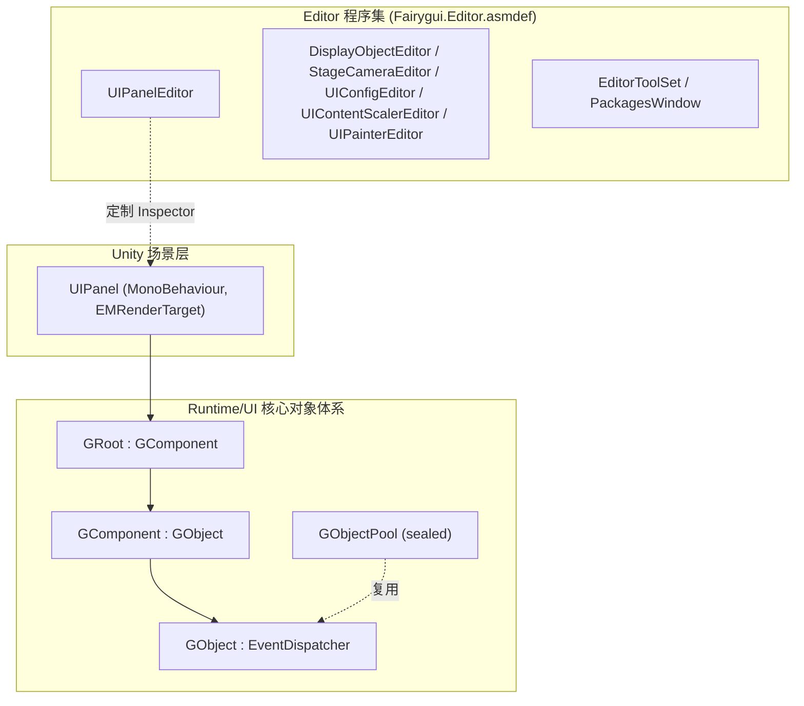

# 工作原理:运行时结构与模块划分

FairyGUI Unity 运行时(包名 `com.gameframex.unity.fairygui.unity`,版本 5.3.5,基于 FairyGUI 官方源码)由两大部分组成:**Runtime** 目录承载纯 C# 的 UI 核心对象体系,**Editor** 目录承载 Unity 编辑器扩展。UI 对象以 `GObject` 为根,通过 `GComponent → GRoot` 逐级组合,最终由 Unity 场景中的 `UIPanel`(MonoBehaviour)挂载呈现。

## 包基本信息

| 项 | 值 |
|------|------|
| 包名 | `com.gameframex.unity.fairygui.unity` |
| 显示名 | FairyGUI |
| 版本 | 5.3.5 |
| 最低 Unity 版本 | 2019.4 |
| Samples | 包内置 Samples 示例(displayName: `Samples`) |

以上信息来自 [package.json](https://github.com/GameFrameX/com.gameframex.unity.fairygui.unity/blob/main/package.json#L2-L10)。

## 目录与模块划分

| 目录/模块 | 内容 | 关键文件示例 |
|------|------|------|
| `Runtime/UI` | UI 对象体系核心:基础对象、组件、根节点、对象池、面板挂载 | [GObject.cs](https://github.com/GameFrameX/com.gameframex.unity.fairygui.unity/blob/main/Runtime/UI/GObject.cs) |
| `Editor` | 编辑器扩展:各组件的 Inspector 定制与工具窗口 | [UIPanelEditor.cs](https://github.com/GameFrameX/com.gameframex.unity.fairygui.unity/blob/main/Editor/UIPanelEditor.cs) |

`Editor` 目录下已确认的编辑器扩展(均位于命名空间 `FairyGUI.Editor`,由独立的 [Fairygui.Editor.asmdef](https://github.com/GameFrameX/com.gameframex.unity.fairygui.unity/blob/main/Editor/Fairygui.Editor.asmdef) 定义程序集边界):

- `DisplayObjectEditor` — 显示对象 Inspector 定制
- `StageCameraEditor` — 舞台相机 Inspector 定制
- `UIConfigEditor` — UI 配置 Inspector 定制
- `UIContentScalerEditor` — 内容缩放设置 Inspector 定制
- `UIPainterEditor` — UI Painter Inspector 定制
- `UIPanelEditor` — `UIPanel` 组件 Inspector 定制
- `EditorToolSet` / `PackagesWindow` — 编辑器工具集与包管理窗口

## UI 对象类层次

运行时 UI 对象全部位于 `Runtime/UI`,继承关系如下(代码为源码原文):

```csharp
public class GObject : EventDispatcher
```

Source: [GObject.cs](https://github.com/GameFrameX/com.gameframex.unity.fairygui.unity/blob/main/Runtime/UI/GObject.cs#L7)

```csharp
public class GComponent : GObject
```

Source: [GComponent.cs](https://github.com/GameFrameX/com.gameframex.unity.fairygui.unity/blob/main/Runtime/UI/GComponent.cs#L14)

```csharp
public class GRoot : GComponent
```

Source: [GRoot.cs](https://github.com/GameFrameX/com.gameframex.unity.fairygui.unity/blob/main/Runtime/UI/GRoot.cs#L10)

```csharp
public sealed class GObjectPool
```

Source: [GObjectPool.cs](https://github.com/GameFrameX/com.gameframex.unity.fairygui.unity/blob/main/Runtime/UI/GObjectPool.cs#L10)

层次含义:

- **`GObject`**:一切 UI 对象的基类,继承自事件分发器 `EventDispatcher`,统一了事件处理。
- **`GComponent`**:容器组件,可承载并管理子 `GObject`,构成组合树的中间层。
- **`GRoot`**:根容器,继承 `GComponent`,是 UI 树的顶层入口。
- **`GObjectPool`**(sealed):对象池,用于 UI 对象的复用。

## Unity 场景挂载:UIPanel

`Runtime` 中的 UI 对象树要呈现到 Unity 场景,需通过 MonoBehaviour 组件 `UIPanel` 挂载到 GameObject 上:

```csharp
[AddComponentMenu("FairyGUI/UI Panel")]
public class UIPanel : MonoBehaviour, EMRenderTarget
```

Source: [UIPanel.cs](https://github.com/GameFrameX/com.gameframex.unity.fairygui.unity/blob/main/Runtime/UI/UIPanel.cs#L25-L27)

要点:

- `UIPanel` 同时实现了 `EMRenderTarget` 接口,使其可作为渲染目标参与框架的渲染链路。
- 菜单路径为 `FairyGUI/UI Panel`,即在 Unity 组件菜单 `Add Component → FairyGUI/UI Panel` 添加。
- 对应的编辑器定制为 `FairyGUI.UIPanelEditor`(`[CustomEditor(typeof(FairyGUI.UIPanel))]`,见 [UIPanelEditor.cs](https://github.com/GameFrameX/com.gameframex.unity.fairygui.unity/blob/main/Editor/UIPanelEditor.cs#L12-L14))。

## 模块结构速览



## 相关链接

- UI 基类实现:[GObject.cs](https://github.com/GameFrameX/com.gameframex.unity.fairygui.unity/blob/main/Runtime/UI/GObject.cs)
- 容器组件:[GComponent.cs](https://github.com/GameFrameX/com.gameframex.unity.fairygui.unity/blob/main/Runtime/UI/GComponent.cs)
- 根容器:[GRoot.cs](https://github.com/GameFrameX/com.gameframex.unity.fairygui.unity/blob/main/Runtime/UI/GRoot.cs)
- Unity 挂载组件:[UIPanel.cs](https://github.com/GameFrameX/com.gameframex.unity.fairygui.unity/blob/main/Runtime/UI/UIPanel.cs)
- 编辑器扩展:[Editor 目录](https://github.com/GameFrameX/com.gameframex.unity.fairygui.unity/blob/main/Editor)
- 包描述文件:[package.json](https://github.com/GameFrameX/com.gameframex.unity.fairygui.unity/blob/main/package.json)
