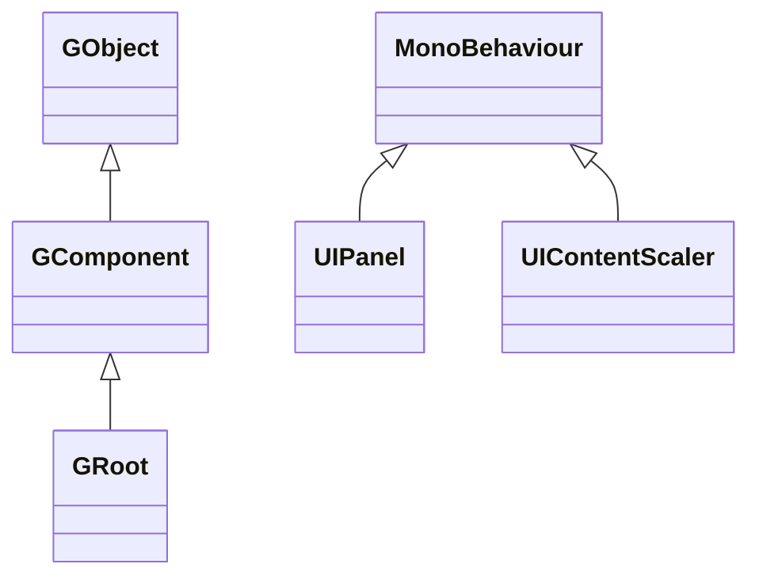

# FairyGUI for Unity 包简介

本包是 [FairyGUI](https://www.fairygui.com/product.html) 在 GameFrameX 下的 Unity 封装版本:FairyGUI 是一个跨平台 UI 编辑器与 UI 框架,本包把它打包为 Unity Package(UPM),并补充了防裁剪、小游戏键盘适配、编辑器快捷菜单等游戏框架集成所需的改动。装好本包后,你就可以用 FairyGUI 编辑器导出的 UI 资源在 Unity 中搭建界面。

## 快速开始

### 1. 安装包

在 Unity 项目的 `Packages/manifest.json` 中添加 `scopedRegistries` 与依赖(四种安装方式任选其一):

```json
{
  "scopedRegistries": [
    {
      "name": "GameFrameX",
      "url": "https://gameframex.upm.alianblank.uk",
      "scopes": [
        "com.gameframex"
      ]
    }
  ],
  "dependencies": {
    "com.gameframex.unity.fairygui.unity": "5.3.3"
  }
}
```

Source: [README.md](https://github.com/GameFrameX/com.gameframex.unity.fairygui.unity/blob/main/README.md#L88-L104)

`scopes` 决定哪些包从这个 registry 解析:只有以 `com.gameframex` 开头的包会从这里拉取。

其他三种方式:

- 直接在 `manifest.json` 的 `dependencies` 中写 Git 地址:`"com.gameframex.unity.fairygui.unity": "https://github.com/gameframex/com.gameframex.unity.fairygui.unity.git"`
- 在 Unity 的 **Package Manager** 中用 **Git URL** 添加:`https://github.com/gameframex/com.gameframex.unity.fairygui.unity.git`
- 把仓库克隆到 Unity 项目的 `Packages` 目录,会自动加载

Source: [README.md](https://github.com/GameFrameX/com.gameframex.unity.fairygui.unity/blob/main/README.md#L108-L115)

### 2. 验证安装

回到 Unity,菜单栏出现 `Tools > FairyGUI` 即安装成功——这是本包新增的编辑器快捷开关入口(用于切换各编译宏)。

### 3. 使用 UI

- 从 [FairyGUI 官网](https://www.fairygui.com/product.html) 下载编辑器并制作 UI,导出资源到 Unity 工程;
- 在场景中通过 `UIPanel`(FairyGUI/UI Panel 组件)挂载界面,或用 `GRoot` 作为 UI 根组件在代码中动态创建;
- 用 `UIContentScaler`(FairyGUI/UI Content Scaler 组件)配置分辨率适配。

本包对 Unity 2019.4 及以上版本可用,无其他依赖包。

## 工作原理速览

包内代码分为三层(Unity Package 标准目录):

| 目录 | 内容 | 关键类型 |
|------|------|----------|
| `Runtime/UI` | 组件层:GObject 组件体系、UIPackage 资源包、UIPanel/UIContentScaler 的 MonoBehaviour 桥接 | `GObject`、`GComponent`、`GRoot`、`GList`、`GButton`、`GLoader`、`UIPanel`、`UIPackage` |
| `Runtime/Core` | 显示层:显示对象、渲染网格、点击检测、混合模式 | `DisplayObject`、`Container`、`Image`、`MeshFactory`、`PixelHitTest` |
| `Editor` | 编辑器扩展:Inspector 扩展、宏开关菜单 | `UIPanelEditor`、`UIConfigEditor`、`EditorToolSet` |

组件层继承关系(源码核实):



- `GObject` 是所有 UI 组件的基类;`GComponent` 是可容纳子对象的容器;`GRoot` 是 UI 树根节点([GObject.cs](https://github.com/GameFrameX/com.gameframex.unity.fairygui.unity/blob/main/Runtime/UI/GObject.cs)、[GComponent.cs](https://github.com/GameFrameX/com.gameframex.unity.fairygui.unity/blob/main/Runtime/UI/GComponent.cs#L14)、[GRoot.cs](https://github.com/GameFrameX/com.gameframex.unity.fairygui.unity/blob/main/Runtime/UI/GRoot.cs#L10))
- `UIPanel` 与 `UIContentScaler` 是挂到 Unity GameObject 上的 `MonoBehaviour`,负责把 FairyGUI 组件树接到 Unity 场景与渲染([UIPanel.cs](https://github.com/GameFrameX/com.gameframex.unity.fairygui.unity/blob/main/Runtime/UI/UIPanel.cs#L26)、[UIContentScaler.cs](https://github.com/GameFrameX/com.gameframex.unity.fairygui.unity/blob/main/Runtime/UI/UIContentScaler.cs#L10))

FairyGUI 自带 `FairyBatching` DrawCall 优化技术,并内置图文混排、emoji 输入、虚拟列表/循环列表、像素级点击检测、弧形 UI、手势、打字机效果等常见 UI 能力;鼠标、单点、多点、VR 控制器等输入被统一封装为同一套交互代码。

## 相对官方版的改动

本包在 FairyGUI 官方 Unity 版基础上做了以下调整([README.md](https://github.com/GameFrameX/com.gameframex.unity.fairygui.unity/blob/main/README.md#L28-L38)):

1. 增加 Unity Package Manager 支持
2. 增加 `FairyGUICroppingHelper` 防裁剪脚本
3. 增加 `link.xml` 裁剪过滤
4. 修复异步 AssetBundle 加载无回调的 bug
5. 增加微信小游戏、抖音小游戏键盘输入适配
6. 增加 `ENABLE_WECHAT_MINI_GAME` 宏(微信小游戏键盘适配,勿与抖音同时开启)
7. 增加 `ENABLE_DOUYIN_MINI_GAME` 宏(抖音小游戏键盘适配,勿与微信同时开启)
8. 增加 Unity 编辑器快捷开关:`Tools > FairyGUI` 对应菜单
9. 增加图片像素化特性

## 相关链接

- [FairyGUI 官方教程](https://www.fairygui.com/docs/guide/index.html)
- [GameFrameX 文档](https://gameframex.doc.alianblank.com)
- [发布记录 / Changelog](https://github.com/GameFrameX/com.gameframex.unity.fairygui.unity/releases)
- 关于像素化特性的开启与参数调整,见 [README.md](https://github.com/GameFrameX/com.gameframex.unity.fairygui.unity/blob/main/README.md#L40-L70)
- QQ 交流群:467608841 / 233840761
