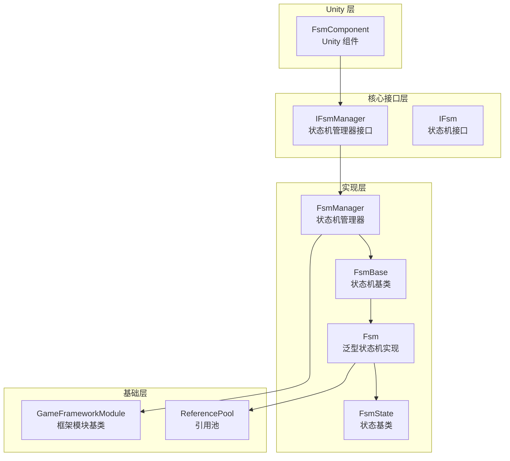
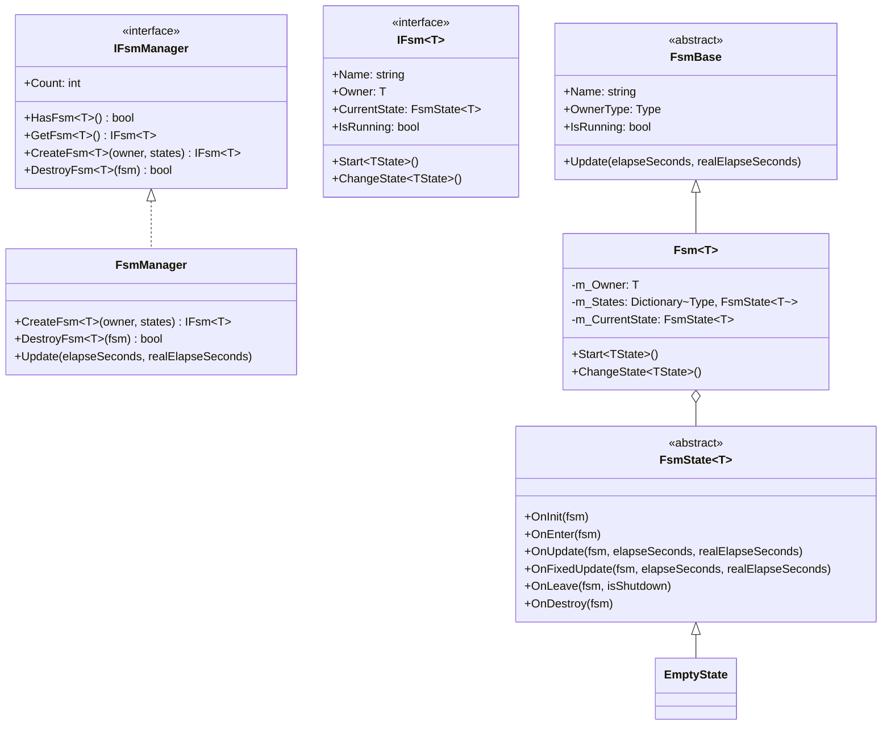
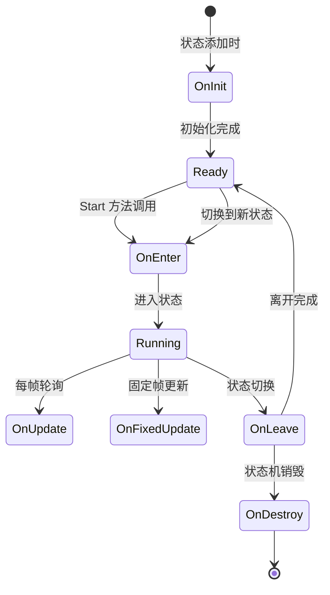
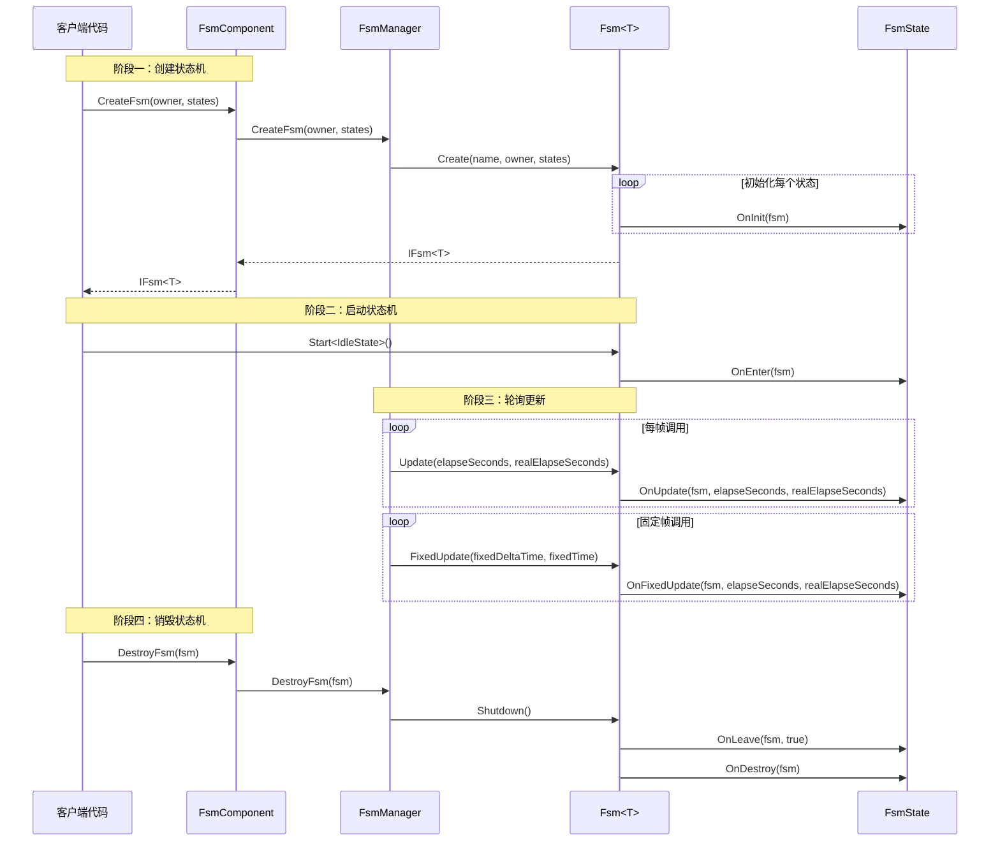

# 概述

GameFrameX 有限状态机（FSM）组件是 GameFrameX 游戏框架的核心模块之一，提供了完整的有限状态机实现，用于管理游戏对象的行为状态转换。该组件基于 Game Framework 开发，支持泛型类型约束，提供了状态生命周期管理、状态数据存储、状态切换等核心功能。

## 项目简介

有限状态机是一种行为设计模式，允许对象在其内部状态改变时改变其行为。FSM 组件将对象的状态封装为独立的状态类，使得状态转换逻辑清晰可控，非常适合处理游戏中的角色行为、AI 状态机 UI 流程控制等场景。

**核心特性：**

- **泛型状态机**：支持任意引用类型作为状态机持有者
- **完整生命周期**：提供状态初始化、进入、更新、固定更新、离开、销毁等回调
- **数据存储**：支持在状态机中存储和检索状态相关数据
- **状态切换**：提供类型安全和灵活的状态切换机制
- **固定帧更新**：支持 FixedUpdate 物理更新
- **对象池集成**：使用引用池技术优化内存分配

## 系统架构

FSM 组件采用分层架构设计，通过接口抽象实现解耦。



**架构说明：**

| 层级 | 组件 | 职责 |
|------|------|------|
| Unity 层 | FsmComponent | 提供 Unity MonoBehaviour 封装，集成到 Unity 生命周期 |
| 核心接口层 | IFsmManager, IFsm | 定义状态机管理和状态机的抽象接口 |
| 实现层 | FsmManager, Fsm, FsmState | 状态机管理器、泛型状态机、状态基类的具体实现 |
| 基础层 | GameFrameworkModule, ReferencePool | 框架基础模块和对象池支持 |

## 核心组件

FSM 组件由以下核心类型组成：



**组件职责：**

| 类型 | 说明 |
|------|------|
| **FsmComponent** | Unity 组件，封装 FsmManager，提供 Editor 和运行时访问 |
| **FsmManager** | 状态机管理器，负责创建、获取、销毁状态机，管理所有状态机实例 |
| **Fsm** | 泛型状态机实现类，管理状态集合、状态数据、状态转换 |
| **FsmState** | 状态基类，定义状态的生命周期回调方法 |
| **FsmBase** | 状态机抽象基类，定义通用属性和方法 |

## 状态生命周期

状态机中的每个状态都有完整的生命周期回调：



**生命周期回调：**

| 回调方法 | 调用时机 | 用途 |
|----------|----------|------|
| `OnInit` | 状态被添加到状态机时 | 初始化状态数据，配置状态参数 |
| `OnEnter` | 进入状态时 | 状态进入逻辑，如播放动画、播放音效 |
| `OnUpdate` | 每帧轮询时 | 状态行为逻辑，条件判断，状态转换检查 |
| `OnFixedUpdate` | 固定帧更新时 | 物理相关逻辑 |
| `OnLeave` | 离开状态时 | 状态退出清理，资源释放 |
| `OnDestroy` | 状态机销毁时 | 最终清理工作 |

## 快速开始

以下是使用 FSM 组件的基本示例：

### 定义状态

首先，定义具体的状态类继承自 `FsmState<T>`：

```csharp
using GameFrameX.Fsm.Runtime;

// 定义角色类作为状态机持有者
public class Character
{
    public string Name;
}

// 空闲状态
public class IdleState : FsmState<Character>
{
    protected internal override void OnEnter(IFsm<Character> fsm)
    {
        base.OnEnter(fsm);
        UnityEngine.Debug.Log("进入空闲状态");
    }

    protected internal override void OnUpdate(IFsm<Character> fsm, float elapseSeconds, float realElapseSeconds)
    {
        base.OnUpdate(fsm, elapseSeconds, realElapseSeconds);
        // 检测是否应该进入移动状态
    }
}

// 移动状态
public class MoveState : FsmState<Character>
{
    protected internal override void OnEnter(IFsm<Character> fsm)
    {
        base.OnEnter(fsm);
        UnityEngine.Debug.Log("进入移动状态");
    }

    protected internal override void OnLeave(IFsm<Character> fsm, bool isShutdown)
    {
        base.OnLeave(fsm, isShutdown);
        UnityEngine.Debug.Log("离开移动状态");
    }
}
```

> Source: [README.md](https://github.com/GameFrameX/com.gameframex.unity.fsm/blob/main/README.md#L43-L78)

### 创建和使用状态机

```csharp
// 创建角色
var character = new Character { Name = "Hero" };

// 通过 FsmComponent 创建状态机
var fsm = fsmComponent.CreateFsm(character,
    new IdleState(),
    new MoveState());

// 启动状态机，从空闲状态开始
fsm.Start<IdleState>();

// 在状态内部切换到另一个状态
// MoveState newState = fsm.GetState<MoveState>();
// newState.ChangeState<MoveState>(fsm);

// 销毁状态机
fsmComponent.DestroyFsm(fsm);
```

> Source: [README.md](https://github.com/GameFrameX/com.gameframex.unity.fsm/blob/main/README.md#L40-L65)

## 核心流程

FSM 组件的工作流程涉及创建、轮询和销毁三个主要阶段：



## 状态数据管理

FSM 组件提供了状态数据存储功能，可以在状态机中保存和检索数据：

```csharp
// 设置数据
fsm.SetData("Health", new VarInt(100));
fsm.SetData("Speed", new VarFloat(5.0f));

// 获取数据
VarInt health = fsm.GetData<VarInt>("Health");
int healthValue = health.Value;

// 检查数据是否存在
if (fsm.HasData("Speed"))
{
    // 数据存在
}

// 移除数据
fsm.RemoveData("Health");
```

> Source: [Fsm.cs](https://github.com/GameFrameX/com.gameframex.unity.fsm/blob/main/Runtime/Fsm/Fsm.cs#L445-L507)

## Unity 集成

FsmComponent 作为 Unity 组件集成到游戏场景中，自动管理状态机的生命周期：

```csharp
[DisallowMultipleComponent]
[AddComponentMenu("Game Framework/FSM")]
public sealed class FsmComponent : GameFrameworkComponent
{
    private IFsmManager m_FsmManager = null;

    protected override void Awake()
    {
        base.Awake();
        m_FsmManager = GameFrameworkEntry.GetModule<IFsmManager>();
    }

    private void FixedUpdate()
    {
        m_FsmManager.FixedUpdate(Time.fixedDeltaTime, Time.fixedTime);
    }
}
```

> Source: [FsmComponent.cs](https://github.com/GameFrameX/com.gameframex.unity.fsm/blob/main/Runtime/Fsm/FsmComponent.cs#L22-L53)

## 相关链接

- [安装指南](./2-installation)
- [快速开始](./3-getting-started)
- [核心概念](./04.features.md)
- [API 参考](./5-api-reference)
- [常见问题](./6-troubleshooting)
- [GitHub 仓库](https://github.com/GameFrameX/com.gameframex.unity.fsm.git)
- [GameFrameX 官方网站](https://gameframex.doc.alianblank.com)
