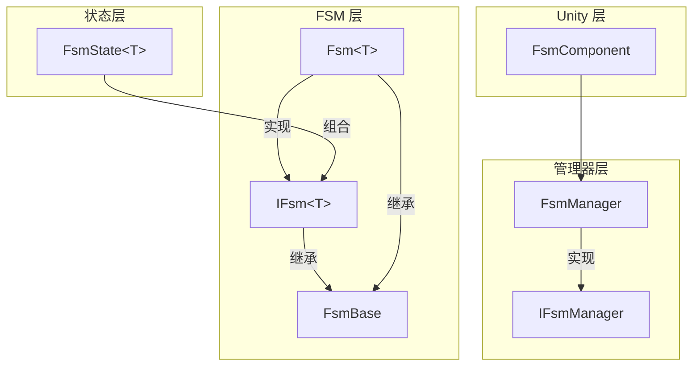
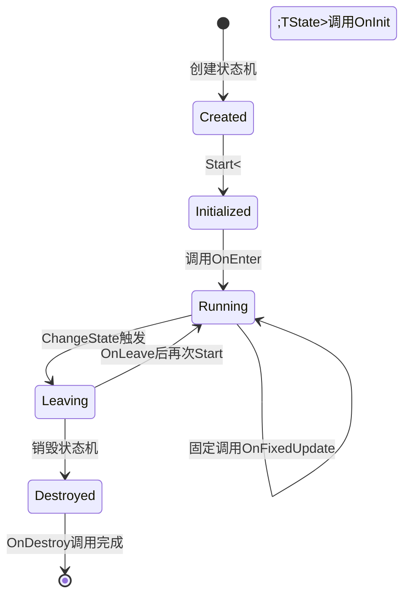
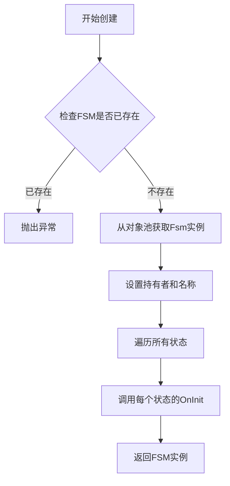

# 核心概念

本文档详细介绍 GameFrameX 有限状态机（FSM）组件的核心概念、架构设计和关键机制。FSM 组件为 Unity 游戏开发提供了健壮的状态管理能力，支持状态生命周期管理、状态转换和数据存储等功能。

## 概述

有限状态机（Finite State Machine，简称 FSM）是一种行为设计模式，它允许对象在有限个状态之间进行切换。在游戏开发中，FSM 广泛应用于 AI 行为管理、游戏流程控制、角色状态切换等场景。

GameFrameX FSM 组件基于 Game Framework 架构设计，提供以下核心能力：

- **泛型状态机** - 支持强类型的状态机定义，编译时类型检查
- **状态生命周期管理** - 完整的状态初始化、进入、更新、离开、销毁回调
- **状态数据存储** - 内置键值对数据存储机制
- **对象池支持** - 自动内存管理和对象复用
- **Unity 组件集成** - 提供 FsmComponent 便于在 Unity 场景中使用

## 系统架构

GameFrameX FSM 采用分层架构设计，从底层到上层依次为：状态层、FSM 层和管理器层。这种分层设计确保了职责分离和代码可维护性。



### 各层职责

**状态层（`FsmState<T>`）** 是状态的具体实现基类。开发者通过继承该类来定义具体的状态，每个状态实现自己的业务逻辑。状态层定义了状态的六个生命周期回调方法，用于响应状态机的各种事件。

**FSM 层（`IFsm<T>` 和 `Fsm<T>`）** 是状态机的核心实现。`IFsm<T>` 接口定义了状态机的所有操作，包括状态查询、状态转换、数据存取等。`Fsm<T>` 是该接口的泛型实现，维护状态集合、当前状态、状态持续时间等运行时数据。

**管理器层（IFsmManager 和 FsmManager）** 负责管理整个系统的 FSM 实例。FsmManager 继承自 GameFrameworkModule，作为游戏框架的一个模块提供服务。它维护所有 FSM 实例的引用，负责创建、查询、销毁和轮询更新。

## 核心组件

### `FsmState<T>` 状态基类

`FsmState<T>` 是所有具体状态的抽象基类。它定义了状态的六个生命周期回调方法，这些方法由状态机在适当的时机自动调用。开发者只需重写需要的方法，无需关注调用时机。

```csharp
public abstract class FsmState<T> where T : class
{
    // 状态初始化时调用
    protected internal virtual void OnInit(IFsm<T> fsm) { }
    
    // 状态进入时调用
    protected internal virtual void OnEnter(IFsm<T> fsm) { }
    
    // 状态每帧更新时调用
    protected internal virtual void OnUpdate(IFsm<T> fsm, float elapseSeconds, float realElapseSeconds) { }
    
    // 状态固定更新时调用（物理相关）
    protected internal virtual void OnFixedUpdate(IFsm<T> fsm, float elapseSeconds, float realElapseSeconds) { }
    
    // 状态离开时调用
    protected internal virtual void OnLeave(IFsm<T> fsm, bool isShutdown) { }
    
    // 状态销毁时调用
    protected internal virtual void OnDestroy(IFsm<T> fsm) { }
    
    // 切换到其他状态
    public void ChangeToState<TState>(IFsm<T> fsm) where TState : FsmState<T>
    protected void ChangeState<TState>(IFsm<T> fsm) where TState : FsmState<T>
}
```

> Source: [FsmState.cs](https://github.com/GameFrameX/com.gameframex.unity.fsm/blob/main/Runtime/Fsm/FsmState.cs#L17-L136)

**设计意图**：使用模板方法模式定义状态的标准行为框架。每个状态只需关注自己的特定逻辑，状态机负责在正确的时机调用正确的方法。这种设计将状态的通用行为抽象到基类，具体行为留给子类实现。

### `IFsm<T>` 状态机接口

`IFsm<T>` 接口定义了状态机的完整操作集合。通过泛型参数 T，状态机可以类型安全地持有任意类型的对象。

```csharp
public interface IFsm<T> where T : class
{
    // 属性
    string Name { get; }
    string FullName { get; }
    T Owner { get; }
    int FsmStateCount { get; }
    bool IsRunning { get; }
    bool IsDestroyed { get; }
    FsmState<T> CurrentState { get; }
    float CurrentStateTime { get; }
    
    // 方法
    void Start<TState>() where TState : FsmState<T>;
    void Start(Type stateType);
    bool HasState<TState>() where TState : FsmState<T>;
    TState GetState<TState>() where TState : FsmState<T>;
    FsmState<T>[] GetAllStates();
    bool HasData(string name);
    TData GetData<TData>(string name) where TData : Variable;
    void SetData<TData>(string name, TData data) where TData : Variable;
    bool RemoveData(string name);
}
```

> Source: [IFsm.cs](https://github.com/GameFrameX/com.gameframex.unity.fsm/blob/main/Runtime/Fsm/IFsm.cs#L18-L179)

**设计意图**：接口隔离原则的典型应用。通过 `IFsm<T>` 接口，状态可以在运行时获取状态机的完整控制权，包括切换状态、存储数据等。这种设计使得状态类可以完全控制状态机的行为。

### FsmManager 状态机管理器

FsmManager 是系统的核心管理器，负责所有 FSM 实例的生命周期管理。

```csharp
public sealed class FsmManager : GameFrameworkModule, IFsmManager
{
    // 创建状态机
    public IFsm<T> CreateFsm<T>(T owner, params FsmState<T>[] states) where T : class;
    public IFsm<T> CreateFsm<T>(string name, T owner, params FsmState<T>[] states) where T : class;
    
    // 获取状态机
    public IFsm<T> GetFsm<T>() where T : class;
    public IFsm<T> GetFsm<T>(string name) where T : class;
    
    // 检查状态机存在
    public bool HasFsm<T>() where T : class;
    
    // 销毁状态机
    public bool DestroyFsm<T>(IFsm<T> fsm) where T : class;
    
    // 轮询更新
    public void FixedUpdate(float fixedDeltaTime, float fixedTime);
}
```

> Source: [FsmManager.cs](https://github.com/GameFrameX/com.gameframex.unity.fsm/blob/main/Runtime/Fsm/FsmManager.cs#L18-L436)

**设计意图**：单例管理器模式在游戏开发中的典型应用。FsmManager 作为游戏框架的一个模块，自动参与游戏框架的初始化和关闭流程。通过 GameFrameworkEntry 获取模块实例，确保模块在系统中全局唯一。

### FsmComponent Unity 组件

FsmComponent 是面向 Unity 引擎的组件封装，提供编辑器友好的状态机管理方式。

```csharp
[DisallowMultipleComponent]
[AddComponentMenu("Game Framework/FSM")]
public sealed class FsmComponent : GameFrameworkComponent
{
    // 所有操作都委托给 m_FsmManager
    private IFsmManager m_FsmManager = null;
    
    protected override void Awake()
    {
        base.Awake();
        m_FsmManager = GameFrameworkEntry.GetModule<IFsmManager>();
    }
    
    private void FixedUpdate()
    {
        m_FsmManager.FixedUpdate(Time.fixedDeltaTime, Time.fixedTime);
    }
}
```

> Source: [FsmComponent.cs](https://github.com/GameFrameX/com.gameframex.unity.fsm/blob/main/Runtime/Fsm/FsmComponent.cs#L22-L53)

**设计意图**：适配器模式的体现。FsmComponent 将底层的 FsmManager 功能适配为 Unity 组件形式，开发者可以直接在 Unity 编辑器中添加和管理状态机组件，无需手动编写初始化代码。

## 状态生命周期

理解状态的六个生命周期回调是正确使用 FSM 的关键。每个回调都有其特定的设计目的和调用时机。



### 生命周期详解

**OnInit - 初始化阶段**

当状态机创建时，所有状态都会调用一次 OnInit 方法。此时状态机尚未启动，当前状态为 null。这个阶段适合进行状态的静态初始化，例如缓存其他状态的引用。

```csharp
protected internal override void OnInit(IFsm<Character> fsm)
{
    // 缓存常驻状态引用
    var idleState = fsm.GetState<IdleState>();
    var runState = fsm.GetState<RunState>();
    // ...
}
```

**OnEnter - 进入阶段**

当状态被设置为当前状态时调用。在状态转换完成后、新状态开始执行前调用。适合执行状态的进入逻辑，如播放动画、设置参数等。

```csharp
protected internal override void OnEnter(IFsm<Character> fsm)
{
    // 播放进入动画
    Owner.PlayAnimation("Idle");
    // 重置状态数据
    fsm.SetData("AttackCount", 0);
}
```

**OnUpdate - 更新阶段**

每帧调用一次，接收逻辑流逝时间（elapseSeconds）和真实流逝时间（realElapseSeconds）。适合放置需要每帧执行的逻辑，如输入检测、AI 决策等。

```csharp
protected internal override void OnUpdate(IFsm<Character> fsm, float elapseSeconds, float realElapseSeconds)
{
    // 检测是否需要切换状态
    if (fsm.GetData<bool>("IsHurt"))
    {
        ChangeState<HurtState>(fsm);
    }
}
```

**OnFixedUpdate - 固定更新阶段**

与 OnUpdate 类似，但按照固定时间间隔调用，适合物理相关的逻辑。

**OnLeave - 离开阶段**

当状态即将离开时调用。参数 isShutdown 表示是正常状态转换（false）还是状态机关闭（true）。适合执行清理工作，如停止动画、保存状态等。

```csharp
protected internal override void OnLeave(IFsm<Character> fsm, bool isShutdown)
{
    // 保存状态数据
    var attackCount = fsm.GetData<int>("AttackCount");
    // 停止当前动画
    Owner.StopAnimation();
}
```

**OnDestroy - 销毁阶段**

当状态机被销毁时调用。这是状态的最后一个生命周期回调，适合执行最终的清理工作，释放所有资源。

## 状态转换机制

状态转换是 FSM 的核心功能。`FsmState<T>` 提供了三种切换状态的方法，适用于不同的使用场景。

```mermaid
sequenceDiagram
    participant StateA as 当前状态
    participant FSM as Fsm<T>
    participant StateB as 目标状态
    
    StateA->>FSM: OnUpdate 检测转换条件
    StateA->>FSM: ChangeState&lt;TargetState&gt;(fsm)
    FSM->>StateA: OnLeave(this, false)
    FSM->>FSM: 重置 CurrentStateTime
    FSM->>FSM: 更新 CurrentState
    FSM->>StateB: OnEnter(this)
```

### 状态转换方法

**公开方法（公开给外部调用者）**

```csharp
// 在 FsmState 内部调用
public void ChangeToState<TState>(IFsm<T> fsm) where TState : FsmState<T>
```

> Source: [FsmState.cs](https://github.com/GameFrameX/com.gameframex.unity.fsm/blob/main/Runtime/Fsm/FsmState.cs#L84-L93)

此方法允许从状态内部触发状态转换。它首先调用旧状态的 OnLeave 方法，然后更新当前状态引用，最后调用新状态的 OnEnter 方法。

**受保护方法（供子类调用）**

```csharp
// 供子类在 OnUpdate 等方法中调用
protected void ChangeState<TState>(IFsm<T> fsm) where TState : FsmState<T>
```

这是最常用的状态切换方式。开发者通常在 OnUpdate 方法中检测转换条件，然后调用此方法切换到下一个状态。

**类型参数方法**

```csharp
// 通过 Type 对象切换状态
protected void ChangeState(IFsm<T> fsm, Type stateType)
```

适用于需要动态决定目标状态类型的场景，如根据配置表或运行时数据选择状态。

## 状态数据存储

FSM 提供了内置的键值对数据存储机制，允许在状态机和状态之间共享数据。这一设计避免了使用全局变量或额外的数据传递机制。

### 数据存储接口

```csharp
// 检查数据是否存在
bool HasData(string name);

// 获取数据
TData GetData<TData>(string name) where TData : Variable;
Variable GetData(string name);

// 设置数据
void SetData<TData>(string name, TData data) where TData : Variable;
void SetData(string name, Variable data);

// 移除数据
bool RemoveData(string name);
```

> Source: [IFsm.cs](https://github.com/GameFrameX/com.gameframex.unity.fsm/blob/main/Runtime/Fsm/IFsm.cs#L136-L178)

### 使用示例

```csharp
// 存储数据
fsm.SetData("Score", new Variable<int>(100));
fsm.SetData("PlayerName", new Variable<string>("Hero"));

// 读取数据
var score = fsm.GetData<Variable<int>>("Score");
var playerName = fsm.GetData<Variable<string>>("PlayerName");

// 检查存在
if (fsm.HasData("Power"))
{
    var power = fsm.GetData<Variable<int>>("Power");
}
```

**设计意图**：使用 Variable 包装原始类型，实现更灵活的数据存储。通过 ReferencePool，数据对象可以在使用完毕后回收再利用，减少垃圾回收压力。

## 状态机创建流程

创建状态机是使用 FSM 的第一步。理解创建流程有助于正确初始化状态机。



### 创建代码示例

```csharp
// 方式1：不指定名称
IFsm<Character> fsm = FsmManager.Instance.CreateFsm(character,
    new IdleState(),
    new RunState(),
    new JumpState(),
    new AttackState());

// 方式2：指定名称（用于同一类型多个FSM）
IFsm<Character> fsm = FsmManager.Instance.CreateFsm("PlayerFSM", character,
    new IdleState(),
    new RunState(),
    new JumpState(),
    new AttackState());

// 方式3：使用List
var states = new List<FsmState<Character>>
{
    new IdleState(),
    new RunState(),
    new JumpState()
};
IFsm<Character> fsm = FsmManager.Instance.CreateFsm(character, states);

// 启动状态机
fsm.Start<IdleState>();
```

> Source: [FsmManager.cs](https://github.com/GameFrameX/com.gameframex.unity.fsm/blob/main/Runtime/Fsm/FsmManager.cs#L268-L325)

**重要提示**：创建状态机时必须至少添加一个状态，否则会抛出异常。状态机创建后需要显式调用 Start 方法才能启动。

## 内存管理

GameFrameX FSM 组件采用对象池技术进行内存优化，减少游戏运行时的垃圾回收压力。

### 对象池机制

FSM 实例和状态数据都通过 ReferencePool 进行管理：

```csharp
// 创建时从对象池获取
Fsm<T> fsm = ReferencePool.Acquire<Fsm<T>>();

// 销毁时返回对象池
internal override void Shutdown()
{
    ReferencePool.Release(this);
}
```

> Source: [Fsm.cs](https://github.com/GameFrameX/com.gameframex.unity.fsm/blob/main/Runtime/Fsm/Fsm.cs#L123-L145)

### 清理流程

```csharp
public void Clear()
{
    // 1. 调用当前状态的 OnLeave（shutdown 为 true）
    if (m_CurrentState != null)
    {
        m_CurrentState.OnLeave(this, true);
    }
    
    // 2. 调用所有状态的 OnDestroy
    foreach (KeyValuePair<Type, FsmState<T>> state in m_States)
    {
        state.Value.OnDestroy(this);
    }
    
    // 3. 清理数据（返回对象池）
    if (m_Datas != null)
    {
        foreach (KeyValuePair<string, Variable> data in m_Datas)
        {
            ReferencePool.Release(data.Value);
        }
    }
    
    // 4. 释放 FSM 实例到对象池
    ReferencePool.Release(this);
}
```

> Source: [Fsm.cs](https://github.com/GameFrameX/com.gameframex.unity.fsm/blob/main/Runtime/Fsm/Fsm.cs#L193-L227)

**设计意图**：正确的资源清理对于长时间运行的游戏至关重要。FSM 在清理时会遍历调用所有状态的销毁回调，确保资源被正确释放。同时，通过对象池复用对象，避免频繁的内存分配和垃圾回收。

## 使用场景与最佳实践

### 典型使用场景

**角色 AI 状态管理**

FSM 最典型的应用场景是角色 AI 行为控制。每个行为状态（待机、巡逻、追击、攻击、撤退等）对应一个 FsmState 子类，状态机负责管理状态之间的转换逻辑。

```csharp
// 角色状态机示例
public class CharacterAI : MonoBehaviour
{
    private IFsm<Character> _fsm;
    
    void Start()
    {
        _fsm = FsmManager.Instance.CreateFsm(this,
            new IdleState(),
            new PatrolState(),
            new ChaseState(),
            new AttackState());
        _fsm.Start<IdleState>();
    }
    
    void Update()
    {
        // FsmManager 会自动调用 Update
    }
}
```

**游戏流程控制**

FSM 也可用于管理游戏整体流程，如主菜单、开始游戏、暂停、结算等状态的切换。

**UI 界面状态管理**

复杂的 UI 界面可以使用 FSM 管理不同的显示状态，确保状态切换的有序进行。

### 最佳实践

**1. 状态数量控制**

建议每个 FSM 管理的状态数量控制在 10 个以内。如果状态过多，考虑拆分多个 FSM。

**2. 状态职责单一**

每个状态应该只负责一种行为逻辑。复杂逻辑应该分解为多个状态。

**3. 避免在 OnUpdate 中进行大量计算**

OnUpdate 每帧都会被调用，应该保持轻量。复杂的计算应该安排在其他时机。

**4. 正确实现状态转换条件**

状态转换条件应该清晰明确，避免条件重叠导致的状态不确定性问题。

**5. 及时销毁不需要的 FSM**

当不再需要状态机时，应该调用 DestroyFsm 方法释放资源。

```csharp
// 销毁状态机
FsmManager.Instance.DestroyFsm(fsm);
```

## 相关链接

- [快速开始](./3-getting-started) - 快速上手 FSM 组件
- [API 参考](./5-api-reference) - 完整的 API 文档
- [安装指南](./2-installation) - 安装和配置 FSM 组件
- [常见问题](./6-troubleshooting) - 常见问题解答
