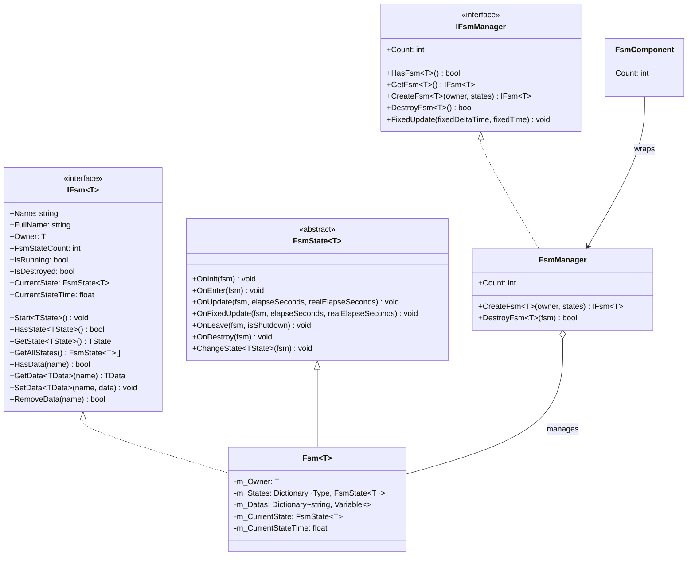

# API 参考

本文档详细列出了 GameFrameX Unity FSM 有限状态机系统的完整 API 接口、类和方法。

## 概述

FSM（有限状态机）模块提供了功能完善的游戏状态管理能力，支持：
- 泛型类型安全的有限状态机实现
- 状态生命周期管理（初始化、进入、更新、离开、销毁）
- 状态间数据共享机制
- Unity 组件集成

## 核心接口

### IFsm<T>

有限状态机接口，定义状态机的核心操作。

> Source: [IFsm.cs](https://github.com/GameFrameX/com.gameframex.unity.fsm/blob/main/Runtime/Fsm/IFsm.cs#L18-L179)

#### 属性

| 属性 | 类型 | 描述 |
|------|------|------|
| `Name` | `string` | 获取有限状态机名称 |
| `FullName` | `string` | 获取有限状态机完整名称（包含持有者类型和名称） |
| `Owner` | `T` | 获取有限状态机持有者对象 |
| `FsmStateCount` | `int` | 获取有限状态机中状态的数量 |
| `IsRunning` | `bool` | 获取有限状态机是否正在运行 |
| `IsDestroyed` | `bool` | 获取有限状态机是否已被销毁 |
| `CurrentState` | `FsmState<T>` | 获取当前有限状态机状态 |
| `CurrentStateTime` | `float` | 获取当前状态已持续的时间（秒） |

#### 方法

**Start**

```csharp
void Start<TState>() where TState : FsmState<T>
void Start(Type stateType)
```

开始有限状态机，进入指定状态。

**HasState**

```csharp
bool HasState<TState>() where TState : FsmState<T>
bool HasState(Type stateType)
```

检查指定状态是否存在。

**GetState**

```csharp
TState GetState<TState>() where TState : FsmState<T>
FsmState<T> GetState(Type stateType)
```

获取指定类型的状态实例。

**GetAllStates**

```csharp
FsmState<T>[] GetAllStates()
void GetAllStates(List<FsmState<T>> results)
```

获取有限状态机的所有状态。

**数据操作**

```csharp
bool HasData(string name)
TData GetData<TData>(string name) where TData : Variable
Variable GetData(string name)
void SetData<TData>(string name, TData data) where TData : Variable
void SetData(string name, Variable data)
bool RemoveData(string name)
```

状态机内部数据存取操作，支持泛型类型的数据存储。

---

### IFsmManager

有限状态机管理器接口，负责管理所有有限状态机实例。

> Source: [IFsmManager.cs](https://github.com/GameFrameX/com.gameframex.unity.fsm/blob/main/Runtime/Fsm/IFsmManager.cs#L16-L184)

#### 属性

| 属性 | 类型 | 描述 |
|------|------|------|
| `Count` | `int` | 获取当前管理的有限状态机数量 |

#### 方法

**HasFsm**

```csharp
bool HasFsm<T>() where T : class
bool HasFsm(Type ownerType)
bool HasFsm<T>(string name) where T : class
bool HasFsm(Type ownerType, string name)
```

检查指定有限状态机是否存在。

**GetFsm**

```csharp
IFsm<T> GetFsm<T>() where T : class
FsmBase GetFsm(Type ownerType)
IFsm<T> GetFsm<T>(string name) where T : class
FsmBase GetFsm(Type ownerType, string name)
```

获取指定的有限状态机实例。

**GetAllFsms**

```csharp
FsmBase[] GetAllFsms()
void GetAllFsms(List<FsmBase> results)
```

获取所有有限状态机。

**CreateFsm**

```csharp
IFsm<T> CreateFsm<T>(T owner, params FsmState<T>[] states) where T : class
IFsm<T> CreateFsm<T>(string name, T owner, params FsmState<T>[] states) where T : class
IFsm<T> CreateFsm<T>(T owner, List<FsmState<T>> states) where T : class
IFsm<T> CreateFsm<T>(string name, T owner, List<FsmState<T>> states) where T : class
```

创建新的有限状态机。

**DestroyFsm**

```csharp
bool DestroyFsm<T>() where T : class
bool DestroyFsm(Type ownerType)
bool DestroyFsm<T>(string name) where T : class
bool DestroyFsm(Type ownerType, string name)
bool DestroyFsm<T>(IFsm<T> fsm) where T : class
bool DestroyFsm(FsmBase fsm)
```

销毁指定的有限状态机。

**FixedUpdate**

```csharp
void FixedUpdate(float fixedDeltaTime, float fixedTime)
```

轮询所有有限状态机的固定更新。

---

## 核心类

### FsmState<T>

有限状态机状态基类，继承此类以创建具体的状态实现。

> Source: [FsmState.cs](https://github.com/GameFrameX/com.gameframex.unity.fsm/blob/main/Runtime/Fsm/FsmState.cs#L17-L136)

#### 生命周期方法

```csharp
protected internal virtual void OnInit(IFsm<T> fsm)
```

状态初始化时调用，可在此进行状态相关数据的初始化。

```csharp
protected internal virtual void OnEnter(IFsm<T> fsm)
```

状态进入时调用，可在此执行进入状态的初始化逻辑。

```csharp
protected internal virtual void OnUpdate(IFsm<T> fsm, float elapseSeconds, float realElapseSeconds)
```

状态轮询时调用，每帧执行，用于状态逻辑更新。

- `elapseSeconds`: 逻辑流逝时间
- `realElapseSeconds`: 真实流逝时间

```csharp
protected internal virtual void OnFixedUpdate(IFsm<T> fsm, float elapseSeconds, float realElapseSeconds)
```

状态固定轮询时调用，使用固定时间步长更新。

```csharp
protected internal virtual void OnLeave(IFsm<T> fsm, bool isShutdown)
```

状态离开时调用。

- `isShutdown`: 是否是关闭整个状态机时触发

```csharp
protected internal virtual void OnDestroy(IFsm<T> fsm)
```

状态销毁时调用，用于清理资源。

#### 状态切换方法

```csharp
public void ChangeToState<TState>(IFsm<T> fsm) where TState : FsmState<T>
protected void ChangeState<TState>(IFsm<T> fsm) where TState : FsmState<T>
protected void ChangeState(IFsm<T> fsm, Type stateType)
```

切换到指定状态。

---

### FsmComponent

Unity 组件，集成到 Unity 场景中的状态机管理器。

> Source: [FsmComponent.cs](https://github.com/GameFrameX/com.gameframex.unity.fsm/blob/main/Runtime/Fsm/FsmComponent.cs#L22-L268)

FsmComponent 是 Unity GameObject 组件，提供与 IFsmManager 相同的 API 接口，可直接在 Unity 编辑器中使用。

#### 属性

| 属性 | 类型 | 描述 |
|------|------|------|
| `Count` | `int` | 获取当前管理的有限状态机数量 |

#### 方法

FsmComponent 提供了与 IFsmManager 完全一致的方法集合：

- `HasFsm<T>()`, `HasFsm(Type)`, `HasFsm<T>(string)`, `HasFsm(Type, string)`
- `GetFsm<T>()`, `GetFsm(Type)`, `GetFsm<T>(string)`, `GetFsm(Type, string)`
- `GetAllFsmList()`, `GetAllFsmList(List<FsmBase>)`
- `CreateFsm<T>(T, params FsmState<T>[])`, `CreateFsm<T>(string, T, params FsmState<T>[])`
- `CreateFsm<T>(T, List<FsmState<T>>)`, `CreateFsm<T>(string, T, List<FsmState<T>>)`
- `DestroyFsm<T>()`, `DestroyFsm(Type)`, `DestroyFsm<T>(string)`, `DestroyFsm(Type, string)`
- `DestroyFsm<T>(IFsm<T>)`, `DestroyFsm(FsmBase)`

---

## 数据类型

### Variable

有限状态机中使用的数据基类。

> Source: [IFsm.cs](https://github.com/GameFrameX/com.gameframex.unity.fsm/blob/main/Runtime/Fsm/IFsm.cs#L148-L171)

状态机支持存储任意继承自 `Variable` 的数据类型：

```csharp
void SetData<TData>(string name, TData data) where TData : Variable
TData GetData<TData>(string name) where TData : Variable
```

---

## 架构图



---

## 使用示例

### 创建状态机

通过 FsmComponent 创建状态机：

```csharp
public class Character : MonoBehaviour
{
    private IFsm<Character> _fsm;
    
    private void Start()
    {
        var fsmComponent = GetComponent<FsmComponent>();
        _fsmComponent = fsmComponent.CreateFsm<Character>(this,
            new IdleState(),
            new RunState(),
            new JumpState());
        _fsm.Start<IdleState>();
    }
    
    private void Update()
    {
        // 状态机在 FsmComponent 中自动更新
    }
}
```

> Source: [FsmComponent.cs](https://github.com/GameFrameX/com.gameframex.unity.fsm/blob/main/Runtime/Fsm/FsmComponent.cs#L163-L166)

### 定义状态

创建自定义状态类：

```csharp
public class IdleState : FsmState<Character>
{
    protected internal override void OnEnter(IFsm<Character> fsm)
    {
        // 进入空闲状态
    }
    
    protected internal override void OnUpdate(IFsm<Character> fsm, float elapseSeconds, float realElapseSeconds)
    {
        // 检测是否需要切换状态
        if (Input.GetKeyDown(KeyCode.Space))
        {
            ChangeState<JumpState>(fsm);
        }
    }
    
    protected internal override void OnLeave(IFsm<Character> fsm, bool isShutdown)
    {
        // 离开空闲状态
    }
}
```

> Source: [FsmState.cs](https://github.com/GameFrameX/com.gameframex.unity.fsm/blob/main/Runtime/Fsm/FsmState.cs#L38-L69)

### 数据共享

在状态间共享数据：

```csharp
// 在某个状态中设置数据
fsm.SetData("health", new VarInt(100));
fsm.SetData("score", new VarInt(0));

// 在另一个状态中读取数据
VarInt health = fsm.GetData<VarInt>("health");
int currentHealth = health.Value;
```

> Source: [Fsm.cs](https://github.com/GameFrameX/com.gameframex.unity.fsm/blob/main/Runtime/Fsm/Fsm.cs#L452-L481)

---

## 相关链接

- [概述](./1-overview) - 有限状态机系统概述
- [安装](./2-installation) - 安装和配置指南
- [快速开始](./3-getting-started) - 快速上手教程
- [核心概念](./04.features.md) - 核心概念详解
- [常见问题](./6-troubleshooting) - 常见问题与解答
