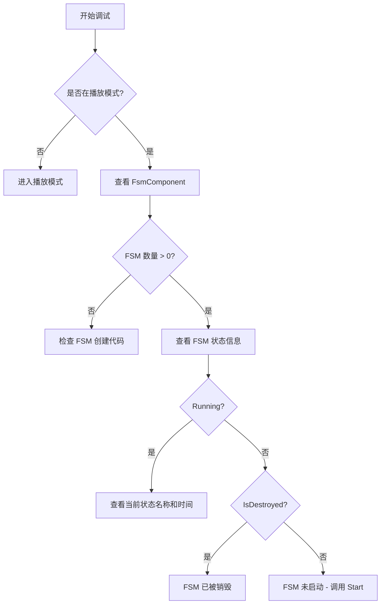

# 常见问题

本文档收集了使用 GameFrameX Unity FSM 有限状态机组件时常见的错误问题及其解决方案。

## 概述

FSM（有限状态机）组件是 GameFrameX 框架的核心模块之一，用于管理和控制游戏对象的状态转换。在使用过程中，开发者可能会遇到各种错误和问题，本文档旨在提供这些常见问题的诊断方法和解决方案。

## 通用错误

### 1. FSM 管理器未初始化

**错误信息：**
```
FSM manager is invalid.
```

**原因分析：**
此错误表示 `FsmComponent` 无法从 `GameFrameworkEntry` 获取 `IFsmManager` 模块。这通常是因为 Game Framework 核心组件未正确初始化。

**解决方案：**

1. 确保在场景中添加了 `FsmComponent` 组件：
```csharp
// 在 Unity 编辑器中，通过 Game Framework 菜单添加
// Game Framework -> Add Component -> Fsm
```

2. 确保 Game Framework 核心组件已正确初始化。在 `FsmComponent` 的 `Awake` 方法中会自动获取 FSM 管理器：
```csharp
// 源码位置: Runtime/Fsm/FsmComponent.cs
protected override void Awake()
{
    ImplementationComponentType = Utility.Assembly.GetType(componentType);
    InterfaceComponentType = typeof(IFsmManager);
    base.Awake();
    m_FsmManager = GameFrameworkEntry.GetModule<IFsmManager>();
    if (m_FsmManager == null)
    {
        Log.Fatal("FSM manager is invalid.");
        return;
    }
}
```

> Source: [FsmComponent.cs](https://github.com/GameFrameX/com.gameframex.unity.fsm/blob/main/Runtime/Fsm/FsmComponent.cs#L37-L48)

---

### 2. 创建 FSM 时 Owner 为空

**错误信息：**
```
FSM owner is invalid.
```

**原因分析：**
创建有限状态机时，传入了 `null` 作为拥有者（owner）参数。FSM 必须有一个有效的拥有者对象。

**解决方案：**

确保创建 FSM 时传入有效的拥有者对象：

```csharp
// 错误示例
IFsm<MyCharacter> fsm = fsmComponent.CreateFsm<MyCharacter>(null, states);

// 正确示例
MyCharacter character = GetComponent<MyCharacter>();
IFsm<MyCharacter> fsm = fsmComponent.CreateFsm(character, states);
```

> Source: [Fsm.cs](https://github.com/GameFrameX/com.gameframex.unity.fsm/blob/main/Runtime/Fsm/Fsm.cs#L113-L116)

---

### 3. 状态数组无效

**错误信息：**
```
FSM states is invalid.
```

**原因分析：**
创建 FSM 时，状态数组为 `null` 或者长度为 0。FSM 至少需要包含一个状态。

**解决方案：**

确保创建 FSM 时提供至少一个有效的状态：

```csharp
// 错误示例 - 状态数组为空
IFsm<MyCharacter> fsm = fsmComponent.CreateFsm(character);

// 正确示例 - 至少包含一个状态
IFsm<MyCharacter> fsm = fsmComponent.CreateFsm(character, 
    new IdleState(), 
    new MoveState()
);
```

> Source: [Fsm.cs](https://github.com/GameFrameX/com.gameframex.unity.fsm/blob/main/Runtime/Fsm/Fsm.cs#L118-L121)

---

### 4. 重复的状态类型

**错误信息：**
```
FSM 'TypeNamePair' state 'StateType' is already exist.
```

**原因分析：**
在创建 FSM 时，尝试添加两个相同类型的状态。每个状态类型在同一个 FSM 中只能存在一个。

**解决方案：**

确保每个状态类型只添加一次：

```csharp
// 错误示例 - 重复添加相同状态类型
IFsm<MyCharacter> fsm = fsmComponent.CreateFsm(character,
    new IdleState(),  // 第一次添加
    new IdleState()   // 重复添加 - 错误！
);

// 正确示例 - 每个状态类型只添加一次
IFsm<MyCharacter> fsm = fsmComponent.CreateFsm(character,
    new IdleState(),
    new MoveState(),
    new AttackState()
);
```

> Source: [Fsm.cs](https://github.com/GameFrameX/com.gameframex.unity.fsm/blob/main/Runtime/Fsm/Fsm.cs#L135-L138)

---

## 状态机运行错误

### 5. 重复启动 FSM

**错误信息：**
```
FSM is running, can not start again.
```

**原因分析：**
尝试启动一个已经在运行状态的 FSM。FSM 在运行期间不允许重复调用 `Start` 方法。

**解决方案：**

1. 在启动前检查 FSM 是否已经在运行：
```csharp
IFsm<MyCharacter> fsm = fsmComponent.GetFsm<MyCharacter>();
if (fsm != null && !fsm.IsRunning)
{
    fsm.Start<IdleState>();
}
```

2. 如果需要重新开始，先销毁现有的 FSM：
```csharp
// 销毁现有 FSM
fsmComponent.DestroyFsm<MyCharacter>();
// 重新创建
IFsm<MyCharacter> fsm = fsmComponent.CreateFsm(character, new IdleState());
fsm.Start<IdleState>();
```

> Source: [Fsm.cs](https://github.com/GameFrameX/com.gameframex.unity.fsm/blob/main/Runtime/Fsm/Fsm.cs#L235-L238)

---

### 6. 状态不存在

**错误信息：**
```
FSM 'TypeNamePair' can not start state 'StateType' which is not exist.
```

**原因分析：**
尝试启动或切换到一个不存在的状态。该状态未被添加到 FSM 的状态列表中。

**解决方案：**

1. 确保要启动/切换的状态已在创建 FSM 时添加：
```csharp
// 创建 FSM 时添加所有需要的状态
IFsm<MyCharacter> fsm = fsmComponent.CreateFsm(character,
    new IdleState(),
    new MoveState(),
    new AttackState()
);

// 启动已存在的状态
fsm.Start<IdleState>();

// 切换到已存在的状态 - 正确
fsm.GetState<AttackState>().ChangeToState<MoveState>(fsm);
```

2. 在切换状态前检查状态是否存在：
```csharp
if (fsm.HasState<MoveState>())
{
    fsm.GetState<AttackState>().ChangeToState<MoveState>(fsm);
}
```

> Source: [Fsm.cs](https://github.com/GameFrameX/com.gameframex.unity.fsm/blob/main/Runtime/Fsm/Fsm.cs#L241-L244)

---

### 7. 无效的状态类型

**错误信息：**
```
State type 'StateType' is invalid.
```

**原因分析：**
传入的状态类型不是有效的 `FsmState<T>` 派生类。

**解决方案：**

确保状态类继承自 `FsmState<T>`：

```csharp
// 错误示例 - 普通类不能作为状态
public class MyClass { }

// 正确示例 - 必须继承 FsmState<T>
public class IdleState : FsmState<MyCharacter>
{
    protected internal override void OnEnter(IFsm<MyCharacter> fsm)
    {
        // 进入状态逻辑
    }
    
    protected internal override void OnUpdate(IFsm<MyCharacter> fsm, float elapseSeconds, float realElapseSeconds)
    {
        // 状态更新逻辑
    }
    
    protected internal override void OnLeave(IFsm<MyCharacter> fsm, bool isShutdown)
    {
        // 离开状态逻辑
    }
}
```

> Source: [Fsm.cs](https://github.com/GameFrameX/com.gameframex.unity.fsm/blob/main/Runtime/Fsm/Fsm.cs#L267-L270)

---

### 8. 当前状态无效，无法切换

**错误信息：**
```
Current state is invalid.
```

**原因分析：**
尝试在 FSM 未启动或已被销毁时切换状态。

**解决方案：**

确保 FSM 正在运行后再切换状态：

```csharp
// 错误示例 - FSM 未启动就尝试切换
IFsm<MyCharacter> fsm = fsmComponent.CreateFsm(character,
    new IdleState(),
    new MoveState()
);
// 未调用 Start 就尝试切换 - 错误！
fsm.GetState<IdleState>().ChangeToState<MoveState>(fsm);

// 正确示例 - 先启动 FSM
IFsm<MyCharacter> fsm = fsmComponent.CreateFsm(character,
    new IdleState(),
    new MoveState()
);
fsm.Start<IdleState>();  // 先启动

// 然后在状态中切换
protected internal override void OnUpdate(IFsm<MyCharacter> fsm, float elapseSeconds, float realElapseSeconds)
{
    if (shouldMove)
    {
        ChangeState<MoveState>(fsm);  // 正确：在状态内切换
    }
}
```

> Source: [Fsm.cs](https://github.com/GameFrameX/com.gameframex.unity.fsm/blob/main/Runtime/Fsm/Fsm.cs#L558-L567)

---

## 数据管理错误

### 9. 重复创建同名 FSM

**错误信息：**
```
Already exist FSM 'TypeNamePair'.
```

**原因分析：**
尝试创建一个已存在的 FSM（相同拥有者类型和名称）。

**解决方案：**

1. 在创建前检查 FSM 是否已存在：
```csharp
if (!fsmComponent.HasFsm<MyCharacter>())
{
    IFsm<MyCharacter> fsm = fsmComponent.CreateFsm(character,
        new IdleState(),
        new MoveState()
    );
}
```

2. 或者先销毁现有的 FSM：
```csharp
fsmComponent.DestroyFsm<MyCharacter>();
IFsm<MyCharacter> fsm = fsmComponent.CreateFsm(character,
    new IdleState(),
    new MoveState()
);
```

> Source: [FsmManager.cs](https://github.com/GameFrameX/com.gameframex.unity.fsm/blob/main/Runtime/Fsm/FsmManager.cs#L284-L287)

---

### 10. 无效的数据名称

**错误信息：**
```
Data name is invalid.
```

**原因分析：**
使用 `null` 或空字符串作为 FSM 数据的键名。

**解决方案：**

始终使用有效的字符串作为数据键：

```csharp
// 错误示例
fsm.SetData<string>(null, "value");
fsm.SetData<string>("", "value");

// 正确示例
fsm.SetData<string>("health", 100);
fsm.SetData<float>("speed", 5.0f);
```

> Source: [Fsm.cs](https://github.com/GameFrameX/com.gameframex.unity.fsm/blob/main/Runtime/Fsm/Fsm.cs#L396-L399)

---

### 11. 无效的结果参数

**错误信息：**
```
Results is invalid.
```

**原因分析：**
传入 `null` 作为存储结果的可变列表参数。

**解决方案：**

确保传入有效的列表对象：

```csharp
// 错误示例
List<FsmBase> fsms = null;
fsmComponent.GetAllFsmList(fsms);

// 正确示例
List<FsmBase> fsms = new List<FsmBase>();
fsmComponent.GetAllFsmList(fsms);
```

> Source: [Fsm.cs](https://github.com/GameFrameX/com.gameframex.unity.fsm/blob/main/Runtime/Fsm/Fsm.cs#L377-L380)

---

## Unity 编辑器相关问题

### 12. FsmComponent 在编辑器中不显示

**问题描述：**
在 Unity 编辑器中添加了 FsmComponent，但在 Inspector 面板中看不到 FSM 信息。

**原因分析：**
`FsmComponentInspector` 仅在运行时显示信息，且需要在游戏物体层级中。

**解决方案：**

1. 确保在 **Play Mode（播放模式）** 下查看：
```csharp
// 源码位置: Editor/Inspector/FsmComponentInspector.cs
public override void OnInspectorGUI()
{
    if (!EditorApplication.isPlaying)
    {
        EditorGUILayout.HelpBox("Available during runtime only.", MessageType.Info);
        return;
    }
    // ...
}
```

2. 确保 FsmComponent 附加在场景中的游戏物体上，而不是预制体上：
```csharp
// Inspector 会检查游戏物体是否在层级面板中
if (IsPrefabInHierarchy(t.gameObject))
{
    // 显示 FSM 信息
}
```

> Source: [FsmComponentInspector.cs](https://github.com/GameFrameX/com.gameframex.unity.fsm/blob/main/Editor/Inspector/FsmComponentInspector.cs#L21-L25)

---

## 调试技巧

### 使用 FsmComponentInspector 查看 FSM 状态

在 Unity 编辑器的播放模式下，可以查看所有 FSM 的实时状态：

1. 在场景中添加 `FsmComponent` 组件
2. 进入播放模式
3. 选择带有 `FsmComponent` 的游戏物体
4. 在 Inspector 中查看 FSM 数量和每个 FSM 的状态



### 常见 FSM 状态说明

| 属性 | 说明 |
|------|------|
| `IsRunning` | FSM 是否正在运行（已调用 Start） |
| `IsDestroyed` | FSM 是否已被销毁 |
| `CurrentStateName` | 当前状态的完整类型名称 |
| `CurrentStateTime` | 当前状态已持续的时间（秒） |

---

## 最佳实践

### 1. 始终检查 FSM 是否存在后再操作

```csharp
// 推荐做法
if (fsmComponent.HasFsm<MyCharacter>())
{
    var fsm = fsmComponent.GetFsm<MyCharacter>();
    // 操作 FSM
}
```

### 2. 正确管理 FSM 生命周期

```csharp
// 创建
IFsm<MyCharacter> fsm = fsmComponent.CreateFsm(owner, states);
fsm.Start<IdleState>();

// 使用
// ... 游戏逻辑 ...

// 销毁
fsmComponent.DestroyFsm(fsm);
```

### 3. 使用 FsmState 内置方法切换状态

```csharp
// 推荐：在状态类中使用受保护的方法
protected internal override void OnUpdate(IFsm<MyCharacter> fsm, float elapseSeconds, float realElapseSeconds)
{
    // 使用受保护的 ChangeState 方法
    if (someCondition)
    {
        ChangeState<NextState>(fsm);
    }
}
```

---

## 相关链接

- [概述](./1-overview) - FSM 组件概述
- [安装](./2-installation) - 安装和配置
- [快速开始](./3-getting-started) - 快速上手指南
- [核心概念](./04.features.md) - 核心概念详解
- [API 参考](./5-api-reference) - 完整 API 文档
