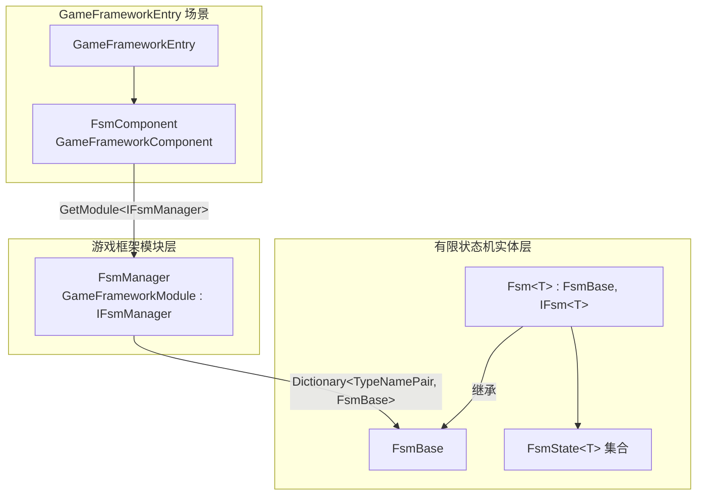

# 工作原理速览:组件、管理器与 FSM 三层

GameFrameX FSM 在 Unity 中以三层结构组织:**组件层(FsmComponent)** 挂在 GameFramework 入口、负责从外部调用;**管理层(FsmManager)** 作为 `GameFrameworkModule` 统一轮询所有已注册的 FSM;**状态机层(Fsm<T> / FsmState<T>)** 才是真正持有者、状态集合与状态切换逻辑的实体。理解这三层后,创建、轮询、销毁一个 FSM 就是从组件入口走到具体状态机的标准路径。

## 快速开始

1. 在 GameFramework 启动场景的 `GameFrameworkEntry` 对象上添加 `GameFrameX/FSM` 组件(由 `[AddComponentMenu("GameFrameX/FSM")]` 自动注册菜单)。
2. 通过 `GameEntry.GetComponent<FsmComponent>()` 获取组件,再调用 `CreateFsm` 创建有限状态机。
3. 通过 `IFsmManager` 接口或 `FsmComponent` 提供的 `HasFsm`、`GetFsm`、`DestroyFsm` 等方法对 FSM 进行查找、轮询与销毁。

组件在 `Awake()` 阶段会从 `GameFrameworkEntry` 取得 `IFsmManager` 模块并缓存引用:

```csharp
// Runtime/Fsm/FsmComponent.cs#L63-L74
protected override void Awake()
{
    ImplementationComponentType = Utility.Assembly.GetType(componentType);
    InterfaceComponentType = typeof(IFsmManager);
    base.Awake();
    m_FsmManager = GameFrameworkEntry.GetModule<IFsmManager>();
    if (m_FsmManager == null)
    {
        Log.Fatal("FSM manager is invalid.");
        return;
    }
}
```

来源:[FsmComponent.cs#L63-L74](https://github.com/GameFrameX/com.gameframex.unity.fsm/blob/main/Runtime/Fsm/FsmComponent.cs#L63-L74)

## 工作原理速览

三层各自职责如下,数据与调用沿"组件 → 管理器 → FSM 实体"自上而下流动。



| 层 | 类型 | 关键职责 |
|----|------|----------|
| 组件层 | `FsmComponent : GameFrameworkComponent` | 暴露 `CreateFsm` / `GetFsm` / `DestroyFsm` 等高层 API;在 `FixedUpdate` 中把固定步长转发给管理器 |
| 管理层 | `FsmManager : GameFrameworkModule, IFsmManager` | 维护 `Dictionary<TypeNamePair, FsmBase>`;按 `Priority` 进入轮询;驱动所有 FSM 的 `Update` / `FixedUpdate` |
| 实体层 | `FsmBase` 与泛型子类 `Fsm<T> : IFsm<T>` | 持有 owner、状态字典 `m_States`、数据字典 `m_Datas`、当前状态 `m_CurrentState` 与停留时间 `m_CurrentStateTime`,执行状态切换 |

- **组件层**:`[GameFrameXAutoComponent(-6000)]` 与 `[AddComponentMenu("GameFrameX/FSM")]` 让它自动被 GameFramework 加载并显示在 Inspector 菜单;所有外部入口都走它,内部转发给 `m_FsmManager`。
- **管理层**:`Priority` 返回 `1`(数值越大越靠前),在 `Update` / `FixedUpdate` 中遍历快照(复制到 `m_TempFsms` / `m_TempFixedFsms`)再调用每个 FSM,避免在遍历中修改集合。
- **实体层**:每一个具体的 `Fsm<T>` 知道自己的 owner 类型 `T` 与一组 `FsmState<T>`,通过 `ChangeState<TState>()` 在状态之间跳转,并记录 `CurrentStateTime` 用于"在某状态停留多久"这类判定。

## 接下来

- 关于创建并启动第一个状态机的完整示例,见《如何创建一个有限状态机》。
- 关于状态类 `FsmState<T>` 的生命周期回调与变量数据,见《状态类与变量使用速查》。
- 关于 Inspector 调试与编辑器扩展,见《FsmComponent Inspector 说明》。

## 相关链接

- [FsmComponent.cs](https://github.com/GameFrameX/com.gameframex.unity.fsm/blob/main/Runtime/Fsm/FsmComponent.cs)
- [FsmManager.cs](https://github.com/GameFrameX/com.gameframex.unity.fsm/blob/main/Runtime/Fsm/FsmManager.cs)
- [Fsm.cs](https://github.com/GameFrameX/com.gameframex.unity.fsm/blob/main/Runtime/Fsm/Fsm.cs)
- [FsmBase.cs](https://github.com/GameFrameX/com.gameframex.unity.fsm/blob/main/Runtime/Fsm/FsmBase.cs)
- [IFsmManager.cs](https://github.com/GameFrameX/com.gameframex.unity.fsm/blob/main/Runtime/Fsm/IFsmManager.cs)
- [IFsm.cs](https://github.com/GameFrameX/com.gameframex.unity.fsm/blob/main/Runtime/Fsm/IFsm.cs)
- [FsmState.cs](https://github.com/GameFrameX/com.gameframex.unity.fsm/blob/main/Runtime/Fsm/FsmState.cs)