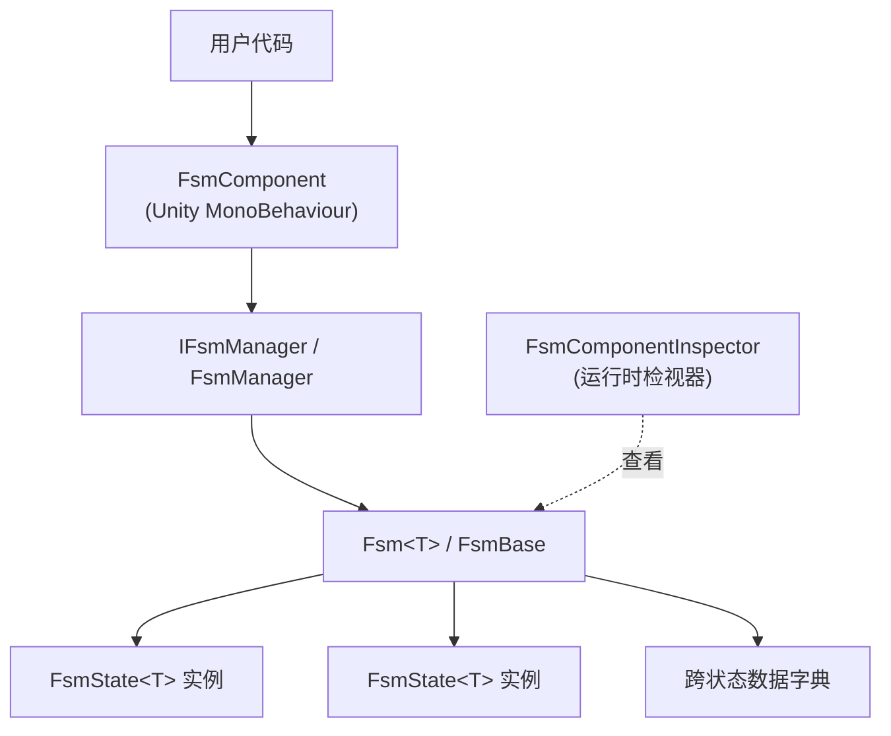

# GameFrameX FSM 是什么

GameFrameX FSM 是 GameFrameX 框架提供的通用有限状态机(Finite State Machine)模块,用于在 Unity 中以类型安全的方式管理对象的状态创建、生命周期和状态切换。它是 GameFrameX 框架的子模块,需通过 `FsmComponent` 接入 GameFrameX 组件体系使用。

## 快速开始

### 1. 安装包

在 Unity 工程的 `Packages/manifest.json` 中添加以下 `scopedRegistries` 与依赖:

```json
{
  "scopedRegistries": [
    {
      "name": "GameFrameX",
      "url": "https://gameframex.upm.alianblank.uk",
      "scopes": [
        "com.gameframex"
      ]
    }
  ],
  "dependencies": {
    "com.gameframex.unity.fsm": "1.1.1"
  }
}
```

Source: [README.md](https://github.com/GameFrameX/com.gameframex.unity.fsm/blob/main/README.md#L44-L63)

也可以直接通过 Git URL(`https://github.com/gameframex/com.gameframex.unity.fsm.git`)或克隆到 `Packages` 目录安装。

### 2. 定义状态

继承 `FsmState<T>` 并覆写生命周期方法,`T` 为状态机的持有者类型:

```csharp
using GameFrameX.Fsm;

public class IdleState : FsmState<Player>
{
    protected override void OnEnter(IFsm<Player> fsm)
    {
        // 进入 Idle 时触发
    }

    protected override void OnUpdate(IFsm<Player> fsm, float elapseSeconds, float realElapseSeconds)
    {
        // 每帧轮询
        if (Input.GetKeyDown(KeyCode.W))
        {
            ChangeState<MoveState>(fsm);
        }
    }

    protected override void OnLeave(IFsm<Player> fsm, bool isShutdown)
    {
        // 离开 Idle 时触发
    }
}
```

Source: [README.md](https://github.com/GameFrameX/com.gameframex.unity.fsm/blob/main/README.md#L101-L123), [FsmState.cs](https://github.com/GameFrameX/com.gameframex.unity.fsm/blob/main/Runtime/Fsm/FsmState.cs#L41-L67)

### 3. 创建并启动 FSM

通过 `GameEntry.GetComponent<FsmComponent>()` 取得组件,再用 `CreateFsm` 装配状态集合并 `Start<TState>` 启动:

```csharp
var fsmComponent = GameEntry.GetComponent<FsmComponent>();
IFsm<Player> fsm = fsmComponent.CreateFsm(player, new IdleState(), new MoveState());
fsm.Start<IdleState>();
```

Source: [README.md](https://github.com/GameFrameX/com.gameframex.unity.fsm/blob/main/README.md#L127-L136), [FsmComponent.cs](https://github.com/GameFrameX/com.gameframex.unity.fsm/blob/main/Runtime/Fsm/FsmComponent.cs#L204-L222)

### 4. 跨状态数据存取(可选)

用 `SetData` / `GetData<T>` 在状态之间共享数据,内部采用对象池实现零 GC:

```csharp
fsm.SetData("Health", 100);
int hp = fsm.GetData<int>("Health");

if (fsm.HasData("Health"))
{
    fsm.RemoveData("Health");
}
```

Source: [README.md](https://github.com/GameFrameX/com.gameframex.unity.fsm/blob/main/README.md#L140-L149)

## 工作原理速览

FSM 模块由三层组成,组件层负责暴露对外 API,管理器层持有所有运行中的 FSM 并驱动其 `Update` / `FixedUpdate`,状态机层管理具体状态集合与跨状态数据。



- `FsmComponent` 继承 `GameFrameworkComponent`,挂载在 `GameFramework` 入口对象上,组件优先级为 `-6000`([FsmComponent.cs#L46-L47](https://github.com/GameFrameX/com.gameframex.unity.fsm/blob/main/Runtime/Fsm/FsmComponent.cs#L46-L47))。
- `FsmManager` 持有所有 FSM 实例并轮询调度,`Update` / `FixedUpdate` 双路径在 `FsmComponent.FixedUpdate` 中驱动([FsmComponent.cs#L76-L84](https://github.com/GameFrameX/com.gameframex.unity.fsm/blob/main/Runtime/Fsm/FsmComponent.cs#L76-L84))。
- `FsmState<T>` 暴露 6 个生命周期钩子:`OnInit`、`OnEnter`、`OnUpdate`、`OnFixedUpdate`、`OnLeave`、`OnDestroy`。
- Editor 目录下的 `FsmComponentInspector` 提供 Play 模式下实时查看当前状态与已运行时长的检视器。

## 接下来

- 如何实现第一个状态机:见任务页《如何创建并启动一个 FSM》
- 跨状态传值出错怎么办:见排查页相关条目
- 所有 API 速查:见参考页《IFsm / FsmState API 速查》
