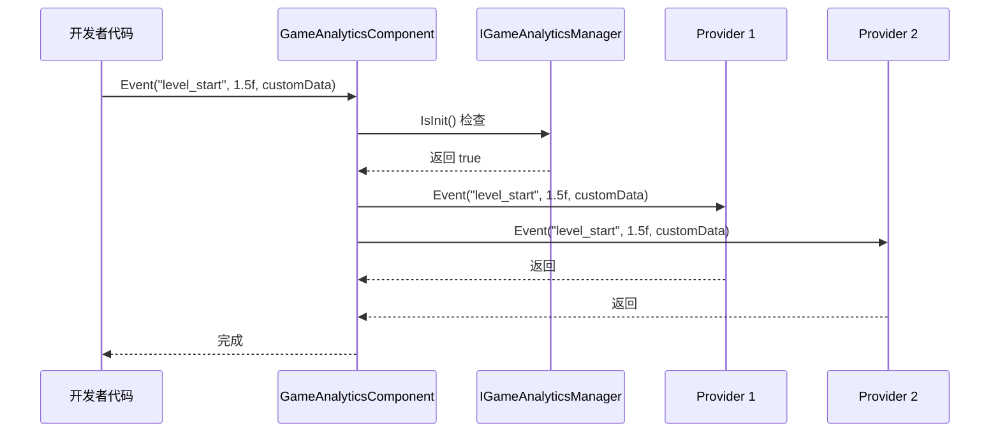
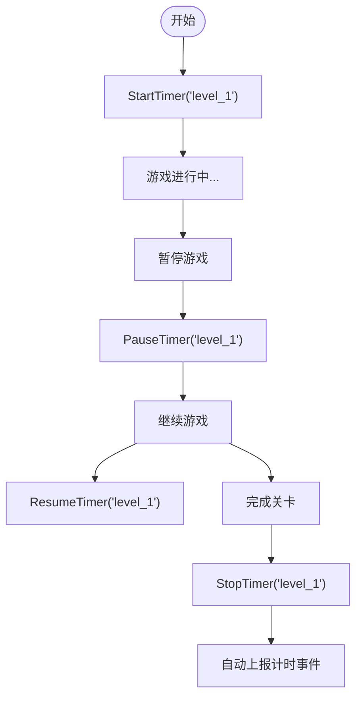

# 插件介绍

`GameFrameX.GameAnalytics` 是 GameFrameX 游戏框架中的游戏数据分析组件，为 Unity 游戏开发者提供统一的事件上报和计时功能接口。该插件采用模块化设计，支持灵活扩展多种第三方数据分析后端。

## 概述

GameAnalytics 组件是游戏框架的核心模块之一，专门用于解决游戏数据分析的集成问题。在游戏开发中，开发者通常需要集成多个数据分析平台（如友盟、Firebase、Adjust 等），每个平台都有各自的 SDK 和 API，这会导致代码重复和维护困难。

GameAnalytics 组件通过定义统一的接口（`IGameAnalyticsManager`）和抽象基类（`BaseGameAnalyticsManager`），将各种数据分析平台的共性功能抽象出来。开发者只需调用统一的 API，即可同时向多个数据分析平台发送事件，大大简化了多平台数据埋点的工作。

### 核心特性

- **统一接口**：提供一套标准的 API，支持事件上报、计时器、公共属性等功能
- **多后端支持**：通过提供者模式，可同时接入多个数据分析平台
- **自动初始化**：支持在组件启用时自动初始化，也支持手动控制初始化时机
- **设备信息采集**：自动采集设备型号、操作系统、屏幕分辨率、网络类型等基础信息
- **计时功能**：提供完整的事件计时能力，用于分析游戏内各种操作的耗时

### 版本信息

- 当前版本：1.2.0
- 首次发布：2024年4月10日

## 架构设计

GameAnalytics 组件采用经典的分层架构设计，从上到下分为三个层次：组件层、管理器层和实现层。

```mermaid
flowchart TD
    subgraph ComponentLayer["组件层 (Unity Component)"]
        GAC[GameAnalyticsComponent]
    end

    subgraph ManagerLayer["管理器层 (Manager Interface)"]
        IGAM[IGameAnalyticsManager]
        BGAM[BaseGameAnalyticsManager]
    end

    subgraph ImplementationLayer["实现层 (Provider)"]
        Provider1[Analytics Provider 1]
        Provider2[Analytics Provider 2]
        ProviderN[Analytics Provider N]
    end

    subgraph GameFramework["GameFrameX 框架"]
        GFM[GameFrameworkModule]
    end

    GAC --> IGAM
    IGAM <|.. BGAM
    BGAM --> GFM
    BGAM -.-> Provider1
    BGAM -.-> Provider2
    BGAM -.-> ProviderN
```

### 各层职责

**组件层 (GameAnalyticsComponent)**

组件层是 Unity 层面的入口点，继承自 `GameFrameworkComponent`。该组件挂载到场景中的 GameObject 上即可使用，主要负责：

- 在 `OnEnable` 时自动调用初始化方法
- 管理多个 `IGameAnalyticsManager` 实例的集合
- 将 API 调用分发到所有已注册的分析提供者
- 提供参数验证和初始化状态检查

> Source: [GameAnalyticsComponent.cs](https://github.com/GameFrameX/com.gameframex.unity.gameanalytics/blob/main/Runtime/GameAnalytics/GameAnalyticsComponent.cs#L14-L80)

**管理器层 (IGameAnalyticsManager / BaseGameAnalyticsManager)**

接口层定义了所有分析功能的标准规范，包括：

- 初始化方法（自动初始化和手动初始化）
- 事件上报方法（4种重载）
- 计时器方法（开始、暂停、恢复、结束）
- 公共属性管理（设置、获取、清除）
- 玩家ID设置

抽象基类 `BaseGameAnalyticsManager` 继承自 `GameFrameworkModule`，实现了接口中的一些通用功能，如公共属性管理、设备信息自动采集等。

> Source: [IGameAnalyticsManager.cs](https://github.com/GameFrameX/com.gameframex.unity.gameanalytics/blob/main/Runtime/GameAnalytics/IGameAnalyticsManager.cs#L8-L105)

> Source: [BaseGameAnalyticsManager.cs](https://github.com/GameFrameX/com.gameframex.unity.gameanalytics/blob/main/Runtime/GameAnalytics/BaseGameAnalyticsManager.cs#L10-L203)

**实现层 (Analytics Provider)**

实现层是具体的数据分析平台适配器，继承自 `BaseGameAnalyticsManager`。开发者可以实现自己的分析提供者，或集成第三方 SDK 的适配器。每个提供者独立运作，组件层会同时向所有已注册的提供者发送事件。

### 事件流向



事件从开发者代码发出后，首先到达 `GameAnalyticsComponent`，组件检查初始化状态后，将事件同时分发给所有已注册的分析提供者，实现一次上报多端接收的效果。

## 核心功能

### 事件上报

事件上报是数据分析的基础，GameAnalytics 组件提供了四种事件上报方式，以满足不同场景的需求：

**简单事件**：仅包含事件名称，用于记录某个动作的发生。

```csharp
gameAnalyticsComponent.Event("game_start");
```

**数值事件**：在事件名称基础上添加数值，可用于统计次数、分数等量化指标。

```csharp
gameAnalyticsComponent.Event("level_complete", 5);
```

**自定义字段事件**：在事件中附加额外的键值对信息，用于更精细的数据分析。

```csharp
var customFields = new Dictionary<string, object>
{
    { "chapter", "chapter_1" },
    { "difficulty", "hard" }
};
gameAnalyticsComponent.Event("battle_end", customFields);
```

**数值+自定义字段事件**：结合数值和自定义字段的完整事件格式。

```csharp
gameAnalyticsComponent.Event("purchase", 99.99f, customFields);
```

### 计时器功能

计时器功能用于精确测量游戏内各种操作的耗时，常见用途包括关卡完成时间、界面加载时间、任务执行时间等。



计时器支持暂停和恢复功能，即使玩家暂时离开，计时也不会丢失。计时结束后，组件会自动将耗时作为事件值上报到数据分析平台。

### 公共属性

公共属性是指每次上报事件时都会自动携带的基础信息。GameAnalytics 组件会自动采集以下设备信息：

| 属性名称 | 说明 | 示例值 |
|---------|------|-------|
| device_id | 设备唯一标识符 | ABC123... |
| device_model | 设备型号 | iPhone 14 Pro |
| device_type | 设备类型 | Handheld |
| os | 操作系统 | iOS 17.0 |
| app_version | 应用版本号 | 1.2.0 |
| unity_version | Unity 引擎版本 | 2022.3.15f1 |
| platform | 运行平台 | iOS |
| processor_type | 处理器类型 | Apple A16 |
| processor_count | CPU 核心数 | 6 |
| system_memory_size | 系统内存大小(MB) | 6144 |
| graphics_device_name | 显卡名称 | Apple GPU |
| screen_width | 屏幕宽度(像素) | 1179 |
| screen_height | 屏幕高度(像素) | 2556 |
| screen_dpi | 屏幕DPI | 460 |
| network_type | 网络类型 | WiFi |
| system_language | 系统语言 | Chinese |

> Source: [BaseGameAnalyticsManager.cs](https://github.com/GameFrameX/com.gameframex.unity.gameanalytics/blob/main/Runtime/GameAnalytics/BaseGameAnalyticsManager.cs#L88-L144)

开发者也可以通过 `SetPublicProperties` 方法添加自定义的公共属性，这些属性会在每次事件上报时自动附带。

### 玩家ID管理

通过 `SetPlayerId` 方法可以设置玩家标识符，用于关联同一个玩家在游戏中的所有行为数据。这对于用户行为分析、留存统计等场景非常重要。

```csharp
// 登录成功后设置玩家ID
gameAnalyticsComponent.SetPlayerId(playerId);
```

## 使用方式

### 安装

插件支持多种安装方式：

1. **通过 manifest.json 添加依赖**：在项目的 `Packages/manifest.json` 文件中的 `dependencies` 节点下添加：
   ```json
   {"com.gameframex.unity.gameanalytics": "https://github.com/AlianBlank/com.gameframex.unity.gameanalytics.git"}
   ```

2. **通过 Unity Package Manager**：在 Unity 编辑器中选择 `Window > Package Manager`，点击 `+` 号，选择 `Add package from git URL`，输入：`https://github.com/AlianBlank/com.gameframex.unity.gameanalytics.git`

3. **直接放置源码**：将仓库下载后放置到 Unity 项目的 `Packages` 目录下，系统会自动识别加载。

### 快速配置

1. 在 Unity 场景中创建一个空的 GameObject
2. 在该 GameObject 上添加 `GameAnalyticsComponent` 组件（菜单路径：`Game Framework > GameAnalytics`）
3. 在 Inspector 面板中配置分析提供者列表，添加需要使用的分析平台
4. 设置各提供者的相关参数

> Source: [GameAnalyticsComponentInspector.cs](https://github.com/GameFrameX/com.gameframex.unity.gameanalytics/blob/main/Editor/Inspector/GameAnalyticsComponentInspector.cs#L18-L68)

### 基本使用示例

```csharp
using GameFrameX.GameAnalytics.Runtime;
using UnityEngine;

public class GameAnalyticsExample : MonoBehaviour
{
    private GameAnalyticsComponent _gameAnalytics;

    private void Awake()
    {
        // 获取组件（通常通过框架获取）
        _gameAnalytics = UnityEngine.Object.FindObjectOfType<GameAnalyticsComponent>();
    }

    private void Start()
    {
        // 上报游戏开始事件
        _gameAnalytics.Event("game_start");
        
        // 开始关卡计时
        _gameAnalytics.StartTimer("level_1");
    }

    private void OnLevelComplete(int levelId)
    {
        // 上报关卡完成事件
        _gameAnalytics.Event($"level_{levelId}_complete", 1.0f);
        
        // 停止关卡计时
        _gameAnalytics.StopTimer($"level_{levelId}");
    }
}
```

## 相关链接

- [安装指南](./2-installation.index)
- [快速开始](./3-getting-started.index)
- [核心架构](./4-core-concepts.index)
- [API 参考](./5-api-reference.index)
- [编辑器配置](./6-configuration.index)
- [故障排除](./7-troubleshooting.index)
- [GitHub 仓库](https://github.com/GameFrameX/com.gameframex.unity.gameanalytics.git)
- [GameFrameX 官网](https://gameframework.cn/)
