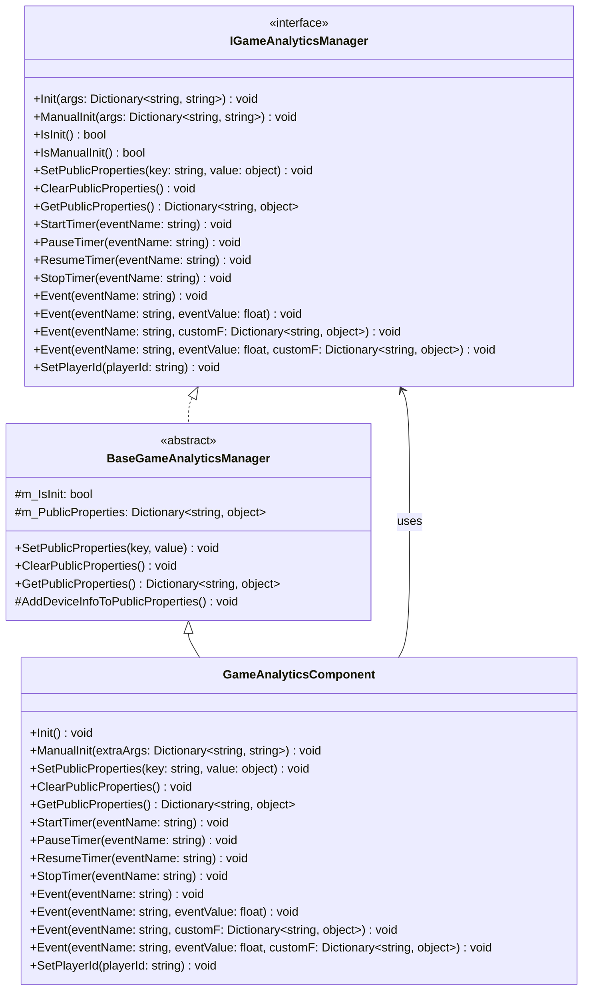
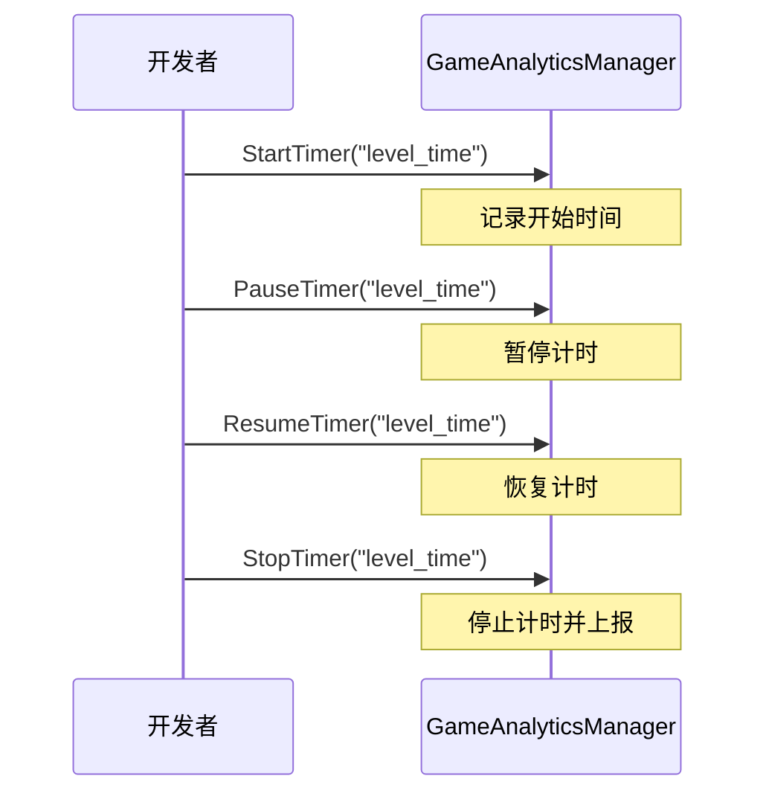

# API 接口

本文档详细介绍 GameAnalytics 插件提供的所有编程接口，包括接口定义、参数说明和使用方式。

## 概述

GameAnalytics 插件提供了完整的游戏数据分析功能接口，通过 `IGameAnalyticsManager` 接口定义标准化的分析方法。插件采用模块化设计，支持多provider扩展，开发者可以通过 `GameAnalyticsComponent` 组件或直接调用 `IGameAnalyticsManager` 接口来使用功能。

> 命名空间：`GameFrameX.GameAnalytics.Runtime`

## 架构



### 组件层级说明

| 层级 | 组件 | 说明 |
|------|------|------|
| 接口层 | `IGameAnalyticsManager` | 定义所有数据分析功能的抽象接口 |
| 基类层 | `BaseGameAnalyticsManager` | 实现公共逻辑和设备信息收集 |
| 组件层 | `GameAnalyticsComponent` | Unity组件，暴露给开发者使用的入口 |

## 初始化接口

### `Init(args: Dictionary<string, string>): void`

自动初始化方法，在组件启用时自动调用，用于配置游戏数据分析服务。

**参数：**
- `args` (Dictionary<string, string>): 初始化参数键值对，包含服务配置信息

**示例：**
```csharp
var args = new Dictionary<string, string>
{
    { "AppId", "your_app_id" },
    { "ChannelId", "your_channel_id" }
};
gameAnalyticsManager.Init(args);
```
> Source: [IGameAnalyticsManager.cs](https://github.com/GameFrameX/com.gameframex.unity.gameanalytics/blob/main/Runtime/GameAnalytics/IGameAnalyticsManager.cs#L10-L13)

---

### `ManualInit(args: Dictionary<string, string>): void`

手动初始化方法，允许开发者在特定时机手动触发初始化过程。

**参数：**
- `args` (Dictionary<string, string>): 初始化参数键值对

**设计意图：**
此方法适用于需要延迟初始化或根据特定条件触发的场景，提供更灵活的控制方式。

> Source: [IGameAnalyticsManager.cs](https://github.com/GameFrameX/com.gameframex.unity.gameanalytics/blob/main/Runtime/GameAnalytics/IGameAnalyticsManager.cs#L15-L18)

---

### `IsInit(): bool`

检查组件是否已完成初始化。

**返回：**
- `bool`: 返回 true 表示已初始化，false 表示未初始化

**示例：**
```csharp
if (gameAnalyticsManager.IsInit())
{
    gameAnalyticsManager.Event("level_complete");
}
```
> Source: [IGameAnalyticsManager.cs](https://github.com/GameFrameX/com.gameframex.unity.gameanalytics/blob/main/Runtime/GameAnalytics/IGameAnalyticsManager.cs#L20-L23)

---

### `IsManualInit(): bool`

检查组件是否配置为手动初始化模式。

**返回：**
- `bool`: 返回 true 表示使用手动初始化，false 表示自动初始化

> Source: [IGameAnalyticsManager.cs](https://github.com/GameFrameX/com.gameframex.unity.gameanalytics/blob/main/Runtime/GameAnalytics/IGameAnalyticsManager.cs#L25-L28)

## 公共属性接口

公共属性用于设置跟随所有事件一起上报的通用数据，减少重复数据的发送。

### `SetPublicProperties(key: string, value: object): void`

设置公共属性，该属性会自动附加到所有后续上报的事件中。

**参数：**
- `key` (string): 属性键名，不能为空
- `value` (object): 属性值

**示例：**
```csharp
gameAnalyticsManager.SetPublicProperties("player_level", 10);
gameAnalyticsManager.SetPlayerId("player_123");
```
> Source: [IGameAnalyticsManager.cs](https://github.com/GameFrameX/com.gameframex.unity.gameanalytics/blob/main/Runtime/GameAnalytics/IGameAnalyticsManager.cs#L30-L35)

---

### `ClearPublicProperties(): void`

清除所有公共属性。清除后会自动重新添加设备信息。

> Source: [IGameAnalyticsManager.cs](https://github.com/GameFrameX/com.gameframex.unity.gameanalytics/blob/main/Runtime/GameAnalytics/IGameAnalyticsManager.cs#L37-L40)

---

### `GetPublicProperties(): Dictionary<string, object>`

获取当前所有公共属性的副本。

**返回：**
- `Dictionary<string, object>`: 包含所有公共属性的字典

**示例：**
```csharp
var properties = gameAnalyticsManager.GetPublicProperties();
foreach (var prop in properties)
{
    Debug.Log($"{prop.Key}: {prop.Value}");
}
```
> Source: [IGameAnalyticsManager.cs](https://github.com/GameFrameX/com.gameframex.unity.gameanalytics/blob/main/Runtime/GameAnalytics/IGameAnalyticsManager.cs#L42-L46)

### 设备信息自动收集

`BaseGameAnalyticsManager` 会自动收集以下设备信息作为公共属性：

| 属性键 | 说明 | 数据来源 |
|--------|------|----------|
| device_id | 设备唯一标识符 | SystemInfo.deviceUniqueIdentifier |
| device_model | 设备型号 | SystemInfo.deviceModel |
| device_type | 设备类型 | SystemInfo.deviceType |
| os | 操作系统 | SystemInfo.operatingSystem |
| app_version | 应用版本 | Application.version |
| unity_version | Unity版本 | Application.unityVersion |
| platform | 运行平台 | Application.platform |
| processor_type | 处理器类型 | SystemInfo.processorType |
| processor_count | 处理器核心数 | SystemInfo.processorCount |
| system_memory_size | 系统内存大小 | SystemInfo.systemMemorySize |
| graphics_device_name | 图形设备名称 | SystemInfo.graphicsDeviceName |
| graphics_memory_size | 显存大小 | SystemInfo.graphicsMemorySize |
| screen_width | 屏幕宽度 | Screen.width |
| screen_height | 屏幕高度 | Screen.height |
| screen_dpi | 屏幕DPI | Screen.dpi |
| network_type | 网络类型 | Application.internetReachability |
| system_language | 系统语言 | Application.systemLanguage |
> Source: [BaseGameAnalyticsManager.cs](https://github.com/GameFrameX/com.gameframex.unity.gameanalytics/blob/main/Runtime/GameAnalytics/BaseGameAnalyticsManager.cs#L85-L143)

## 计时器接口

计时器功能用于测量游戏内特定操作所花费的时间，适用于关卡通关时间、加载时间等场景。

### `StartTimer(eventName: string): void`

开始计时，为指定事件启动计时器。

**参数：**
- `eventName` (string): 事件名称，用于标识计时器，不能为空

**示例：**
```csharp
// 玩家开始进入新关卡时开始计时
gameAnalyticsManager.StartTimer("level_loading_time");
```
> Source: [IGameAnalyticsManager.cs](https://github.com/GameFrameX/com.gameframex.unity.gameanalytics/blob/main/Runtime/GameAnalytics/IGameAnalyticsManager.cs#L48-L52)

---

### `PauseTimer(eventName: string): void`

暂停指定事件的计时器。

**参数：**
- `eventName` (string): 要暂停的计时器事件名称

> Source: [IGameAnalyticsManager.cs](https://github.com/GameFrameX/com.gameframex.unity.gameanalytics/blob/main/Runtime/GameAnalytics/IGameAnalyticsManager.cs#L54-L58)

---

### `ResumeTimer(eventName: string): void`

恢复指定事件的计时器。

**参数：**
- `eventName` (string): 要恢复的计时器事件名称

> Source: [IGameAnalyticsManager.cs](https://github.com/GameFrameX/com.gameframex.unity.gameanalytics/blob/main/Runtime/GameAnalytics/IGameAnalyticsManager.cs#L60-L64)

---

### `StopTimer(eventName: string): void`

停止指定事件的计时器并上报计时结果。

**参数：**
- `eventName` (string): 要停止的计时器事件名称

**示例：**
```csharp
// 关卡加载完成后停止计时并上报
gameAnalyticsManager.StopTimer("level_loading_time");
```
> Source: [IGameAnalyticsManager.cs](https://github.com/GameFrameX/com.gameframex.unity.gameanalytics/blob/main/Runtime/GameAnalytics/IGameAnalyticsManager.cs#L66-L70)

### 计时器使用流程



## 事件上报接口

事件上报是游戏数据分析的核心功能，用于收集玩家行为数据。

### `Event(eventName: string): void`

上报简单事件，仅包含事件名称，不携带任何数据。

**参数：**
- `eventName` (string): 事件名称，不能为空

**示例：**
```csharp
// 玩家完成新手引导
gameAnalyticsManager.Event("tutorial_complete");

// 玩家打开设置界面
gameAnalyticsManager.Event("open_settings");
```
> Source: [IGameAnalyticsManager.cs](https://github.com/GameFrameX/com.gameframex.unity.gameanalytics/blob/main/Runtime/GameAnalytics/IGameAnalyticsManager.cs#L72-L76)

---

### `Event(eventName: string, eventValue: float): void`

上报带有数值的事件，用于统计数值的场景。

**参数：**
- `eventName` (string): 事件名称
- `eventValue` (float): 事件数值

**示例：**
```csharp
// 上报得分
gameAnalyticsManager.Event("score", 1500.5f);

// 上报金币数量
gameAnalyticsManager.Event("coins_earned", 100f);
```
> Source: [IGameAnalyticsManager.cs](https://github.com/GameFrameX/com.gameframex.unity.gameanalytics/blob/main/Runtime/GameAnalytics/IGameAnalyticsManager.cs#L78-L83)

---

### `Event(eventName: string, customF: Dictionary<string, object>): void`

上报带有自定义字段的事件，用于记录丰富的上下文信息。

**参数：**
- `eventName` (string): 事件名称
- `customF` (Dictionary<string, object>): 自定义字段字典

**示例：**
```csharp
// 上报关卡完成事件，包含额外信息
var customFields = new Dictionary<string, object>
{
    { "level_id", 5 },
    { "difficulty", "hard" },
    { "stars_earned", 3 },
    { "time_taken", 120.5 }
};
gameAnalyticsManager.Event("level_complete", customFields);
```
> Source: [IGameAnalyticsManager.cs](https://github.com/GameFrameX/com.gameframex.unity.gameanalytics/blob/main/Runtime/GameAnalytics/IGameAnalyticsManager.cs#L85-L90)

---

### `Event(eventName: string, eventValue: float, customF: Dictionary<string, object>): void`

上报同时带有数值和自定义字段的事件，适用于需要同时记录数值和上下文的场景。

**参数：**
- `eventName` (string): 事件名称
- `eventValue` (float): 事件数值
- `customF` (Dictionary<string, object>): 自定义字段字典

**示例：**
```csharp
// 上报付费购买事件
var purchaseData = new Dictionary<string, object>
{
    { "item_id", "gem_pack_100" },
    { "payment_method", "alipay" },
    { "region", "CN" }
};
gameAnalyticsManager.Event("purchase", 9.99f, purchaseData);
```
> Source: [IGameAnalyticsManager.cs](https://github.com/GameFrameX/com.gameframex.unity.gameanalytics/blob/main/Runtime/GameAnalytics/IGameAnalyticsManager.cs#L92-L98)

### 事件上报类型选择

```mermaid
flowchart TD
    A[需要上报事件?] --> B{需要附带数据?}
    B -->|否| C[Event(eventName)]
    B -->|是| D{数据类型?}
    D -->|仅数值| E[Event(eventName, eventValue)]
    D -->|仅自定义字段| F[Event(eventName, customF)]
    D -->|数值+自定义字段| G[Event(eventName, eventValue, customF)]
    
    C --> H[上报完成]
    E --> H
    F --> H
    G --> H
```

## 玩家标识接口

### `SetPlayerId(playerId: string): void`

设置当前玩家的唯一标识符，用于关联玩家行为数据。

**参数：**
- `playerId` (string): 玩家唯一标识符

**示例：**
```csharp
// 玩家登录后设置玩家ID
gameAnalyticsManager.SetPlayerId("player_882347");
```
> Source: [IGameAnalyticsManager.cs](https://github.com/GameFrameX/com.gameframex.unity.gameanalytics/blob/main/Runtime/GameAnalytics/IGameAnalyticsManager.cs#L100-L104)

## 完整使用示例

以下示例展示了一个典型的游戏分析集成流程：

```csharp
using GameFrameX.GameAnalytics.Runtime;
using UnityEngine;

public class GameAnalyticsExample : MonoBehaviour
{
    private IGameAnalyticsManager _gameAnalyticsManager;

    private void Start()
    {
        // 通过Unity组件获取管理器
        var component = GetComponent<GameAnalyticsComponent>();
        
        // 设置玩家ID
        component.SetPlayerId("player_882347");
        
        // 设置公共属性
        component.SetPublicProperties("server_id", "server_01");
        component.SetPublicProperties("game_mode", " PvP");
    }

    private void OnLevelStart(int levelId)
    {
        // 开始关卡计时
        GetComponent<GameAnalyticsComponent>().StartTimer($"level_{levelId}");
        
        // 上报关卡开始事件
        GetComponent<GameAnalyticsComponent>().Event("level_start", new Dictionary<string, object>
        {
            { "level_id", levelId },
            { "difficulty", "normal" }
        });
    }

    private void OnLevelComplete(int levelId, float timeTaken, int stars)
    {
        // 停止关卡计时
        GetComponent<GameAnalyticsComponent>().StopTimer($"level_{levelId}");
        
        // 上报关卡完成事件
        GetComponent<GameAnalyticsComponent>().Event("level_complete", timeTaken, new Dictionary<string, object>
        {
            { "level_id", levelId },
            { "stars", stars },
            { "time_taken", timeTaken }
        });
    }

    private void OnPurchase(string itemId, float price)
    {
        // 上报付费事件
        GetComponent<GameAnalyticsComponent>().Event("purchase", price, new Dictionary<string, object>
        {
            { "item_id", itemId },
            { "currency", "USD" }
        });
    }
}
```
> Source: [GameAnalyticsComponent.cs](https://github.com/GameFrameX/com.gameframex.unity.gameanalytics/blob/main/Runtime/GameAnalytics/GameAnalyticsComponent.cs#L36-L42)

## Unity组件接口

`GameAnalyticsComponent` 是 Unity 组件，提供了与 `IGameAnalyticsManager` 接口相同的方法，可直接在 Unity 场景中使用。

### 组件方法列表

| 方法 | 说明 |
|------|------|
| `Init()` | 初始化组件 |
| `ManualInit(extraArgs)` | 手动初始化 |
| `SetPlayerId(playerId)` | 设置玩家ID |
| `SetPublicProperties(key, value)` | 设置公共属性 |
| `ClearPublicProperties()` | 清除公共属性 |
| `GetPublicProperties()` | 获取公共属性 |
| `StartTimer(eventName)` | 开始计时 |
| `PauseTimer(eventName)` | 暂停计时 |
| `ResumeTimer(eventName)` | 恢复计时 |
| `StopTimer(eventName)` | 停止计时 |
| `Event(eventName)` | 上报简单事件 |
| `Event(eventName, eventValue)` | 上报数值事件 |
| `Event(eventName, customF)` | 上报自定义字段事件 |
| `Event(eventName, eventValue, customF)` | 上报完整事件 |

> Source: [GameAnalyticsComponent.cs](https://github.com/GameFrameX/com.gameframex.unity.gameanalytics/blob/main/Runtime/GameAnalytics/GameAnalyticsComponent.cs#L27-L358)

## 相关链接

- [核心架构](./4-core-concepts.index) - 了解插件的整体架构设计
- [快速开始](./3-getting-started.index) - 快速集成插件
- [编辑器配置](./6-configuration.index) - 配置 GameAnalytics 组件
- [故障排除](./7-troubleshooting.index) - 常见问题与解决方案
