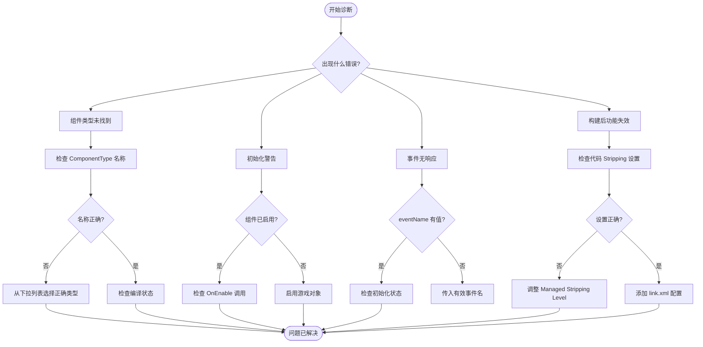

# 故障排除

本文档提供 GameFrameX GameAnalytics 插件的常见问题排查指南，帮助开发者快速定位和解决集成过程中遇到的问题。

## 概述

GameAnalytics 组件在 Unity 项目中可能会遇到多种配置和运行时问题。本文档涵盖从安装配置到运行时错误的各类常见问题，并提供详细的诊断步骤和解决方案。

## 常见问题与解决方案

### 1. 组件类型未找到

**错误信息：**
```
Can not find component type 'XXX'.
```

**问题原因：**
- 在 Inspector 面板中配置的组件类型名称拼写错误
- 指定的分析服务实现类不存在或未正确引用
- 命名空间不匹配

**解决方案：**

1. 打开 Unity 编辑器
2. 在场景中选择挂载了 `GameAnalyticsComponent` 的游戏对象
3. 在 Inspector 面板中检查 **ComponentType** 下拉菜单
4. 从下拉列表中选择正确的分析服务实现类型（不要手动输入）
5. 确保分析服务实现类已正确编译且无语法错误

> Source: [GameAnalyticsComponent.cs](https://github.com/GameFrameX/com.gameframex.unity.gameanalytics/blob/main/Runtime/GameAnalytics/GameAnalyticsComponent.cs#L58-L63)

### 2. 初始化相关警告

**警告信息：**
```
GameAnalyticsManager is not init.
```

**问题原因：**
- 在分析管理器初始化完成之前调用了事件上报或计时方法
- `GameAnalyticsComponent` 的 `Init()` 方法尚未执行

**解决方案：**

GameAnalyticsComponent 会在 `OnEnable()` 时自动初始化。如果您看到此警告，请检查：

1. 确保 `GameAnalyticsComponent` 已正确添加到场景中的游戏对象上
2. 游戏对象的 `OnEnable()` 已被 Unity 引擎调用（游戏对象可能处于禁用状态）
3. 如果需要手动初始化，调用 `ManualInit()` 方法之前确保已完成自动初始化

```csharp
// 正确的方式：确保组件已启用
var analytics = gameObject.GetComponent<GameAnalyticsComponent>();
// Component 会在 OnEnable 时自动初始化
```

> Source: [GameAnalyticsComponent.cs](https://github.com/GameFrameX/com.gameframex.unity.gameanalytics/blob/main/Runtime/GameAnalytics/GameAnalyticsComponent.cs#L170-L177)

### 3. 重复组件警告

**问题描述：**
Unity 提示不能添加多个 GameAnalyticsComponent

**问题原因：**
- 场景中已存在 `GameAnalyticsComponent`，再次添加时会触发 `[DisallowMultipleComponent]` 特性

**解决方案：**

1. 检查场景中是否已存在 GameAnalytics 组件
2. 如需多个配置方案，使用组件列表功能（Inspector 面板中的 `游戏数据分析组件列表`）
3. 删除重复的组件实例

```csharp
// 检查是否已存在组件
var existing = FindObjectsOfType<GameAnalyticsComponent>();
if (existing.Length > 0)
{
    // 使用现有组件，不要再次添加
}
```

> Source: [GameAnalyticsComponent.cs](https://github.com/GameFrameX/com.gameframex.unity.gameanalytics/blob/main/Runtime/GameAnalytics/GameAnalyticsComponent.cs#L12)

### 4. 代码被 Strip 导致的问题

**问题描述：**
- 在构建 IL2CPP 项目后，分析服务功能失效
- 运行时报错找不到特定类型

**问题原因：**
Unity 的代码 stripping 机制可能会移除未直接引用的类

**解决方案：**

插件已包含 `GameFrameXGameAnalyticsCroppingHelper` 用于防止代码被裁剪。如果仍有问题：

1. 打开 `Project Settings > Player > Other Settings`
2. 设置 **Managed Stripping Level** 为 **Minimal**
3. 或在 `link.xml` 文件中添加如下配置：

```xml
<linker>
    <assembly fullname="GameFrameX.GameAnalytics.Runtime" preserve="all"/>
</assembly>
```

> Source: [GameFrameXGameAnalyticsCroppingHelper.cs](https://github.com/GameFrameX/com.gameframex.unity.gameanalytics/blob/main/Runtime/GameFrameXGameAnalyticsCroppingHelper.cs#L1-L17)

### 5. 参数验证错误

**错误信息：**
- 传入空的事件名称时方法无响应

**问题原因：**
- 事件名称参数不能为空字符串或 null

**解决方案：**

所有事件方法和计时方法都使用 `GameFrameworkGuard.NotNullOrEmpty` 进行参数验证。请确保传入有效的事件名称：

```csharp
// ❌ 错误示例
analytics.Event("");
analytics.StartTimer(null);

// ✅ 正确示例
analytics.Event("player_login");
analytics.StartTimer("level_loading");
```

> Source: [GameAnalyticsComponent.cs](https://github.com/GameFrameX/com.gameframex.unity.gameanalytics/blob/main/Runtime/GameAnalytics/GameAnalyticsComponent.cs#L160-L166)

### 6. 编辑器配置问题

**问题描述：**
- Inspector 面板中无法选择组件类型
- 配置参数不显示

**解决方案：**

1. 确保 Unity 已编译完成所有脚本（无编译错误）
2. 检查 Editor 文件夹中的 Inspector 代码是否正常工作
3. 刷新类型列表：关闭并重新打开 Inspector 面板
4. 确保 `GameAnalyticsComponentProvider` 类正确序列化

> Source: [GameAnalyticsComponentInspector.cs](https://github.com/GameFrameX/com.gameframex.unity.gameanalytics/blob/main/Editor/Inspector/GameAnalyticsComponentInspector.cs#L42-L50)

## 诊断流程



## 调试技巧

### 启用调试日志

在 Unity 控制台中查看以下日志分类：

- **Error**: 组件类型未找到等严重错误
- **Warning**: 初始化未完成等警告信息

### 检查初始化状态

```csharp
var analytics = gameObject.GetComponent<GameAnalyticsComponent>();
// 检查初始化状态
if (analytics.GetType().GetProperty("IsInit")?.GetValue(analytics) is bool isInit)
{
    Debug.Log($"Analytics initialized: {isInit}");
}
```

### 验证公共属性

组件会自动收集设备信息。可以在运行时检查这些属性是否正确设置：

```csharp
// 获取公共属性
var properties = analytics.GetPublicProperties();
foreach (var prop in properties)
{
    Debug.Log($"{prop.Key}: {prop.Value}");
}
```

> Source: [BaseGameAnalyticsManager.cs](https://github.com/GameFrameX/com.gameframex.unity.gameanalytics/blob/main/Runtime/GameAnalytics/BaseGameAnalyticsManager.cs#L88-L144)

## 相关链接

- [快速开始](./3-getting-started) - 了解如何快速集成
- [核心架构](./4-core-concepts) - 深入了解组件架构
- [API 接口](./5-api-reference) - 完整的 API 参考文档
- [编辑器配置](./6-configuration) - 了解如何在编辑器中配置组件
- [插件介绍](./1-overview) - 插件概述与功能介绍
