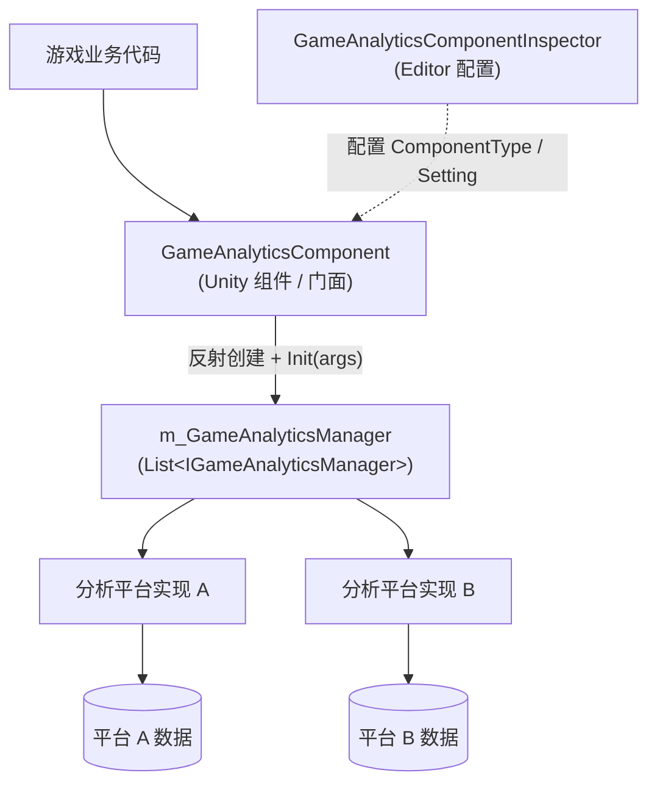

# 游戏数据分析组件简介

GameAnalytics 游戏数据分析组件为 Unity 项目提供统一的游戏数据分析上报入口：你只需要在 Inspector 中挂载 `GameAnalyticsComponent` 并配置数据分析 Provider，就可以用同一套 API 上报事件、管理计时器，并把数据同时送往多个第三方分析平台。组件零外部依赖，支持 Unity 2019.4 及以上版本（当前包版本 1.2.1）。

## 快速开始

### 1. 安装包

选择以下任一方式（任选其一即可）：

**方式一：scopedRegistries（推荐）** —— 编辑 Unity 项目的 `Packages/manifest.json`：

```json
{
  "scopedRegistries": [
    {
      "name": "GameFrameX",
      "url": "https://gameframex.upm.alianblank.uk",
      "scopes": [
        "com.gameframex"
      ]
    }
  ],
  "dependencies": {
    "com.gameframex.unity.gameanalytics": "1.2.0"
  }
}
```

`scopes` 控制哪些包通过此注册表解析，只有以 `com.gameframex` 开头的包才会从这个注册表获取。

Source: [README.zh-CN.md](https://github.com/GameFrameX/com.gameframex.unity.gameanalytics/blob/main/README.zh-CN.md#L34-L52)

**方式二：Git URL** —— 在 `manifest.json` 的 `dependencies` 节点下添加：

```json
{
   "com.gameframex.unity.gameanalytics": "https://github.com/gameframex/com.gameframex.unity.gameanalytics.git"
}
```

也可以在 Unity 的 `Package Manager` 中用 `Git URL` 方式添加，地址为 `https://github.com/gameframex/com.gameframex.unity.gameanalytics.git`；或直接把仓库下载到 Unity 项目的 `Packages` 目录下自动加载。

Source: [README.zh-CN.md](https://github.com/GameFrameX/com.gameframex.unity.gameanalytics/blob/main/README.zh-CN.md#L54-L61)

### 2. 挂载组件并配置 Provider

在场景中创建 `Game Framework/GameAnalytics` 组件（`GameAnalyticsComponent`）。组件在 `Awake` 中收集 Provider，在 `OnEnable` 时自动调用 `Init()`：它会按 Inspector 里配置的 `ComponentType` 反射创建实现了 `IGameAnalyticsManager` 的实例，并把每条 Provider 的 `Setting` 键值对作为初始化参数传入。

```csharp
public void Init()
{
    if (m_IsInit)
    {
        return;
    }

    foreach (var gameAnalyticsComponentProvider in m_gameAnalyticsComponentProviders)
    {
        if (gameAnalyticsComponentProvider.ComponentType.IsNotNullOrWhiteSpace())
        {
            var gameAnalyticsComponentType = Utility.Assembly.GetType(gameAnalyticsComponentProvider.ComponentType);
            if (gameAnalyticsComponentType == null)
            {
                Log.Error($"Can not find component type '{gameAnalyticsComponentProvider.ComponentType}'.");
                continue;
            }

            if (Activator.CreateInstance(gameAnalyticsComponentType) is IGameAnalyticsManager gameAnalyticsManager)
            {
                Dictionary<string, string> args = new Dictionary<string, string>();
                foreach (var param in gameAnalyticsComponentProvider.Setting)
                {
                    args[param.Key] = param.Value;
                }

                gameAnalyticsManager.Init(args);
                m_GameAnalyticsManager.Add(gameAnalyticsManager);
            }
        }
    }

    m_IsInit = true;
}
```

Source: [GameAnalyticsComponent.cs](https://github.com/GameFrameX/com.gameframex.unity.gameanalytics/blob/main/Runtime/GameAnalytics/GameAnalyticsComponent.cs#L47-L80)

### 3. 上报第一个事件

初始化完成后即可调用事件上报与计时 API：

```csharp
// 简单事件上报
public void Event(string eventName)
{
    if (!_isInit) return;
    _gameAnalyticsManager.Event(eventName);
}

// 带数值的事件上报
public void Event(string eventName, float eventValue)
{
    if (!_isInit) return;
    _gameAnalyticsManager.Event(eventName, eventValue);
}

// 开始计时 / 结束计时
public void StartTimer(string eventName)
{
    if (!_isInit) return;
    _gameAnalyticsManager.StartTimer(eventName);
}

public void StopTimer(string eventName)
{
    if (!_isInit) return;
    _gameAnalyticsManager.StopTimer(eventName);
}
```

Source: [README.zh-CN.md](https://github.com/GameFrameX/com.gameframex.unity.gameanalytics/blob/main/README.zh-CN.md#L76-L118)

注意：请确保在使用组件的任何方法之前组件已正确初始化；上报的事件名称应具有代表性和唯一性，以保证数据分析的准确性。

## 工作原理速览

组件采用"门面 + 多 Provider"结构：`GameAnalyticsComponent` 是对外的唯一入口（继承自 `GameFrameworkComponent`），它持有零个或多个实现了 `IGameAnalyticsManager` 的管理器实例，所有公开方法都会遍历列表广播给每一个已配置的分析平台，因此一次调用可以同时上报到多个平台。



各类型职责如下：

| 类型 | 说明 |
|------|------|
| `GameAnalyticsComponent` | Unity 组件门面，`Awake` 收集 Provider、`OnEnable` 自动 `Init()`，所有方法广播到全部 Manager |
| `IGameAnalyticsManager` | 数据分析管理器接口，定义初始化、公共属性、计时器、事件上报、玩家 ID 等 API |
| `BaseGameAnalyticsManager` | 管理器基类，供具体平台实现继承复用 |
| `GameAnalyticsComponentInspector` | Editor 扩展，用于在 Inspector 中可视化配置 Provider 与 Setting |
| `GameFrameXGameAnalyticsCroppingHelper` | 裁剪（移除模块）辅助类 |

`IGameAnalyticsManager` 提供的核心 API 一览（完整签名见接口文件）：

| 方法 | 签名 | 说明 |
|------|------|------|
| 自动初始化 | `void Init(Dictionary<string, string> args)` | 组件启用时自动调用 |
| 手动初始化 | `void ManualInit(Dictionary<string, string> args)` | 仅 `IsManualInit()` 为真时由组件转发 |
| 设置公共属性 | `void SetPublicProperties(string key, object value)` | 所有事件附带的公共字段 |
| 清除/获取公共属性 | `void ClearPublicProperties()` / `Dictionary<string, object> GetPublicProperties()` | 清空或读取公共属性 |
| 计时器 | `StartTimer` / `PauseTimer` / `ResumeTimer` / `StopTimer(string eventName)` | 事件耗时的开始/暂停/恢复/结束 |
| 事件上报 | `Event(string eventName)` 及带 `float` / `Dictionary<string, object>` 的重载 | 共 4 个重载 |
| 设置玩家 ID | `void SetPlayerId(string playerId)` | 标识当前玩家 |

Source: [IGameAnalyticsManager.cs](https://github.com/GameFrameX/com.gameframex.unity.gameanalytics/blob/main/Runtime/GameAnalytics/IGameAnalyticsManager.cs#L8-L105)

## 接下来

- 上报事件与计时器的具体用法，见《事件上报与计时功能》任务页
- 在 Inspector 中配置数据分析 Provider 与 Setting，见《配置数据分析 Provider》任务页
- 排查初始化失败、`Can not find component type` 报错等问题，见《初始化与上报失败排查》排查页
- 版本演进记录见仓库 [CHANGELOG.md](https://github.com/GameFrameX/com.gameframex.unity.gameanalytics/blob/main/CHANGELOG.md)
