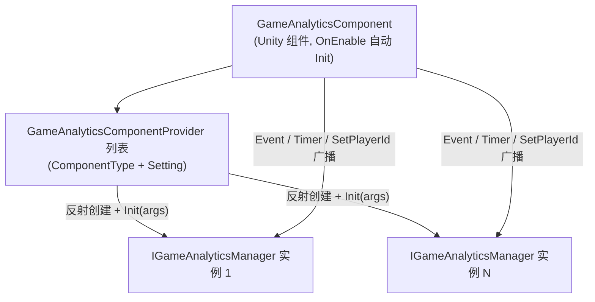

# 安装与快速上手

GameAnalytics 游戏数据分析组件为 Unity 项目提供事件上报与计时器功能的统一接口:装好包、在场景挂上 `GameAnalyticsComponent` 并配置 Provider 后,一行 `Event(...)` 即可上报数据到任意数据分析 SDK。本页带你从安装走到第一次上报。

## 前置条件

- Unity `2019.4` 或更高版本(见 [package.json](https://github.com/GameFrameX/com.gameframex.unity.gameanalytics/blob/main/package.json#L7) 中 `"unity": "2019.4"`)。
- 项目中已有 GameFrameX 框架基础组件:`GameAnalyticsComponent` 继承自 `GameFrameworkComponent`,并使用 `GameFrameX.Runtime` 命名空间下的 `Utility.Assembly`、`Log` 等基础设施(见 [GameAnalyticsComponent.cs](https://github.com/GameFrameX/com.gameframex.unity.gameanalytics/blob/main/Runtime/GameAnalytics/GameAnalyticsComponent.cs#L1-L14))。
- 本包自身在 `package.json` 中声明 `"dependencies": {}`,无额外第三方依赖。

## 快速开始

### 第 1 步:安装包

任选以下一种方式(当前仓库版本为 `1.2.1`,README 示例中写的 `1.2.0` 为历史版本号):

1. 编辑 Unity 项目的 `Packages/manifest.json`,添加 `scopedRegistries` 部分:

```json
{
  "scopedRegistries": [
    {
      "name": "GameFrameX",
      "url": "https://gameframex.upm.alianblank.uk",
      "scopes": [
        "com.gameframex"
      ]
    }
  ],
  "dependencies": {
    "com.gameframex.unity.gameanalytics": "1.2.0"
  }
}
```

`scopes` 控制哪些包通过此注册表解析,只有以 `com.gameframex` 开头的包才会从这个注册表获取。

Source: [README.zh-CN.md](https://github.com/GameFrameX/com.gameframex.unity.gameanalytics/blob/main/README.zh-CN.md#L34-L52)

2. 直接在 `manifest.json` 的 `dependencies` 节点下添加 Git 地址:

```json
{
   "com.gameframex.unity.gameanalytics": "https://github.com/gameframex/com.gameframex.unity.gameanalytics.git"
}
```

Source: [README.zh-CN.md](https://github.com/GameFrameX/com.gameframex.unity.gameanalytics/blob/main/README.zh-CN.md#L54-L59)

3. 在 Unity 的 `Package Manager` 中选择 `Add package from git URL`,填入 `https://github.com/gameframex/com.gameframex.unity.gameanalytics.git`。
4. 直接下载仓库放置到 Unity 项目的 `Packages` 目录下,Unity 会自动加载识别。

### 第 2 步:挂载组件

在 Unity 菜单中选择 `Component → Game Framework → GameAnalytics`,向场景中的 GameFrameX 组件载体 GameObject 添加 `GameAnalyticsComponent`。组件标注了 `[DisallowMultipleComponent]`,同一 GameObject 只能挂一个。

```csharp
[DisallowMultipleComponent]
[AddComponentMenu("Game Framework/GameAnalytics")]
public sealed class GameAnalyticsComponent : GameFrameworkComponent
```

Source: [GameAnalyticsComponent.cs](https://github.com/GameFrameX/com.gameframex.unity.gameanalytics/blob/main/Runtime/GameAnalytics/GameAnalyticsComponent.cs#L12-L14)

### 第 3 步:配置数据分析 Provider

在 Inspector(自定义编辑器见 [GameAnalyticsComponentInspector.cs](https://github.com/GameFrameX/com.gameframex.unity.gameanalytics/blob/main/Editor/Inspector/GameAnalyticsComponentInspector.cs))中为组件添加 Provider 条目,填写:

| 字段 | 说明 |
|------|------|
| `ComponentType` | 实现 `IGameAnalyticsManager` 的类型完整名称(字符串) |
| `Setting` | 传给该 SDK 的键值对配置(如 AppKey、SecretKey 等) |

组件启用时会在 `OnEnable()` 中自动执行 `Init()`:按 `ComponentType` 通过反射创建实例,把 `Setting` 汇总成 `Dictionary<string, string>` 后调用 `gameAnalyticsManager.Init(args)`,并把实例加入管理列表——之后所有上报调用会广播到每一个已注册的 Provider。

```csharp
public void Init()
{
    if (m_IsInit)
    {
        return;
    }

    foreach (var gameAnalyticsComponentProvider in m_gameAnalyticsComponentProviders)
    {
        if (gameAnalyticsComponentProvider.ComponentType.IsNotNullOrWhiteSpace())
        {
            var gameAnalyticsComponentType = Utility.Assembly.GetType(gameAnalyticsComponentProvider.ComponentType);
            if (gameAnalyticsComponentType == null)
            {
                Log.Error($"Can not find component type '{gameAnalyticsComponentProvider.ComponentType}'.");
                continue;
            }

            if (Activator.CreateInstance(gameAnalyticsComponentType) is IGameAnalyticsManager gameAnalyticsManager)
            {
                Dictionary<string, string> args = new Dictionary<string, string>();
                foreach (var param in gameAnalyticsComponentProvider.Setting)
                {
                    args[param.Key] = param.Value;
                }

                gameAnalyticsManager.Init(args);
                m_GameAnalyticsManager.Add(gameAnalyticsManager);
            }
        }
    }

    m_IsInit = true;
}
```

Source: [GameAnalyticsComponent.cs](https://github.com/GameFrameX/com.gameframex.unity.gameanalytics/blob/main/Runtime/GameAnalytics/GameAnalyticsComponent.cs#L47-L80)

### 第 4 步:上报第一个事件与计时器

初始化由组件自动完成,业务代码中直接调用即可(命名空间 `GameFrameX.GameAnalytics.Runtime`):

```csharp
// 开始/结束计时
GameEntry.GameAnalytics.StartTimer("level_1");
GameEntry.GameAnalytics.StopTimer("level_1");

// 简单事件上报
GameEntry.GameAnalytics.Event("level_complete");

// 带数值的事件上报
GameEntry.GameAnalytics.Event("coin_gain", 100f);

// 带自定义字段的事件上报
GameEntry.GameAnalytics.Event("purchase",
    new Dictionary<string, object> { { "sku", "gem_100" }, { "price", "0.99" } });

// 带数值和自定义字段的事件上报
GameEntry.GameAnalytics.Event("boss_kill", 1f,
    new Dictionary<string, object> { { "boss_id", "b_003" } });
```

Source: [README.zh-CN.md](https://github.com/GameFrameX/com.gameframex.unity.gameanalytics/blob/main/README.zh-CN.md#L80-L148)

> **注意:** 组件未初始化(`m_IsInit == false`)时,除 `Init()` 外的所有方法都会直接 `return`,不会报错也不会上报。事件名称应具有代表性和唯一性,以确保数据分析的准确性。

## 工作原理速览

组件是一个"多路广播"外壳,真正的数据分析逻辑由你注入的 `IGameAnalyticsManager` 实现承担(例如同时接入 GA、Firebase 等多个平台):



## 常见错误

| 症状 | 原因 | 修复 |
|------|------|------|
| 调用 `Event` / `StartTimer` 没有任何上报,也不报错 | 组件未初始化,方法开头 `if (!_isInit) return;` 直接返回 | 确认组件已随 GameObject 启用触发 `OnEnable → Init()`;或先调用 `Init()` |
| Console 出现 `Can not find component type '...'.` | Provider 的 `ComponentType` 类型名写错,或该类型所在程序集未被引用 | 核对类型完整名称;确认实现类为 `public` 且程序集已加载 |
| 同一 GameObject 挂不上第二个组件 | `[DisallowMultipleComponent]` 限制 | 只保留一个 `GameAnalyticsComponent`,多平台用多个 Provider 解决 |
| 需要登录后才能用的 SDK 拿不到参数 | 该 Provider 标记为手动初始化,自动 `Init` 时未传业务参数 | 登录成功后调用 `ManualInit(Dictionary<string, string> extraArgs)`(见 [GameAnalyticsComponent.cs](https://github.com/GameFrameX/com.gameframex.unity.gameanalytics/blob/main/Runtime/GameAnalytics/GameAnalyticsComponent.cs#L86-L100)) |

## 接下来

- 完整接口清单与各方法签名,见 [IGameAnalyticsManager.cs](https://github.com/GameFrameX/com.gameframex.unity.gameanalytics/blob/main/Runtime/GameAnalytics/IGameAnalyticsManager.cs#L8-L105)(含 `PauseTimer` / `ResumeTimer` / `SetPublicProperties` / `SetPlayerId` 等)。
- 基类默认实现参考 [BaseGameAnalyticsManager.cs](https://github.com/GameFrameX/com.gameframex.unity.gameanalytics/blob/main/Runtime/GameAnalytics/BaseGameAnalyticsManager.cs)。
- Inspector 自定义编辑器见 [GameAnalyticsComponentInspector.cs](https://github.com/GameFrameX/com.gameframex.unity.gameanalytics/blob/main/Editor/Inspector/GameAnalyticsComponentInspector.cs)。
- 版本历史见仓库 [CHANGELOG.md](https://github.com/GameFrameX/com.gameframex.unity.gameanalytics/blob/main/CHANGELOG.md)。
- 官方文档站:https://gameframex.doc.alianblank.com ;社区 QQ 群:467608841 / 233840761。

## 背景

组件在 `Awake` 中将 `IsAutoRegister = false` 并新建空的 `IGameAnalyticsManager` 列表,真正的实例化延迟到 `OnEnable` 触发的 `Init()` 中完成,因此 Provider 类型必须在组件启用时即可通过 `Utility.Assembly.GetType` 解析到。这种"反射 + 字符串配置"的设计让你无需修改本包源码,就能接入任意实现了 `IGameAnalyticsManager` 的数据分析 SDK。

Source: [GameAnalyticsComponent.cs](https://github.com/GameFrameX/com.gameframex.unity.gameanalytics/blob/main/Runtime/GameAnalytics/GameAnalyticsComponent.cs#L20-L30)
