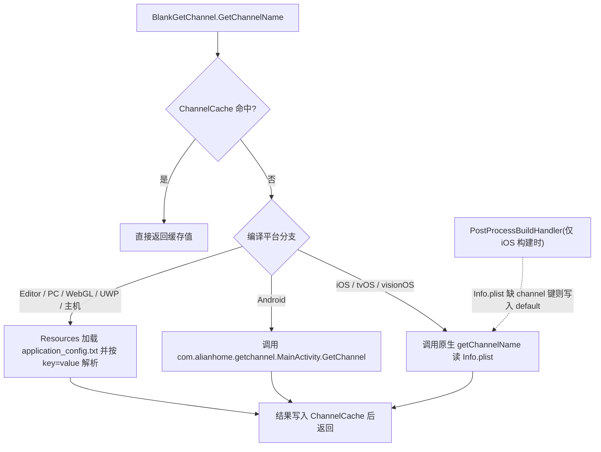

# 工作原理:渠道读取流程

调用 `BlankGetChannel.GetChannelName()` 时,组件先查进程内缓存 `ChannelCache`,未命中则按当前编译平台走三条不同读取路径(Android 原生 jar、iOS 原生 Info.plist、Editor/PC 读 `Resources/application_config.txt`),结果写回缓存后返回。整个入口只有一个静态方法,定义在 [Runtime/BlankGetChannel.cs](https://github.com/GameFrameX/com.gameframex.unity.getchannel/blob/main/Runtime/BlankGetChannel.cs#L98-L141)。

## 读取流程总览



## 各平台读取来源

| 平台(编译宏) | 配置来源 | 代码入口 |
|------|------|------|
| `UNITY_ANDROID` | AndroidManifest.xml 主启动 Activity 的 `meta-data android:name="channel"` | `new AndroidJavaClass("com.alianhome.getchannel.MainActivity")` 调静态方法 `GetChannel`,原生实现打包在 [Plugins/Android/com.alianhome.getchannel.jar](https://github.com/GameFrameX/com.gameframex.unity.getchannel/blob/main/Plugins/Android/com.alianhome.getchannel.jar) |
| `UNITY_IOS` / `UNITY_TVOS` / `UNITY_VISIONOS` | Info.plist 中的 String 键 `channel` | `[DllImport("__Internal")] getChannelName(channelKey)`,原生实现见 [Plugins/iOS/BlankGetChannel/BlankGetChannel.mm](https://github.com/GameFrameX/com.gameframex.unity.getchannel/blob/main/Plugins/iOS/BlankGetChannel/BlankGetChannel.mm) |
| `UNITY_STANDALONE` / `UNITY_EDITOR` / `UNITY_WEBGL` / `UNITY_WSA` / `UNITY_PS4` / `UNITY_PS5` / `UNITY_XBOXONE` / `UNITY_SWITCH` | `Resources/application_config.txt`(每行 `key=value`) | `Resources.Load<TextAsset>("application_config")` 逐行解析 |

方法签名的默认值:第一个参数 `channelKey = "channel"`,第二个参数 `defaultValue = "default"`,即未配置渠道时返回字符串 `"default"`。

## 步骤一:缓存命中检查

方法入口先查静态字典 `ChannelCache`(初始容量 32),命中直接返回,不触发任何平台读取:

```csharp
private static readonly Dictionary<string, string> ChannelCache = new Dictionary<string, string>(32);

public static string GetChannelName(string channelKey = "channel", string defaultValue = "default")
{
    if (ChannelCache.TryGetValue(channelKey, out var value))
    {
        return value;
    }

    string channelName = defaultValue;
```

Source: [Runtime/BlankGetChannel.cs](https://github.com/GameFrameX/com.gameframex.unity.getchannel/blob/main/Runtime/BlankGetChannel.cs#L57-L105)

注意:缓存没有失效机制,进程生命周期内第一次读到的值会被一直使用。

## 步骤二:Editor/PC 路径——解析 application_config.txt

Editor、Standalone、WebGL、UWP 及各主机平台走 `Resources.Load` 分支。整个文件被逐行解析并**全部键值**写入缓存(不只是当前请求的键),因此随后读取其他键(如 `sub_channel`)也直接走缓存:

```csharp
var textAsset = Resources.Load<TextAsset>("application_config");
if (textAsset != null)
{
    var lines = textAsset.text.Split(new string[] { "\n", "\r", "\r\n" }, StringSplitOptions.RemoveEmptyEntries);
    foreach (var line in lines)
    {
        var split = line.Split(new string[] { "=" }, StringSplitOptions.RemoveEmptyEntries);
        if (split.Length > 1)
        {
            var key = split[0].Trim();
            var channelValue = split[1].Trim();
            ChannelCache[key] = channelValue;
        }
    }
}
else
{
    ChannelCache[channelKey] = defaultValue;
}
```

Source: [Runtime/BlankGetChannel.cs](https://github.com/GameFrameX/com.gameframex.unity.getchannel/blob/main/Runtime/BlankGetChannel.cs#L106-L125)

文件不存在或该键未配置时,把 `defaultValue` 写入缓存并返回。解析按第一个 `=` 切分,等号后内容整体 Trim 后作为值,因此值中可以包含 `=` 之外的普通字符。

## 步骤三:Android 路径——调用原生 jar

```csharp
using (AndroidJavaClass androidJavaClass = new AndroidJavaClass("com.alianhome.getchannel.MainActivity"))
{
    channelName = androidJavaClass.CallStatic<string>("GetChannel", channelKey);
}
```

Source: [Runtime/BlankGetChannel.cs](https://github.com/GameFrameX/com.gameframex.unity.getchannel/blob/main/Runtime/BlankGetChannel.cs#L131-L135)

C# 侧只透传 `channelKey`,取值逻辑在 jar 内(读取 Manifest 的 meta-data)。

## 步骤四:iOS/tvOS/visionOS 路径——P/Invoke 原生方法

```csharp
[DllImport("__Internal")]
private static extern string getChannelName(string channelKey);
```

Source: [Runtime/BlankGetChannel.cs](https://github.com/GameFrameX/com.gameframex.unity.getchannel/blob/main/Runtime/BlankGetChannel.cs#L47-L48)

## 步骤五:结果写回缓存

三个分支的返回值统一落到方法末尾这两行,之后再调用同一键不会重复触发平台读取:

```csharp
ChannelCache[channelKey] = channelName;
return channelName;
```

Source: [Runtime/BlankGetChannel.cs](https://github.com/GameFrameX/com.gameframex.unity.getchannel/blob/main/Runtime/BlankGetChannel.cs#L139-L140)

## 配套构建后处理:iOS 兜底写入

iOS 构建完成后,编辑器脚本 `PostProcessBuildHandler`(`[PostProcessBuild(99)]`,仅 `BuildTarget.iOS`)会读取生成的 Info.plist:若其中没有 `channel` 键,则写入 `"default"` 并写回文件;若已有该键则跳过并打印日志 `已有渠道,跳过设置=>`:

```csharp
string plistPath = path + "/Info.plist";
PlistDocument plist = new PlistDocument();
plist.ReadFromString(File.ReadAllText(plistPath));
if (!plist.root.values.TryGetValue(channelKey, out var value))
{
    plist.root.SetString(channelKey, channelValue);
    plist.WriteToFile(plistPath);
    Debug.Log("配置渠道成功=>" + channelValue);
}
else
{
    Debug.Log("已有渠道,跳过设置=>" + value);
}
```

Source: [Editor/PostProcessBuildHandler.cs](https://github.com/GameFrameX/com.gameframex.unity.getchannel/blob/main/Editor/PostProcessBuildHandler.cs#L31-L49)

也就是说 iOS 真机上运行时读取的 `channel` 键至少存在(手动在 Info.plist 配置的值优先),异常被 `try/catch` 包裹,失败仅 `Debug.LogException` 不会中断构建。

## 调用示例

示例组件在按钮点击时用自定义键 `appchannel` 读取渠道:

```csharp
public class BlankGetChannelExample : MonoBehaviour
{
    private string value;
    void OnGUI()
    {
        GUILayout.Label(value);
        if (GUILayout.Button("GET", GUILayout.Width(200), GUILayout.Height(100)))
        {
            value = BlankGetChannel.GetChannelName("appchannel");
        }
    }
}
```

Source: [Sample~/BlankGetChannelExample.cs](https://github.com/GameFrameX/com.gameframex.unity.getchannel/blob/main/Sample~/BlankGetChannelExample.cs#L4-L15)

## 常见错误

| 症状 | 原因 | 规避 |
|------|------|------|
| 始终返回 `"default"` | Editor/PC 下 Resources 目录缺少 `application_config.txt`,或文件内没有对应键 | 在 `Assets/Resources/` 放置该文件并写 `channel=xxx`;注意文件名不带扩展名加载,实际文件为 `.txt` |
| Android 取不到值 | Manifest 主启动 Activity 未配置 `meta-data android:name="channel"` | 在主 Activity 内加 `<meta-data android:name="channel" android:value="android_cn_taptap" />` |
| iOS 取不到值 | Info.plist 缺 `channel` 键时会被构建后处理写入 `"default"`,之后运行期一直读到 `default` | 构建前在 Xcode 工程 Info.plist 中配置 String 类型 `channel` 键 |
| 修改配置后运行期不生效 | `ChannelCache` 进程内无失效机制,首次读取后一直复用 | 重启应用/重新进 Play Mode |

## 相关链接

- 配置各平台渠道的具体操作:仓库内 [README.zh-CN.md](https://github.com/GameFrameX/com.gameframex.unity.getchannel/blob/main/README.zh-CN.md)
- 版本历史:[CHANGELOG.md](https://github.com/GameFrameX/com.gameframex.unity.getchannel/blob/main/CHANGELOG.md)
