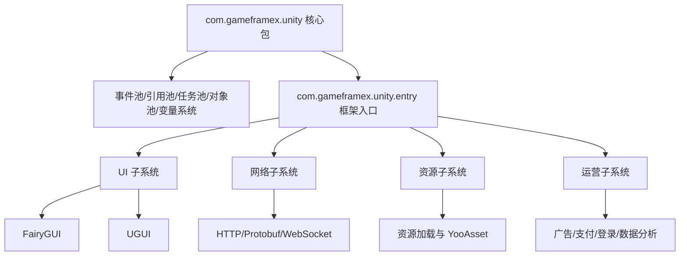

# 项目简介与特性

GameFrameX Unity 是 GameFrameX 综合解决方案的 Unity 客户端实现，提供 90+ 个模块化组件，覆盖从核心框架、资源管理、UI 系统、网络通信到广告、支付、登录、数据分析等游戏开发与运营全链路。本框架兼容 Unity 2019.4 及以上版本，定位为"独立游戏前后端一体化解决方案"。

## 核心特性

- **模块化设计** — 每个组件独立成包，按需引入到 Unity 工程的 `Packages/manifest.json`，互不干扰
- **热更新支持** — 集成 HybridCLR，支持 C# 热更新；同时提供 XLua 适配包
- **多 UI 方案** — 同时支持 FairyGUI 与 UGUI，按团队技术栈自由选择
- **异步优先** — 基于 UniTask 的 async/await 异步编程模型
- **全平台覆盖** — iOS、Android、WebGL、微信/抖音/支付宝小游戏
- **运营组件丰富** — 广告（穿山甲、TopOn）、支付（支付宝、Apple、Google）、登录（QQ、微信、Apple、Facebook、Google）、数据分析、对象存储等开箱即用

## 快速开始

### 1. 配置 Scoped Registry

在 Unity 工程的 `Packages/manifest.json` 中添加 GameFrameX 的 scoped registry：

```json
{
  "scopedRegistries": [
    {
      "name": "GameFrameX",
      "url": "https://gameframex.upm.alianblank.uk",
      "scopes": [
        "com.gameframex"
      ]
    }
  ],
  "dependencies": {
    "com.gameframex.unity": "1.11.0"
  }
}
```

Source: [README.zh-CN.md](https://github.com/GameFrameX/GameFrameX.Unity/blob/main/README.zh-CN.md#L38-L57)

### 2. 添加所需组件

在 `dependencies` 中按需添加组件包，版本号可在 [Releases](https://github.com/GameFrameX/GameFrameX.Unity/releases) 页面查看。常用组合示例：

```json
{
  "dependencies": {
    "com.gameframex.unity": "1.11.0",
    "com.gameframex.unity.asset": "2.0.0",
    "com.gameframex.unity.ui": "2.1.1",
    "com.gameframex.unity.ui.fairygui": "3.0.0",
    "com.gameframex.unity.procedure": "1.0.4",
    "com.gameframex.unity.event": "1.0.2",
    "com.gameframex.unity.fsm": "1.0.3",
    "com.gameframex.unity.network": "2.5.1",
    "com.gameframex.unity.sound": "1.0.6",
    "com.gameframex.unity.localization": "2.0.0"
  }
}
```

Source: [README.zh-CN.md](https://github.com/GameFrameX/GameFrameX.Unity/blob/main/README.zh-CN.md#L59-L82)

## 工作原理速览

GameFrameX 的核心包 `com.gameframex.unity` 提供了框架运行时与编辑器基础能力，涵盖事件池、引用池、任务池、对象池和变量系统。其他组件（如 UI、网络、资源管理）均在此基础上以独立包的形式存在，通过 Unity Package Manager 的 scoped registry 机制按需分发。



Source: [README.zh-CN.md](https://github.com/GameFrameX/GameFrameX.Unity/blob/main/README.zh-CN.md#L85-L113)

## 组件一览

版本号通过 [GameFrameX UPM Registry](https://gameframex.upm.alianblank.uk) 自动获取。下表汇总各分组的关键组件，完整列表见 [README.zh-CN.md](https://github.com/GameFrameX/GameFrameX.Unity/blob/main/README.zh-CN.md)。

| 分组 | 代表组件 | 作用 |
|------|---------|------|
| 核心框架 | com.gameframex.unity、entry、event、fsm、procedure | 运行时骨架、事件系统、状态机、流程管理 |
| 资源管理 | com.gameframex.unity.asset、download、builder | 资源加载、文件下载、构建管线 |
| UI 框架 | com.gameframex.unity.ui、ui.fairygui、ui.ugui | UI 基础与 FairyGUI/UGUI 适配 |
| 网络通信 | com.gameframex.unity.web、web.protobuff、psygames.unitywebsocket、webview | HTTP、Protobuf、WebSocket、WebView |
| 数据与配置 | com.gameframex.unity.config、localization、focus-creative-games.luban | 配置管理、本地化、Luban 配置生成 |
| 音频与动画 | com.gameframex.unity.sound、demigiant.dotween、esotericsoftware.spine | 音频、DoTween 动画、Spine 骨骼动画 |
| 场景与设置 | com.gameframex.unity.scene、setting | 场景切换、玩家设置 |
| 热更新 | com.gameframex.unity.tencent.xlua、xlua | XLua 热更方案 |
| 广告 | advertisement、advertisement.csj、advertisement.topon 及小游戏广告 | 穿山甲、TopOn、微信/抖音/支付宝/快手小游戏广告 |
| 支付 | com.gameframex.unity.payment、payment.alipay、payment.apple、payment.google | 统一支付接口与三方实现 |
| 登录 | login.apple、login.facebook、login.google、login.qq、login.wechat | 各平台登录 SDK |
| 数据分析 | gameanalytics、sentry、adjust 等 | 数据统计、错误追踪、归因分析 |
| 对象存储 | objectstorage、objectstorage.aliyun、objectstorage.qiniu、objectstorage.tencent | 阿里云 OSS、七牛、腾讯云 COS |
| 小游戏 | minigame.wechat、tuyoogame.yooasset.minigame.* | 微信/YooAsset 小游戏适配 |
| 平台工具 | getchannel、operationclipboard、systeminfo、sharesdk 等 | 渠道号、剪贴板、设备标识、分享 |

Source: [README.zh-CN.md](https://github.com/GameFrameX/GameFrameX.Unity/blob/main/README.zh-CN.md#L85-L239)

## 接下来

- 查看完整组件版本与说明：[README.zh-CN.md](https://github.com/GameFrameX/GameFrameX.Unity/blob/main/README.zh-CN.md)
- 接入流程管理：[流程（Procedure）组件](https://github.com/GameFrameX/GameFrameX.Unity/blob/main/README.zh-CN.md)
- 接入事件系统：[事件（Event）组件](https://github.com/GameFrameX/GameFrameX.Unity/blob/main/README.zh-CN.md)
- 接入网络通信：[网络（Network/Web）组件](https://github.com/GameFrameX/GameFrameX.Unity/blob/main/README.zh-CN.md)
- 官方文档站：[GameFrameX 文档](https://gameframex.doc.alianblank.com)
- 社区支持：QQ 群 467608841
