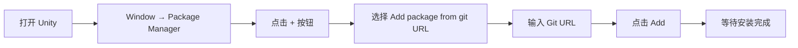
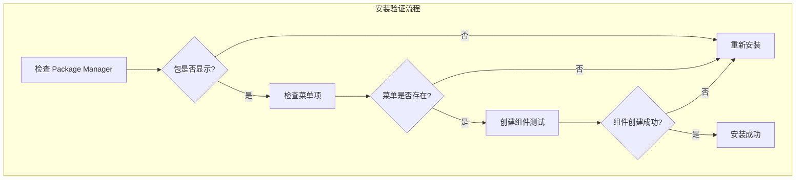

# 安装方式

本文档介绍如何在 Unity 项目中安装 GlobalConfig 全局配置组件。

## 概述

GlobalConfig 是 GameFrameX 框架的核心组件之一，用于管理游戏的全局配置信息，包括应用程序版本检查地址、资源版本检查地址、服务器地址等。该组件采用 Unity Package Manager (UPM) 方式进行管理，支持多种安装途径以适应不同的开发工作流。

## 安装前提条件

在安装 GlobalConfig 组件之前，请确保您的开发环境满足以下要求：

| 需求 | 最低版本 | 说明 |
|------|----------|------|
| Unity 编辑器 | 2017.1 | 支持的 Unity 版本 |
| 包管理器 | 内置 | Unity 2017.1+ 内置 |

### 依赖项说明

GlobalConfig 组件依赖于以下 GameFrameX 核心包：

| 依赖包 | 版本要求 | 说明 |
|--------|----------|------|
| com.gameframex.unity | 1.1.1 | GameFrameX 核心框架 |
| com.gameframex.unity.web | 1.1.2 | Web 网络请求组件 |

> **注意**：当使用 UPM 方式安装时，依赖项会自动解析并安装。您无需手动处理依赖关系。

## 安装方式

GlobalConfig 组件提供三种安装方式，您可以根据项目需求选择最适合的一种：

### 方式一：通过 manifest.json 安装（推荐）

这是最推荐的安装方式，便于版本管理和团队协作。您需要在项目的 `Packages/manifest.json` 文件中添加包依赖。

**操作步骤：**

1. 找到您 Unity 项目的 `Packages` 文件夹
2. 使用文本编辑器打开 `manifest.json` 文件
3. 在 `dependencies` 节点下添加以下内容：

```json
{
  "dependencies": {
    "com.gameframex.unity.globalconfig": "https://github.com/GameFrameX/com.gameframex.unity.globalconfig.git"
  }
}
```

> **注意**：如果您使用的是旧版本的 Git URL (`https://github.com/AlianBlank/com.gameframex.unity.globalconfig.git`)，仍可继续使用，但建议更新为新的官方仓库地址。

**示例完整的 manifest.json：**

```json
{
  "dependencies": {
    "com.gameframex.unity.globalconfig": "https://github.com/GameFrameX/com.gameframex.unity.globalconfig.git",
    "com.unity.collab-proxy": "1.15.18",
    "com.unity.ide.rider": "3.0.15",
    "com.unity.ide.visualstudio": "2.0.16",
    "com.unity.ide.vscode": "1.2.5",
    "com.unity.test-framework": "1.1.31",
    "com.unity.textmeshpro": "3.0.6",
    "com.unity.timeline": "1.6.4",
    "com.unity.ugui": "1.0.0",
    "com.unity.modules.ai": "1.0.0",
    "com.unity.modules.androidjni": "1.0.0",
    "com.unity.modules.animation": "1.0.0",
    "com.unity.modules.assetbundle": "1.0.0",
    "com.unity.modules.audio": "1.0.0",
    "com.unity.modules.cloth": "1.0.0",
    "com.unity.modules.director": "1.0.0",
    "com.unity.modules.imageconversion": "1.0.0",
    "com.unity.modules.imgui": "1.0.0",
    "com.unity.modules.jsonserialize": "1.0.0",
    "com.unity.modules.particlesystem": "1.0.0",
    "com.unity.modules.physics": "1.0.0",
    "com.unity.modules.physics2d": "1.0.0",
    "com.unity.modules.screencapture": "1.0.0",
    "com.unity.modules.terrain": "1.0.0",
    "com.unity.modules.terrainphysics": "1.0.0",
    "com.unity.modules.tilemap": "1.0.0",
    "com.unity.modules.ui": "1.0.0",
    "com.unity.modules.uielements": "1.0.0",
    "com.unity.modules.umbra": "1.0.0",
    "com.unity.modules.unityanalytics": "1.0.0",
    "com.unity.modules.unitywebrequest": "1.0.0",
    "com.unity.modules.unitywebrequestassetbundle": "1.0.0",
    "com.unity.modules.unitywebrequestaudio": "1.0.0",
    "com.unity.modules.unitywebrequesttexture": "1.0.0",
    "com.unity.modules.unitywebrequestwww": "1.0.0",
    "com.unity.modules.vehicles": "1.0.0",
    "com.unity.modules.video": "1.0.0",
    "com.unity.modules.vr": "1.0.0",
    "com.unity.modules.wind": "1.0.0",
    "com.unity.modules.xr": "1.0.0"
  }
}
```

4. 保存文件并返回 Unity 编辑器
5. 等待包管理器自动下载并导入依赖包

### 方式二：通过 Unity Package Manager 安装

如果您更喜欢使用图形界面，可以通过 Unity 内置的 Package Manager 安装。

**操作步骤：**

1. 打开 Unity 编辑器
2. 导航到菜单：**Window** → **Package Manager**
3. 在 Package Manager 窗口中，点击左上角的 **+** 按钮
4. 选择 **Add package from git URL...** 选项
5. 在输入框中粘贴以下 Git URL：

```
https://github.com/GameFrameX/com.gameframex.unity.globalconfig.git
```

6. 点击 **Add** 按钮开始安装
7. 等待下载和导入完成



### 方式三：手动安装（本地开发）

如果您需要使用本地开发版本或无法访问网络，可以采用手动安装方式。

**操作步骤：**

1. 访问 GitHub 仓库下载源代码：

   ```
   https://github.com/GameFrameX/com.gameframex.unity.globalconfig.git
   ```

2. 将下载的文件夹内容复制到 Unity 项目的 `Packages` 目录下
3. Unity 会自动识别并加载符合规范的包
4. 如果需要更新版本，只需替换文件夹内容

**注意事项：**
- 包文件夹需要包含 `package.json` 文件才能被 Unity 正确识别
- 建议使用有意义的文件夹名称，例如：`Packages/com.gameframex.unity.globalconfig/`

## 安装验证

安装完成后，可以通过以下方式验证是否成功：

1. **检查 Package Manager**：在 Package Manager 窗口中确认 `Game Frame X Global Config` 包已显示
2. **检查菜单项**：在 Unity 菜单栏中确认出现 **Game Framework** → **Global Config** 菜单项
3. **创建组件**：在场景中创建空物体，右键点击 **Add Component**，搜索 "Global Config"，确认组件可正常添加



## 常见问题

### Q1: 安装失败，提示网络错误

**解决方案**：
- 检查网络连接是否正常
- 尝试使用代理或 VPN
- 使用方式三进行手动安装

### Q2: 依赖项版本冲突

**解决方案**：
- 检查其他包对 `com.gameframex.unity` 的版本要求
- 在 manifest.json 中明确指定兼容的版本号

### Q3: 包版本过旧

**解决方案**：
- Git URL 安装方式默认获取最新版本
- 如需特定版本，可在 URL 后添加版本标签，例如：
  ```
  https://github.com/GameFrameX/com.gameframex.unity.globalconfig.git#1.3.0
  ```

## 相关链接

- [GitHub 仓库](https://github.com/GameFrameX/com.gameframex.unity.globalconfig.git)
- [GameFrameX 官方文档](https://gameframex.doc.alianblank.com)
- [添加到场景](./3-getting-started.1-add-to-scene)
- [配置属性](./3-getting-started.2-configure-properties)
- [代码访问](./3-getting-started.3-code-access)
