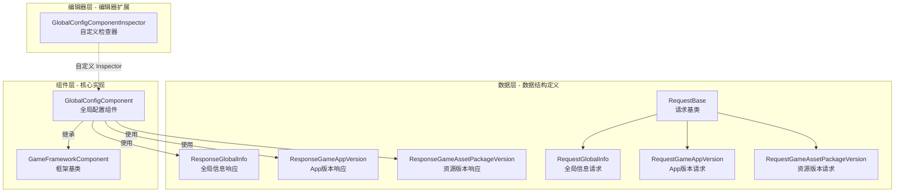

# GlobalConfig 组件简介

GlobalConfig 组件是 GameFrameX 框架的核心组成部分，提供 Unity 游戏项目中的全局配置管理能力。该组件集中管理应用程序版本检查、资源版本检查、AOT 代码列表等全局配置信息，支持通过编辑器可视化配置和代码动态设置两种方式。

## 概述

GlobalConfig 组件设计用于解决游戏项目中全局配置分散、难以管理的问题。在游戏开发过程中，存在许多需要全局访问的配置数据，例如服务器地址、版本检查接口、应用商店链接等。传统的做法是将这些配置硬编码或分散在多个配置文件中，导致维护困难且容易出错。

GlobalConfig 组件通过统一的接口和标准化的数据模型，将所有全局配置集中管理。该组件继承自 `GameFrameworkComponent`，可以直接作为 Unity 组件添加到场景中，并通过 GameFrameX 框架的组件管理系统进行全局访问。这种设计使得配置数据的设置和获取变得简单统一，同时支持编辑器配置和运行时动态设置两种模式。

组件的核心功能包括四个方面：首先，`CheckAppVersionUrl` 属性用于存储应用程序版本检查的 URL 地址，使游戏能够查询是否有新版本可用；其次，`CheckResourceVersionUrl` 属性用于存储资源版本检查的 URL 地址，支持热更新功能的资源管理；第三，`AOTCodeList` 和 `AOTCodeLists` 属性用于配置 AOT 补充元数据列表，解决 IL2CPP 构建模式下的泛型问题；最后，`Content` 属性允许存储任意附加内容，满足业务扩展需求。

## 架构设计

GlobalConfig 组件采用分层架构设计，分为数据层、组件层和编辑器层三个部分。数据层包含请求类和响应类，用于定义与服务器通信的数据结构；组件层是核心的 `GlobalConfigComponent` 类，负责配置数据的存储和访问；编辑器层提供自定义 Inspector，简化编辑器中的配置工作。

数据层采用继承结构组织请求类。`RequestBase` 是所有请求类的基类，定义了通用的属性包括语言（Language）、程序版本（AppVersion）、运行平台（Platform）、包名（PackageName）、渠道（Channel）和子渠道（SubChannel）。具体的请求类如 `RequestGlobalInfo`、`RequestGameAppVersion` 和 `RequestGameAssetPackageVersion` 继承自该基类，可以根据需要扩展各自的业务字段。

响应类同样采用类似的设计模式。`ResponseGlobalInfo` 包含 CheckAppVersionUrl、CheckResourceVersionUrl、AOTCodeList 和 Content 等配置信息；`ResponseGameAppVersion` 包含应用版本检查结果，包括是否强制升级、下载地址、是否需要更新、更新公告和更新标题；`ResponseGameAssetPackageVersion` 包含资源版本信息，包括语言、版本号、资源包名称、路径、平台、下载根路径、包名、游戏版本和渠道名称。

组件层的 `GlobalConfigComponent` 类继承自 `GameFrameworkComponent`，使用 `[DisallowMultipleComponent]` 和 `[AddComponentMenu("Game Framework/Global Config")]` 属性进行标记，确保场景中只有一个实例并方便在编辑器菜单中查找。该类通过序列化字段存储配置数据，并提供属性访问器支持运行时修改。

编辑器层的 `GlobalConfigComponentInspector` 继承自 `GameFrameworkInspector`，为组件提供自定义的 Inspector 界面。该检查器将配置项分类展示，支持在编辑模式下可视化配置各项属性，同时在运行时禁止编辑以保证数据一致性。

## 核心功能特性

GlobalConfig 组件提供以下核心功能特性：

**版本检查接口管理** — 组件提供 `CheckAppVersionUrl` 和 `CheckResourceVersionUrl` 两个属性，分别用于配置应用程序版本检查接口和资源版本检查接口。这两个接口是游戏热更新系统的关键组成部分，游戏启动时通过这些接口获取最新版本信息，判断是否需要更新应用程序或下载新的资源包。

**AOT 代码列表配置** — 在使用 IL2CPP 进行 Unity 项目构建时，由于 AOT 编译的限制，某些泛型类型可能无法正常使用。组件提供 `AOTCodeList` 和 `AOTCodeLists` 属性，允许开发者配置需要补充的 AOT 元数据列表，确保运行时的泛型实例化正常工作。

**运行时配置更新** — 组件支持通过代码动态更新配置数据。通过 `SetOriginalData` 方法可以设置原始数据字符串，通过 `SetGlobalConfig` 方法可以设置完整的 `ResponseGlobalInfo` 对象。这使得游戏可以从服务器获取最新的全局配置，实现配置的动态更新而无需重新发布。

**全局配置访问** — 继承自 GameFrameworkComponent 的组件可以通过框架的组件管理系统在游戏的任何位置方便地访问。这确保了配置数据的一致性和可管理性，避免了通过单例或静态变量访问带来的耦合问题。

## 使用场景

GlobalConfig 组件适用于以下典型使用场景：

**游戏启动配置** — 游戏启动时需要获取服务器地址、版本检查接口等基础配置信息。将这些配置存储在 GlobalConfig 组件中，其他系统（如网络模块、更新模块）可以直接从组件获取所需信息。

**热更新系统集成** — 热更新系统需要知道资源版本检查的 URL 地址。通过 GlobalConfig 组件集中管理这些 URL，使得热更新系统可以灵活地从配置中读取，而无需硬编码。

**多渠道打包** — 不同渠道可能需要不同的服务器地址或配置参数。通过 GlobalConfig 组件可以根据渠道动态设置相应的配置值，实现一套代码支持多渠道。

**动态配置更新** — 游戏上线后可能需要调整某些配置参数。通过 `SetGlobalConfig` 方法从服务器获取最新配置，实现配置的动态更新，无需玩家重新下载安装包。

## 相关链接

- [安装方式](../2-installation.1-install-methods) - 了解如何安装 GlobalConfig 组件
- [添加到场景](../3-getting-started.1-add-to-scene) - 了解如何在 Unity 场景中使用组件
- [配置属性](../3-getting-started.2-configure-properties) - 详细了解各配置属性的作用
- [代码访问](../3-getting-started.3-code-access) - 了解如何在代码中访问全局配置
- [GlobalConfigComponent 详解](../4-core-component.1-global-config-component) - 核心组件完整 API 参考
- [请求类详解](../5-data-structures.1-request-classes) - 请求数据结构说明
- [响应类详解](../5-data-structures.2-response-classes) - 响应数据结构说明
- [自定义 Inspector](../6-editor-configuration.1-custom-inspector) - 编辑器配置详情
- [AOT 代码列表配置](../7-aot-configuration.1-aot-code-list) - AOT 配置说明
- [FAQ](../8-troubleshooting.1-faq) - 常见问题解答
