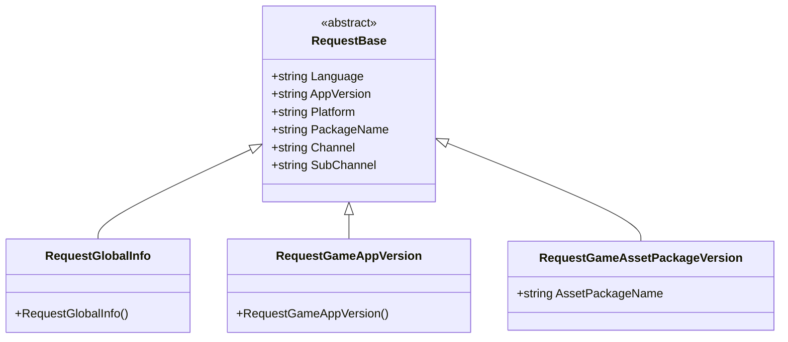
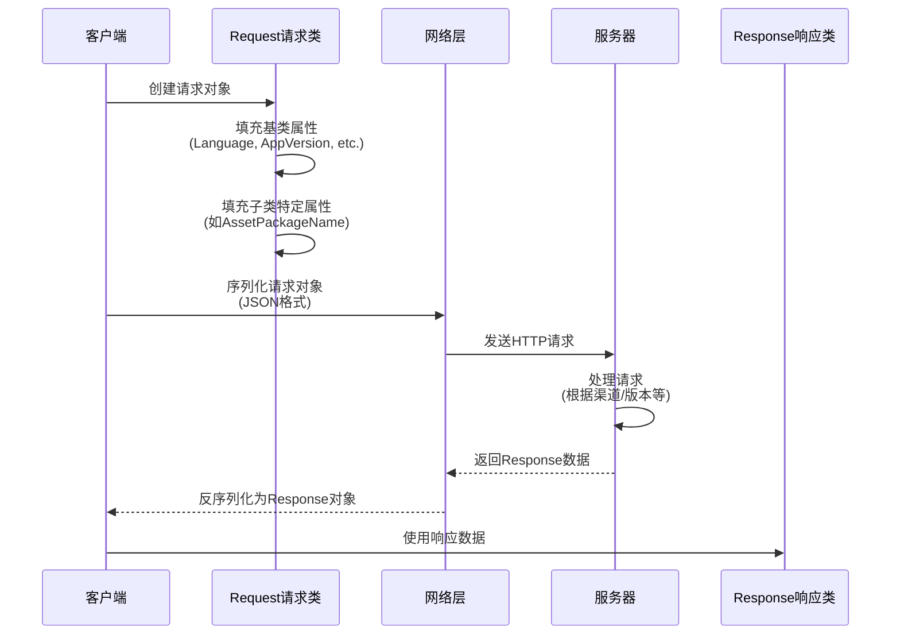

# 请求类

请求类是 GlobalConfig 系统中用于封装客户端请求数据的 DTO（Data Transfer Object）类。它们负责携带客户端环境信息向服务器请求配置数据。

## 概述

请求类采用面向对象的设计模式，通过继承 `RequestBase` 基类实现统一的数据结构，同时允许各具体请求类型扩展自己的特定字段。这种设计确保了：

- **代码复用**：所有请求共有的属性（如语言、版本、平台等）在基类中统一管理
- **类型安全**：每个请求类型有明确的语义，便于区分和管理
- **可扩展性**：通过继承可以轻松添加新的请求类型或扩展现有请求

### 核心设计意图

GlobalConfig 系统需要获取服务器上的配置数据，客户端需要告诉服务器**我是谁**（渠道、包名）、**我在哪里**（平台）、**我的版本是什么**（应用版本）等信息。请求类正是承担这一职责——将客户端上下文信息序列化后发送给服务器。

## 类层次结构



该类图展示了请求类的完整继承关系。所有具体请求类型都继承自抽象基类 `RequestBase`，后者定义了所有请求共有的属性。

## RequestBase 基类

`RequestBase` 是所有请求类的抽象基类，定义了客户端请求时需要携带的通用信息。

```csharp
namespace GameFrameX.GlobalConfig.Runtime
{
    /// <summary>
    /// 请求基类
    /// </summary>
    public abstract class RequestBase
    {
        /// <summary>
        /// 语言
        /// </summary>
        public string Language { get; set; }

        /// <summary>
        /// 程序版本
        /// </summary>
        public string AppVersion { get; set; }

        /// <summary>
        /// 运行平台
        /// </summary>
        public string Platform { get; set; }

        /// <summary>
        /// 包名
        /// </summary>
        public string PackageName { get; set; }

        /// <summary>
        /// 渠道
        /// </summary>
        public string Channel { get; set; }

        /// <summary>
        /// 子渠道
        /// </summary>
        public string SubChannel { get; set; }
    }
}
```

> Source: [RequestBase.cs](https://github.com/GameFrameX/com.gameframex.unity.globalconfig/blob/main/Runtime/GlobalConfig/RequestBase.cs#L1-L38)

### 属性说明

| 属性 | 类型 | 说明 |
|------|------|------|
| Language | string | 客户端当前使用的语言，用于服务器返回对应语言的配置 |
| AppVersion | string | 应用程序版本号，用于版本校验和差异化配置 |
| Platform | string | 运行平台（如 iOS、Android、Windows 等） |
| PackageName | string | 应用包名，用于区分不同应用 |
| Channel | string | 发行渠道标识，用于分渠道配置 |
| SubChannel | string | 子渠道标识，用于更细粒度的渠道区分 |

### 设计意图

这些通用属性是游戏和应用配置系统中常见的分区维度。通过在请求中携带这些信息，服务器可以：
- 根据版本返回不同的配置（热更新）
- 根据平台返回不同的资源路径
- 根据渠道返回不同的活动配置
- 根据语言返回本地化内容

## 具体请求类

### RequestGlobalInfo

全局信息请求类，用于获取游戏的全局配置信息。

```csharp
namespace GameFrameX.GlobalConfig.Runtime
{
    /// <summary>
    /// 全局信息请求对象,可以自己继承实现自己的字段
    /// </summary>
    public class RequestGlobalInfo : RequestBase
    {
    }
}
```

> Source: [RequestGlobalInfo.cs](https://github.com/GameFrameX/com.gameframex.unity.globalconfig/blob/main/Runtime/GlobalConfig/RequestGlobalInfo.cs#L1-L9)

**设计意图**：该类继承自 `RequestBase`，用于请求包含游戏全局配置的响应数据（如服务器地址、版本检查接口等）。文档注释表明允许开发者继承此类添加自定义字段。

### RequestGameAppVersion

游戏版本请求类，用于检查应用程序是否有新版本可用。

```csharp
namespace GameFrameX.GlobalConfig.Runtime
{
    /// <summary>
    /// 游戏版本请求对象,可以自己继承实现自己的字段
    /// </summary>
    public class RequestGameAppVersion : RequestBase
    {
    }
}
```

> Source: [RequestGameAppVersion.cs](https://github.com/GameFrameX/com.gameframex.unity.globalconfig/blob/main/Runtime/GlobalConfig/RequestGameAppVersion.cs#L1-L9)

**设计意图**：该类用于向服务器查询当前应用版本的状态。服务器可以返回版本对比结果，提示用户是否需要更新。

### RequestGameAssetPackageVersion

游戏资源包版本请求类，用于检查特定资源包是否需要更新。

```csharp
namespace GameFrameX.GlobalConfig.Runtime
{
    /// <summary>
    /// 游戏资源版本请求对象,可以自己继承实现自己的字段
    /// </summary>
    public class RequestGameAssetPackageVersion : RequestBase
    {
        /// <summary>
        /// 资源包名称
        /// </summary>
        public string AssetPackageName { get; set; }
    }
}
```

> Source: [RequestGameAssetPackageVersion.cs](https://github.com/GameFrameX/com.gameframex.unity.globalconfig/blob/main/Runtime/GlobalConfig/RequestGameAssetPackageVersion.cs#L1-L13)

**设计意图**：与 `RequestGameAppVersion` 不同，此类专门用于资源包的版本检查。通过 `AssetPackageName` 属性指定要检查的具体资源包名称。这支持了游戏资源热更新功能，可以只更新变化的部分而非整个应用。

## 请求流程



该流程图展示了请求对象从创建到服务器响应的完整生命周期。请求对象携带必要的上下文信息，帮助服务器做出正确的响应决策。

## 扩展请求类

如果内置的请求类无法满足需求，开发者可以通过继承来扩展：

```csharp
// 自定义请求示例
public class RequestCustomConfig : RequestBase
{
    /// <summary>
    /// 自定义字段：场景ID
    /// </summary>
    public int SceneId { get; set; }

    /// <summary>
    /// 自定义字段：玩家ID
    /// </summary>
    public string PlayerId { get; set; }
}
```

**扩展步骤**：
1. 继承自 `RequestBase`
2. 添加业务所需的特定属性
3. 在发送请求时创建实例并填充数据

## 相关链接

- [响应类](./5-data-structures.2-response-classes) - 了解请求对应的响应数据结构
- [GlobalConfigComponent](./4-core-component.1-global-config-component) - 了解如何使用请求获取配置
- [快速开始 - 代码访问](./3-getting-started.3-code-access) - 了解如何在代码中使用这些请求类
