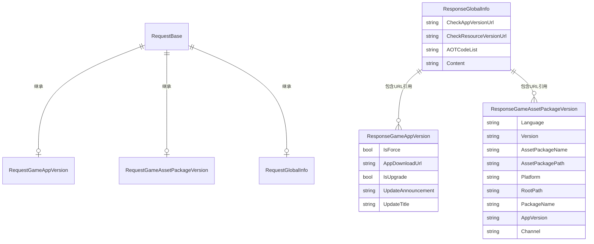

# 响应类

响应类（Response Classes）是 GlobalConfig 系统中用于承载从服务器返回的配置数据的数据传输对象（DTO）。每个响应类对应一种特定类型的配置信息。

## 概述

在 GlobalConfig 系统中，客户端向服务器发送请求后，服务器会返回相应的配置数据。这些返回的数据通过响应类进行结构和类型化，使得代码可以类型安全地访问配置信息。

GlobalConfig 提供了三种主要的响应类：

| 响应类 | 用途 |
|--------|------|
| ResponseGameAppVersion | 游戏应用程序版本信息 |
| ResponseGameAssetPackageVersion | 游戏资源包版本信息 |
| ResponseGlobalInfo | 全局配置信息 |

### 设计意图

响应类的设计遵循以下原则：

1. **简洁性**：使用简单的 POCO 类，不引入额外的依赖
2. **类型安全**：每个配置类型有专门的类，提供强类型访问
3. **可扩展性**：可以通过继承或组合扩展新的响应类型

## 类结构详解

### ResponseGameAppVersion

游戏版本信息响应类，包含应用升级相关的所有信息。

```csharp
namespace GameFrameX.GlobalConfig.Runtime
{
    /// <summary>
    /// 游戏版本信息
    /// </summary>
    public class ResponseGameAppVersion
    {
        /// <summary>
        /// 是否强制升级
        /// </summary>
        public bool IsForce { get; set; }

        /// <summary>
        /// 程序下载地址
        /// </summary>
        public string AppDownloadUrl { get; set; }

        /// <summary>
        /// 是否需要更新
        /// </summary>
        public bool IsUpgrade { get; set; }

        /// <summary>
        /// 更新公告
        /// </summary>
        public string UpdateAnnouncement { get; set; }

        /// <summary>
        /// 更新标题
        /// </summary>
        public string UpdateTitle { get; set; }
    }
}
```

> Source: [ResponseGameAppVersion.cs](https://github.com/GameFrameX/com.gameframex.unity.globalconfig/blob/main/Runtime/GlobalConfig/ResponseGameAppVersion.cs#L1-L33)

**属性说明：**

| 属性 | 类型 | 说明 |
|------|------|------|
| IsForce | bool | 是否强制升级，true 表示用户必须升级才能继续游戏 |
| AppDownloadUrl | string | 新版本应用的下载 URL 地址 |
| IsUpgrade | bool | 是否有可用更新，true 表示服务器上有新版本 |
| UpdateAnnouncement | string | 更新公告内容，通常显示给用户 |
| UpdateTitle | string | 更新提示的标题 |

### ResponseGameAssetPackageVersion

游戏资源包版本信息响应类，包含资源更新的相关配置。

```csharp
namespace GameFrameX.GlobalConfig.Runtime
{
    /// <summary>
    /// 游戏资源版本信息
    /// </summary>
    public class ResponseGameAssetPackageVersion
    {
        /// <summary>
        /// 语言
        /// </summary>
        public string Language { get; set; }

        /// <summary>
        /// 资源版本
        /// </summary>
        public string Version { get; set; }

        /// <summary>
        /// 资源包名称
        /// </summary>
        public string AssetPackageName { get; set; }

        /// <summary>
        /// 资源包路径
        /// </summary>
        public string AssetPackagePath { get; set; }

        /// <summary>
        /// 平台
        /// </summary>
        public string Platform { get; set; }

        /// <summary>
        /// 下载根路径
        /// </summary>
        public string RootPath { get; set; }

        /// <summary>
        /// 包名
        /// </summary>
        public string PackageName { get; set; }

        /// <summary>
        /// 游戏版本
        /// </summary>
        public string AppVersion { get; set; }

        /// <summary>
        /// 渠道名称
        /// </summary>
        public string Channel { get; set; }
    }
}
```

> Source: [ResponseGameAssetPackageVersion.cs](https://github.com/GameFrameX/com.gameframex.unity.globalconfig/blob/main/Runtime/GlobalConfig/ResponseGameAssetPackageVersion.cs#L1-L53)

**属性说明：**

| 属性 | 类型 | 说明 |
|------|------|------|
| Language | string | 当前语言设置，如 "zh-CN"、"en-US" |
| Version | string | 资源包版本号，如 "1.0.0" |
| AssetPackageName | string | 资源包名称 |
| AssetPackagePath | string | 资源包相对路径 |
| Platform | string | 运行平台，如 "Android"、"iOS"、"Windows" |
| RootPath | string | 资源下载的根目录 URL |
| PackageName | string | 应用包名 |
| AppVersion | string | 应用程序版本号 |
| Channel | string | 渠道标识 |

### ResponseGlobalInfo

全局信息响应类，包含系统级的配置端点和全局参数。

```csharp
namespace GameFrameX.GlobalConfig.Runtime
{
    /// <summary>
    /// 全局信息响应对象
    /// </summary>
    public class ResponseGlobalInfo
    {
        /// <summary>
        /// 检测程序版本地址
        /// </summary>
        public string CheckAppVersionUrl { get; set; }

        /// <summary>
        /// 检测资源版本地址
        /// </summary>
        public string CheckResourceVersionUrl { get; set; }

        /// <summary>
        /// AOT代码列表
        /// </summary>
        public string AOTCodeList { get; set; }

        /// <summary>
        /// 扩展内容
        /// </summary>
        public string Content { get; set; }
    }
}
```

> Source: [ResponseGlobalInfo.cs](https://github.com/GameFrameX/com.gameframex.unity.globalconfig/blob/main/Runtime/GlobalConfig/ResponseGlobalInfo.cs#L1-L28)

**属性说明：**

| 属性 | 类型 | 说明 |
|------|------|------|
| CheckAppVersionUrl | string | 检查应用程序版本的服务器接口地址 |
| CheckResourceVersionUrl | string | 检查资源包版本的服务器接口地址 |
| AOTCodeList | string | AOT 编译代码列表的 JSON 字符串 |
| Content | string | 额外的扩展内容，可用于自定义配置 |

## 数据流关系

以下图表展示了请求类与响应类之间的对应关系：



## 使用示例

### 基本用法

在游戏启动时从服务器获取全局配置：

```csharp
using GameFrameX.GlobalConfig.Runtime;
using UnityEngine;

public class ConfigManager : MonoBehaviour
{
    public void LoadGlobalConfig(string jsonData)
    {
        // 解析全局配置响应
        var globalInfo = new ResponseGlobalInfo
        {
            CheckAppVersionUrl = "https://api.example.com/check-app-version",
            CheckResourceVersionUrl = "https://api.example.com/check-resource-version",
            AOTCodeList = "[\"Method1\", \"Method2\"]",
            Content = "{\"config\": \"value\"}"
        };

        Debug.Log($"App Version URL: {globalInfo.CheckAppVersionUrl}");
        Debug.Log($"Resource Version URL: {globalInfo.CheckResourceVersionUrl}");
    }
}
```

### 处理游戏版本检查响应

```csharp
using GameFrameX.GlobalConfig.Runtime;
using UnityEngine;

public class VersionChecker
{
    public void HandleVersionResponse(ResponseGameAppVersion response)
    {
        if (response.IsUpgrade)
        {
            Debug.Log($"发现新版本: {response.UpdateTitle}");
            Debug.Log($"更新公告: {response.UpdateAnnouncement}");
            
            if (response.IsForce)
            {
                Debug.LogWarning("当前版本已过时，需要强制更新！");
                // 显示强制更新界面
            }
            else
            {
                // 显示可选更新界面
            }
            
            // 打开下载页面
            Application.OpenURL(response.AppDownloadUrl);
        }
        else
        {
            Debug.Log("当前已是最新版本");
        }
    }
}
```

### 处理资源包版本响应

```csharp
using GameFrameX.GlobalConfig.Runtime;
using UnityEngine;

public class AssetUpdater
{
    public void HandleAssetVersionResponse(ResponseGameAssetPackageVersion response)
    {
        Debug.Log($"资源版本: {response.Version}");
        Debug.Log($"资源包: {response.AssetPackageName}");
        Debug.Log($"平台: {response.Platform}");
        Debug.Log($"渠道: {response.Channel}");
        Debug.Log($"下载根路径: {response.RootPath}");
        
        // 根据响应构建资源下载路径
        string fullAssetPath = $"{response.RootPath}/{response.AssetPackagePath}";
        Debug.Log($"完整资源路径: {fullAssetPath}");
    }
}
```

## 与 GlobalConfigComponent 的集成

ResponseGlobalInfo 在 GlobalConfigComponent 中被使用，用于存储从服务器获取的全局配置：

```csharp
namespace GameFrameX.GlobalConfig.Runtime
{
    public sealed class GlobalConfigComponent : GameFrameworkComponent
    {
        /// <summary>
        /// 获取全局配置信息
        /// </summary>
        /// <returns>返回全局配置信息对象</returns>
        public ResponseGlobalInfo GlobalInfo
        {
            get { return m_responseGlobalInfo; }
        }

        /// <summary>
        /// 全局配置信息对象
        /// </summary>
        private ResponseGlobalInfo m_responseGlobalInfo;

        /// <summary>
        /// 设置全局配置信息
        /// </summary>
        /// <param name="globalInfo">全局配置信息对象</param>
        public void SetGlobalConfig(ResponseGlobalInfo globalInfo)
        {
            m_responseGlobalInfo = globalInfo;
        }
    }
}
```

> Source: [GlobalConfigComponent.cs](https://github.com/GameFrameX/com.gameframex.unity.globalconfig/blob/main/Runtime/GlobalConfig/GlobalConfigComponent.cs#L131-L158)

## 响应类与请求类的对应关系

| 请求类 | 响应类 | 用途说明 |
|--------|--------|----------|
| RequestGameAppVersion | ResponseGameAppVersion | 客户端发送应用信息，服务器返回版本检查结果 |
| RequestGameAssetPackageVersion | ResponseGameAssetPackageVersion | 客户端发送资源包名称，服务器返回资源版本信息 |
| RequestGlobalInfo | ResponseGlobalInfo | 客户端请求全局配置，服务器返回各服务接口地址 |

## 扩展响应类

如果需要扩展响应类，可以自定义类来接收额外的服务器返回数据：

```csharp
using GameFrameX.GlobalConfig.Runtime;

/// <summary>
/// 自定义全局信息响应类
/// </summary>
[System.Serializable]
public class CustomResponseGlobalInfo : ResponseGlobalInfo
{
    /// <summary>
    /// 服务器时间戳
    /// </summary>
    public long ServerTimestamp { get; set; }

    /// <summary>
    /// 服务器区域
    /// </summary>
    public string ServerRegion { get; set; }

    /// <summary>
    /// 额外配置数据
    /// </summary>
    public Dictionary<string, object> ExtraData { get; set; }
}
```

## Related Links

- [请求类](./5-data-structures.1-request-classes) - 请求类的详细文档
- [GlobalConfigComponent](./4-core-component.1-global-config-component) - 核心组件文档
- [添加到场景](./3-getting-started.1-add-to-scene) - 如何将组件添加到场景
- [配置属性](./3-getting-started.2-configure-properties) - 配置属性说明
- [代码访问](./3-getting-started.3-code-access) - 通过代码访问配置
