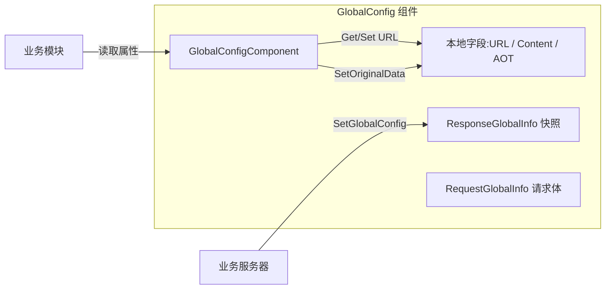

# 简介

GameFrameX GlobalConfig 是 GameFrameX 框架中的全局配置组件，用于集中管理与服务器下发或本地配置的全局参数，包括应用版本检查 URL、资源版本检查 URL、主机服务地址、AOT 元数据列表以及自定义扩展内容等。组件以 Unity MonoBehaviour 形式挂载，通过 `GameFrameworkComponent` 接入框架生命周期，供业务模块按需读取。

## 快速开始

### 1. 安装

选择任一方式将组件加入 Unity 项目：

1. 在 `Packages/manifest.json` 中添加 scoped registry：

   ```json
   {
     "scopedRegistries": [
       {
         "name": "GameFrameX",
         "url": "https://gameframex.upm.alianblank.uk",
         "scopes": ["com.gameframex"]
       }
     ],
     "dependencies": {
       "com.gameframex.unity.globalconfig": "1.3.2"
     }
   }
   ```

2. 在 `dependencies` 节点下直接添加 Git URL：

   ```json
   {
     "com.gameframex.unity.globalconfig": "https://github.com/gameframex/com.gameframex.unity.globalconfig.git"
   }
   ```

3. 在 Unity Package Manager 中通过 `Add package from git URL` 添加上面的地址。

4. 直接把仓库克隆到 Unity 项目的 `Packages/` 目录下。

### 2. 挂载组件

在场景中的 `GameFrameX` 框架入口对象上添加 `Global Config` 组件（菜单路径 `Add Component → GameFrameX → Global Config`）。组件继承自 `GameFrameworkComponent`，并在 `Awake` 中关闭自动注册，由框架入口统一管理。

Source: [GlobalConfigComponent.cs#L11-L13](https://github.com/GameFrameX/com.gameframex.unity.globalconfig/blob/main/Runtime/GlobalConfig/GlobalConfigComponent.cs#L11-L13)

### 3. 配置字段

组件在 Inspector 中暴露以下字段，可直接在编辑器中填写，也可以由运行时通过属性赋值：

| 字段 | 类型 | 说明 |
|------|------|------|
| `Check App Version Url` | string | 应用版本检查接口地址 |
| `Check Resource Version Url` | string | 资源版本检查接口地址 |
| `AOT Code List` | string | AOT 补充元数据列表（JSON 字符串），赋值时会自动解析到 `AOTCodeLists` |
| `Host Server Url` | string | 主机服务地址，用于连接后端 |
| `Content` | string | 自定义扩展内容 |
| `Original Data` | string（只读） | 通过 `SetOriginalData` 写入的原始数据 |

Source: [GlobalConfigComponent.cs#L18-L134](https://github.com/GameFrameX/com.gameframex.unity.globalconfig/blob/main/Runtime/GlobalConfig/GlobalConfigComponent.cs#L18-L134)

### 4. 运行时读取

通过框架入口拿到组件实例后直接读取属性即可：

```csharp
var globalConfig = GameFrameXEntry.GetComponent<GlobalConfigComponent>();
string hostUrl = globalConfig.HostServerUrl;
string appVersionUrl = globalConfig.CheckAppVersionUrl;
string content = globalConfig.Content;
```

## 工作原理速览

组件内部维护一份 `ResponseGlobalInfo` 对象，用于保存服务器下发的全局配置快照；本地字段则保存 URL、原始数据、AOT 列表等扩展信息。请求与响应类型分开定义，方便业务方继承扩展。



## 相关链接

- [GlobalConfigComponent.cs](https://github.com/GameFrameX/com.gameframex.unity.globalconfig/blob/main/Runtime/GlobalConfig/GlobalConfigComponent.cs)
- [RequestGlobalInfo.cs](https://github.com/GameFrameX/com.gameframex.unity.globalconfig/blob/main/Runtime/GlobalConfig/RequestGlobalInfo.cs)
- [ResponseGlobalInfo.cs](https://github.com/GameFrameX/com.gameframex.unity.globalconfig/blob/main/Runtime/GlobalConfig/ResponseGlobalInfo.cs)
- [RequestBase.cs](https://github.com/GameFrameX/com.gameframex.unity.globalconfig/blob/main/Runtime/GlobalConfig/RequestBase.cs)
- [Editor/Inspector/GlobalConfigComponentInspector.cs](https://github.com/GameFrameX/com.gameframex.unity.globalconfig/blob/main/Editor/Inspector/GlobalConfigComponentInspector.cs)
- [README.zh-CN.md](https://github.com/GameFrameX/com.gameframex.unity.globalconfig/blob/main/README.zh-CN.md)