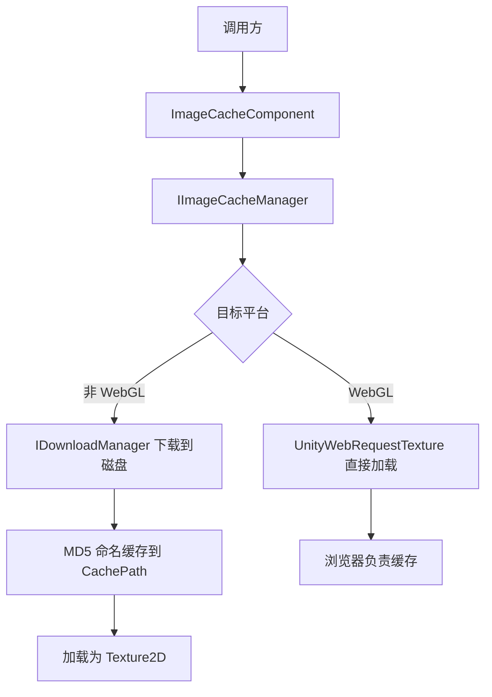

# 概述

GameFrameX.ImageCache 是 GameFrameX 框架的图片缓存组件，负责把远程图片下载到本地、按 URL 的 MD5 命名落盘，并在二次加载时直接从磁盘读取为 `Texture2D`，从而避免重复下载、缩短 UI 出图时间。

## 快速开始

1. 在 Unity 项目的 `Packages/manifest.json` 中添加 GameFrameX 注册表：

```json
{
  "scopedRegistries": [
    {
      "name": "GameFrameX",
      "url": "https://gameframex.upm.alianblank.uk",
      "scopes": [
        "com.gameframex"
      ]
    }
  ]
}
```

2. 在 `dependencies` 中添加依赖：

```json
{
  "dependencies": {
    "com.gameframex.unity.imagecache": "0.0.1"
  }
}
```

3. 在场景中添加 `ImageCacheComponent`（菜单 `GameFrameX/Image Cache`），并在 Inspector 中按需调整 `CachePath`、`MaxDiskSize`、`ExpireDays`。组件在 `Awake` 时会把配置同步到 `IImageCacheManager`，默认缓存路径为 `Application path + "/cache/images/"`。

4. 调用接口加载远程图片：

```csharp
// 获取图片缓存组件
var imageCache = GameEntry.GetComponent<ImageCacheComponent>();

// 异步加载远程图片
Texture2D texture = await imageCache.LoadImageAsync("https://example.com/image.png");

// 检查图片是否已缓存
bool cached = imageCache.IsCached("https://example.com/image.png");

// 移除指定缓存
imageCache.RemoveCache("https://example.com/image.png");

// 清空所有缓存
imageCache.ClearCache();
```

来源:[ImageCacheComponent.cs](https://github.com/GameFrameX/com.gameframex.unity.imagecache/blob/main/Runtime/ImageCache/ImageCacheComponent.cs#L73-L76)、[README.zh-CN.md](https://github.com/GameFrameX/com.gameframex.unity.imagecache/blob/main/README.zh-CN.md#L78-L93)

## 工作原理速览



- **非 WebGL 平台**：通过 `IDownloadManager` 把图片下载到磁盘，文件按 URL 的 MD5 命名;加载时优先命中缓存，未命中再下载。
- **WebGL 平台**：通过 `UnityWebRequestTexture` 直接加载图片，缓存完全由浏览器管理，本地接口 `IsCached` / `RemoveCache` / `ClearCache` 不生效。

来源:[ImageCacheManager.cs](https://github.com/GameFrameX/com.gameframex.unity.imagecache/blob/main/Runtime/ImageCache/ImageCacheManager.cs)、[IImageCacheManager.cs](https://github.com/GameFrameX/com.gameframex.unity.imagecache/blob/main/Runtime/ImageCache/IImageCacheManager.cs#L26-L47)

## 接下来

- 缓存参数与默认值:见《reference/config》
- 在 Inspector 中调参:见《tasks/configure-cache》
- 图片加载失败的排查:见《troubleshooting/load-failed》
- 平台差异与 WebGL 行为:见《reference/platform-support》